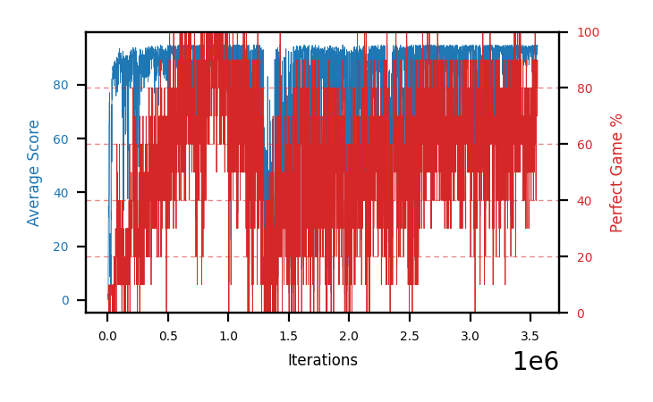
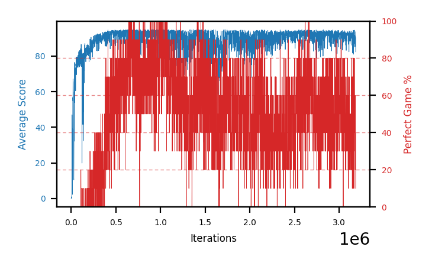
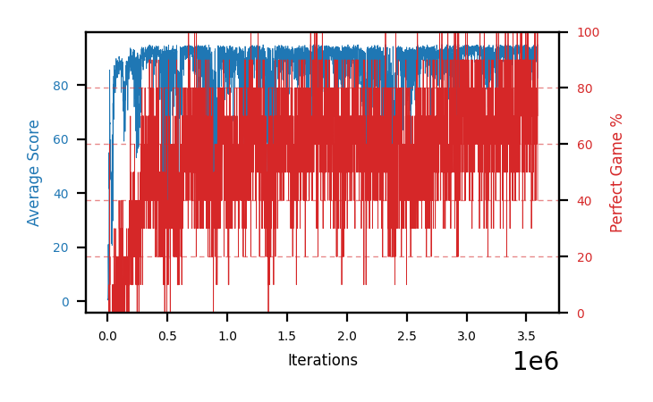
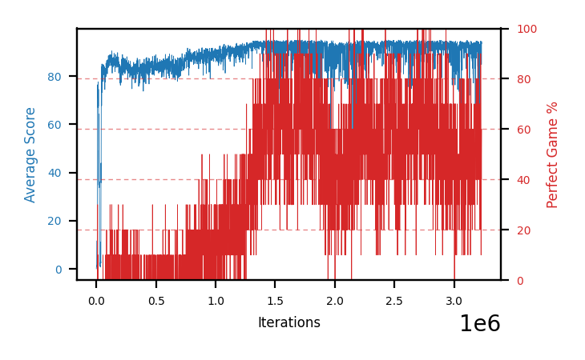
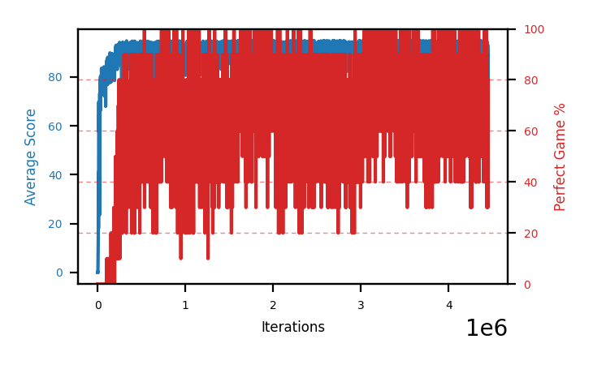
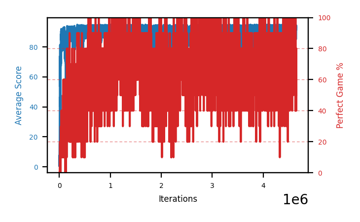
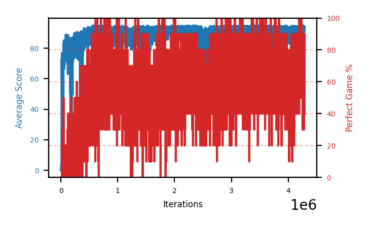
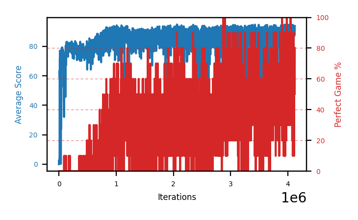

# Charts

Progress graphs, **batch 10 onward**. Per-arm numbers live in
[`completedRuns.md`](completedRuns.md); this file is images plus a short reading of each.
Batch 1-9 captions moved to [`archive/batches1-9.md`](archive/batches1-9.md) — the PNGs are all
still in `charts/`.

In every chart: **blue is average score** (food eaten, out of 95) on the left axis, **red is
perfect-game percentage** on the right. Grey dashed vertical lines mark resumes; faint red dashed
horizontals mark 20/40/60/80% on the right axis, because the perfect rate is the objective and
was unreadable against left-axis ticks.

**Newest batch first.** Within a batch, best result first.

## These are snapshots, on purpose

The images are **copies** from `snek2/runs/`, not links. The live graphs there are rewritten every
eval and would be lost if that directory were cleaned out, silently blanking this file. Refresh with
`refresh_charts.sh`, which re-copies every `runs/*.png` into `charts/` and prints each one's step.

**The script does not touch this file** — it copies images only, so a new arm gets a PNG and no
entry unless one is written by hand. That drifted once, to 12 undocumented arms across batches 5-7,
because a successful `refresh_charts.sh` looked like the charts were handled. Check both this file
and the archive, since captions now live in two places:

```
cd snek2/hyperparamTuning
ls charts/*.png | sed 's|.*/||;s|\.png||' | sort > /tmp/have
grep -ho 'charts/[a-zA-Z0-9-]*\.png' charts.md archive/batches1-9.md \
  | sed 's|charts/||;s|\.png||' | sort -u > /tmp/doc
comm -23 /tmp/have /tmp/doc   # anything listed is an undocumented arm
```

## Batch 13 — the lower handover plus the shield, and an exact null

Four seeds, handover 0.0125 and `GUIDED_FRACTION=0.5`, run to 3.4-3.7M. **The schedule works and
the outcome is unchanged.** Epsilon descended on skill to 0.0023-0.0050, all four passed the
pre-registered 350k check, and `best_perfect30` came out at a mean of **82.2% against batch 11's
82.2%** — an exact null, p = 1.000 on an exact paired permutation test.

Read these charts against batch 11's below and the difference is that there is no difference. What
*is* gone is batch 12's shape: no arm here peaks early and then decays to 55.

| seed | b13 best30 | b11 best30 | diff |
|---|---|---|---|
| 1 | 78.0% | 85.7% | -7.7 |
| 2 | 82.3% | 91.7% | -9.4 |
| 3 | 85.3% | 73.0% | +12.3 |
| 4 | 83.3% | 78.3% | +5.0 |
| **mean** | **82.2%** | **82.2%** | **+0.0** |

Per-seed swings of ±12 pp around a zero mean is what n=4 looks like on this metric, and it is the
clearest statement in this file of why seed count is the binding constraint.

### b13c-shieldseed3 — handover 0.0125 + shield, seed 3


Step 3.67M · peak trailing 94.8 (at 3185k) · **best 30-eval perfect 85.3%** (at 2864k) · `strong_eval_fraction` **26.5%** · trailing-30 at stop 72.3%

Best of the batch, and the arm that inverts batch 11's seed ordering: seed 3 was batch 11's weakest
at 73.0% and is batch 13's strongest at 85.3%. Same seed, same config but the schedule — a +12.3 pp
swing that means nothing on its own and is exactly why the batch mean is what gets reported.

Still near its peak at 3.19M when stopped, with the smallest gap in the batch between peak trailing
and where it ended.

### b13d-shieldseed4 — handover 0.0125 + shield, seed 4


Step 3.51M · peak trailing 94.5 (at 980k) · best 30-eval perfect 83.3% (at 1005k) · `strong_eval_fraction` 14.5% · trailing-30 at stop **39.0%**

Peaked earliest in the batch at ~1M and gave up **44.3 pp** by 3.5M — the largest drawdown here, and
the reason the shield cannot be credited with fixing the post-peak decline: batch 11's seed 4 was
its *most* stable arm at 5.6 pp. The paired drawdown comparison is -1.0 pp at p = 0.875, i.e.
nothing.

### b13b-shieldseed2 — handover 0.0125 + shield, seed 2


Step 3.70M · peak trailing 94.8 (at 1919k) · best 30-eval perfect 82.3% (at 1508k) · `strong_eval_fraction` 25.4% · trailing-30 at stop 67.0%

**The fastest start on record**: trailing 92.4 with a 72.3% perfect rate by step 350k, where batch
12's arms were at 0%. Whatever else the epsilon change did or did not do, that is the deadlock
being decisively absent.

### b13a-shieldseed1 — handover 0.0125 + shield, seed 1


Step 3.39M · peak trailing 94.5 (at 2661k) · best 30-eval perfect 78.0% (at 2679k) · `strong_eval_fraction` 11.5% · trailing-30 at stop 70.7%

Weakest of the batch and the slowest to get going — 2.0% perfect at 350k, the only arm that would
have looked marginal against the abandon condition. Its best work came latest of the four, at 2.68M,
and it held most of it: a 7.3 pp drawdown against its own seed's 42.4 pp in batch 11.

---

## Batch 12 — the epsilon rewrite, and the deadlock it found

Four seeds of batch 11's config plus the two-phase epsilon schedule, **stopped at ~1M of a
planned 2.5M** because all four failed the same way: epsilon pinned at the refinement ceiling
0.05 and the perfect rate never left 0. Read these four charts as one shape repeated four times —
a fast climb to 81-87 trailing between 214k and 479k, then a slow decay to 53-63 that never
recovers. Both numbers are greedy evals, so that decay is the learned policy getting worse, not
an exploration tax on the measurement.

**`strong_eval_fraction` is 0.0% in all four arms**, against 25.2 / 30.5 / 0.0 / 8.2% for batch 11
at the same 1M steps. The mechanism, the fix, and the two wrong turns taken diagnosing it are in
[`runs.md`](runs.md#-the-new-schedule-deadlocks-all-four-arms-are-failing-44-at-1m-steps). These
arms are kept as the measured cost of sitting at epsilon 0.05: not a wasted batch, a negative
result with four seeds behind it.

### b12s-shield05seed1 — the exploration shield at handover 0.05, seed 1


Step 0.43M (stopped) · trailing 83.1 at stop · best 30-eval perfect 0.3% · max single eval 10% · not measured

**The arm that moved the handover.** A verification run, `SEED=1` so it pairs with `b12a`, with the
one-step exploration shield on and the handover still at 0.05. It **fixed the decay** — `b12a` fell
83.8 → 74.2 between 200k and 400k while this one was still rising — and **did not fix perfect
games**: 2 perfect-game evals in 431, plateauing at trailing ~83 where the perfect rate is ~0,
improving at 4.7 points per 100k against `b11a`'s 11.1.

Kept because it is the whole argument for dropping the handover to 0.0125: a one-step mask prevents
blunders but not self-trapping, so the collect policy still never finishes a board and the buffer
never contains the last ten food. Read against `b12a` below and `b11a` above.

### b12a-eps002seed1 — two-phase epsilon, seed 1


Step 1.12M (stopped) · peak score 89.1, peak trailing 87.02 (at 214k) · best 30-eval perfect **6.3%** (at 213k) · max single eval 40% · not measured

The best of a bad batch, and the arm that makes the decay unambiguous. It read trailing **87.0**
with 6.3% best-30 at 214k — a genuinely promising arm — then fell to 59.6 over the next 900k steps
**at exactly the same epsilon**. Same exploration rate, worse policy, so nothing about the
measurement explains it.

41 of its 1122 evals contained a perfect game, which was enough to nudge epsilon to 0.0388 at its
best and never enough to escape: the refinement phase needs 20-40% to reach the floor, and 0.05
makes that unreachable.

### b12d-eps002seed4 — two-phase epsilon, seed 4


Step 1.09M (stopped) · peak score 87.2, peak trailing 86.36 (at 479k) · best 30-eval perfect 6.3% (at 29k) · max single eval 30% · not measured

The latest peak in the batch at 479k, and the only arm whose best-30 came in its first 30k steps —
during the bootstrap phase, before the ceiling took hold. Everything after is decline.

### b12c-eps002seed3 — two-phase epsilon, seed 3


Step 0.98M (stopped) · peak score 85.3, peak trailing 82.46 (at 360k) · best 30-eval perfect 1.7% (at 369k) · max single eval 10% · not measured

8 perfect games in 977 evals, and a max single eval of 10% — it reached the endgame often enough
to prove the policy was not hopeless and never often enough for the schedule to notice.

### b12b-eps002seed2 — two-phase epsilon, seed 2


Step 1.03M (stopped) · peak score 82.8, peak trailing 81.4 (at 259k) · **best 30-eval perfect 0.0%** · max single eval **0%** · not measured

**The cleanest demonstration of the deadlock in the project: zero perfect games in 1032 evals.**
Epsilon reached 0.05 at step 11000 and sat there for the remaining 942k steps, because the signal
that would have lowered it requires finishing a game and 3.3% random actions never let it. An arm
that peaked at 81.4 trailing was never once measured completing the board.

---

## Batch 11 — the same config on the 30-value vector

Four seeds of batch 10's config, byte for byte, on the observation vector after the following-tail
and food-space blocks landed. **A deliberate null-result test**: the only difference from batch 10
is those two observations, and the comparison was pre-registered before launch. It came back
**+5.4 pp at t=0.80 — not significant** against a ~10 pp threshold, and the close-out added two
measured comparisons that came out the same way (+4.1 pp on the graph-100% tier, +4.5 pp on best
checkpoint; exact p = 0.14 and 0.16). The first seeded batch (`SNEK_SEED=1..4`). Full write-up:
[`completedRuns.md`](completedRuns.md#batch-11--the-same-config-on-the-30-value-vector-no-significant-difference).

Read these four charts for their *shape*, not their level: three of the four peaked before 1.8M and
then declined for another 1.5-2.5M steps, which is the most useful thing batch 11 produced. The
close-out puts numbers on what that cost — in all four arms the best measured checkpoint lands
**within 39k steps of the graph's best-30 peak**, so nothing in the declining tail contributed to any
of the four records.

**That agreement is a batch-11 property, not a general rule**, and it would be easy to over-read.
Batch 10's gaps are -1058k, -3046k, -99k and +29k — `b10b`'s best checkpoint came at 1501k while its
graph peaked at 4547k. The difference is chart shape: batch 11's arms have one sharp peak, so the
graph's best window and the best individual checkpoint have nowhere else to be, whereas batch 10's
broad plateaus let the two land 3M apart. **Do not use a graph peak to decide where to look for a
checkpoint** — that is what the close-out is for.

### b11b-obs30seed2 — `DISCOUNT=0.995`, 30-value vector, seed 2



Step 3.56M · peak score 94.92 (at 855k) · **best 30-eval perfect 91.7%** (at 873k) · **best ckpt 96%** @855k

**The best arm in the project on both metrics**: the highest best-30 any arm has reached, and the
highest single-checkpoint measurement (96/100, CI 90.2-98.4, ~94% after the winner's-curse
correction). Both peaks are in the same place — the graph tops out at 855k and the record checkpoint
*is* 855k, which is the tidiest agreement between graph and measurement in this file.

Also n=1 of eight arms across the two batches, with the batch means overlapping heavily — a
high-water mark, not a finding. Gave up 18 pp from that peak by the time it was stopped.

### b11a-obs30seed1 — `DISCOUNT=0.995`, 30-value vector, seed 1



Step 3.19M · peak score 94.82 (at 653k) · **best 30-eval perfect 85.7%** (at 678k) · best ckpt 94% @671k

**The clearest picture of the post-peak decline in the project so far.** 85.7% at 678k down to
43.3% by 3.19M — a **42.4 pp** drawdown, the largest on record, with no death event: the arm never
went to zero, it just got steadily worse for 2.5M steps.

Its record checkpoint sits at 671k, inside that early peak, and measures 94% — so the decline cost
this arm a policy it had already found rather than one it never reached. That is the case for the
shorter, wider batch design in [`runs.md`](runs.md) stated as concretely as it gets.

### b11d-obs30seed4 — `DISCOUNT=0.995`, 30-value vector, seed 4



Step 3.59M · peak score 94.18 (at 3468k) · **best 30-eval perfect 78.3%** (at 3468k) · best ckpt 88% @3507k

The one arm still near its peak when stopped, and the reason not to cap the next batch at 2M
without hedging: it peaked at 3468k, where the other three peaked before 1.8M. A short cap would
have truncated this arm before its best work.

Its record checkpoint is at 3507k — the last 100k steps of the run, and the only arm in either batch
whose best measured checkpoint came from its final stretch. Whether it was still improving or had
just arrived at its ceiling is unanswerable now; it is the batch's one genuinely open question.

### b11c-obs30seed3 — `DISCOUNT=0.995`, 30-value vector, seed 3



Step 3.23M · peak score 94.26 (at 2452k) · **best 30-eval perfect 73.0%** (at 1718k) · best ckpt 87% @1706k

Weakest of the batch, and the illustration of why n=4 cannot settle a 5 pp question: 73.0% against
`b11b`'s 91.7% on an identical config differing only in seed. The measured gap is narrower — 87%
against 96% — because a best-checkpoint figure asks what the arm managed once, and a best-30 asks
whether it could hold it.

The one arm whose close-out degenerated: only 87 checkpoints screened, against an
`EVAL_CONFIRM_COUNT` of 100, so every screened checkpoint was confirmed anyway and the screen was
pure overhead. See the note in [`hyperparamTuning.md`](hyperparamTuning.md#screening-eval_screen_episodes-on-by-default).

---

## Batch 10 — the fresh baseline on the third environment

Four seeds of `DISCOUNT=0.995`, the first arms to train end-to-end on the environment left by
2026-08-02's seven fixes. **Every arm was stopped healthy rather than dying or declining to a
stop** — a first for this project — and it held the best measured checkpoint on record (93%) until
batch 11's close-out beat it with 96%. These four are the control batch 11 is compared against.
Their checkpoints **no longer load on `master`**: `450e66e` is the last commit with the 26-value
vector.

### b10d-disc995seed4 — `DISCOUNT=0.995`, third env, seed 4



Step 4.45M · peak score 94.74 (at 3978k) · best 30-eval perfect 84.3% (at 1666k) · **best measured checkpoint 93%** (at 1695k), pooled **74.9%** /66000

**The best measured checkpoint in the project.** A mid-run eval had read 95% at 1815k; the full
close-out found 93% at 1695k instead, and the two intervals overlap almost entirely — the same
policy family measured twice, not a record and a near-miss. Treat ~87% as the honest estimate of
the underlying rate once the winner's curse is accounted for.

### b10b-disc995seed2 — `DISCOUNT=0.995`, third env, seed 2



Step 4.65M · peak score 94.96 (at 4545k) · **best 30-eval perfect 85.0%** (at 4547k) · best measured checkpoint 90% (at 1501k), pooled 71.8% /62400

Still climbing when it was stopped — peak trailing score at 4545k out of 4652k run. Its ceiling is
unknown and, because the vector has since changed, unknowable: this arm cannot be resumed.

### b10a-disc995seed1 — `DISCOUNT=0.995`, third env, seed 1



Step 4.29M · peak score 94.38 (at 3402k) · best 30-eval perfect 78.3% (at 3402k) · best measured checkpoint 85% (at 2344k), pooled 67.2% /27200

### b10c-disc995seed3 — `DISCOUNT=0.995`, third env, seed 3



Step 4.12M · peak score 93.84 (at 4021k) · best 30-eval perfect 72.7% (at 4064k) · best measured checkpoint 79% (at 3965k), pooled 63.0% /4700

Weakest of batch 10, and the arm whose close-out selected only 47 checkpoints where `b10d` selected
660 — the selector's own read on how much of a run is worth measuring.

---
