# Charts

Progress graphs for every tuning arm. Companion to
[`hyperparamTuning.md`](hyperparamTuning.md) (the protocol) and
[`runs.md`](runs.md) (what is running), [`completedRuns.md`](completedRuns.md)
(per-arm verdicts) and [`findings.md`](findings.md) (conclusions).

In every chart: **blue is average score** (food eaten, out of a possible 95) on the
left axis, **red is perfect-game percentage** on the right. Grey dashed vertical
lines mark points where training was resumed, and **faint red dashed horizontal lines
mark 20/40/60/80% on the right axis** — the perfect rate is the objective and was
unreadable by eye without them, since the left axis ticks are on a different scale.

## These are snapshots, on purpose

The images here are **copies** taken from `snek2/runs/`, not links to it. The live
graphs in `runs/` are rewritten on every eval and would be lost if that directory
were ever cleaned out, which would silently blank out this file. Copies mean the
documented history survives independently.

The trade-off is that they go stale. Refresh them with:

```
snek2/hyperparamTuning/refresh_charts.sh
```

That re-copies every `runs/*.png` into `charts/` and prints the step each one is
at, so captions can be updated to match.

**The script does not touch this file.** It copies images only, so a new arm ends up with
a PNG in `charts/` and no entry here unless one is written by hand. That drifted once —
batches 5, 6 and 7 reached 12 undocumented arms because a successful `refresh_charts.sh`
looked like the charts were handled. Check for the gap with:

```
ls charts/*.png | sed 's|charts/||;s|\.png||' | sort > /tmp/have
grep -o 'charts/[a-zA-Z0-9-]*\.png' charts.md | sed 's|charts/||;s|\.png||' | sort -u > /tmp/doc
comm -23 /tmp/have /tmp/doc
```

Snapshot refreshed 2026-07-29, at the steps noted below.

**Batches run newest first** — the highest-numbered batch at the top, batch 1 at the bottom — so the current
state of the investigation is what you see on opening the file, and the early dead ends stay
available without being in the way. Add each new batch directly under the index table.
Within a batch, arms are ordered **best result first** rather than by name, since that is
the ordering worth seeing at a glance.

## Every arm at a glance

Sorted by **best evaluated checkpoint** — the highest 100-episode measurement any single
checkpoint of that arm produced, which is the closest thing here to "how good did this
config ever get". **Pooled** is the average across its ten measured checkpoints, so it
answers the different question of how good a *typical* good checkpoint is.

Graph-derived columns misrank arms badly (`b5c` is 2nd of its batch on best perfect-30 and
last on measurement), so read peak score and best perfect-30 as chart description, not as
ranking.

| policy | change | steps | peak score (at) | best perfect-30 | **best eval'd ckpt** | pooled | verdict |
|---|---|---|---|---|---|---|---|
| `b8f-disc9975seed2` ‡ | alpha 0.6, `td_loss`, no IS, **disc 0.9975** | 3.02M | 89.4 (1716k) | **69.3%** | **88%** @2581k | **59.2%** /6300 | **project record**; 63 ckpts at >=80% |
| `b8d-disc995clip` ‡ | + **`GRADIENT_CLIPPING=10`**, disc 0.995 | 3.48M | 86.9 (2058k) | 50.0% | **80%** @2538k | 58.4% /2500 | second; ties `b8f` on pooled, clipping adds nothing |
| `b7f-disc995seed3` | alpha 0.6, `td_loss`, no IS, **disc 0.995** | 1.06M | **92.6** (267k) | 44.0% | 51% @860k | 38.8% /1000 | best of batch 7, and it survived |
| `b4c-schlongper` | alpha 0.8, `td_loss`, no IS | 1.06M | 92.0 (869k) | 34.0% | **50%** @869k | 37.1% | ties `b7f` on ceiling, dies 2 of 3 seeds |
| `b7e-disc995seed2` | alpha 0.6, `td_loss`, no IS, **disc 0.995** | 1.28M | 92.3 (997k) | 32.3% | 39% @334k | 29.5% | strong, survived |
| `b6b-alpha06` | alpha 0.6, `td_loss`, no IS | 1.80M | 89.6 (1712k) | 21.7% | 36% @1455k † | 24.5% † | old selector — an underestimate |
| `b8e-clipseed2` | + `GRADIENT_CLIPPING=10`, disc 0.995 | 1.16M | 85.9 (504k) | 21.3% | **32%** @500k | 32% (1 ckpt) | one good checkpoint, no good region |
| `b7d-discount995` | alpha 0.6, `td_loss`, no IS, **disc 0.995** | 1.60M | 88.7 (1242k) | 17.7% | 26% @1330k | 16.4% | survived, weakest of the three discount seeds |
| `b7a-a06seed2` | alpha 0.6, `td_loss`, no IS | 2.00M | 88.8 (1978k) | 15.0% | 19% @1822k | 12.0% | survived to 2M, low ceiling |
| `b6a-alpha04` | alpha 0.4, `td_loss`, no IS | 1.41M | 87.5 (356k) | 14.3% | 13% @514k † | 8.1% † | tame, never near death, low ceiling |
| `b5d-schlongTDE` | alpha 0.8, `td_error`, no IS | 2.08M | 86.2 (500k) | 10.7% | 12% @1160k † | 6.6% † | stable, low ceiling |
| `b5c-schlongIS` | alpha 0.8, `td_loss`, **IS on** | 2.31M | 87.8 (265k) | 17.0% | 6% @2239k † | 2.1% † | IS correction cancels the benefit |
| `b8c-disc9975` | alpha 0.6, `td_loss`, no IS, **disc 0.9975** | 1.75M | 79.8 (305k) | 14.7% | not measured | — | monotone decline to a stop; `b8f`'s sibling |
| `b4b-unifbuf500k` | alpha 0 + 500k buffer | 1.23M | 86.6 (743k) | 9.3% | not measured | — | steady, slowly rising |
| `b4a-uniform` | alpha 0 | 1.25M | 85.9 (550k) | 8.7% | not measured | — | peaked ~575k, drifting down |
| `b1a-base` | none (control) | 503k | 87.5 (135k) | 16.7% | not measured | — | collapsed at 265k; score recovered, skill did not |
| `b3a-epsfloor` | `MIN_EPSILON=0.001` | 545k | 83.5 (236k) | 11.0% | not measured | — | best of batch 3, degraded anyway |
| `b3b-epsfloor2` | `MIN_EPSILON=0.001` | 549k | 85.8 (305k) | 8.3% | not measured | — | declined despite the floor — falsified hypothesis A |
| `b2a-base2` | none (repeat) | 999k | 83.8 (293k) | 7.0% | not measured | — | no collapse; long drift down, 1.1% perfect at 1M |
| `b8g-clipseed3` | + `GRADIENT_CLIPPING=10`, disc 0.995 | 3.43M | 77.0 (99k) | 30.0% | **none >50%** | — | **died, recovered after 1.2M, died again** |
| `b7b-a06seed3` | alpha 0.6, `td_loss`, no IS | 1.78M | 83.8 (127k) | 7.7% | **0%** (dead) | — | **died at 1162k** |
| `b7c-a06seed4` | alpha 0.6, `td_loss`, no IS | 1.74M | 82.6 (193k) | 9.7% | **0%** (dead) | — | **died at 573k** |
| `b5a-schlong` | alpha 0.8, `td_loss`, no IS | 2.05M | 83.9 (59k) | 10.0% | **0%** (dead) | — | **died at 272k**, `b4c` repeat |
| `b5b-schlong2` | alpha 0.8, `td_loss`, no IS | 1.92M | 83.8 (69k) | 7.7% | **0%** (dead) | — | **died at 246k**, `b4c` repeat |
| `b3c-buf500k` | 500k buffer, alpha 0.6 | 4.81M | 85.7 (312k) | 5.7% | **0%** (dead) | — | **died at ~750k**, score 0.0 for 4M steps |
| `b8a-disc999` | alpha 0.6, `td_loss`, no IS, **disc 0.999** | 1.11M | 63.1 (94k) | 0.7% | **0%** (dead) | — | **died at 452k**, never got going |
| `b8b-disc999seed2` | alpha 0.6, `td_loss`, no IS, **disc 0.999** | 1.41M | **31.8** (63k) | 0.0% | **0%** (dead) | — | **zero perfect games in 1.41M steps** |
| `b1c-nstep3` | `N_STEP_UPDATE=3` | 1.14M | 76.0 (255k) | 1.7% | not measured | — | dead end |
| `b1b-tgt200` | `TARGET_UPDATE_PERIOD=200` | 106k | 76.9 | 1.0% | not measured | — | stopped early, verdict weak |
| `b2b-nstep2` | `N_STEP_UPDATE=2` | 580k | 74.6 (140k) | 0.7% | not measured | — | dead end |

**‡ still running; measured mid-run** at 2.93M (`b8d`) and 2.65M (`b8f`). Results are in
`runs/<arm>_checkpoint_evals_midrun2.json`. Both record checkpoints are preserved in
[`../hallOfFame/`](../hallOfFame/README.md).

**These two rows moved 25 points in thirteen hours.** Measured earlier the same day at 63% and
62% best / ~47% pooled, they re-measured at **88% and 80% best / ~59% pooled** after another ~860k
training steps each. Every arm above them in this table was stopped at ~1.06M steps, before the
region these records came from existed — see [`findings.md`](findings.md).

**On pooled rate they remain tied** (57.9-60.4 vs 56.5-60.3, overlapping); `b8f` is ahead on best
checkpoint. What is solid is that both clear `b7f` by ~20 points on pooled with no overlap.

**† measured with the superseded smoothed-first selector**, which has since been shown to
pick systematically worse checkpoints than outlier selection (+0.64 vs -0.40 correlation
with the true rate). Those five figures are **underestimates** and are not comparable to
the unmarked rows; `b6b` in particular is probably well above 36%. Everything unmarked used
the current outlier selector. Provenance is recorded per result in
`runs/<arm>_checkpoint_evals*.json` as `selected_by` and `graph_single_eval`.

**The pooled column is being retired.** From 2026-07-30 the selector measures every
checkpoint above 80% and none at or below 50%, so the checkpoint count varies per arm — 16
for `b8f`, 1 for `b8e`. A pooled average over 16 and over 1 are not the same statistic, so
compare arms on **best eval'd ckpt** and read pooled only as a within-arm consistency check.
`b8e` shows why this matters: its single measurable checkpoint reads 32%, which looks
mid-table, but having *one* checkpoint above the floor where `b8f` has 16 is the finding.

One caveat on `b4c`'s 50%: that checkpoint has been measured four separate times, reading
51%, 42%, 32% and 50%. Its pooled figure over 400 episodes is **41.7%**, which is the number
to trust — the 50-51% readings are the high draws. No other arm has been measured more than
once, so treat this column as "best single 100-episode reading" rather than a settled value.

**What this table shows now that batch 8 is in it.** Every arm in the top six shares one
config family — alpha 0.6-0.8, `td_loss` priorities, no IS weights — and all of them raise the
discount above 0.99. Nothing outside that family has measured above 8.1%. The discount is the
highest-leverage knob found so far, and it has an **optimum**: 0.995 and 0.9975 hold the top
places while 0.999 produced the two worst charts in the file.

**The second-highest-leverage factor turned out to be the horizon, not a hyperparameter.** The two
top arms measured 63% and 62% at ~1.8M steps and **88% and 80% at ~2.6M**. Every other arm in this
table was stopped at or before 2.1M, and the four previous best were stopped at ~1.06M — so this
table has been systematically comparing configs at a step count where none of them had finished
improving. Do not stop a healthy arm at 1M steps.

**Eight of the 30 arms died outright**, and six of those ran the same PER config as the best
arm. That is the central tension in these charts: `b4c` and `b7f` reach ~50% at their best
checkpoints, while `b5a`, `b5b`, `b7b`, `b7c` and `b8g` — near-identical configs — went to 0.0
and stayed there. `DISCOUNT=0.995` remains the only change that has held the ceiling while
avoiding the deaths at n=3.

**Gradient clipping is the batch's negative result.** It was added as a cheap stability aid and
read as "the most promising thing in the batch" off `b8d` at 163k steps. At n=3 it is 1 of 3 —
`b8d` thriving, `b8e` faded, `b8g` dead — against 3 of 3 for plain 0.995. It may raise the
ceiling (`b8d` is the best-behaved 0.995 arm ever run) while lowering survival, which is the
tradeoff `0.995` was valued for removing.

Uniform sampling (`b4a`, `b4b`) was the prior favourite and landed at about a third of
`b4c`'s rate, so the axis mattered but the expected direction was wrong.

---

## Batch 8 — the discount optimum, and gradient clipping

Seven arms in four slots. Set out to push the discount past 0.995 and found that the discount
has an optimum: 0.999 is dead 2 of 2, while **0.9975 produced the best arm the investigation
has run**. Gradient clipping, added as an incidental stability aid, was briefly the batch's
headline and ended as its negative result.

### b8f-disc9975seed2 — `DISCOUNT=0.9975`, seed 2

Step 3.02M (running) · peak score **89.4** (at 1716k) · **best 30-eval perfect 69.3%** (at 2828k) · max single eval **100%** · **best measured checkpoint 88.0%**, pooled 59.2% /6300

**The project record.** Measured mid-run over 63 checkpoints: best **88.0%** at 2581k
(CI 80.2-93.0), top-3 82.7%, pooled **59.2%** — 20 points above `b7f`'s 38.8% with no overlap.
**35 of its 63 checkpoints measured >=60%.** The 2581k checkpoint is saved in
[`../hallOfFame/`](../hallOfFame/README.md).

It leads every statistic in the file, graph and measured alike, and recorded the **first 100%
single eval** in the project. Its block means climb from 1.3% over the first 300k to **56.8%
across 2823-2923k**.

**It was measured twice, 13 hours apart, and the second run was 25 points higher** — 63.0% best /
46.5% pooled at 1.78M, then 88.0% / 59.2% at 2.65M. The intervening 870k steps took it from 16
checkpoints above 80% to 63.

**Its 90% graph points measured 22-82%** — a ~60-point spread — while its 80% points produced the
88% champion. The graph eval filters but does not rank; see [`findings.md`](findings.md).

**Now past peak.** Its last three 100k blocks average 54.7% → 56.8% → 39.6% perfect against a
69.3% best window at 2828k. One declining block is not conclusive for an arm that recovered from
9.0% earlier, but the record is banked either way.

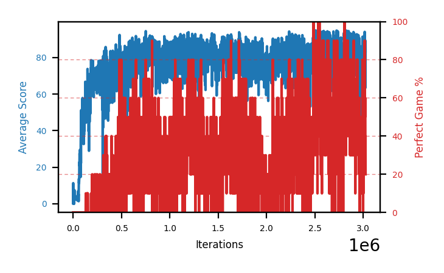

### b8d-disc995clip — `DISCOUNT=0.995` + **`GRADIENT_CLIPPING=10`**

Step 3.48M (running) · peak score 86.9 (at 2058k) · **best 30-eval perfect 50.0%** (at 2671k) · max single eval 100% · **best measured checkpoint 80.0%**, pooled 58.4% /2500

**Second best arm in the project, tied with `b8f` on pooled rate.** Measured mid-run over 25
checkpoints: best **80.0%** at 2538k (CI 71.1-86.7), top-3 74.7%, pooled **58.4%** (CI 56.5-60.3),
overlapping `b8f`'s interval. 13 of 25 checkpoints measured >=60%. The 2538k checkpoint is saved in
[`../hallOfFame/`](../hallOfFame/README.md).

**This does not vindicate gradient clipping.** `b8f` beat it without clipping — 88% vs 80% on best,
tied on pooled. An interim note in these docs, written while `b8d` was measured and `b8f` was not,
claimed clipping raised the ceiling; both re-measurements closed that off.

**Now clearly past peak**, and further along than `b8f`: its last 300k averages ~18% perfect
against a 50.0% best window at 2671k. Unlike `b8f`, its measured quality did **not** improve with
step count within the selected set (corr −0.11), and its 2.6-3.0M band measured worse than its
2.2-2.6M band.

Its chart is the most patient riser on record. Peak trailing and best-30 window are both from
its most recent 200k steps, after 2M steps of monotone improvement from the 300-600k trough:

| block | mean trailing | mean perfect |
|---|---|---|
| 300-600k | 22.4 | 0.4% |
| 600-900k | 69.4 | 8.5% |
| 1200-1500k | 72.0 | 11.2% |
| 1500-1800k | 73.9 | 18.4% |
| **1800-2100k** | **78.3** | **24.8%** |

Earlier this file called it "the fastest riser on record" for reaching 36.0% by 163k steps.
That reading was wrong in an interesting way: the 163k window was real but was followed by a
near-total collapse (0.4% perfect across 300-600k), and everything durable came after 600k. A
strong early window is not a head start. Measurement agrees — its 153k checkpoint reads 38.0%
against 62.0% at 1688k.

Do not read its latest trailing value as a decline. At 2336k it read **42.6**, while its 50k
block means over the previous 400k run 66.7-80.6 and its most recent block carries the highest
perfect rate of that span (33.2%, with an 80% point). Single evals are 10 episodes.

Its `dead_since` reads 275000 from that collapse while the arm went on to 38.3%, which is why
the summary block carries `zero_since` for "is it dead *now*" — and note `b8d` predates that
field, so its summary lacks the key entirely.

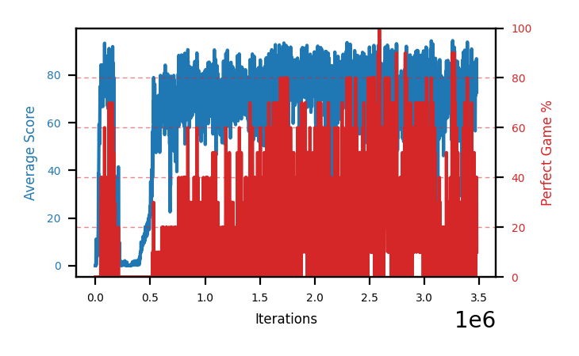

### b8e-clipseed2 — `DISCOUNT=0.995` + `GRADIENT_CLIPPING=10`, seed 2

Step 1.16M · peak score 85.9 (at 504k) · best 30-eval perfect 21.3% (at 515k) · max single eval 60% · **stopped, flat**

Never dead — `dead_since` and `zero_since` were null for the entire run — and never good. No
300k block averaged above 6.9% perfect, and recent-30 had fallen to 1.7% when it was stopped.
The chart is a broad hump peaking around 500k and slowly deflating.

Its one checkpoint above the 50% floor (step 500k) measured **32.0% (CI 23.7-41.7)**, which is
*better* than the 21.3% window implied and comparable to `b7e`'s 39%. So the config found a good
policy once and could not find a second — 1 checkpoint above the floor against `b8f`'s 16.


### b8g-clipseed3 — `DISCOUNT=0.995` + `GRADIENT_CLIPPING=10`, seed 3

Step 3.43M · peak score 77.0 (at 99k) · best 30-eval perfect 30.0% (at 253k) · max single eval 50% · **stopped, dead**

**The most instructive failure in the batch**, and a chart worth reading in full rather than
from its endpoints:

| block | mean trailing | mean perfect |
|---|---|---|
| 0-300k | 52.7 | 8.7% |
| 600-900k | **1.7** | 0.0% |
| 1200-1500k | 8.4 | 0.0% |
| **2100-2400k** | **63.7** | **4.3%** |
| 2700-3000k | **0.0** | 0.0% |
| 3300-3600k | 0.1 | 0.0% |

It sat near zero from 600k to 1800k — **1.2M steps** — and came back to 63.7 trailing. That is
by far the longest recovery on record, and it stretches the "no arm recovers from sustained
zero" rule further than any previous case. Then it collapsed for good, spending its final 900k
at 0.0 (`zero_since` 2625k).

Both halves are the lesson. A long dead stretch is not proof an arm is finished. And a recovery
is not proof of durability — the same thing `b7b` taught, now with a far larger swing. It has
**no checkpoint above the 50% floor** in 3429 evals, so the selector declines to measure it at
all.

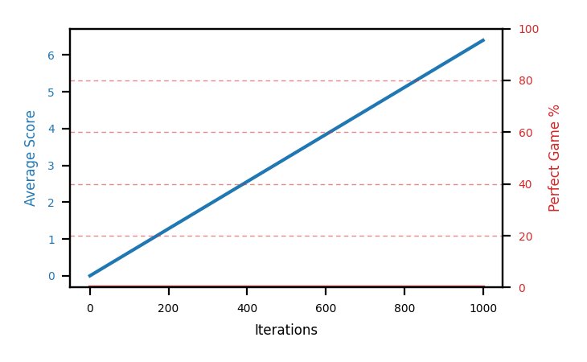

### b8c-disc9975 — `DISCOUNT=0.9975`

Step 1.75M · peak score 79.8 (at 305k) · best 30-eval perfect 14.7% (at 343k) · **stopped, monotone decline**

The midpoint arm, included as a fallback in case 0.999 broke — which it did. It looked healthy
and rising at 359k, then declined without recovering: every 200k block lower than the last,
ending at 13% of its peak with no perfect game for 1.26M steps.

Never technically dead (trailing near 10, never 0.0), which is why it needed a different
stopping criterion from the 0.999 arms. Its sibling `b8f` runs the identical config and became
the best arm in the file, so this is seed variance, not the discount value — 0.9975 stands at
1 of 2.

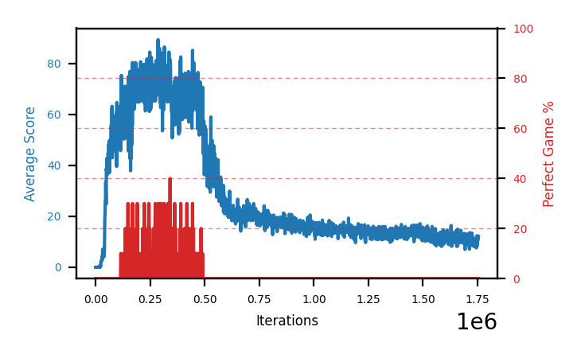

### b8a-disc999 — `DISCOUNT=0.999`

Step 1.11M · peak score 63.1 (at 94k) · best 30-eval perfect 0.7% · **died at 452k**

A chart that never gets going. Unlike the batch-5 and batch-7 deaths, which peaked in the
80s before collapsing, this one tops out at trailing **63.1** and manages a 0.7% best-30
window before flatlining at 452k.

That is the signature of a badly conditioned target rather than of catastrophic forgetting.
At a ~1000-step effective horizon the value function bootstraps over a span longer than an
episode, so the discount has an **optimum near 0.995 rather than a monotone benefit** — see
[`findings.md`](findings.md). The prediction that 0.999 might destabilise was recorded
before launch.

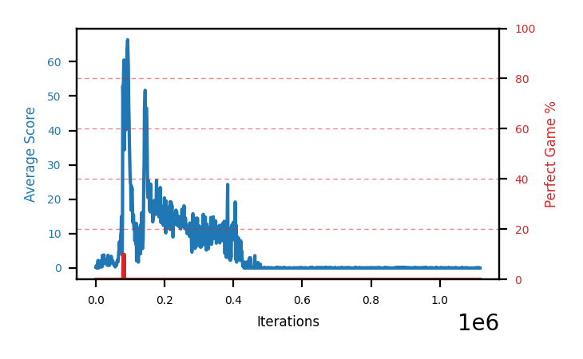

### b8b-disc999seed2 — `DISCOUNT=0.999`, seed 2

Step 1.41M · peak score **31.8** (at 63k) · best 30-eval perfect 0.0% · **died at 398k**

The second 0.999 seed, and the worst chart in this file. Peak trailing 31.8, and **not one
perfect game across 1.41M steps** — no other arm here has failed to produce at least one.
Two seeds failing this badly is what makes 0.999 falsified rather than unlucky.

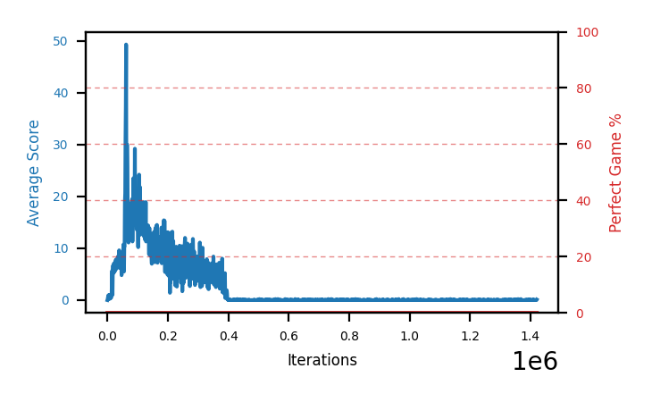

---


## Batch 7 — seeding `b6b`, and finding `DISCOUNT=0.995`

Six arms in four slots. The batch set out to seed `b6b`'s config to n=3 and instead found
the strongest result in the investigation in its spare slot.

### b7f-disc995seed3 — alpha 0.6, `td_loss`, no IS, **`DISCOUNT=0.995`**

Step 1.06M · peak score **92.6** (at 267k) · **best 30-eval perfect 44.0%** (at 699k) · **measured 38.8%, best checkpoint 51%**

**The best arm on record.** Its 44.0% best 30-eval window beats `b4c`'s 34.0%, its peak score
of 92.6 of 95 is the highest ever, and its best checkpoint measures **51%** over 100
episodes — equal to `b4c`'s best, on a config whose three seeds all survived.

The red trace is the clearest in this file: sustained 40-70% bands from 600k onward rather
than isolated spikes. Ten measured checkpoints ran 27-51%, six of them above 38%, so the peak
is a **region** rather than a lucky point.

The chart also shows the honest limit of the result. Compare it to `b4c`'s and the ceilings
are the same; what changed is that `b4c`'s config threw away two runs in three to get there.

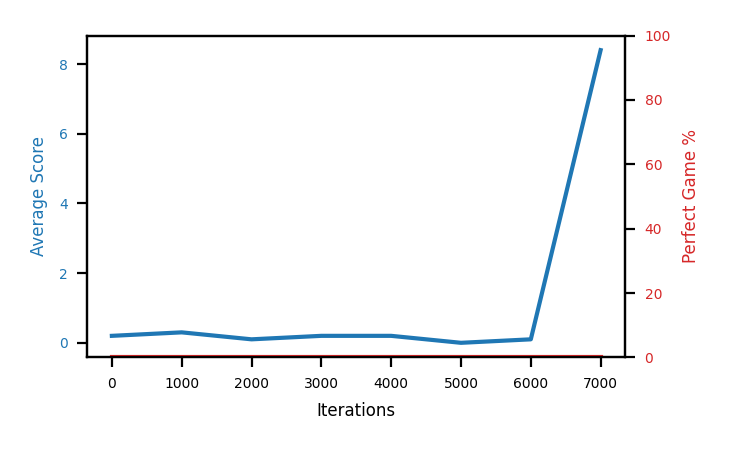

### b7e-disc995seed2 — alpha 0.6, `td_loss`, no IS, **`DISCOUNT=0.995`**

Step 1.28M · peak score 92.3 (at 997k) · best 30-eval perfect 32.3% (at 318k) · **measured 29.5%**

Second discount seed, and the one that opened fastest — trailing 75.3 within 179k steps, the
strongest start of any arm here. It oscillates more than `b7f` and its best window comes
early (318k), but it never approaches death across 1.28M steps.

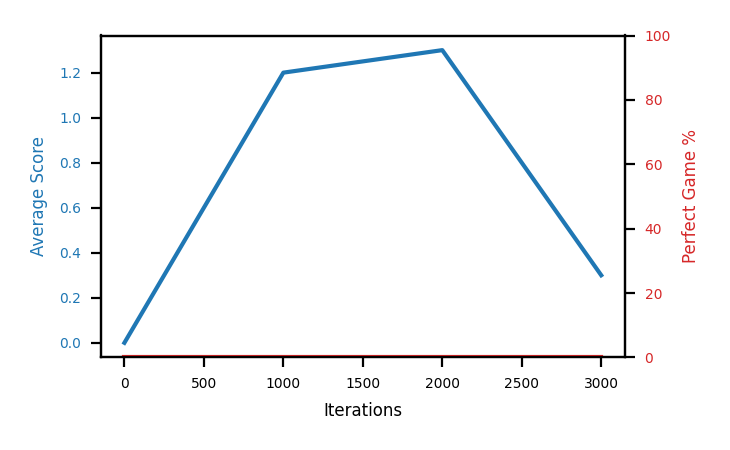

### b7d-discount995 — alpha 0.6, `td_loss`, no IS, **`DISCOUNT=0.995`**

Step 1.60M · peak score 88.7 (at 1242k) · best 30-eval perfect 17.7% (at 1336k) · **measured 16.4%**

The first discount arm and the weakest of the three, which is the useful part: at 16.4% it
still beats every non-discount arm in its own batch, so **the worst of three discount seeds
outperforms the best seed of the config it modifies.** Its best work comes late, around
1.24-1.34M, unlike `b7e`'s early peak.


### b7a-a06seed2 — alpha 0.6, `td_loss`, no IS (the seed that lived)

Step 2.00M · peak score 88.8 (at 1978k) · best 30-eval perfect 15.0% (at 1835k) · **measured 12.0%**

The one surviving `b6b` seed, and the direct control for the discount arms — same config,
`DISCOUNT=0.99`. It runs healthy for a full 2M steps and still measures only 12.0%, against
16.4-38.8% for its three discount siblings. Its peak score arrives at 1978k, right at the
end, so it was still improving when stopped.

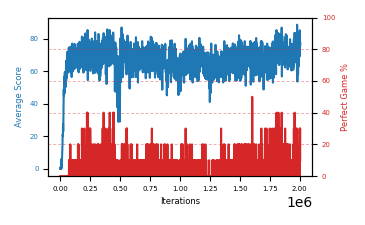

### b7b-a06seed3 — `b6b` seed 3

Step 1.78M · peak score 83.8 (at 127k) · best 30-eval perfect 7.7% · **died at 1162k**

**The cautionary chart.** Its 200k blocks run 52.6 / 19.1 / 61.9 / 50.9 / 14.3 / 0.1: it
climbed out of one deep trough, was called an oscillator on that basis, and then died from
the next one. **A past recovery is not evidence of a future one** — telling an oscillation
from a slow death needs the trend *after* the trough, not the resilience before it.

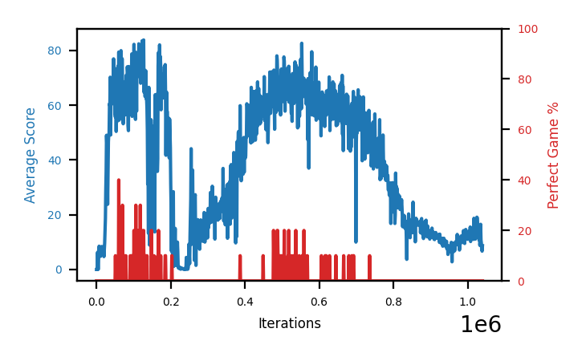

### b7c-a06seed4 — `b6b` seed 4

Step 1.74M · peak score 82.6 (at 193k) · best 30-eval perfect 9.7% · **died at 573k**

The other seed failure. Together with `b7b` it took the config's survival from 3-of-4 to
**2-of-4**, weakening the "lower sharpness is safer" reading — 50% survival against eff
~1.6's 33% is not a real difference at these sample sizes.

This arm was also the patience test: at 162k steps down it was deliberately left running
because `b6b` had recovered from a similar trough, and it went on to sit at exactly 0.0 for
**363 consecutive evals**. Both these deaths arrive far later than the eff ~1.6 deaths at
246k and 272k, which suggests lower sharpness delays death rather than preventing it.

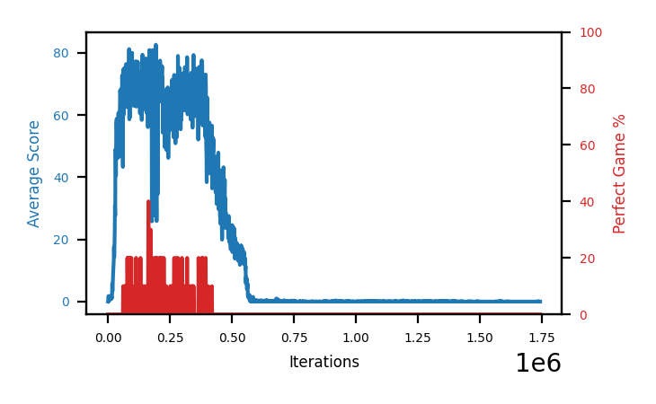

---

## Batch 6 — the effective-exponent sweep

Two arms testing a mechanism found by reading the code rather than sweeping: because
`element_wise_huber_loss` squares errors below 1.0 before alpha is applied, `td_loss` with
alpha 0.8 is really **~1.6** on the `td_error` scale. The alpha label had never matched what
was being tested.

### b6b-alpha06 — alpha 0.6, `td_loss`, no IS (eff ~1.2)

Step 1.80M · peak score 89.6 (at 1712k) · best 30-eval perfect 21.7% (at 1467k) · **measured 24.5%**

**The chart that most deserves study, because reading it wrongly cost this investigation its
fourth retraction.** The trace crashes to near-zero twice — once around 140-600k and again
near 1.2M, touching trailing 0.3 and 0.9 — and recovers fully both times, ending with its
highest perfect rates of the whole run.

At the first crash this arm was written off as "a crash with permanent capability loss" that
"never regained a quarter of its peak". It then exceeded that peak. It is a **very
long-period oscillator**, with a period over a million steps, and no read before ~600k would
have been right.

Its 24.5% was measured with the old smoothed-first selector, so it is an **underestimate**
and is due a re-measure.

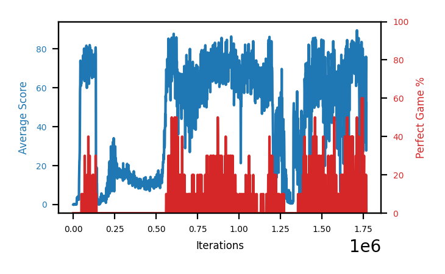

### b6a-alpha04 — alpha 0.4, `td_loss`, no IS (eff ~0.8)

Step 1.41M · peak score 87.5 (at 356k) · best 30-eval perfect 14.3% (at 372k) · **measured 8.1%**

The mirror image of `b6b` and the flattest healthy chart in this file: trailing score sits
near 73 for more than a million steps, never approaches death, and never gets much above its
own average. The prediction made before launch — that eff ~0.8 survives — held.

The pair together is the whole point: **`b6a` is safe and low, `b6b` is violent and high.**
That produced the "sharpness is a variance dial" reading, later weakened when batch 7 seeded
`b6b`'s config and lost 2 of 4 arms to late deaths.

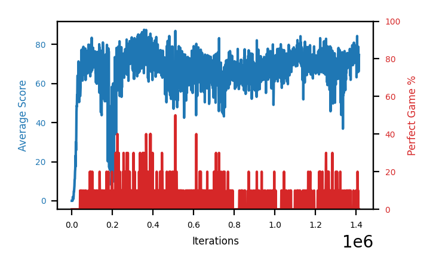

---

## Batch 5 — the `b4c` replication that failed

Four arms, all at alpha 0.8. Two exact `b4c` repeats and two single-factor reverts. **Both
exact repeats died**, which retracted the "restoring `theSchlong`'s PER triples the perfect
rate" finding and started the effective-exponent line of investigation.

### b5c-schlongIS — alpha 0.8, `td_loss`, **IS weights back on**

Step 2.31M · peak score 87.8 (at 265k) · best 30-eval perfect 17.0% (at 211k) · **measured 2.1%**

The most instructive chart in this file about **why graphs must not be used to rank arms.**
Its red trace looks healthy through the first 400k and its 17.0% window was second-best in
the batch, yet 100-episode measurement puts it **last of all four at 2.1%** — barely above
the ~1% committed baseline.

The blue trace explains the mechanism: IS correction makes the arm *stable* — it sailed
through the 200-270k window that killed `b5a` and `b5b` without dropping below 62 — but it
cancels the prioritization it is correcting, and most of the benefit with it. Stability
bought at the cost of everything worth having.

This arm also demonstrates the checkpoint-retention trap. It ran 2M steps past its peak, so
by measurement time the 211k checkpoint behind that 17.0% had been evicted and only weak
survivors remained. **Its true ceiling is unmeasurable.**


### b5d-schlongTDE — alpha 0.8, **`abs(td_error)`** priorities, no IS

Step 2.08M · peak score 86.2 (at 500k) · best 30-eval perfect 10.7% (at 410k) · **measured 6.6%**

The other single-factor revert, and the other survivor. Reverting the priority *signal*
instead of the IS weights lands the effective exponent at ~0.8 rather than ~1.6. Like `b5c`
it survives, and like `b5c` it tops out low.

The chart shows a real dip to ~23 around 243k — the same crisis window that killed the two
repeats — followed by full recovery. So the crisis is a property of the config family, not
of the two arms that died; what differs is whether it is absorbing.

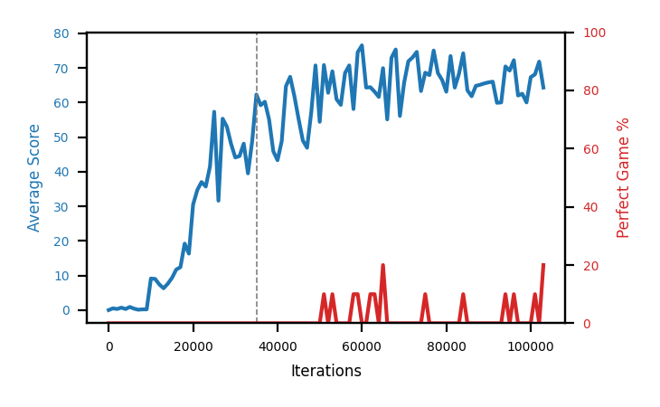

### b5a-schlong — exact `b4c` repeat, seed 1

Step 2.05M · peak score 83.9 (at 59k) · best 30-eval perfect 10.0% (at 84k) · **died at 272k**

This chart is the retraction. Identical config to `b4c` — the arm that measured ~50% at its
best checkpoint — and it goes to **0.0 and stays there for 1.7M steps.** Note how much of
the x-axis is flat: that is the eval-cost confound, since a dead policy ends every episode
instantly and burns steps several times faster than a live one. High step count on this
chart means nothing.

Checking `b4c` afterwards showed it bottomed at trailing 10.1 in the same 200-270k window
and recovered. So the config produces a **~1-in-3 lottery ticket** rather than a better
policy.

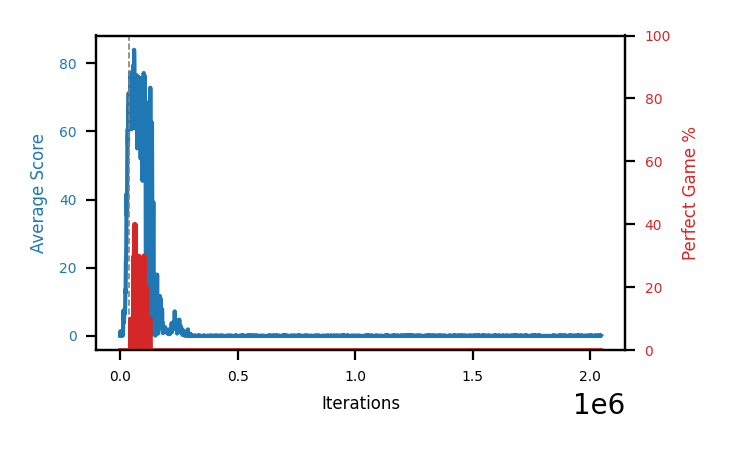

### b5b-schlong2 — exact `b4c` repeat, seed 2

Step 1.92M · peak score 83.8 (at 69k) · best 30-eval perfect 7.7% (at 129k) · **died at 246k**

The second exact repeat, and the confirmation. Same shape as `b5a` above: a healthy first
130k, then the 200-270k crisis, then flat at 0.0 for 1.9M steps. Two independent seeds
failing the same way is what makes this a retraction rather than one unlucky run.

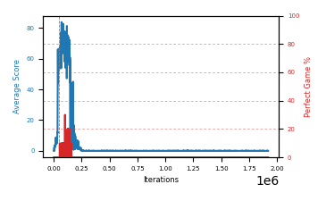

---

## Batch 4 — the sampling machinery, and the breakthrough

Three arms spanning the prioritization axis: none, none-plus-diversity, and `theSchlong`'s
original maximum. The last one won by a wide margin.

### b4c-schlongper — alpha 0.8, `td_loss` priorities, no IS weights

Step 1.06M · peak score **92.0** of 95 (at 869k) · **best 30-eval perfect 34.0%** · **checkpoint 869k measures 51.0% over 100 episodes**

**The best arm in the investigation, by roughly 2x on every measure that matters.** This
is `theSchlong`'s exact PER configuration — the three changes made during the cpprb port,
all reverted together.

Its checkpoint at 869k was reloaded and evaluated over 100 greedy episodes: **51.0%
perfect (95% CI 41.3-60.6%), median score 95 of 95.** It wins more than half the games it
plays. See [`findings.md`](findings.md) for all four checkpoint measurements.

The red trace is unmistakable against every other chart in this file: sustained 40-60%
spikes from 700k onward, **41 separate evals at >=50%**, and a peak of 80% at 970k. No
other arm has ever produced a single eval above 40%.

It is also the highest-variance arm here, and the chart shows why that matters: a **severe
collapse from 150k to 300k** takes score from 74 down to ~19 before it recovers. Judged at
300k — the horizon this document uses — this arm would have been killed as a failure. It
then climbed for 600k steps to a level nothing else has approached. The dip to 0% at
~1046k is the same phenomenon recurring; it is already recovering (71.4 score / 20% at
1058k).

High ceiling, wide spread — exactly what the human described `theSchlong` as. Consistency
is now the open problem rather than ceiling.

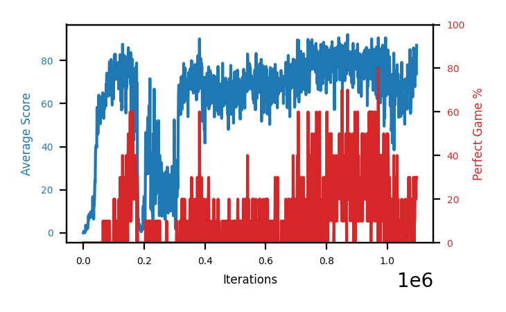

### b4b-unifbuf500k — alpha 0 (uniform) + 500k buffer

Step 1.23M · peak score 86.6 (at 743k) · best 30-eval perfect 9.3% · cumulative 4.03%

Uniform sampling with a 5x buffer, and the **steadiest arm in the investigation** — the
blue trace holds ~65-69 for a million steps with no collapse and its perfect rate is still
slowly rising (5.7% trailing, up from 4.3%). Contrast with `b3c-buf500k`, which had the
same buffer *with* PER and died: the difference between them is prioritization.

Steady, though, at a low level. This is the "stable but stuck" pattern again, and it is
the trade `b4c` refuses to make.

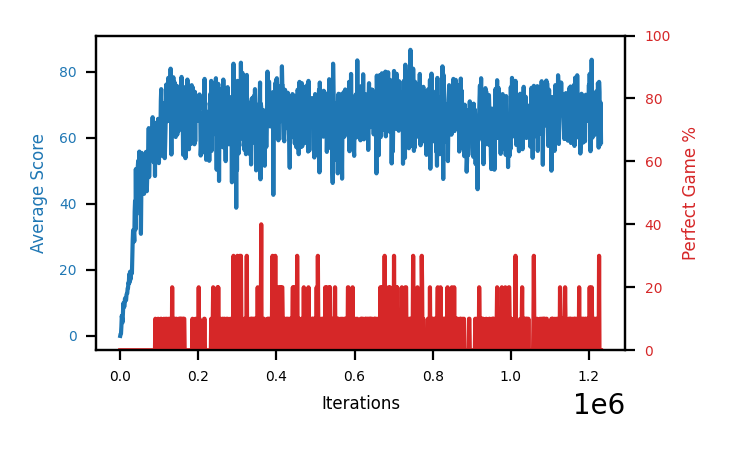

### b4a-uniform — alpha 0 (uniform), default buffer

Step 1.25M · peak score 85.9 (at 550k) · best 30-eval perfect 8.7% · cumulative 3.50%

Plain uniform sampling, which was the prior favourite going into this batch and came in at
about a third of `b4c`'s rate. Its perfect rate built steadily to 6.8% around 575k and has
drifted down since, ending near 1.8%.

Useful as the clean control: **removing prioritization entirely is better than the
committed `alpha=0.6 + IS` config but far worse than `theSchlong`'s aggressive
prioritization.** So the relationship is not monotonic in "how much prioritization", which
is why isolating which of `b4c`'s three changes carries the gain is batch 5's priority.

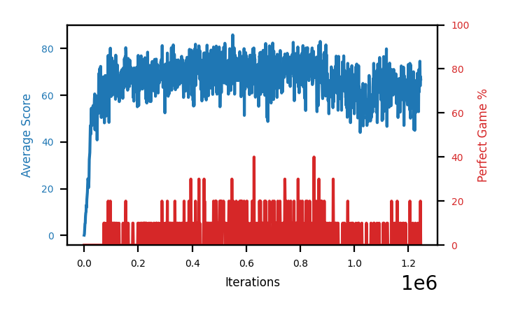

---

## Batch 3 — the epsilon hypothesis, settled

All three arms are past 490k, all three epsilon treatments engaged long ago, and the
verdict is in: **the two floored arms degraded and the fully greedy arm did not.**
Compare the three charts below in order — they are the clearest evidence in this
investigation, because the prediction was specific and it failed both ways.

### b3a-epsfloor — `MIN_EPSILON=0.001`, floored since 267k

Step 515k · peak score 83.5 (at 236k) · **best perfect-30 11.0%** · latest block 61.4 / 1.3%

**Batch 3's best perfect rate, and it still degraded.** Its perfect rate climbed
2.6 → 4.4 → 6.2 → **8.6** across the 50k blocks to 300k, with the 250-300k block
holding the highest score mean of any arm at any point (74.4, floor 58.2).

Then it turned: 8.6% → 6.8 → 2.6 → 3.6 → 3.4 → **1.3**, with score sliding 74.4 → 61.4.
The floor was engaged from 267k, i.e. for the entire decline, so it did not prevent
anything.

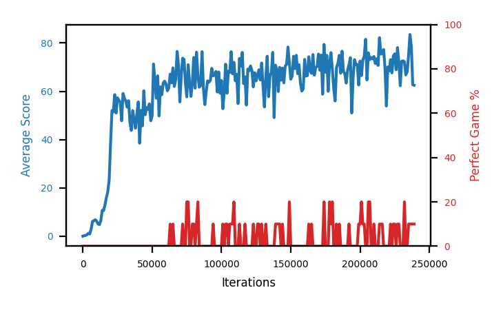

### b3b-epsfloor2 — `MIN_EPSILON=0.001`, floored since 147k

Step 516k · peak score **85.8** (at 305k) · best perfect-30 8.3% · latest block 52.0 / 3.3%

The arm with the longest treatment exposure — floored from 147k, 369k steps of it — and
**the clearest single refutation of hypothesis A.**

The chart is a rounded arc: up to a peak at ~305k, then a decline that both deepens and
widens, with the blue trace's troughs reaching into the 30s by 500k where earlier lows
were in the 50s. Growing variance alongside a falling mean is the signature to
recognise. Its worst eval in the 500-550k block is 28.2, against 52.2 in the 250-300k
block. Zero exploration was never involved.

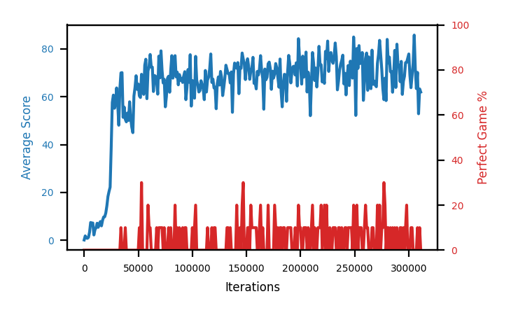

### b3c-buf500k — `REPLAY_BUFFER_MAX_LENGTH=500000`

Step 492k · peak score **85.7** (at 312k) · best perfect-30 5.7% · latest block 66.5 / 2.1%

**The arm that settled the batch, and the flattest curve in the investigation.** It
crossed `avg_reward > 100` at 282k with `MIN_EPSILON` at its 0.0 default, so it has been
running **fully greedy since 282k** — the condition that was supposed to destroy it.

The prediction was that it would break around 430-460k regardless of buffer size. **It
did not.** It set its best score of the whole run at 312k, *after* going greedy, and at
492k its 450-500k block is 66.5 against 70.7 at 250-300k — a 4-point slide where the
floored arms lost 13 and 19. Its trailing-30 perfect rate is also the only one currently
rising (0.7% → 2.7%).

Compare this chart with `b3b`'s directly: same time span, same peak height, but this one
has no arc and no variance growth. The one config difference that matters is the 5x
buffer.

**Retracted at 4.81M steps: this arm died.** Score fell to 0.0 at ~750k and stayed there
for the next 4 million steps, giving it the worst cumulative perfect rate (0.27%) of any
arm that ever learned to play. The praise above was a snapshot at 500k of a run with 4M
steps of information still in it.

Note the shape of the tail on this chart — it is what total policy destruction looks
like, and it is nothing like the gentle slides elsewhere in this file. Also note that a
dead policy is *fast*: episodes end instantly, so evals become free and this arm raced
to 4.81M steps while its batch mates did ~1.2M. Step count is not progress.

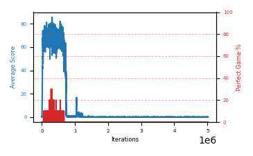

---

## Batch 2

### b2a-base2 — baseline repeat

Step 968k · peak score 83.8 (at 293k) · trailing-30 perfect **0.7%** · best perfect-30 7.0%

The counterpart to `b1a-base` and the reason repeats matter. Same config, and it ran
**well past the 265k step where its twin collapsed** without ever breaking — no cliff
anywhere on this curve.

**This is also the reference run for the premise of the whole investigation, and it
misses badly.** At 967k steps — the horizon where ~50% perfect games was expected —
its 950-1000k block is 64.3 score and **1.1% perfect**. Its best window all run was
7.0%. See "The committed config reaches ~1% at 1M steps" in
[`findings.md`](findings.md).

The chart's other useful feature is its **very long wavelength**: score dips to a
trough near 575k, recovers to ~66 by 760k, then drifts down again. At 680k this looked
like terminal decay and was written up as such; 80k steps later it looked like a
recovery; by 967k it is a shallow downward drift with big slow swings. A trough spans
~100k steps, so snapshots 150k apart give opposite verdicts — hence the rule against
calling trends from the most recent window.

Also worth noting: it never triggered the last epsilon rung, its `avg_reward` peaking
at 99.1 against the threshold of 100.

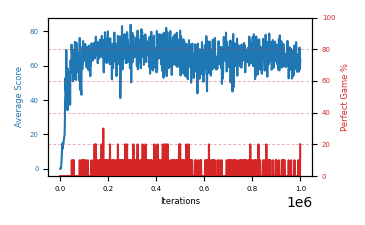

### b2b-nstep2 — `N_STEP_UPDATE=2`

Step 414k · peak score 74.6 (at 140k) · last-5 48.3 · trailing-30 perfect 0.0%

Tested whether n-step's steadiness survives at a faster rate than n=3. It does not:
this is the same shape as the n=3 chart, one step milder — peak below either
baseline, then a long slow decline. Trailing-30 perfect rate is **0.0%**, and only
two isolated perfect evals in its whole history.

Two arms, same shape, ordered by n. That is a trend rather than noise, and it closes
the n-step direction.

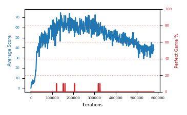

---

## Batch 1

### b1a-base — control, committed defaults

Step 414k · peak score 87.5 (at 135k) · latest 60.5 · perfect peaked at 14% mean / 40% spikes, now 2.9%

**The most important chart here: catastrophic forgetting, caught in full — and then
a half-recovery.** Broad plateau from 30k to ~260k with the perfect rate (red)
building to 14% mean and 40% spikes, a hard break at ~265k down to 20-40, then an
unaided climb back to ~65 from 350k on.

The thing to look at is the **red trace after 350k**, not the blue one. Blue
recovers; red stays sparse and short. Score came back, the ability to finish games
did not. This is the clearest picture in the investigation of why score alone is
the wrong late-run metric.

This happened *after* its best perfect rate — the run was on track for a good
result and destroyed it. `b2a-base2` below is the identical config and has not
collapsed, so this is stochastic rather than inherent to the config. It is also the
only arm that ever drove epsilon to exactly 0.0 (at 92k), which was the leading
suspect for a long time — since falsified, see [`findings.md`](findings.md).


### b1b-tgt200 — `TARGET_UPDATE_PERIOD=200`

Step 106k (stopped) · peak score 76.9 · last-5 62.5 · trailing-30 perfect 1.0%

Fastest early riser in the batch, reaching ~55 by 15k where the baseline needed
~25k, and first perfect game at 33k. But it settled into a noisy plateau slightly
below the baseline and its perfect rate never took off. Stopped to free a slot;
resumable with `SNEK_TARGET_UPDATE_PERIOD=200`.

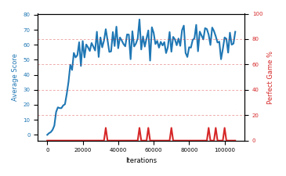

### b1c-nstep3 — `N_STEP_UPDATE=3`

Step 858k · peak score 76.0 (at 255k) · last-5 29.7 · trailing-30 perfect 0.0%

**A complete arc, and a negative result.** Slowest to rise; at matched steps it
looked like a clear loser; through 200k it was the only arm still gaining while the
others flattened, which made it the most interesting arm in batch 1. Then it peaked
at 76 around 255k and **declined for the next 600k steps**, settling flat at ~30.

Its only perfect games were a handful around 206-300k; nothing since. The long
right-hand tail is the useful part of this chart — it is what "promising trajectory
that simply runs out" looks like, and it is only visible at this horizon.

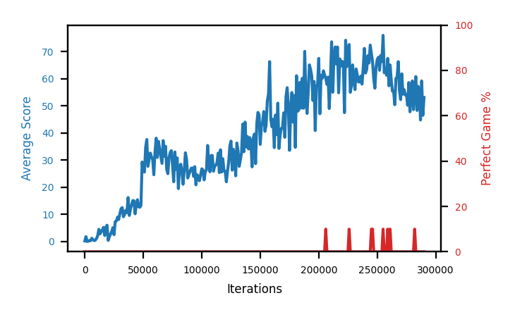
