# Charts

Progress graphs for the most recent batches — **28, 36, 37, 39, 40 and 43**, a cap of six, newest first.
Per-arm numbers live in [`completedRuns.md`](completedRuns.md); this file is images plus a short reading of
each. A batch appears here **while it is still running**, with training-only numbers, not just once it has
closed. Batch 27 was retired to [`archive/charts-archive.md`](archive/charts-archive.md) when 36 launched,
**batch 30** followed when 34's results arrived, **batch 31** (a void, stopped C51 arm) when 35's arrived,
**batch 33** when 38 launched, **batch 32** when 39 did, **batches 34 and 35** when 37's and 40's results
landed, and **the C51 pilot plus batch 38** when 42/43 launched.

**Everything here except 43 is closed.** `b39` reached its 3M cap and closed out on the laptop; `b37` and
`b40` are done on the desktop, training, close-out *and* HOF-500. **`b43` is training now**, and **`b42` — its
seed-matched control on the desktop — is queued behind a wave barrier and has no chart yet**; its section goes
in as soon as its arms produce one. The gate ladder's two null rungs (34, 70 and 35, 40) were retired earlier,
since the ladder's conclusion is now carried by 28-29, 37 and 40 — the batches that bear on whether gate 75's
record region was real.

**`b37` and `b39` are not a numbering slip:** `b37` was queued from the desktop the same evening `b38` was
launched from the laptop, so the two hosts took adjacent numbers out of order. **`b41` has no section here
either** — it is the b29 same-seed determinism probe, still closing out on the desktop.

**Batch 42 and 43 arms do not start at step 0**, so their curves begin mid-chart at the step of the checkpoint
each one continues. There is no resume line at the left edge because the graph history was deliberately not
carried over: these are fresh policy dirs seeded from one checkpoint, not resumes of the source arm.

**Older sections are retired, not deleted.** Batches 1-11 are in
[`archive/batches1-11.md`](archive/batches1-11.md) and anything retired since is in
[`archive/charts-archive.md`](archive/charts-archive.md). **The PNGs are all still in `charts/`**, so
an archived caption still renders. See
[when an arm is stopped](hyperparamTuning.md#when-you-stop-a-batch-of-arms) for the procedure.

In every chart: **blue is average score** (food eaten, out of 95) on the left axis, **red is
perfect-game percentage** on the right. Grey dashed vertical lines mark resumes; faint red dashed
horizontals mark 20/40/60/80% on the right axis, because the perfect rate is the objective and
was unreadable against left-axis ticks.

**Newest batch first.** Within a batch, best result first.

## These are snapshots, on purpose

The images are **copies** from `snek2/runs/`, not links. The live graphs there are rewritten every
eval and would be lost if that directory were cleaned out, silently blanking this file. Refresh with
`scripts/refresh_charts.sh`, which re-copies every `runs/*.png` into `charts/` and prints each one's step.

**The script does not touch this file** — it copies images only, so a new arm gets a PNG and no
entry unless one is written by hand. That drifted once, to 12 undocumented arms across batches 5-7,
because a successful `refresh_charts.sh` looked like the charts were handled. Check this file **and both
archives**, since captions now live in three places — `archive/charts-archive.md` was missing from this
snippet until 2026-08-08, which would have reported every retired arm as undocumented:

```
cd snek2/hyperparamTuning
ls charts/*.png | sed 's|.*/||;s|\.png||' | sort > /tmp/have
grep -ho 'charts/[a-zA-Z0-9-]*\.png' charts.md archive/batches1-11.md archive/charts-archive.md \
  | sed 's|.*charts/||;s|\.png||' | sort -u > /tmp/doc
comm -23 /tmp/have /tmp/doc   # anything listed is an undocumented arm
```

**Six PNGs in `charts/` are not arm charts and will always appear in that list** —
`champion-vs-mediocre`, `drawdown-b23b-vs-b18`, `per-b18-vs-b20-priorities`, `plasticity-metrics`,
`best30-drivers` and `gate-behavior-b27-vs-b29` are diagnostic figures referenced from
[`findings.md`](findings.md) and [`perDiagnostics/`](perDiagnostics/README.md), not training graphs.
Anything *else* the check prints is a real gap.

## Batch 43 — **continuing the four best checkpoints at `lr 1e-6`** — *training on the laptop, launched 2026-08-18 20:52*

**The question:** every record in this project is a checkpoint some arm *passed through* on its way to a worse
endpoint. No arm has ever been continued from its own best checkpoint. `b43` continues the top four of eight
across b29 and b40 — ranked by their best **500-episode** perfect rate — to a 3M absolute cap under b29's
config (`fc 320`, chase-safe `c=0.10` gate 75, no free-space term), with **`SNEK_LEARNING_RATE=1e-6`** the only
change. The desktop's **`b42`** runs the identical four at the default `1e-5` as the seed-matched control.
Rationale, the pre-registered outcome readings and the selection-bias warning are in
[`runs.md`](runs.md#batches-42-and-43--what-happens-if-you-keep-training-a-champion--running-launched-2026-08-18-2052);
launcher [`scripts/launch_b43_lowlr.sh`](scripts/launch_b43_lowlr.sh), seeding
[`scripts/seed_from_checkpoint.sh`](scripts/seed_from_checkpoint.sh).

| arm | continues | from | its 500-ep rate there | training-self-eval so far |
|---|---|---|---|---|
| `b43a` | `b29b-chase10g75seed2` | @1447k | **99.0%** (the project record) | best-30 **97.7**, `sef` 98.6 |
| `b43b` | `b29a-chase10g75seed1` | @1347k | 98.4% | best-30 **98.7**, `sef` 100.0 |
| `b43c` | `b40b-chasefree10g75seed2` | @1513k | 98.2% | best-30 96.0, `sef` 100.0 |
| `b43d` | `b29c-chase10g75seed3` | @1396k | 97.1% (378 ep, gate-abandoned) | best-30 95.7, `sef` 97.2 |

**Reading, ~70 evals in (≈70k steps each): all four are holding, none has improved on its start.** Every arm
sits at `sef` **97-100** with `max_single_eval` 100 and `zero_since` null — so nothing is degrading, which is
itself the first result, since a champion dropped into a fresh replay buffer at a retuned rate could easily
have fallen apart. It has not: **the same four checkpoints fell 80% → 50% perfect in 5k steps when the replay
buffer was *not* carried over**, and holding 95-98% here is what the buffer copy bought.

**Do not read these best-30 numbers against the 500-episode column beside them.** A 10-episode self-eval
averaged over 30 evals and a flat 500-episode measurement are different instruments, and the 500-ep column is
additionally **the maximum of a noisy statistic over 8 arms and hundreds of checkpoints** — biased upward. The
comparison that means something is `b43` against `b42`, which starts from byte-identical weights. Everything
here is training self-eval; the close-outs will be the real numbers.

**`sef` is not comparable with any other batch in this file.** It is the share of an arm's *own* evals above
80% perfect, and these arms started at ~98% instead of 0 — so 100.0 says "it never dropped", not "it learned
fast". Only `b42`'s `sef` is a fair reference.

### b43b-lowlr-b29a — continues `b29a` @1347k, 98.4%/500

Best-30 **98.7** at 1381k, `sef` **100.0**, recent-30 95.7, `max_single_eval` 100. The steadiest of the four
so far and the only one whose best-30 window sits above its own starting 500-ep figure — on 10-episode evals,
so not yet a result.


### b43a-lowlr-b29b — continues `b29b` @1447k, **99.0%/500, the project record**

Best-30 **97.7** at 1516k, `sef` **98.6**, recent-30 97.7. The arm that matters most: it starts from the head
of b29b's 18-checkpoint band, and [that band is now known to be a
seed rather than a config](findings.md#-corrected-2026-08-18-the-record-region-does-not-replicate--the-98500-count-is-seed-noise-and-pooled-is-the-only-metric-of-this-family-worth-reading),
so whether the region can be *extended by training inside it* is the open question `b42`/`b43` exist to answer.

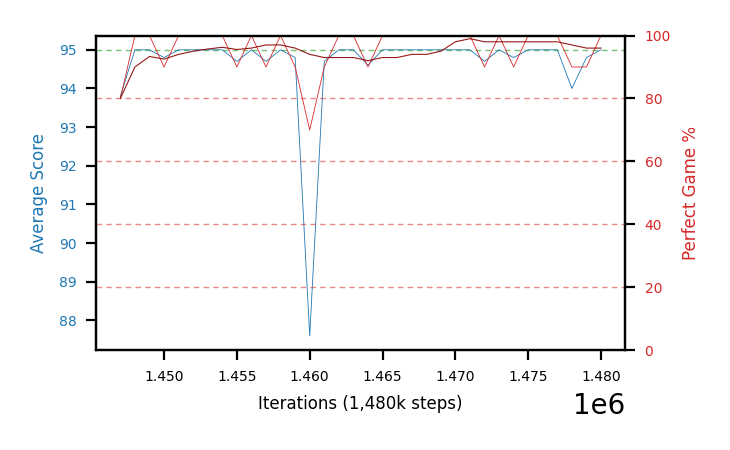

### b43c-lowlr-b40b — continues `b40b` @1513k, 98.2%/500

Best-30 96.0 at 1542k, `sef` **100.0**, recent-30 95.0. **The one arm with a confound worth stating:** `b40b`
was trained *with* the free-space PBRS term and is being continued *without* it, because the batch pins b29's
config for all four. PBRS leaves the optimal policy unchanged but the value function absorbs the potential, so
this arm's restored `Q` is mis-calibrated against its new reward in a way the other three are not. It is the
same change on the `b42` side, so the host comparison stays clean — but do not read `b43c` against `b43a/b/d`
as though only the seed differed.

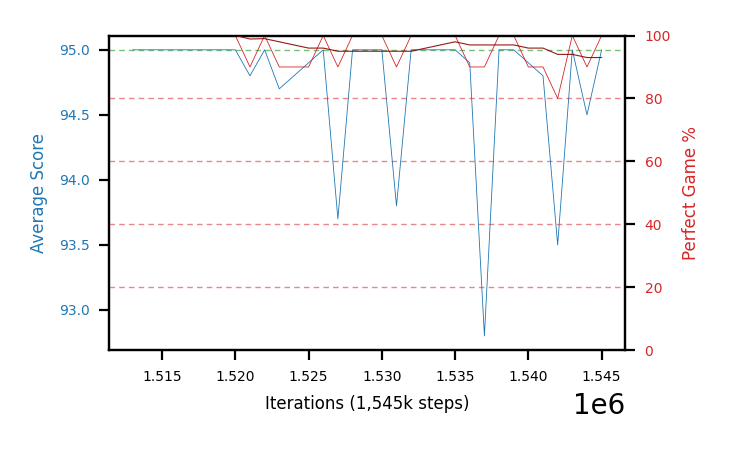

### b43d-lowlr-b29c — continues `b29c` @1396k, 97.1% over 378 episodes

Best-30 95.7 at 1461k, `sef` 97.2, recent-30 95.0. The weakest starting point of the four and currently the
weakest arm, which is the expected ordering. Its starting figure is **not** a 500-episode number — the row was
abandoned by the 98% gate at 378 episodes — so it is not strictly comparable with the three above it.


## Batch 40 — chase-safe **plus a global free-space term** — *done on the desktop: null, and it makes b29's record region look like seed luck*

**`b29`'s config with `SNEK_FREE_SPACE_SHAPING` added on top** — `Φ = 1 / (number of open regions)`, the tail
cell freed before the count, *added to* chase-safe rather than replacing it (PBRS terms sum). `fc 320`,
`c=0.10`, **gate 75**, IS off, `td_error`, 2M, seeds 1-4. The hypothesis was that an explicit
"don't cut the board in two" signal would carry the last few meals, where the chase-safe potential is
measurably exhausted (98-99 carries 0.00-0.04).

| arm | best-30 | `sef` | pooled/eq | ≥98%/100 | held ≥98%/500 |
|---|---|---|---|---|---|
| `b40b` | **97.7** | **62.7** | 89.52 | **63** | **1 — 98.2% @1513k** |
| `b40c` | 95.3 | 61.5 | 89.11 | 9 | 0 |
| `b40a` | 96.3 | 45.0 | 88.28 | 16 | 0 |
| `b40d` | 94.0 | 56.8 | 85.68 | 2 | 0 |
| **group** | | | **88.15** | **90, 4 of 4 seeds** | **1** |

**Two arms produced a flawless 100.0%/100 checkpoint** — `b40a` @1562k and `b40b` @1424k — and every seed
reached the ≥98%/100 tier, which no unshaped batch has done.

**‡ But against `b29` it is a null, and the /100 agreement is what makes that convincing.** b40's ≥98%/100
counts are **16 / 63 / 9 / 2** against b29's **59 / 64 / 9 / 1** — nearly the same distribution, same
4-of-4 shape — and pooled ties the family (**88.15** vs b29 87.83, b35 88.20, b34 86.43). The free-space term
moved neither metric.

**Where they diverge is the tier that turns out to be noise.** b29 held **21** checkpoints at ≥98%/500; b40
holds **1**. And `b37`, an exact `b29` replication on fresh seeds, holds **0** — see below. So the honest
reading is that **the ≥98%/500 band is seed-dependent, not config-dependent**: three batches with
indistinguishable /100 tiers produced 21, 1 and 0 held checkpoints. **90 ≥98%/100 checkpoints in b40 yielded
one that survived 500 episodes**, which is the attrition rate to expect, and `b40b` @1513k (**98.2%/500**) is
a HOF-promotion candidate — third-best /500 on record behind `b29b`'s 99.0 and `b29a`'s 98.4.

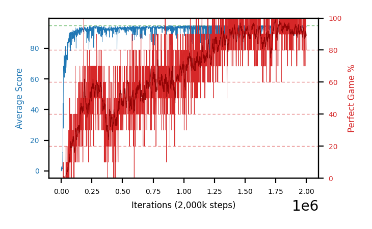
**b40a-chasefree10g75seed1** — 100.0%/100 @1562k, 16 at ≥98%/100, none held at 500

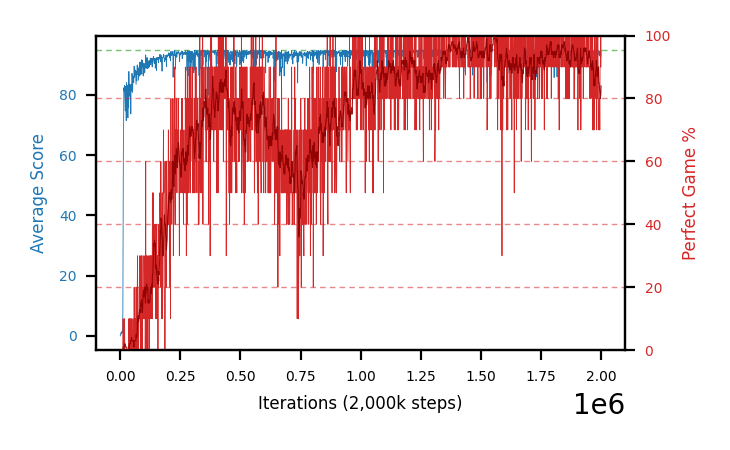
**b40b-chasefree10g75seed2** — the batch's arm: 100.0%/100 @1424k, 63 at ≥98%/100, **98.2%/500 @1513k**

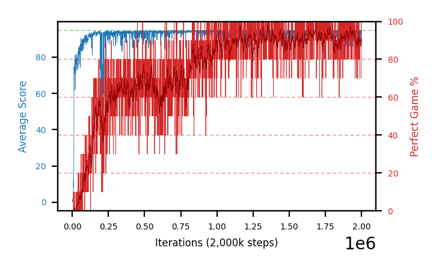
**b40c-chasefree10g75seed3** — pooled 89.11, 9 candidates, none held

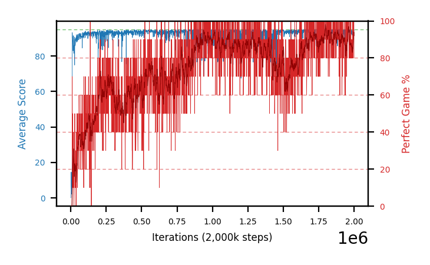
**b40d-chasefree10g75seed4** — the weak seed, as in every batch of this family

## Batch 39 — **C51 initialised at expected Q = 0** instead of the grid midpoint — *closed at the 3M cap: it loses on every metric, through the head's capacity rather than its calibration*

**b36's config with `SNEK_C51_ZERO_INIT=1` as the only change** — verified by diffing the two launchers'
environment blocks, which differ in exactly that one line. Same `eps 1.5e-4`, `lr 1e-4`, `fc 320`, seeds
1-4, 3M cap, so `b36a-d` is an exact seed-matched control. Launcher
[`launch_b39_zeroinit.sh`](scripts/launch_b39_zeroinit.sh); pre-registered hypotheses in [`runs.md`](runs.md).

**The first arm in this project to run with the ramp** — the knob shipped 2026-08-15 and was dead code
until now, so the launch was preceded by a smoke run. All four reports confirm `zero-expected-Q init`.

**It is being run knowing the measurement says it should lose.** The [init-optimism
finding](findings.md#-a-c51-head-starts-at-the-grid-midpoint-not-at-0--and-it-cost-b36-nothing-because-the-ddqn-controls-init-is-further-from-the-truth) put the
true value at **~34**, so the standard init's 57.5 is 23.5 too high and **zero is 34.0 too low** — the
ramp moves the init *further* from the truth. The point is the mechanism, not the verdict.

| | E[Q] | `aeff` | bottom-3 mass | action spread |
|---|---|---|---|---|
| standard init | 58.52 | 49.87 of 51 | 0.018 | 0.73 |
| **zero init** (λ=0.16219) | 0.07 | **6.66 of 51** | **0.290** | **0.09** |

**One λ sets the mean and the spread**, so the head starts *sharper than any trained net here ever
becomes* (b36 settles at `aeff` 20.9-24.6) and must **broaden before it can sharpen**. The ramp is also a
**−20.3 logit handicap on the top atom** and **−17.0 at `z=100`**, where a near-win must put its mass;
`e^−17 ≈ 4e−8`. **Confirmed on the smoke run:** after 2,000 steps the top-atom biases had not moved to
three decimals, all drift (max 0.0150) sitting in the bottom atoms. So recovery must come through the
kernel and cannot begin until the agent experiences high returns — **valuation lags discovery**, which
predicts damage in the endgame value signal rather than in whether the arm learns to play.

**‡ Closed: all four arms self-terminated at the 3M cap and closed out at gate 95. H2 confirmed, H1
falsified, and the margin held from 1.26M to the end.** Matched at ≤1.87M (b36's shortest horizon) and
seed-paired, b39 is **−9.4 pp** on best-30 and **−7.1 pp** on `sef`, **4 of 4 seeds down**. This is not a
slow start.

| seed | b39 best-30 / `sef` | b36 best-30 / `sef` | delta | b39 pooled | b36 pooled |
|---|---|---|---|---|---|
| 1 | 75.7 / 10.7 | 84.0 / 24.3 | **−8.3** / −13.6 | 69.78 | 75.36 |
| 2 | 75.7 / 15.8 | 86.0 / 25.3 | **−10.3** / −9.5 | 69.77 | 76.70 |
| 3 | 77.7 / 20.0 | 84.7 / 18.9 | **−7.0** / +1.1 | 70.60 | 74.77 |
| 4 | 74.7 / 11.0 | 86.7 / 17.5 | **−12.0** / −6.5 | 70.57 | 80.19 |
| **group** | **76.0 / 14.4** | **85.4 / 21.5** | **−9.4 / −7.1** | **70.18** | **76.76** |

*best-30 and `sef` matched at ≤1.87M; pooled equal-effort over each arm's whole close-out.*

**‡ The cleanest single number is that b39 produced no measurable checkpoint at all.** Across **650 rows in
four arms, every one was abandoned under the 95% gate** — not one checkpoint could still reach 95% once its
failures were counted, so the batch has **zero full-length rows**. b36 produced 4 and b38 5. b39's best rows
are truncated at **89.4-91.9%** against b36's **94.0-97.0%**. Pooled is **−6.58 pp**, 4 of 4 seeds
(−5.58, −6.93, −4.17, −9.62).

**Its seed spread is the tell that this is a ceiling, not luck: pooled 69.77-70.60, a spread of 0.83 pp**,
against b36's 5.4 and b38's 6.7. Every seed is pinned at the same worse level, which is what a capacity
constraint looks like and not what seed noise looks like.

**The `aeff` path is non-monotonic exactly as pre-registered** — b39a 7.0 → **26.7 @601k** → 21.1, b39b
7.0 → **27.3 @631k** → 20.9, against b36a's monotone 49.6 → 21.6. The head does spend training broadening
before it can sharpen.

**But the predicted *reason* was wrong, and the correction is the point.** The damage was expected to run
through calibration — zero-init starts 34 from the truth against standard init's 23.5, so it should take
longer to arrive. **It arrives sooner:** half-life on `|excess|` is **202k / 163k** for b39a/b39b against
b36a's **304k**, wash-out 601k/631k against 864k, from a *larger* initial error (−30 vs +24). Faster
calibration, worse play.

**What actually separates them is the action gap.** b36a has full-scale separation (**12.18**) by 8,000
steps; b39 sits at **1.72** and needs ~600k to reach 8.90, so its whole first 600k runs at a gap 3-7×
smaller. `argmax` ignores the level and depends entirely on the differences — the level was never the
thing to measure. b39 also parks **15-18%** of its greedy mass on the `−5` death atom early, against
b36's 0.3%. **The transferable rule: judge a categorical init by the spread it leaves available, not by
how close its mean is to the truth.** Full account in
[`findings.md`](findings.md#-zero-init-loses-and-the-channel-is-action-separation-not-calibration--b39-closed-at-3m).

| arm | step | trailing | best-30 (own peak) | `sef` | pooled | best row |
|---|---|---|---|---|---|---|
| `b39d` | 3000k | 92.1 | **80.7** @2924k | 15.7 | 70.57 | 90.9% (77 ep, ab.) |
| `b39c` | 3000k | 90.8 | 77.7 @886k | 17.6 | 70.60 | 91.9% (86 ep, ab.) |
| `b39a` | 3000k | 91.4 | 75.7 @1795k | 12.8 | 69.78 | 89.4% (66 ep, ab.) |
| `b39b` | 3000k | 88.8 | 75.7 @769k | 13.6 | 69.77 | 91.5% (71 ep, ab.) |

*Own-peak best-30 is over the full 3M, so it flatters b39 against b36's 2M — and it still loses by 5-11 pp.*

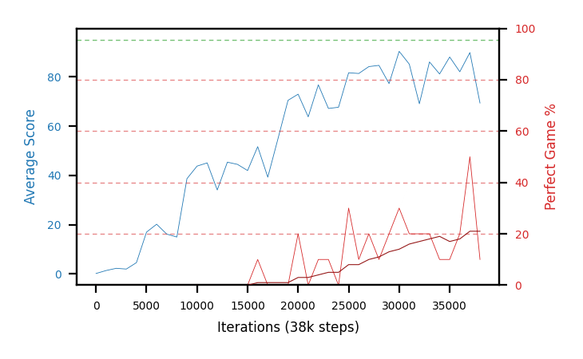
**b39a-c51zeroinitseed1** — paired with `b36a` (best-30 84.0, pooled 75.36)

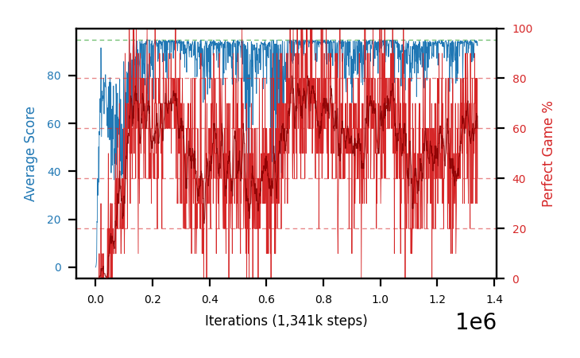
**b39b-c51zeroinitseed2** — paired with `b36b` (86.0, 76.70)

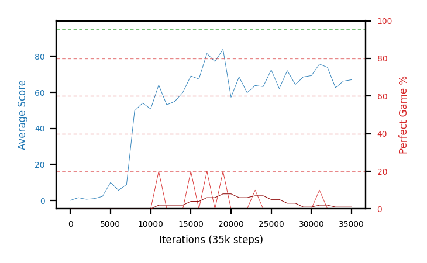
**b39c-c51zeroinitseed3** — paired with `b36c` (84.7, 74.77)

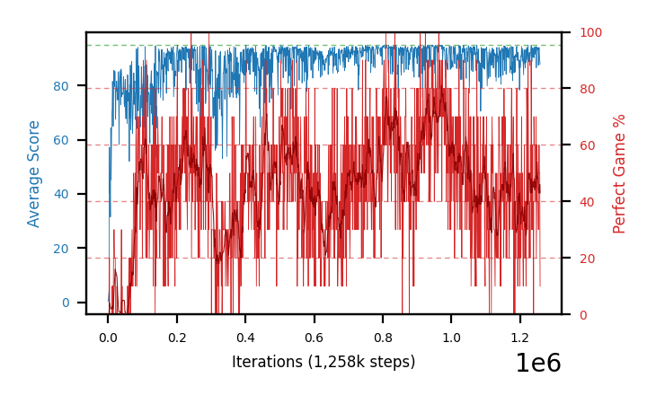
**b39d-c51zeroinitseed4** — paired with `b36d` (86.7, **80.19** — the control's strongest arm)

## Batch 37 — **`b29` replicated on fresh seeds 5-8** — *done on the desktop: the /100 band replicates, the /500 record does not*

**Byte-identical to `b29` except `SNEK_SEED`** — `fc 320`, chase-safe `c=0.10`, **gate 75**, IS off,
`td_error`, 2M. Queued because b29's 21-checkpoint ≥98%/500 band rested on **2 of its 4 seeds**, and a
record region that depends on the seed is a different claim from one that depends on the config.

| arm | best-30 | `sef` | pooled/eq | ≥98%/100 | held ≥98%/500 |
|---|---|---|---|---|---|
| `b37b` | **97.7** | 56.0 | **90.50** | **43** | 0 — best 97.0%, abandoned at 361 ep |
| `b37c` | 97.0 | **58.6** | 87.88 | 16 | 0 — best 96.9%, abandoned at 357 ep |
| `b37a` | 91.3 | 49.8 | 82.19 | 0 | 0 |
| `b37d` | 90.0 | 40.8 | 80.72 | 0 | 0 |
| **group** | | | **85.32** | **59, 2 of 4 seeds** | **0 of 4** |

**The 2-of-4 pattern replicates exactly** — two strong seeds carrying the ≥98%/100 tier, two contributing
nothing — and `b37b`'s pooled **90.50** is the highest single arm in the chase-safe family. **The record tier
does not replicate at all:** 59 candidates at ≥98%/100 produced **zero** that held 98% over 500 episodes, with
the two best abandoned around 360 episodes at 96.9-97.0%.

**Read this together with `b40` above.** The same config, fresh seeds, gives 0 where b29 gave 21; a different
config with an added shaping term gives 1. **The ≥98%/500 count is the noisiest metric in this project** and a
single batch's value should not be treated as a property of its config. Pooled equal-effort is what
distinguishes these batches, and on that b37 (85.32) is the *weakest* of the family despite holding its best
single arm.


**b37a-chase10g75seed5** — seed 5, no ≥98%/100 checkpoint at all


**b37b-chase10g75seed6** — strongest arm of the family on pooled (90.50), yet 0 held at 500


**b37c-chase10g75seed7** — highest `sef` of the batch (58.6), 16 candidates, 0 held


**b37d-chase10g75seed8** — the weak seed

## Batch 36 — **C51 on `fc 320`**, one wide layer instead of three narrow — *stopped at 1.87-2.02M, closed out*

**Batch 32's config verbatim at `eps 1.5e-4` with `SNEK_FC_LAYERS=320` the only change**, seeds 1-4, win
reward back at its default 100, `lr 1e-4`, 51 atoms over `[-5, 120]`. Launched 12:43 on 2026-08-16;
launcher [`launch_c51_fc320.sh`](scripts/launch_c51_fc320.sh), rationale and pre-registered hypotheses in
[`runs.md`](runs.md).

**Two controls, both on disk, answering different questions.** `b32a`/`b32b` — same `eps`, `lr` and seeds
at `fc 200,100,100` — is the clean one-variable *architecture* pair, but only 1M deep, so **match at 1M
before quoting anything**. `b24a-d` is **ddqn** at this exact shape, **3M** and closed out at pooled
**85.97-89.03** with two ≥98%/500 records, which is the "is C51 worth it at all" comparison — **and b36
did not clear it**, see the reading below.

**What the shape changes for a categorical head is *where* the parameters sit, not how many.** Obs 30 to
3×51 = 153 outputs:

| shape | first layers | final layer | total | share in the final layer |
|---|---|---|---|---|
| **`fc 320`** | 9,920 | **48,960** | ~58.9k | **83%** |
| `fc 200,100,100` | 36,400 | 15,453 | ~51.9k | 30% |

Only +13% capacity, but the budget moves into the layer feeding the 153-way distribution, and two layers
of gradient compounding disappear. **That second half is why churn is the reading, not level** — C51's
defect here is instability.

**The pre-registered expectation is a null on the ceiling**, because nine shapes have never raised it and
the one direct measurement says the deeper net's penultimate layer was *not* capacity-bound (effective rank
16-20 of 100, head outputs 4-6 of 153). **If that rank comes out at 16-20 of 320 here too, widening bought
nothing** and any gain is optimisation rather than capacity.

**Stopped at 2M rather than 3M** (21:26 on 2026-08-16, the user's call), so **match at 2M**. Close-out
complete at gate 95, 4 parallel processes at `EVAL_WORKERS=4`:

| arm | step | best-30 | at | `sef` | trailing | pooled /eq | best ckpt |
|---|---|---|---|---|---|---|---|
| `b36d` | 1873k | **86.7** | 331k | 17.4 | 92.64 | **80.19** | 95.0 @356k |
| `b36b` | 1972k | 86.0 | 402k | **24.7** | 91.14 | 76.70 | 94.0 @305k |
| `b36c` | 2011k | 84.7 | 247k | 19.5 | **93.14** | 74.77 | 91.6 @471k *[83 ep]* |
| `b36a` | 2023k | 84.0 | 977k | 23.2 | 92.02 | 75.36 | **97.0 @550k** |
| *`b32a`/`b32b` control, `fc 200,100,100`, ≤1M* | 1000k | *77.0 / 63.0* | | *16.1 / 10.3* | | *never closed out* | |
| **`b24a-d` control, `ddqn` at this same `fc 320`, 3M** | 3000k | **95.3-96.7** | | **60.5-73.2** | | **85.97-89.03** | **98.0-100.0** *(≤2M rows)* |

**Hypothesis 2 beat the null against `b32`, and the batch still loses badly to `b24`.** Both readings are
real and they answer different questions:

- **Against `b32` (the C51 architecture question): a clear gain.** Best-30 **84.0-86.7 against 77.0/63.0**,
  `sef` 17.4-24.7 against 10.3/16.1, and the **seed spread collapsed from 14 pp to 2.7 pp**. Wide-shallow
  is the better C51 shape.
- **Against `b24` (the "is C51 worth it" question): no.** Same `fc 320`, same observation era, `ddqn`:
  best-30 **95.3-96.7**, `sef` **60.5-73.2** — a factor of 3, and `sef` is the low-variance metric — and
  **every b24 seed produced a ≥98% checkpoint inside 2M** where no b36 seed did. The seed-agreement gain
  also does not generalise: `b24`'s spread is **1.4 pp**, tighter than b36's. Full comparison and its
  caveats in [`findings.md`](findings.md#-after-four-fixes-c51-is-still-well-behind-the-scalar-head-at-its-own-architecture--and-b24-not-b32-is-the-control).

**The 3M question went unanswered** — every arm peaked best-30 by 402k except `b36a` (977k) while trailing
stayed 91-93 to 2M, so it neither collapsed like b33 nor kept climbing. **`b36c`'s best row is 83 episodes,
not 100** — abandoned under `EVAL_MIN_ACHIEVABLE=95`, so `best_of` relaxed to half-depth and it is not
comparable with the full-length rows.

**Init optimism is now measured and excluded as a C51 explanation.** Every arm started at `V ≈ 57.5`, the
grid midpoint, against a true value of **~34** — but the offset is common-mode (the action gap is at full
scale by 8k), it costs the policy nothing, and the `ddqn` control's init at 0 is *further* from the truth.
[The finding](findings.md#-a-c51-head-starts-at-the-grid-midpoint-not-at-0--and-it-cost-b36-nothing-because-the-ddqn-controls-init-is-further-from-the-truth).

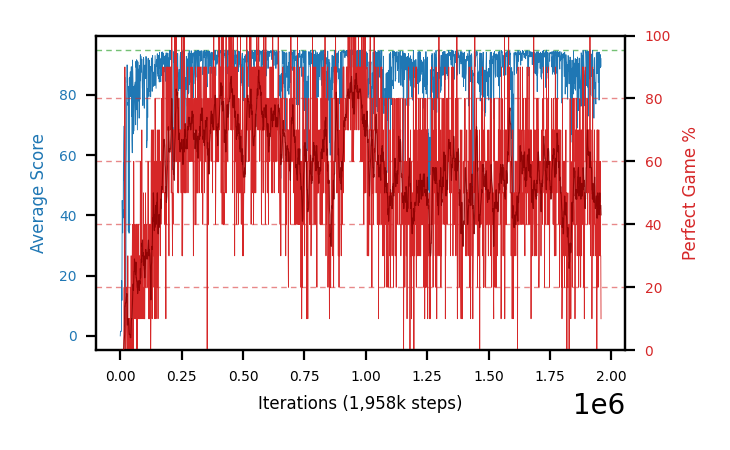
**b36a-c51fc320seed1** — paired with `b32a`

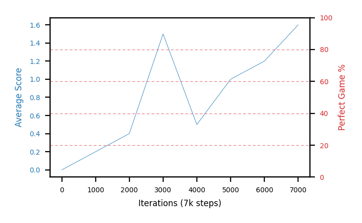
**b36b-c51fc320seed2** — paired with `b32b`


**b36c-c51fc320seed3**


**b36d-c51fc320seed4**

## Batches 28-29 — chase-safe **dose** (`c=0.20`) and **gate** (`75`) on `fc 320` — *done: the gate is the lever (desktop)*

Both extend b27's gate-85 null onto the two axes a single dose could not test. `b28` doubles the coefficient
to **`c=0.20`** at gate 85; `b29` drops the **gate to 75** at `c=0.10`. Everything else is b24's config —
`fc 320`, IS off, `td_error`, target 1000, discount 0.9975, `FORK_BRANCHES=4`, 2M cap, seeds 1-4, the same
`b24a-d` control. All eight closed out and HOF-500'd on the desktop.

**`b28` (`c=0.20`, gate 85) is a null — the dose is not the issue.** Pooled mean **85.4**, ~2.5 under the b24
control's 87.9, and **0 of 4** seeds held ≥98%/500. With b27/b30 this rules out both the net and the dose at
gate 85.

| arm | best-30 | `sef` | pooled (eq) | HOF-500 |
|---|---|---|---|---|
| `b28d-chase20g85seed4` | 96.7 | 68.7 | 89.10 | best 96.8% @1061k (341 ep, ab.) — **0 held** |
| `b28a-chase20g85seed1` | 96.0 | 54.0 | 89.72 | best 95.6% @1727k (275 ep, ab.) — **0 held** |
| `b28c-chase20g85seed3` | 92.7 | 33.4 | 82.67 | none reached the gate — **0 held** |
| `b28b-chase20g85seed2` | 90.7 | 47.9 | 80.15 | best 90.0% @1127k (120 ep, ab.) — **0 held** |

**`b29` (`c=0.10`, gate 75) produced a record region — the positive result of the whole investigation.**
Pooled **87.8** (a dead heat with b24) but **21 checkpoints held ≥98%/500 across two of four seeds**, where
the record-holding control produced only 2 isolated ones. `b29b` carries an **18-checkpoint band**
(1446k-1529k) peaking at **99.0%/500 (495/500) @1447k** — **the new project record** (point estimate above
b24's 98.0%/500; lead inside the CI, but the *region* is not).

| arm | best-30 | `sef` | pooled (eq) | HOF-500 (≥98%/500) |
|---|---|---|---|---|
| `b29a-chase10g75seed1` | 97.7 | 60.3 | 89.76 | **3 held**, best 98.4% @1347k |
| `b29c-chase10g75seed3` | 96.3 | 67.9 | 89.68 | 0 held (best 97.1%, 378 ep ab.) |
| `b29b-chase10g75seed2` | 97.3 | 55.6 | 87.14 | **18 held** (1446k-1529k), best **99.0% @1447k** |
| `b29d-chase10g75seed4` | 94.3 | 59.7 | 84.75 | 0 held (best 90.6%, 127 ep ab.) |

**The gate is the lever, not the dose or the net.** Gate 85 is null on `fc 320` (b27), on `fc 200,100,100`
(b30) and at doubled dose (b28); gate 75 matches the control's pooled *and* produces a record region it never
did. The Φ calibration is why — the potential carries ~0 at lengths 98-99, so a gate-85 term grades the flat
final approach while gate 75 turns it on ten meals earlier, in the packing decisions that decide whether the
endgame is winnable. Full write-up:
[`completedRuns.md`](completedRuns.md#batches-28-29--chase-safe-dose-and-gate-the-gate-is-the-lever-and-gate-75-produces-a-record-region).
`b29b` @1447k was promoted to `hallOfFame/` on 2026-08-16 (copy verified 98/100 on fresh laptop episodes).

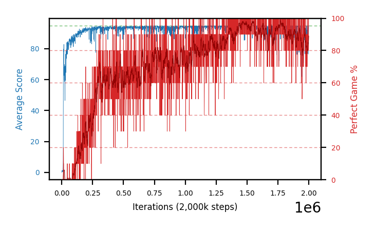
**b29b-chase10g75seed2 — 99.0%/500 @1447k, the record-region arm**


**b29a-chase10g75seed1 — 3 held ≥98%/500**

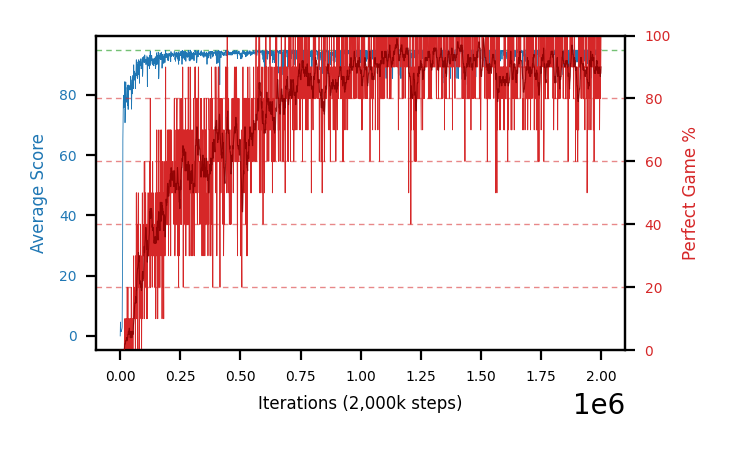
**b29c-chase10g75seed3**

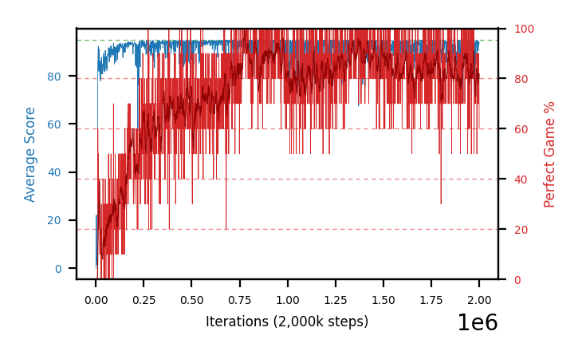
**b29d-chase10g75seed4**


**b28a-chase20g85seed1** (`c=0.20`, null)


**b28b-chase20g85seed2** (`c=0.20`, null)


**b28c-chase20g85seed3** (`c=0.20`, null)


**b28d-chase20g85seed4** (`c=0.20`, null)
