# Charts

Progress graphs for the most recent batches — **23 through 27 plus 30**, a cap of six, newest first. Per-arm
numbers live in
[`completedRuns.md`](completedRuns.md); this file is images plus a short reading of each. A batch appears
here **while it is still running**, with training-only numbers, not just once it has closed.

**Older sections are retired, not deleted.** Batches 1-11 are in
[`archive/batches1-11.md`](archive/batches1-11.md) and anything retired since is in
[`archive/charts-archive.md`](archive/charts-archive.md). **The PNGs are all still in `charts/`**, so
an archived caption still renders. See
[when an arm is stopped](hyperparamTuning.md#when-you-stop-a-batch-of-arms) for the procedure.

In every chart: **blue is average score** (food eaten, out of 95) on the left axis, **red is
perfect-game percentage** on the right. Grey dashed vertical lines mark resumes; faint red dashed
horizontals mark 20/40/60/80% on the right axis, because the perfect rate is the objective and
was unreadable against left-axis ticks.

**Newest batch first.** Within a batch, best result first.

## These are snapshots, on purpose

The images are **copies** from `snek2/runs/`, not links. The live graphs there are rewritten every
eval and would be lost if that directory were cleaned out, silently blanking this file. Refresh with
`refresh_charts.sh`, which re-copies every `runs/*.png` into `charts/` and prints each one's step.

**The script does not touch this file** — it copies images only, so a new arm gets a PNG and no
entry unless one is written by hand. That drifted once, to 12 undocumented arms across batches 5-7,
because a successful `refresh_charts.sh` looked like the charts were handled. Check this file **and both
archives**, since captions now live in three places — `archive/charts-archive.md` was missing from this
snippet until 2026-08-08, which would have reported every retired arm as undocumented:

```
cd snek2/hyperparamTuning
ls charts/*.png | sed 's|.*/||;s|\.png||' | sort > /tmp/have
grep -ho 'charts/[a-zA-Z0-9-]*\.png' charts.md archive/batches1-11.md archive/charts-archive.md \
  | sed 's|.*charts/||;s|\.png||' | sort -u > /tmp/doc
comm -23 /tmp/have /tmp/doc   # anything listed is an undocumented arm
```

**Four PNGs in `charts/` are not arm charts and will always appear in that list** —
`champion-vs-mediocre`, `drawdown-b23b-vs-b18`, `per-b18-vs-b20-priorities` and `plasticity-metrics` are
diagnostic figures referenced from [`findings.md`](findings.md) and
[`perDiagnostics/`](perDiagnostics/README.md), not training graphs. Anything *else* the check prints is a
real gap.

## Batch 28 — chase-safe shaping at **`c=0.20`**, gate 85 (b24 config) — *b28a-d running on the desktop*

The dose rung above b27. Identical to it — `fc 320`, gate 85, IS off, `td_error`, target 1000, discount
0.9975, `FORK_BRANCHES=4`, 2M cap, seeds 1-4, the same `b24a-d` control — with the shaping coefficient
**doubled to `c=0.20`**. Its job is the one ambiguity a single dose cannot resolve: **b27 came back null**
(below — pooled 85.2 vs the control's 87.9, and **0 of 4** record-tier checkpoints against the control's
two), so b28 separates *"chase-safe is the wrong idea"* from *"`c=0.10` was too small to see."*

**Status at 08:46 on 2026-08-15: 262-275k of 2M (~13%), all four healthy** — epsilons off the 0.0125
ceiling (0.003-0.005), no dead or zero stretch, peak trailing ~93.7. **A dead heat with the control this
early, exactly like b27 was**: at the matched ≤275k horizon mean best-30 **56.9 vs 57.4 (−0.5), 2 of 4
seeds ahead**, `sef` ~3 for both (near zero this early). Nothing to read yet — best-30 at 13% of the cap
measures *when* an arm started winning, not the endgame consolidation this batch is about. Shaped first,
control in parentheses:

| arm | step | best-30 (control) | `sef` (control) |
|---|---|---|---|
| `b28b-chase20g85seed2` | 275k | **65.3** (`b24b` 58.3, +7.0) | 5.4 (2.2) |
| `b28d-chase20g85seed4` | 269k | 63.3 (`b24d` 73.7, −10.4) | 6.7 (13.8) |
| `b28c-chase20g85seed3` | 274k | 53.3 (`b24c` 58.7, −5.4) | 0.0 (1.8) |
| `b28a-chase20g85seed1` | 262k | 45.7 (`b24a` 39.0, +6.7) | 0.4 (0.0) |

**The verdict is the 2M close-out's ≥98%/500 count, read against b24's two records — not best-30 at 275k.**
`b29` (gate 75) is queued behind these four.

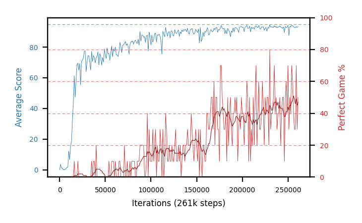
**b28a-chase20g85seed1**

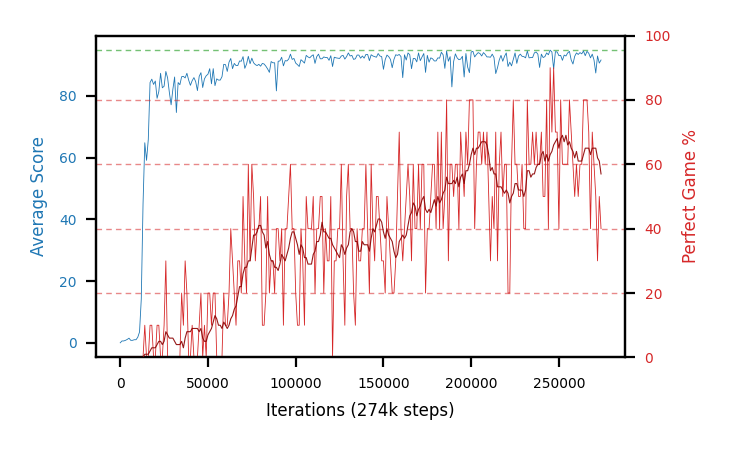
**b28b-chase20g85seed2**

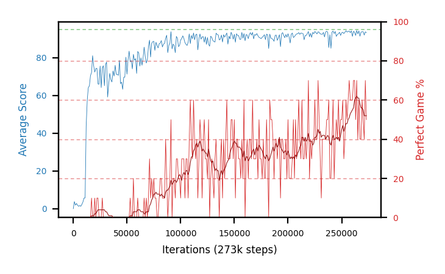
**b28c-chase20g85seed3**

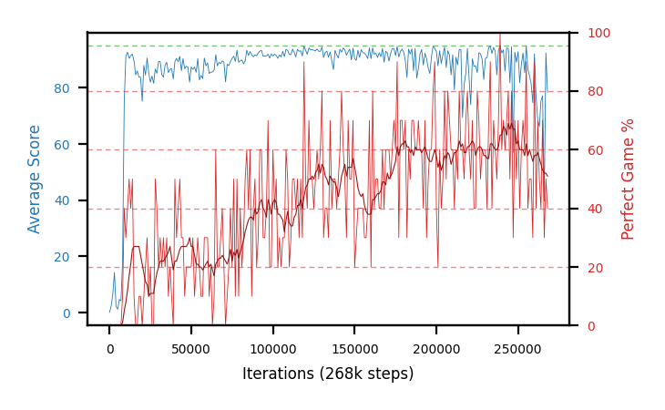
**b28d-chase20g85seed4**

## Batch 30 — the same shaping on `fc 200,100,100`, `c=0.10`, gate 85 — *done at the 2M cap (laptop)*

b27's config with one change, the net: **`200,100,100`** instead of `320`. Everything else is identical —
`c=0.10`, gate 85, IS off, `td_error`, target 1000, discount 0.9975, `FORK_BRANCHES=4`, no food-distance
shaping, **2M cap**, seeds 1-4. Together with b24/b25/b27 it makes a **2×2 of shaping × architecture**, so
the shaping result stops depending on one net.

**Done at the 2M cap on the laptop, all four — and the early edge washed out.** At ~0.95M this wave read
`sef` **+6.9, 4 of 4 ahead** of its b25 control; **carried to the full 2M cap the lead is gone.** Matched
at ≤2M, mean best-30 **92.9 vs 93.6 (−0.7)** and mean `sef` **56.9 vs 58.6 (−1.7)** — a dead heat, if
anything a shade behind, and now pointing the *same* way as b27. The +6.9 was the ~10 pp `n=4` noise
resolving as the control caught up, not a shaping effect. All four healthy throughout (peak trailing ~95,
no dead or zero stretch), so the potential-based term is not destabilizing — it just is not helping. Final
training numbers, shaped first, b25-r2 control at the matched ≤2M horizon in parentheses:

| arm | seed | best-30 (control) | `sef` (control) | peak trail |
|---|---|---|---|---|
| `b30e-chase10fc200x100x100seed1` | 1 | 93.7 (`b25a` 93.7, +0.0) | 58.4 (61.4, −3.0) | 95.00 |
| `b30g-chase10fc200x100x100seed3` | 3 | 93.3 (`b25c` 93.7, −0.4) | 58.3 (61.0, −2.7) | 95.00 |
| `b30f-chase10fc200x100x100seed2` | 2 | 92.3 (`b25b` 95.3, −3.0) | 55.9 (57.9, −2.0) | 94.92 |
| `b30h-chase10fc200x100x100seed4` | 4 | 92.3 (`b25d` 91.7, +0.6) | 55.0 (54.2, +0.8) | 95.00 |
| **mean** | | **92.9 (93.6, −0.7)** | **56.9 (58.6, −1.7)** | — |

**Close-out running on the laptop** (4 parallel `top20` processes, gate 95, started 09:35 on 2026-08-15,
`complete=false` as of ~12:52). Until it lands b30 still has no pooled figure and no **≥98%/500 count**,
the decisive metric for the shaping×architecture 2×2. Numbers go to `completedRuns.md` and the pooled/HOF
line here when the four processes finish.

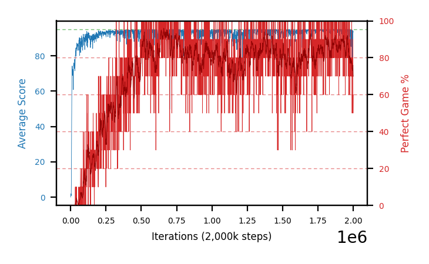
**b30e-chase10fc200x100x100seed1**

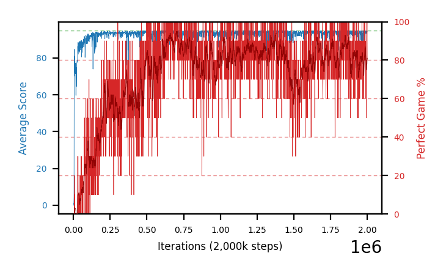
**b30f-chase10fc200x100x100seed2** — the first red mark of the relaunch, at step 6k.

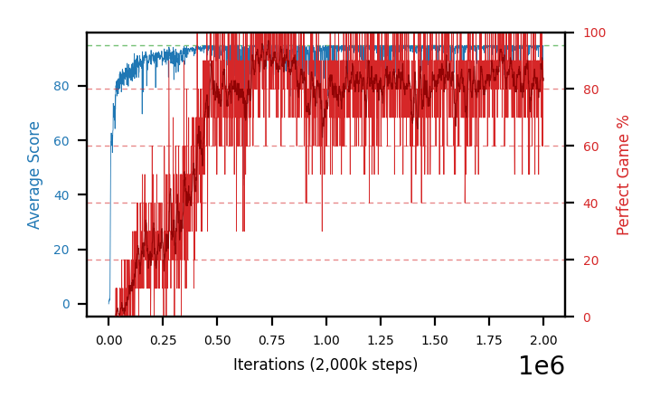
**b30g-chase10fc200x100x100seed3**

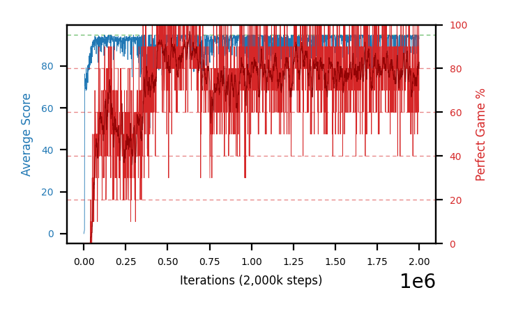
**b30h-chase10fc200x100x100seed4**

## Batch 27 — potential-based chase-safe shaping, `c=0.10`, gate 85 (b24 config) — *done, close-out null*

The first arms to carry the new shaping term. `Snake.step` adds `c·(γΦ(s′) − Φ(s))` with **Φ = 1 iff the
head and tail share a free region that also holds the food, and the snake is ≥85 long**; potential-based,
so the optimal policy is untouched and only the gradient on the way there changes. Everything else is
b24's config — `fc 320`, IS off, `td_error`, target period 1000, discount 0.9975, `FORK_BRANCHES=4`,
seeds 1-4 — which makes **`b24a-d` the seed-matched control**. Cap **2M** (b24 ran 3M; its record
checkpoints land at 1.03-1.39M). Design and the Phase 0 calibration of `c`:
[the plan](../plans/chase-safe-reward-shaping.md) and [`runs.md`](runs.md).

**Done at the 2M cap, closed out on the desktop — and it is a null.** The close-out pools **85.6 / 84.2 /
83.2 / 88.0** (eq-effort, gate 95), **mean 85.2**, against the b24 control's **~87.9** — a shade *below*, not
above. And on the metric that matters, **no b27 seed produced a ≥98%/500 checkpoint**: the auto-chained
HOF-500 re-measure (gate 98, 500 episodes) found `b27e` empty, `b27f` a single 92.6% partial, `b27g` best
96.6%, `b27h` best **97.5%** (435 ep) — all short of the bar the control cleared **twice** (`b24b`, `b24d`
both 98.0%/500, the record). So `c=0.10` chase-safe shaping on `fc 320` did not reproduce the record, let
alone beat it. All four healthy throughout (trailing 93.6-94.1, no dead or zero stretch), so the term is
not destabilizing — it simply bought nothing. Close-out and HOF-500, shaped first, b24 control in
parentheses:

| arm | close-out pooled (control) | HOF-500 best (≥98% held) |
|---|---|---|
| `b27h-chase10g85seed4` | **88.0** (`b24d` 85.97) | 97.5% @1945k, 435 ep — **0 held** |
| `b27e-chase10g85seed1` | 85.6 (`b24a` 89.03) | none reached the gate |
| `b27f-chase10g85seed2` | 84.2 (`b24b` 88.84) | 92.6% @1431k (partial) — 0 held |
| `b27g-chase10g85seed3` | 83.2 (`b24c` ~87.8) | 96.6% @1975k — 0 held |
| **mean** | **85.2 (≈87.9)** | **0 of 4 ≥98%/500 (control: 2 of 4)** |

Read together with b30 (same `c=0.10`, other net, also a dead-heat-to-slightly-behind after the early edge
washed out), **both architectures agree that `c=0.10` chase-safe shaping does not help.** Whether that is
the idea or the dose is exactly what **b28** (`c=0.20`, above) is running to answer; **b29** (gate 75) is
queued behind it.

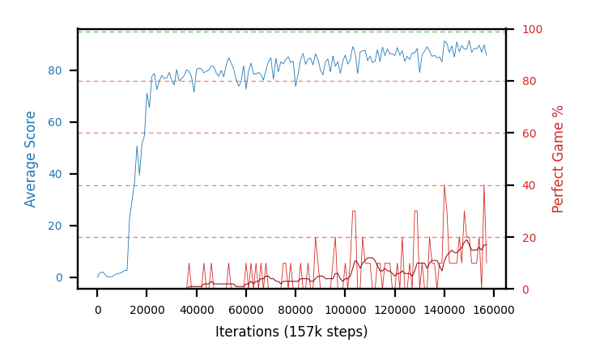
**b27e-chase10g85seed1**

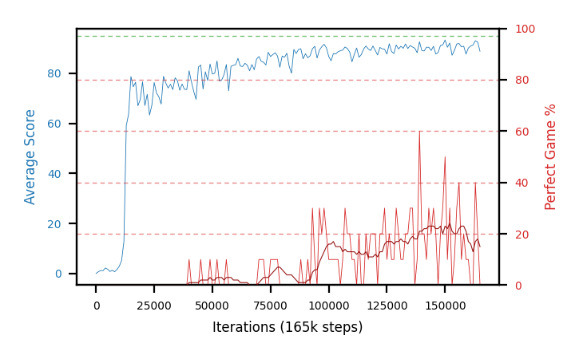
**b27f-chase10g85seed2**

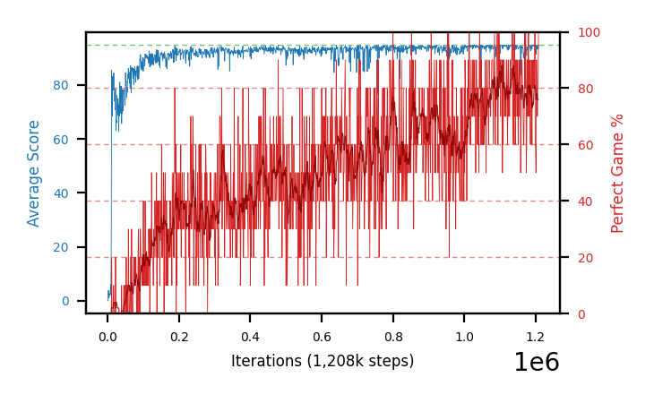
**b27g-chase10g85seed3**

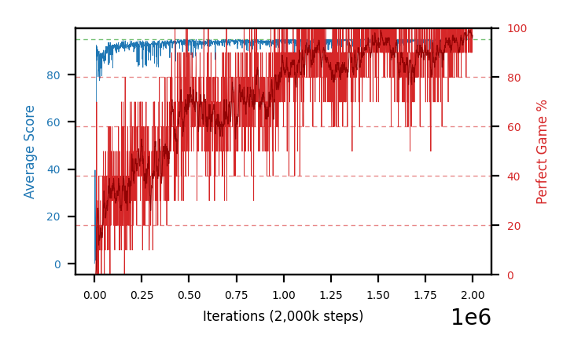
**b27h-chase10g85seed4** — first filled board at step 8k, and the first arm whose epsilon left the 0.0125
ceiling.

## Batch 26 — FC `100,100` under IS-off (`SNEK_IS_WEIGHTS=0`), `td_error`, seeds 1-4 — *closed, HOF-500 empty*

The third shape in the width follow-up: a shallow **two-layer `100,100`** net, after b24 (`320`) and b25
(`200,100,100`) both lifted consolidation. It asks whether a shallower shape still gets the gain, or whether
it needs the depth/capacity those two had. Seed-matched control is b22 (`50,100,50`, IS off). Trained on the
desktop.

**All four trained to the 3M cap and closed out (gate 95).** The shallow shape **does not carry the lift**:
close-out pooled mean **79.2** is only **+3.5 over the b22 control's 75.7** — against b24's +12.2 (`320`) and
b25's +10.3 (`200,100,100`). Three seeds learned well (`sef` 44-58); `b26d` is a weak seed (`sef` 13.8,
pooled 69.6) but never died. **No arm produced a ≥98%/100 checkpoint** — the best full-length reads are
`b26b`/`b26c` at 97.0%/100 — so the auto-HOF-500 (gate 98, running now) selects nothing and lands empty; the
record stays b24's. **‡ This is also the arm that separates width from size, and it retracts b25's reading.** `100,100`
has **1.14× the control's parameters — more than b24's `320` at 0.94×** — and gets a quarter of the lift,
so "the gain tracks capacity" is wrong. The ordering that holds is the **widest layer**: 320 → +12.2,
200 → +10.3, 100 → +3.5, 50 → 0
([finding](findings.md#-corrected-2026-08-14-the-is-off-architecture-lift-tracks-the-widest-layer-not-the-parameter-count)).
Sorted by close-out pooled.

| arm | peak trail | best-30 | `sef` (3M) | close-out pooled | best full-length |
|---|---|---|---|---|---|
| `b26b` | 95.00 | **93.7%** @1982k | **58.0%** | **83.8** | 97.0% @1948k |
| `b26c` | 94.96 | 92.0% @2231k | 52.1% | 83.2 | 97.0% @1969k |
| `b26a` | 94.92 | 88.0% @2349k | 44.6% | 80.0 | 95.0% @2904k |
| `b26d` | 94.84 | 79.7% @1073k | 13.8% | 69.6 | none ≥95% (all ab.) |
| **mean — b26 fc100,100 IS-off** | **94.93** | **88.4%** | **42.1%** | **79.2** | 0 of 4 held ≥98%/100 |
| **mean — b22 fc50,100,50 IS-off (control)** | 94.88 | 86.2% | 30.5% | 75.7 | — |


**b26b-fc100x100noisseed2**


**b26c-fc100x100noisseed3**


**b26a-fc100x100noisseed1**


**b26d-fc100x100noisseed4**

## Batch 25 — FC `200,100,100` under IS-off (`SNEK_IS_WEIGHTS=0`), `td_error`, seeds 1-4

b22's exact IS-off config with a 3-layer `200,100,100` net (36,804 params, **3.09×** the control) — the second
shape in the width follow-up after b24's `320` result. It asks whether b24's consolidation lift is width
itself or just more parameters, and whether it survives at a shape other than one wide layer. Seed-matched
control is b22 (`50,100,50`, IS off). Trained on the desktop.

**Fully evaluated — and the first auto-HOF chain ran end to end (training → close-out → HOF-500).** The
close-out (gate 95) pools a mean **86.0** — **+10.3 over the b22 control's 75.7, within 1.9 of b24's
87.9** — so the consolidation lift **replicates at a 3-layer `200,100,100` shape**. (This section first
read that as "capacity rather than width"; **b26 falsified it** — `100,100` carries more parameters than
b24's `320` and gets +3.5. The shapes order by widest layer, and `200,100,100` costs 3.09× the control's
parameters to land *below* `320`'s 0.94×.) Peak is unmoved at 95.0. **But the HOF-500 (gate 98) held nothing: every
arm's ≥98%/100 candidates were abandoned, none reaching 98% over 500** — the /100 highs inflated exactly as
b24's did. The strongest was `b25b` @911k, still 97.2% when gate-98 stopped it at 392 episodes; that is a
plausible ~97%/500 holder the folder's gate-97 standard would have run to completion, so it needs a hand
re-measure before any hall claim. **No b25 checkpoint enters the folder on the auto run.** Sorted by
close-out pooled.

| arm | peak trail | best-30 | `sef` | close-out pooled | HOF-500 (gate 98) |
|---|---|---|---|---|---|
| `b25c` | 95.00 | 93.7% | **66.9%** | **87.2** | none ≥98% (best 95.3% @827k, ab.) |
| `b25d` | 95.00 | 94.3% | 62.2% | 85.9 | none ≥98% (best 96.4% @2431k, ab.) |
| `b25a` | 95.00 | 93.7% | 63.2% | 85.6 | none ≥98% (best 92.7% @802k, ab.) |
| `b25b` | 95.00 | **95.3%** | 62.7% | 85.5 | none ≥98% (best **97.2%** @911k, ab.) |
| **mean — b25 fc200,100,100 IS-off** | **95.00** | **94.3%** | **63.8%** | **86.0** | 0 of 4 held ≥98%/500 |
| **mean — b22 fc50,100,50 IS-off (control)** | 94.88 | 86.2% | 30.5% | 75.7 | — |


**b25c-fc200x100x100noisseed3-r2**


**b25a-fc200x100x100noisseed1-r2**


**b25b-fc200x100x100noisseed2-r2**


**b25d-fc200x100x100noisseed4-r2**

## Batch 24 — FC width `320` under IS-off (`SNEK_IS_WEIGHTS=0`), `td_error`, seeds 1-4

Batch 22's exact IS-off config with the network widened to a single `320` layer (batch 20's `320`
shape) — width is the only change. It asks the question batch 20 could not answer under the β→1.0
control: **does width matter once the prioritisation is fixed at IS-off?** The seed-matched control is
b22 (`50,100,50`, IS off). Trained on the desktop.

**Width raises consolidation under IS-off, and the batch set a new record.** All four peak at **95.00**, so
width does not move the ceiling. But the close-out pools **87.9** (eq-effort, gate 95): **+12.2 over the b22
control's 75.7, and higher on every seed** — above every prior gate-95 arm, the b18b record's 78.5 included.
This is the project's first sign that width and prioritisation interact: width paid nothing under β→1.0
(batch 20), and it pays here under IS-off.

**The HOF-500 re-measured all 199 ≥97%/100 checkpoints; 9 held ≥97%/500 and the batch took the record.** The
new record is **`b24d` @1342k, 98.0%/500** (490/500, CI [96.4,98.9]), edging `b18b` @1588k (97.6%/700) and
tied by `b24b` @2860k (98.0%/500). The /100 rows were badly inflated — `b24a`'s two 100%/100 highs produced
**0 survivors** at 500 episodes (b23b's 97%/100 → 92.4%/500 was the same pattern) — so read the `best HOF-500`
column, not `best /100`.

All at the 3M cap, sorted by close-out pooled. Close-out and HOF-500 ran on the desktop (gate 95 / gate 97,
`EVAL_WORKERS=4`).

| arm | peak trail | best-30 | `sef` | close-out pooled | best /100 | best HOF-500 |
|---|---|---|---|---|---|---|
| `b24a` | 95.00 | 95.3% | 60.5% | **89.03** | **100.0%** @1633k | — (0 of 43 held) |
| `b24b` | 95.00 | **96.7%** | **73.2%** | 88.84 | 99.0% @1031k | **98.0%** @2860k |
| `b24c` | 95.00 | 96.0% | 67.4% | 87.68 | **100.0%** @2126k | 97.4% @2982k |
| `b24d` | 95.00 | 96.7% | 62.9% | 85.97 | 99.0% @1292k | **98.0%** @1342k ← **record** |
| **mean — b24 fc320 IS-off** | **95.00** | **96.2%** | **66.0%** | **87.9** | — | — |
| **mean — b22 fc50,100,50 IS-off** | 94.88 | 86.2% | 30.5% | 75.7% | — | — |


**b24b-fc320noisseed2**


**b24d-fc320noisseed4**


**b24c-fc320noisseed3**


**b24a-fc320noisseed1**
