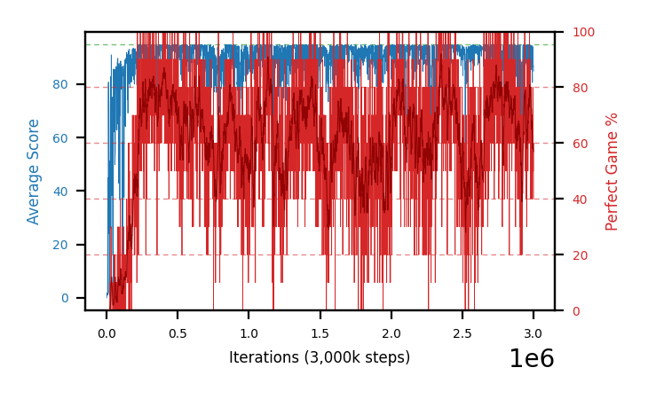
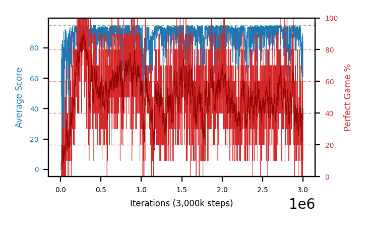
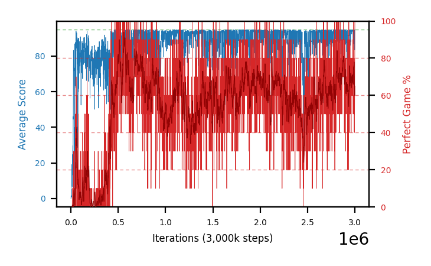
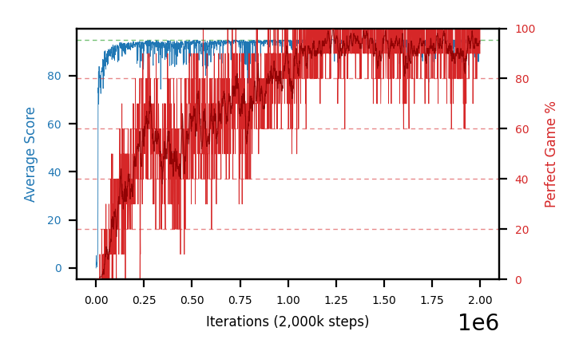
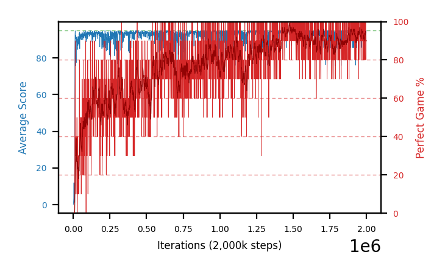
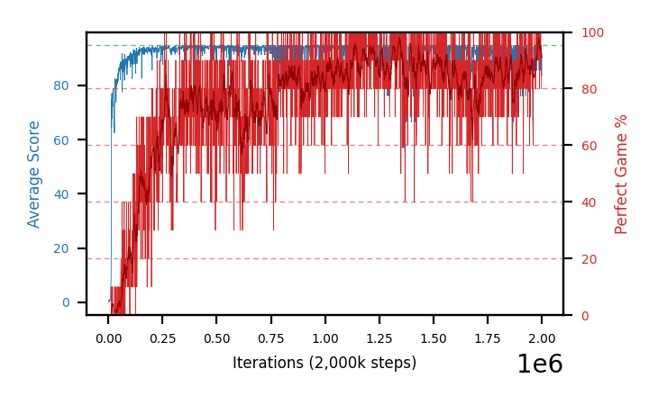
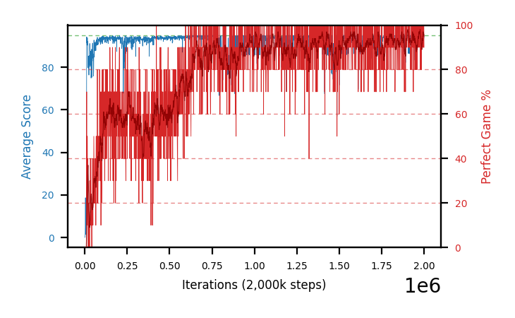
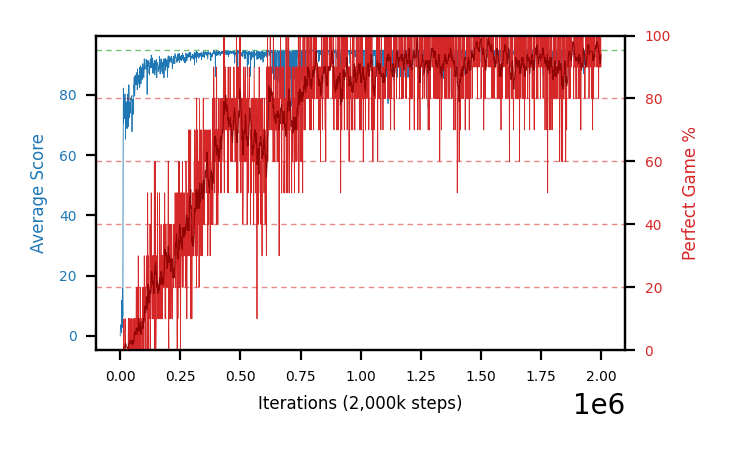
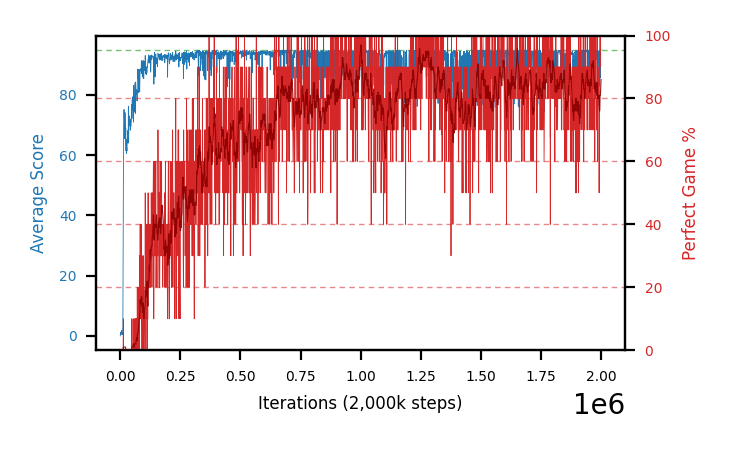

# Charts

Progress graphs for the most recent batches — **28, 34, 35, 36, 38 and 39**, a cap of six, newest first,
plus the **C51 pilot** as a temporary seventh while its arms are still a live control. Per-arm numbers live in
[`completedRuns.md`](completedRuns.md); this file is images plus a short reading of each. A batch appears
here **while it is still running**, with training-only numbers, not just once it has closed.
Batch 27 was retired to [`archive/charts-archive.md`](archive/charts-archive.md) when 36 launched, **batch 30**
followed when 34's results arrived, **batch 31** (a void, stopped C51 arm) when 35's arrived, **batch 33**
when 38 launched, and **batch 32** when 39 did.

**`b39` is running and entered below; `b36` and `b38` are both closed out.** The gate-ladder batches (28-29,
34, 35) are kept contiguous for the pending `b37` replication rather than retiring the strict-oldest of them,
so **batch 32** went instead — its question, the Adam epsilon dose, **closed for good** the same day when
b36+b38 resolved it at 4 seeds a side. **There is no batch 37 here:** `b37` is the desktop's b29 replication,
queued the same evening as `b38` from the other host, so the laptop's arms took the next free numbers.

**Older sections are retired, not deleted.** Batches 1-11 are in
[`archive/batches1-11.md`](archive/batches1-11.md) and anything retired since is in
[`archive/charts-archive.md`](archive/charts-archive.md). **The PNGs are all still in `charts/`**, so
an archived caption still renders. See
[when an arm is stopped](hyperparamTuning.md#when-you-stop-a-batch-of-arms) for the procedure.

In every chart: **blue is average score** (food eaten, out of 95) on the left axis, **red is
perfect-game percentage** on the right. Grey dashed vertical lines mark resumes; faint red dashed
horizontals mark 20/40/60/80% on the right axis, because the perfect rate is the objective and
was unreadable against left-axis ticks.

**Newest batch first.** Within a batch, best result first.

## These are snapshots, on purpose

The images are **copies** from `snek2/runs/`, not links. The live graphs there are rewritten every
eval and would be lost if that directory were cleaned out, silently blanking this file. Refresh with
`refresh_charts.sh`, which re-copies every `runs/*.png` into `charts/` and prints each one's step.

**The script does not touch this file** — it copies images only, so a new arm gets a PNG and no
entry unless one is written by hand. That drifted once, to 12 undocumented arms across batches 5-7,
because a successful `refresh_charts.sh` looked like the charts were handled. Check this file **and both
archives**, since captions now live in three places — `archive/charts-archive.md` was missing from this
snippet until 2026-08-08, which would have reported every retired arm as undocumented:

```
cd snek2/hyperparamTuning
ls charts/*.png | sed 's|.*/||;s|\.png||' | sort > /tmp/have
grep -ho 'charts/[a-zA-Z0-9-]*\.png' charts.md archive/batches1-11.md archive/charts-archive.md \
  | sed 's|.*charts/||;s|\.png||' | sort -u > /tmp/doc
comm -23 /tmp/have /tmp/doc   # anything listed is an undocumented arm
```

**Six PNGs in `charts/` are not arm charts and will always appear in that list** —
`champion-vs-mediocre`, `drawdown-b23b-vs-b18`, `per-b18-vs-b20-priorities`, `plasticity-metrics`,
`best30-drivers` and `gate-behavior-b27-vs-b29` are diagnostic figures referenced from
[`findings.md`](findings.md) and [`perDiagnostics/`](perDiagnostics/README.md), not training graphs.
Anything *else* the check prints is a real gap.

## Batch 39 — **C51 initialised at expected Q = 0** instead of the grid midpoint — *running, launched 18:43 on 2026-08-17*

**b36's config with `SNEK_C51_ZERO_INIT=1` as the only change** — verified by diffing the two launchers'
environment blocks, which differ in exactly that one line. Same `eps 1.5e-4`, `lr 1e-4`, `fc 320`, seeds
1-4, 3M cap, so `b36a-d` is an exact seed-matched control. Launcher
[`launch_b39_zeroinit.sh`](launch_b39_zeroinit.sh); pre-registered hypotheses in [`runs.md`](runs.md).

**The first arm in this project to run with the ramp** — the knob shipped 2026-08-15 and was dead code
until now, so the launch was preceded by a smoke run. All four reports confirm `zero-expected-Q init`.

**It is being run knowing the measurement says it should lose.** The [init-optimism
finding](findings.md#-a-c51-head-starts-at-the-grid-midpoint-not-at-0--and-it-cost-b36-nothing-because-the-ddqn-controls-init-is-further-from-the-truth) put the
true value at **~34**, so the standard init's 57.5 is 23.5 too high and **zero is 34.0 too low** — the
ramp moves the init *further* from the truth. The point is the mechanism, not the verdict.

| | E[Q] | `aeff` | bottom-3 mass | action spread |
|---|---|---|---|---|
| standard init | 58.52 | 49.87 of 51 | 0.018 | 0.73 |
| **zero init** (λ=0.16219) | 0.07 | **6.66 of 51** | **0.290** | **0.09** |

**One λ sets the mean and the spread**, so the head starts *sharper than any trained net here ever
becomes* (b36 settles at `aeff` 20.9-24.6) and must **broaden before it can sharpen**. The ramp is also a
**−20.3 logit handicap on the top atom** and **−17.0 at `z=100`**, where a near-win must put its mass;
`e^−17 ≈ 4e−8`. **Confirmed on the smoke run:** after 2,000 steps the top-atom biases had not moved to
three decimals, all drift (max 0.0150) sitting in the bottom atoms. So recovery must come through the
kernel and cannot begin until the agent experiences high returns — **valuation lags discovery**, which
predicts damage in the endgame value signal rather than in whether the arm learns to play.

**Watch `aeff` against step.** Standard init falls 49.9 → 21-24 monotonically; if b39 climbs
6.7 → ~36 → 21-24, that non-monotonic path is direct evidence of training spent broadening.

**First reading at 31-38k steps, which is 1% of the run and settles nothing.** Trailing avg score
**69.1-82.1**; `b39a` reads **82.1 @38k** against `b36a`'s **85.9 @39k**, so there is no dramatic early
slowdown of the kind H1 predicts — but a 3.8-point gap on one seed at 1% depth is noise, and best-30 is
still 2.0-11.0 for every arm. **Do not read these panels as evidence either way yet.** The comparison that
matters is `aeff` against step, and the first useful point for it is ~100k.

| arm | step | trailing | best-30 | ε |
|---|---|---|---|---|
| `b39a` | 38k | **82.1** | 11.0 | 0.010 |
| `b39d` | 31k | 79.5 | 6.3 | 0.011 |
| `b39b` | 35k | 75.5 | 2.0 | 0.012 |
| `b39c` | 35k | 69.1 | 3.3 | 0.012 |


**b39a-c51zeroinitseed1** — paired with `b36a` (best-30 84.0, pooled 75.36)


**b39b-c51zeroinitseed2** — paired with `b36b` (86.0, 76.70)


**b39c-c51zeroinitseed3** — paired with `b36c` (84.7, 74.77)


**b39d-c51zeroinitseed4** — paired with `b36d` (86.7, **80.19** — the control's strongest arm)

## Batch 38 — **Adam ε `3.125e-4`** on b36's `fc 320` — *closed: the dose is a dead heat at n=4, as pre-registered*

**b36's config verbatim with `SNEK_ADAM_EPSILON=3.125e-4` the only change**, seeds 1-4, 3M steps. Launcher
[`launch_b38_eps3125.sh`](launch_b38_eps3125.sh); chained behind b36's close-out by
[`chain_after_evals.sh`](chain_after_evals.sh). **The numbering skips 37 deliberately** — `b37` is the
desktop's b29 replication (seeds 5-8), queued the same evening from the other host. Rationale in
[`runs.md`](runs.md).

**What it is for.** b32 showed Adam ε cuts greedy-action churn **−26%** on a shared state set but could not
separate `1.5e-4` from `3.125e-4` at n=2 a side. b36 + b38 is **4 seeds per side on one architecture** —
the first configuration here that can resolve the dose at all. Pre-registered expectation: **a null on the
dose**, since b32's two values came out 0.0865 against 0.0895.

**All four ran to the 3M cap and self-terminated**, then closed out at gate 95 as 4 parallel processes at
`EVAL_WORKERS=4`. Paired against b36 by seed:

| arm | best-30 | `sef` | trailing @3M | pooled /eq | pooled **≤2M** | b36's ≤2M | best ckpt |
|---|---|---|---|---|---|---|---|
| `b38a` | 84.3 | **31.0** | 87.8 | **78.51** | **77.99** | 75.36 | **96.0 @2355k** |
| `b38b` | **88.3** | 15.5 | **74.6** ↓ | 71.79 | 73.01 | 76.70 | 95.0 @284k |
| `b38c` | 80.0 | 18.6 | **94.1** | 72.53 | 73.37 | 74.82 | 95.0 @290k |
| `b38d` | 87.3 | 22.2 | 92.1 | 72.66 | 74.55 | 80.19 | 93.4 @557k *[91 ep]* |
| **group** | 80.0-88.3 | 15.5-31.0 | | **73.87** | **74.73** | **76.77** | **no arm ≥98%** |

**The dose question closes as a dead heat, exactly as pre-registered.** At a matched ≤2M horizon b38 pools
**74.73 against b36's 76.77** — 3 of 4 seeds favour `1.5e-4`, mean **−2.04 pp**, sign test **p=0.625**. So
`1.5e-4` stays the default as the lower-variance reference, and **the dose is closed for good**: b32 could
not separate the two at n=2 and n=4 now says there is nothing to separate. Best-30 (80.0-88.3 vs
84.0-86.7) and best checkpoint (93.4-96.0 vs 91.6-97.0) agree.

**The ≤2M column is exact, not estimated.** `pooled_equal_effort` was recomputed from each row's stored
`episode_perfect` flags truncated to the 20-episode screen depth, reproducing all 8 published figures to
the decimal before being applied at the cutoff — so the horizon mismatch that made the first b38 reading
unquotable is removed rather than caveated.

**And the extra million steps was worth nothing or less.** Pooling over all rows against ≤2M only: **3 of 4
arms got *worse* past 2M** (b38b 73.01→71.79, b38c 73.37→72.53, b38d 74.55→72.66). `b38a` is the exception
and it is a real one — it improved (77.99→78.51) and holds the batch's best checkpoint at **2355k**, past
b36's horizon entirely. So C51 past 2M is mildly negative on average with one seed still gaining, which
**answers the horizon question b36's launcher raised**: there is no case for running C51 past ~2M, and a
future C51 batch can stop there.

**No arm produced a ≥98% checkpoint, so there is no HOF-500 to run** — the same outcome as b36. Against
`b24` (`ddqn`, same `fc 320`, pooled 85.97-89.03, ≥98% in all four seeds) both C51 batches remain far
behind.

**The seed spread got worse, and that half of the earlier reading survives.** best-30 spread **8.3 pp
against b36's 2.7**, so the higher dose did not tighten anything.


**b38a-c51fc320eps3125seed1** — highest `sef` of the four (29.3), peaks latest (1129k)


**b38b-c51fc320eps3125seed2** — the batch's best-30 (88.3) and its lowest trailing (81.2)


**b38c-c51fc320eps3125seed3** — the weak seed, best-30 80.0, yet the highest trailing (93.2)


**b38d-c51fc320eps3125seed4** — only arm to reach peak trailing 95.0

## Batch 36 — **C51 on `fc 320`**, one wide layer instead of three narrow — *stopped at 1.87-2.02M, closed out*

**Batch 32's config verbatim at `eps 1.5e-4` with `SNEK_FC_LAYERS=320` the only change**, seeds 1-4, win
reward back at its default 100, `lr 1e-4`, 51 atoms over `[-5, 120]`. Launched 12:43 on 2026-08-16;
launcher [`launch_c51_fc320.sh`](launch_c51_fc320.sh), rationale and pre-registered hypotheses in
[`runs.md`](runs.md).

**Two controls, both on disk, answering different questions.** `b32a`/`b32b` — same `eps`, `lr` and seeds
at `fc 200,100,100` — is the clean one-variable *architecture* pair, but only 1M deep, so **match at 1M
before quoting anything**. `b24a-d` is **ddqn** at this exact shape, **3M** and closed out at pooled
**85.97-89.03** with two ≥98%/500 records, which is the "is C51 worth it at all" comparison — **and b36
did not clear it**, see the reading below.

**What the shape changes for a categorical head is *where* the parameters sit, not how many.** Obs 30 to
3×51 = 153 outputs:

| shape | first layers | final layer | total | share in the final layer |
|---|---|---|---|---|
| **`fc 320`** | 9,920 | **48,960** | ~58.9k | **83%** |
| `fc 200,100,100` | 36,400 | 15,453 | ~51.9k | 30% |

Only +13% capacity, but the budget moves into the layer feeding the 153-way distribution, and two layers
of gradient compounding disappear. **That second half is why churn is the reading, not level** — C51's
defect here is instability.

**The pre-registered expectation is a null on the ceiling**, because nine shapes have never raised it and
the one direct measurement says the deeper net's penultimate layer was *not* capacity-bound (effective rank
16-20 of 100, head outputs 4-6 of 153). **If that rank comes out at 16-20 of 320 here too, widening bought
nothing** and any gain is optimisation rather than capacity.

**Stopped at 2M rather than 3M** (21:26 on 2026-08-16, the user's call), so **match at 2M**. Close-out
complete at gate 95, 4 parallel processes at `EVAL_WORKERS=4`:

| arm | step | best-30 | at | `sef` | trailing | pooled /eq | best ckpt |
|---|---|---|---|---|---|---|---|
| `b36d` | 1873k | **86.7** | 331k | 17.4 | 92.64 | **80.19** | 95.0 @356k |
| `b36b` | 1972k | 86.0 | 402k | **24.7** | 91.14 | 76.70 | 94.0 @305k |
| `b36c` | 2011k | 84.7 | 247k | 19.5 | **93.14** | 74.77 | 91.6 @471k *[83 ep]* |
| `b36a` | 2023k | 84.0 | 977k | 23.2 | 92.02 | 75.36 | **97.0 @550k** |
| *`b32a`/`b32b` control, `fc 200,100,100`, ≤1M* | 1000k | *77.0 / 63.0* | | *16.1 / 10.3* | | *never closed out* | |
| **`b24a-d` control, `ddqn` at this same `fc 320`, 3M** | 3000k | **95.3-96.7** | | **60.5-73.2** | | **85.97-89.03** | **98.0-100.0** *(≤2M rows)* |

**Hypothesis 2 beat the null against `b32`, and the batch still loses badly to `b24`.** Both readings are
real and they answer different questions:

- **Against `b32` (the C51 architecture question): a clear gain.** Best-30 **84.0-86.7 against 77.0/63.0**,
  `sef` 17.4-24.7 against 10.3/16.1, and the **seed spread collapsed from 14 pp to 2.7 pp**. Wide-shallow
  is the better C51 shape.
- **Against `b24` (the "is C51 worth it" question): no.** Same `fc 320`, same observation era, `ddqn`:
  best-30 **95.3-96.7**, `sef` **60.5-73.2** — a factor of 3, and `sef` is the low-variance metric — and
  **every b24 seed produced a ≥98% checkpoint inside 2M** where no b36 seed did. The seed-agreement gain
  also does not generalise: `b24`'s spread is **1.4 pp**, tighter than b36's. Full comparison and its
  caveats in [`findings.md`](findings.md#-after-four-fixes-c51-is-still-well-behind-the-scalar-head-at-its-own-architecture--and-b24-not-b32-is-the-control).

**The 3M question went unanswered** — every arm peaked best-30 by 402k except `b36a` (977k) while trailing
stayed 91-93 to 2M, so it neither collapsed like b33 nor kept climbing. **`b36c`'s best row is 83 episodes,
not 100** — abandoned under `EVAL_MIN_ACHIEVABLE=95`, so `best_of` relaxed to half-depth and it is not
comparable with the full-length rows.

**Init optimism is now measured and excluded as a C51 explanation.** Every arm started at `V ≈ 57.5`, the
grid midpoint, against a true value of **~34** — but the offset is common-mode (the action gap is at full
scale by 8k), it costs the policy nothing, and the `ddqn` control's init at 0 is *further* from the truth.
[The finding](findings.md#-a-c51-head-starts-at-the-grid-midpoint-not-at-0--and-it-cost-b36-nothing-because-the-ddqn-controls-init-is-further-from-the-truth).


**b36a-c51fc320seed1** — paired with `b32a`


**b36b-c51fc320seed2** — paired with `b32b`


**b36c-c51fc320seed3**


**b36d-c51fc320seed4**

## Batch 35 — chase-safe `c=0.10`, **gate 40** — *done on the desktop: null, and the sweet spot at 75 is isolated*

**The gate ladder's deep rung: `b29`'s config with `SNEK_CHASE_SAFE_GATE=40`, everything else identical** —
`fc 320`, IS off, `td_error`, target 1000, discount 0.9975, `FORK_BRANCHES=4`, `c=0.10`, 2M cap, seeds 1-4.
Holds the per-flip dose at 0.10 (the calibration clamp) and moves only the gate, so the total episode dose
rises ~2.5× vs gate 85.

**Null on the record metric — yet the highest pooled of any shaped batch.** Pooled equal-effort **88.2**
(88.6 / 85.9 / 90.7 / 87.6), above b29's 87.8, b34's 86.4 and the b24 control's 87.9, but **0 of the 3 measured
seeds held any ≥98%/500 checkpoint** (best partials abandoned at 96-97% over 310-367 episodes; `b35c`'s HOF-500
was still running at check time). So across four gates — 85, 75, 70, 40 — **only 75 records**; the sweet spot
is a narrow, isolated band, and mid-game shaping (40) lifts the *average* board without buying the record-tier
endgame. **Consolidation and the record tier are decoupled.** All four arms healthy throughout (peak 95.00, no
zero stretch). Full read:
[`findings.md`](findings.md#-chase-safe-reward-shaping-null-at-gate-85-at-any-dose-records-at-gate-75--the-gate-is-the-lever);
per-arm table in [`completedRuns.md`](completedRuns.md#batch-35--chase-safe-c010-gate-40-null--the-sweet-spot-at-75-is-isolated-not-a-plateau).
`sef` is on a 2M horizon, comparable to the b28/b29/b34 waves.

| arm | best-30 | `sef` | pooled (eq) | HOF-500 |
|---|---|---|---|---|
| `b35c-chase10g40seed3` | 97.7 | 59.7 | **90.7** | HOF-500 running (best full 100% @1166k /100) |
| `b35a-chase10g40seed1` | 96.0 | 47.4 | 88.6 | best 96.2% @1409k (319 ep, ab.) — **0 held** |
| `b35d-chase10g40seed4` | 96.7 | 61.3 | 87.6 | best 97.0% @1480k (367 ep, ab.) — **0 held** |
| `b35b-chase10g40seed2` | 94.7 | 62.8 | 85.9 | best 96.5% @1353k (310 ep, ab.) — **0 held** |


**b35c-chase10g40seed3** — highest pooled of any shaped batch; HOF-500 still running


**b35a-chase10g40seed1**


**b35d-chase10g40seed4**


**b35b-chase10g40seed2** — weakest seed

## Batch 34 — chase-safe `c=0.10`, **gate 70** — *done on the desktop: null, gate 75 is a narrow sweet spot*

**One variable off the record region: `b29`'s config with the gate dropped 75 → 70.** Otherwise identical —
`fc 320`, IS off, `td_error`, target 1000, discount 0.9975, `FORK_BRANCHES=4`, `c=0.10`, 2M cap, seeds 1-4,
seed-matched control `b24`. Trained, closed out and HOF-500 re-measured on the desktop.

**Gate 70 is a null — a 5-length step off 75 loses the effect.** Pooled equal-effort **86.4** (~1.5 under
b24's 87.9, just under `b29`'s 87.8) and **0 of 4 seeds held any ≥98%/500 checkpoint**, against `b29`'s 21
across two seeds. The close-out threw off two 100%/100 and two 98%/100 rows, but every one deflated below
gate 98 at 500 episodes. All four arms healthy throughout (peak trailing 95.00, no zero stretch). This
confirms gate 75 is a **band, not a threshold** — 85 is null, 75 records, 70 null again. Full read:
[`findings.md`](findings.md#-chase-safe-reward-shaping-null-at-gate-85-at-any-dose-records-at-gate-75--the-gate-is-the-lever);
per-arm table in [`completedRuns.md`](completedRuns.md#batch-34--chase-safe-c010-gate-70-null--gate-75-is-a-narrow-sweet-spot-not-a-threshold).
The `sef` numbers are on a 2M horizon and comparable to the b28/b29 waves below (also 2M), not to the 3M
batches.

| arm | best-30 | `sef` | pooled (eq) | HOF-500 |
|---|---|---|---|---|
| `b34d-chase10g70seed4` | 95.7 | 68.9 | 89.5 | best 97.2% @1915k (392 ep, ab.) — **0 held** |
| `b34c-chase10g70seed3` | 97.0 | 66.1 | 89.4 | best 96.0% @1532k (321 ep, ab.) — **0 held** |
| `b34a-chase10g70seed1` | 94.3 | 46.7 | 82.9 | best 95.2% @1126k (248 ep, ab.) — **0 held** |
| `b34b-chase10g70seed2` | 94.0 | 54.9 | 83.8 | best 93.8% @1776k (193 ep, ab.) — **0 held** |


**b34d-chase10g70seed4** — highest `sef`; best HOF-500 partial (97.2%, abandoned)


**b34c-chase10g70seed3** — highest best-30 of b34 (97.0)


**b34a-chase10g70seed1**


**b34b-chase10g70seed2** — weakest seed

## C51 pilot — distributional RL, learning-rate screen — *closed at 600k, chose `5e-5`*

**A seventh section on purpose, and temporary.** The cap of six counts numbered batches. This screen
became `b31`, which is now void — but its two `lr 1e-4` arms are **batch 32's control**, so the section
stays until b32 closes rather than being retired with b31.

**The table and the graphs below this paragraph are regenerated by
[`pick_c51_lr.py`](pick_c51_lr.py)** between the `C51-PILOT-STATUS` markers, so they are current as of
whenever it last ran, and the prose outside them is hand-written. **Editing inside the markers is
pointless** — the next run overwrites it.

The first C51 arms in this project, from
[`../plans/distributional-c51.md`](../plans/distributional-c51.md): the scalar head is replaced by a
distribution over the return on **51 atoms over `[-5, 120]`** trained by cross-entropy, with the PER
priority as the KL. Everything else is **b25's config verbatim** — `fc 200,100,100`, IS off, target 1000,
discount 0.9975, `FORK_BRANCHES=4`, no food-distance shaping — so `b25a-d` is the seed-matched control
when this becomes a batch.

**Closed 2026-08-15 at 20:09, and `5e-5` was chosen for `b31` on consistency rather than on being
best.** The two readings worth carrying: at n=2 the **between-seed spread (up to 57.6 pp) is twice the
spread between the rate means (30.5 pp)**, so the ranking is thin; and **time to the first perfect game
predicted nothing** about where an arm finished (Spearman ρ = 0.05 — the 8k starter finished at 11.7, the
141k starter at 85.3). `2.5e-4` is the one clear failure, with one arm collapsing to zero at 599k. Three
arms had not stopped improving at the cap, so for `1e-5` and `1e-4` the **600k horizon** may be what bound
them rather than the rate. Full account:
[`findings.md`](findings.md#-the-c51-learning-rate-screen-the-seed-spread-beat-the-rate-effect-and-time-to-first-win-predicted-nothing).

**It is a learning-rate screen, not a result.** A cross-entropy loss starts at `ln 51 ≈ 3.93` where the
Huber TD loss starts near 0, so b25's `1e-5` is not obviously the same step size for a categorical head.
**Four rates × two seeds, seed-matched across the rates**, launched as two waves an hour and a half apart:
`1e-5` and `5e-5` at 15:06 (`c51pilot-`), then `1e-4` and `2.5e-4` at 16:41 (`c51pilotB-`) — so wave B is
several hundred thousand steps behind and the horizon line in the generated block is what makes the
comparison fair. Eight trainers on a 14-core laptop is deliberate and was measured first: ~2.3 GB per arm
against 36 GB, and a swap-in rate of 244 pages per 20 s, so the cost is throughput and not paging.

<!-- C51-PILOT-STATUS:BEGIN -->
*Generated by `pick_c51_lr.py` at 2026-08-15 20:09, when the last pilot arm stopped — the numbers below are read straight off the eval series, and the prose around this block is hand-written.*

**Compared at a common horizon of 600k steps**, the lowest final step any arm reached, because both metrics accumulate over an arm's own evals and a longer arm would otherwise win on horizon alone.

| lr | seeds | mean best-30 | mean `sef` | mean peak trail |
|---|---|---|---|---|
| 5e-05 **← chosen** | 2 | 69.5 | 12.6 | 92.42 |
| 1e-05 | 2 | 56.5 | 3.6 | 89.89 |
| 0.0001 | 2 | 39.0 | 5.3 | 88.19 |
| 0.00025 | 2 | 4.0 | 0.0 | 68.79 |

| arm | lr | seed | step | best-30 | `sef` | peak trail | first perfect |
|---|---|---|---|---|---|---|---|
| `c51pilot-lr1e5seed1` | 1e-05 | 1 | 600k | 85.3 | 7.3 | 93.56 | 141k |
| `c51pilot-lr5e5seed2` | 5e-05 | 2 | 600k | 71.7 | 13.0 | 93.30 | 20k |
| `c51pilot-lr5e5seed1` | 5e-05 | 1 | 600k | 67.3 | 12.1 | 91.54 | 15k |
| `c51pilotB-lr1e4seed2` | 0.0001 | 2 | 600k | 66.3 | 10.6 | 90.80 | 46k |
| `c51pilot-lr1e5seed2` | 1e-05 | 2 | 600k | 27.7 | 0.0 | 86.22 | 92k |
| `c51pilotB-lr1e4seed1` | 0.0001 | 1 | 600k | 11.7 | 0.0 | 85.58 | 8k |
| `c51pilotB-lr25e4seed1` | 0.00025 | 1 | 600k | 5.7 | 0.0 | 70.82 | 49k |
| `c51pilotB-lr25e4seed2` | 0.00025 | 2 | 600k | 2.3 | 0.0 | 66.76 | 59k |

**Chosen: `5e-05`** — best_perfect30 69.5 against 56.5 for the next rate (1e-05).

**Batch `b31` launched at 2026-08-15 20:09** on this rate, 4 seeds, 2M cap, `fc 200,100,100`, otherwise b25's config — so `b25a-d` is the seed-matched control.


**c51pilot-lr1e5seed1** — lr 1e-05, best-30 85.3, first perfect 141k


**c51pilot-lr5e5seed2** — lr 5e-05, best-30 71.7, first perfect 20k


**c51pilot-lr5e5seed1** — lr 5e-05, best-30 67.3, first perfect 15k


**c51pilotB-lr1e4seed2** — lr 0.0001, best-30 66.3, first perfect 46k


**c51pilot-lr1e5seed2** — lr 1e-05, best-30 27.7, first perfect 92k


**c51pilotB-lr1e4seed1** — lr 0.0001, best-30 11.7, first perfect 8k


**c51pilotB-lr25e4seed1** — lr 0.00025, best-30 5.7, first perfect 49k


**c51pilotB-lr25e4seed2** — lr 0.00025, best-30 2.3, first perfect 59k
<!-- C51-PILOT-STATUS:END -->

## Batches 28-29 — chase-safe **dose** (`c=0.20`) and **gate** (`75`) on `fc 320` — *done: the gate is the lever (desktop)*

Both extend b27's gate-85 null onto the two axes a single dose could not test. `b28` doubles the coefficient
to **`c=0.20`** at gate 85; `b29` drops the **gate to 75** at `c=0.10`. Everything else is b24's config —
`fc 320`, IS off, `td_error`, target 1000, discount 0.9975, `FORK_BRANCHES=4`, 2M cap, seeds 1-4, the same
`b24a-d` control. All eight closed out and HOF-500'd on the desktop.

**`b28` (`c=0.20`, gate 85) is a null — the dose is not the issue.** Pooled mean **85.4**, ~2.5 under the b24
control's 87.9, and **0 of 4** seeds held ≥98%/500. With b27/b30 this rules out both the net and the dose at
gate 85.

| arm | best-30 | `sef` | pooled (eq) | HOF-500 |
|---|---|---|---|---|
| `b28d-chase20g85seed4` | 96.7 | 68.7 | 89.10 | best 96.8% @1061k (341 ep, ab.) — **0 held** |
| `b28a-chase20g85seed1` | 96.0 | 54.0 | 89.72 | best 95.6% @1727k (275 ep, ab.) — **0 held** |
| `b28c-chase20g85seed3` | 92.7 | 33.4 | 82.67 | none reached the gate — **0 held** |
| `b28b-chase20g85seed2` | 90.7 | 47.9 | 80.15 | best 90.0% @1127k (120 ep, ab.) — **0 held** |

**`b29` (`c=0.10`, gate 75) produced a record region — the positive result of the whole investigation.**
Pooled **87.8** (a dead heat with b24) but **21 checkpoints held ≥98%/500 across two of four seeds**, where
the record-holding control produced only 2 isolated ones. `b29b` carries an **18-checkpoint band**
(1446k-1529k) peaking at **99.0%/500 (495/500) @1447k** — **the new project record** (point estimate above
b24's 98.0%/500; lead inside the CI, but the *region* is not).

| arm | best-30 | `sef` | pooled (eq) | HOF-500 (≥98%/500) |
|---|---|---|---|---|
| `b29a-chase10g75seed1` | 97.7 | 60.3 | 89.76 | **3 held**, best 98.4% @1347k |
| `b29c-chase10g75seed3` | 96.3 | 67.9 | 89.68 | 0 held (best 97.1%, 378 ep ab.) |
| `b29b-chase10g75seed2` | 97.3 | 55.6 | 87.14 | **18 held** (1446k-1529k), best **99.0% @1447k** |
| `b29d-chase10g75seed4` | 94.3 | 59.7 | 84.75 | 0 held (best 90.6%, 127 ep ab.) |

**The gate is the lever, not the dose or the net.** Gate 85 is null on `fc 320` (b27), on `fc 200,100,100`
(b30) and at doubled dose (b28); gate 75 matches the control's pooled *and* produces a record region it never
did. The Φ calibration is why — the potential carries ~0 at lengths 98-99, so a gate-85 term grades the flat
final approach while gate 75 turns it on ten meals earlier, in the packing decisions that decide whether the
endgame is winnable. Full write-up:
[`completedRuns.md`](completedRuns.md#batches-28-29--chase-safe-dose-and-gate-the-gate-is-the-lever-and-gate-75-produces-a-record-region).
`b29b` @1447k was promoted to `hallOfFame/` on 2026-08-16 (copy verified 98/100 on fresh laptop episodes).


**b29b-chase10g75seed2 — 99.0%/500 @1447k, the record-region arm**


**b29a-chase10g75seed1 — 3 held ≥98%/500**


**b29c-chase10g75seed3**


**b29d-chase10g75seed4**


**b28a-chase20g85seed1** (`c=0.20`, null)


**b28b-chase20g85seed2** (`c=0.20`, null)


**b28c-chase20g85seed3** (`c=0.20`, null)


**b28d-chase20g85seed4** (`c=0.20`, null)
