# Charts

Progress graphs for the most recent batches — **23 through 27 plus 30**, a cap of six, newest first. Per-arm
numbers live in
[`completedRuns.md`](completedRuns.md); this file is images plus a short reading of each. A batch appears
here **while it is still running**, with training-only numbers, not just once it has closed.

**Older sections are retired, not deleted.** Batches 1-11 are in
[`archive/batches1-11.md`](archive/batches1-11.md) and anything retired since is in
[`archive/charts-archive.md`](archive/charts-archive.md). **The PNGs are all still in `charts/`**, so
an archived caption still renders. See
[when an arm is stopped](hyperparamTuning.md#when-you-stop-a-batch-of-arms) for the procedure.

In every chart: **blue is average score** (food eaten, out of 95) on the left axis, **red is
perfect-game percentage** on the right. Grey dashed vertical lines mark resumes; faint red dashed
horizontals mark 20/40/60/80% on the right axis, because the perfect rate is the objective and
was unreadable against left-axis ticks.

**Newest batch first.** Within a batch, best result first.

## These are snapshots, on purpose

The images are **copies** from `snek2/runs/`, not links. The live graphs there are rewritten every
eval and would be lost if that directory were cleaned out, silently blanking this file. Refresh with
`refresh_charts.sh`, which re-copies every `runs/*.png` into `charts/` and prints each one's step.

**The script does not touch this file** — it copies images only, so a new arm gets a PNG and no
entry unless one is written by hand. That drifted once, to 12 undocumented arms across batches 5-7,
because a successful `refresh_charts.sh` looked like the charts were handled. Check this file **and both
archives**, since captions now live in three places — `archive/charts-archive.md` was missing from this
snippet until 2026-08-08, which would have reported every retired arm as undocumented:

```
cd snek2/hyperparamTuning
ls charts/*.png | sed 's|.*/||;s|\.png||' | sort > /tmp/have
grep -ho 'charts/[a-zA-Z0-9-]*\.png' charts.md archive/batches1-11.md archive/charts-archive.md \
  | sed 's|.*charts/||;s|\.png||' | sort -u > /tmp/doc
comm -23 /tmp/have /tmp/doc   # anything listed is an undocumented arm
```

**Three PNGs in `charts/` are not arm charts and will always appear in that list** —
`champion-vs-mediocre`, `drawdown-b23b-vs-b18` and `per-b18-vs-b20-priorities` are diagnostic figures
referenced from [`findings.md`](findings.md) and [`perDiagnostics/`](perDiagnostics/README.md), not
training graphs. Anything *else* the check prints is a real gap.

## ⚠ Every graph in batches 27 and 30 has a flat red line, and it is an instrumentation bug

The perfect-game counter compared the episode's final reward with `PERFECT_GAME_REWARD`, and the chase-safe
shaping shifts that reward by `−c` at the winning step. So **`perfect_percent` is 0 in every eval of these
eight arms** even though their `max_score` fields record filled boards from step 9k. Read the blue score
curve on these charts and ignore the red axis entirely. The same zero also pinned epsilon at 0.0125, so the
arms are not valid tests of the shaping either — the whole story is in
[`findings.md`](findings.md#-a-perfect-game-was-identified-by-its-final-reward-and-the-shaping-term-silenced-every-counter),
and [`runs.md`](runs.md#-both-shaping-batches-are-invalid--the-perfect-game-counter-was-reward-based-2026-08-14)
has what happens to the runs.

## Batch 30 — the same shaping on `fc 200,100,100`, `c=0.10`, gate 85 — *stopped at ~138k, counter bug*

b27's config with one change, the net: **`200,100,100`** instead of `320`. Everything else is identical —
`c=0.10`, gate 85, IS off, `td_error`, target 1000, discount 0.9975, `FORK_BRANCHES=4`, no food-distance
shaping, **2M cap**, seeds 1-4. Together with b24/b25/b27 it makes a **2×2 of shaping × architecture**, so
the shaping result stops depending on one net. Launched 2026-08-14 on the laptop.

**Status: stopped 2026-08-14 at 137-139k steps**, ~32 min in, after the perfect-game counter turned out to
be reward-based (banner above). Nothing here is a reading on the shaping. What the score curve *does* say is
that the shaped arms were learning normally — trailing 88.4-93.5 at ~138k against `b25`'s 86-89 at 108k —
which is why the 2×2 is worth relaunching rather than abandoning. **Control remains `b25a-d` read at a
matched horizon** (best-30 93.7 / 95.3 / 93.7 / 91.7 at 2M, `sef` 61.4 / 57.9 / 61.0 / 54.2).

| arm | net | `c` | gate | step | trailing | perfect % | status |
|---|---|---|---|---|---|---|---|
| `b30a-chase10fc200x100x100seed1` | 200,100,100 | 0.10 | 85 | 138k | 90.5 | **0, miscounted** | stopped |
| `b30b-chase10fc200x100x100seed2` | 200,100,100 | 0.10 | 85 | 137k | 89.2 | **0, miscounted** | stopped |
| `b30c-chase10fc200x100x100seed3` | 200,100,100 | 0.10 | 85 | 138k | 88.4 | **0, miscounted** | stopped |
| `b30d-chase10fc200x100x100seed4` | 200,100,100 | 0.10 | 85 | 139k | 90.2 | **0, miscounted** | stopped — its control `b25d` is the weak seed of its wave |

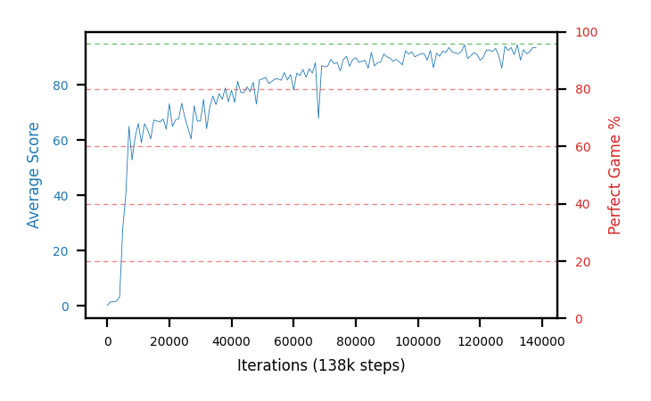
**b30a-chase10fc200x100x100seed1**


**b30b-chase10fc200x100x100seed2**

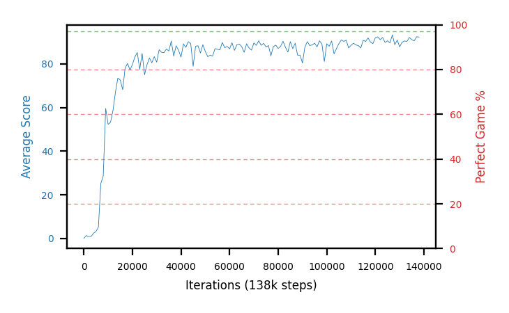
**b30c-chase10fc200x100x100seed3**

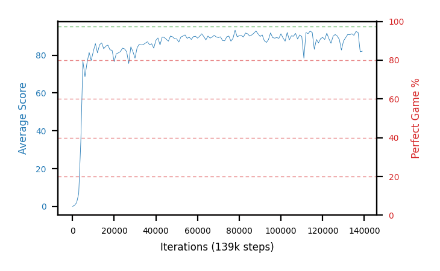
**b30d-chase10fc200x100x100seed4**

## Batch 27 — potential-based chase-safe shaping, `c=0.10`, gate 85 (b24 config) — *desktop, counter bug*

The first arms to carry the new shaping term. `Snake.step` adds `c·(γΦ(s′) − Φ(s))` with **Φ = 1 iff the
head and tail share a free region that also holds the food, and the snake is ≥85 long**; potential-based,
so the optimal policy is untouched and only the gradient on the way there changes. Everything else is
b24's config — `fc 320`, IS off, `td_error`, target period 1000, discount 0.9975, `FORK_BRANCHES=4`,
seeds 1-4 — which makes **`b24a-d` the seed-matched control**. Cap **2M** (b24 ran 3M; its record
checkpoints land at 1.03-1.39M). Design and the Phase 0 calibration of `c`:
[the plan](../plans/chase-safe-reward-shaping.md) and [`runs.md`](runs.md).

**Status at 2026-08-14 21:00: all four still training at 309-326k, and all four are contaminated** by the
counter bug in the banner at the top of this file. Every graph below shows the same thing — a healthy blue
score curve settling at 90-93 and **no red line at all**, because `perfect_percent` was 0 in all 310-327
evals while each arm's own `max_score` field recorded a **filled board** between steps 9k and 16k. Epsilon
sat at 0.0125 the whole way, so these are not readings on the shaping.

| arm | step | trailing | first filled board | perfect % | epsilon | control |
|---|---|---|---|---|---|---|
| `b27a-chase10g85seed1` | 309k | 92.6 | step 16k | **0, miscounted** | 0.0125 | `b24a` (pooled 89.0, best-30 95.3) |
| `b27b-chase10g85seed2` | 326k | 91.7 | step 14k | **0, miscounted** | 0.0125 | `b24b` (88.8, 96.7) |
| `b27c-chase10g85seed3` | 319k | 90.5 | step 13k | **0, miscounted** | 0.0125 | `b24c` (87.7, 96.0) |
| `b27d-chase10g85seed4` | 318k | 93.0 | step 9k | **0, miscounted** | 0.0125 | `b24d` (86.0, 96.7) — holds the record |

Graphs copied off the desktop by hand (`scp the-claw-den:~/Snek/snek2/runs/b27*.png`) rather than waiting
for the `results` branch, because the flat red axis is the evidence. **b28** (`c=0.20`) and **b29** (gate 75)
are still queued and would inherit the same bug until the fix is deployed there.

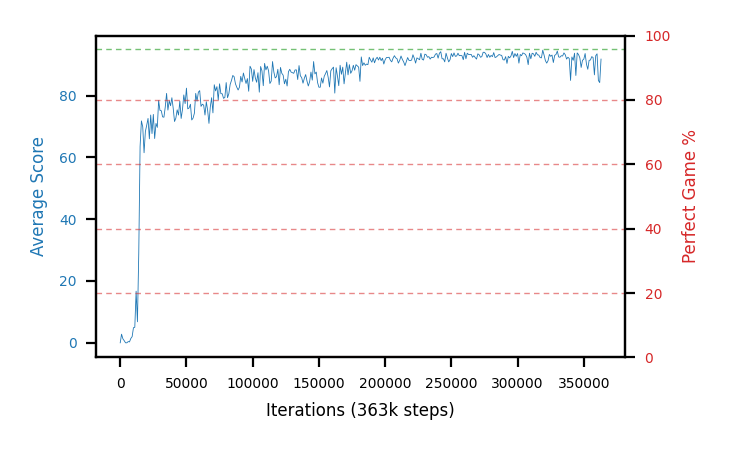
**b27a-chase10g85seed1** — score rises to ~93 and holds; the perfect-game axis is empty for all 310 evals.

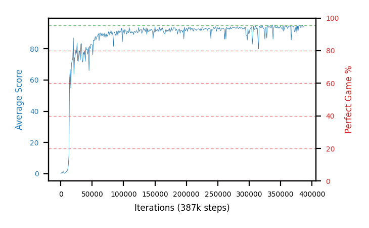
**b27b-chase10g85seed2**

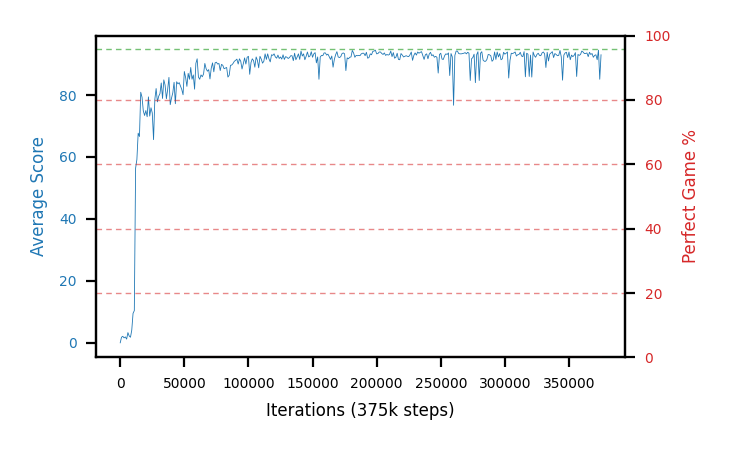
**b27c-chase10g85seed3**

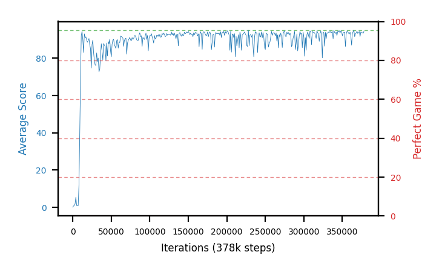
**b27d-chase10g85seed4** — first filled board at step 9k, the earliest of the eight shaped arms.

## Batch 26 — FC `100,100` under IS-off (`SNEK_IS_WEIGHTS=0`), `td_error`, seeds 1-4 — *closed, HOF-500 empty*

The third shape in the width follow-up: a shallow **two-layer `100,100`** net, after b24 (`320`) and b25
(`200,100,100`) both lifted consolidation. It asks whether a shallower shape still gets the gain, or whether
it needs the depth/capacity those two had. Seed-matched control is b22 (`50,100,50`, IS off). Trained on the
desktop.

**All four trained to the 3M cap and closed out (gate 95).** The shallow shape **does not carry the lift**:
close-out pooled mean **79.2** is only **+3.5 over the b22 control's 75.7** — against b24's +12.2 (`320`) and
b25's +10.3 (`200,100,100`). Three seeds learned well (`sef` 44-58); `b26d` is a weak seed (`sef` 13.8,
pooled 69.6) but never died. **No arm produced a ≥98%/100 checkpoint** — the best full-length reads are
`b26b`/`b26c` at 97.0%/100 — so the auto-HOF-500 (gate 98, running now) selects nothing and lands empty; the
record stays b24's. **‡ This is also the arm that separates width from size, and it retracts b25's reading.** `100,100`
has **1.14× the control's parameters — more than b24's `320` at 0.94×** — and gets a quarter of the lift,
so "the gain tracks capacity" is wrong. The ordering that holds is the **widest layer**: 320 → +12.2,
200 → +10.3, 100 → +3.5, 50 → 0
([finding](findings.md#-corrected-2026-08-14-the-is-off-architecture-lift-tracks-the-widest-layer-not-the-parameter-count)).
Sorted by close-out pooled.

| arm | peak trail | best-30 | `sef` (3M) | close-out pooled | best full-length |
|---|---|---|---|---|---|
| `b26b` | 95.00 | **93.7%** @1982k | **58.0%** | **83.8** | 97.0% @1948k |
| `b26c` | 94.96 | 92.0% @2231k | 52.1% | 83.2 | 97.0% @1969k |
| `b26a` | 94.92 | 88.0% @2349k | 44.6% | 80.0 | 95.0% @2904k |
| `b26d` | 94.84 | 79.7% @1073k | 13.8% | 69.6 | none ≥95% (all ab.) |
| **mean — b26 fc100,100 IS-off** | **94.93** | **88.4%** | **42.1%** | **79.2** | 0 of 4 held ≥98%/100 |
| **mean — b22 fc50,100,50 IS-off (control)** | 94.88 | 86.2% | 30.5% | 75.7 | — |

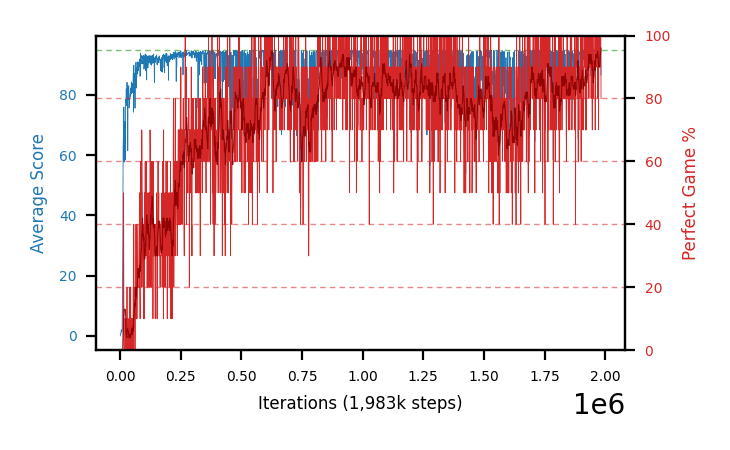
**b26b-fc100x100noisseed2**

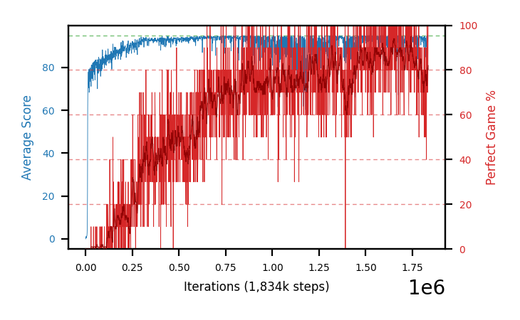
**b26c-fc100x100noisseed3**

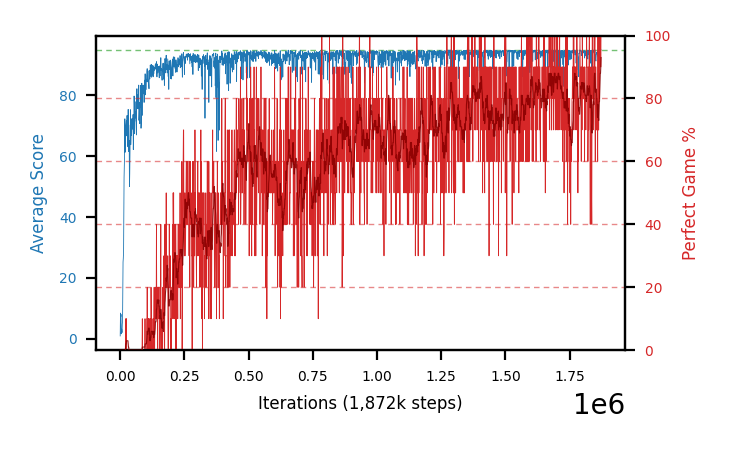
**b26a-fc100x100noisseed1**

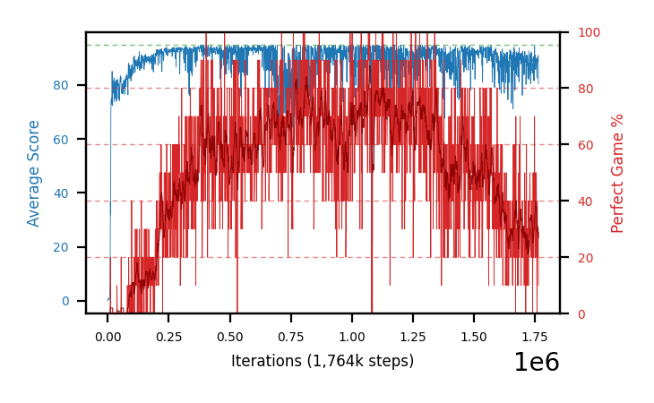
**b26d-fc100x100noisseed4**

## Batch 25 — FC `200,100,100` under IS-off (`SNEK_IS_WEIGHTS=0`), `td_error`, seeds 1-4

b22's exact IS-off config with a 3-layer `200,100,100` net (36,804 params, **3.09×** the control) — the second
shape in the width follow-up after b24's `320` result. It asks whether b24's consolidation lift is width
itself or just more parameters, and whether it survives at a shape other than one wide layer. Seed-matched
control is b22 (`50,100,50`, IS off). Trained on the desktop.

**Fully evaluated — and the first auto-HOF chain ran end to end (training → close-out → HOF-500).** The
close-out (gate 95) pools a mean **86.0** — **+10.3 over the b22 control's 75.7, within 1.9 of b24's
87.9** — so the consolidation lift **replicates at a 3-layer `200,100,100` shape**. (This section first
read that as "capacity rather than width"; **b26 falsified it** — `100,100` carries more parameters than
b24's `320` and gets +3.5. The shapes order by widest layer, and `200,100,100` costs 3.09× the control's
parameters to land *below* `320`'s 0.94×.) Peak is unmoved at 95.0. **But the HOF-500 (gate 98) held nothing: every
arm's ≥98%/100 candidates were abandoned, none reaching 98% over 500** — the /100 highs inflated exactly as
b24's did. The strongest was `b25b` @911k, still 97.2% when gate-98 stopped it at 392 episodes; that is a
plausible ~97%/500 holder the folder's gate-97 standard would have run to completion, so it needs a hand
re-measure before any hall claim. **No b25 checkpoint enters the folder on the auto run.** Sorted by
close-out pooled.

| arm | peak trail | best-30 | `sef` | close-out pooled | HOF-500 (gate 98) |
|---|---|---|---|---|---|
| `b25c` | 95.00 | 93.7% | **66.9%** | **87.2** | none ≥98% (best 95.3% @827k, ab.) |
| `b25d` | 95.00 | 94.3% | 62.2% | 85.9 | none ≥98% (best 96.4% @2431k, ab.) |
| `b25a` | 95.00 | 93.7% | 63.2% | 85.6 | none ≥98% (best 92.7% @802k, ab.) |
| `b25b` | 95.00 | **95.3%** | 62.7% | 85.5 | none ≥98% (best **97.2%** @911k, ab.) |
| **mean — b25 fc200,100,100 IS-off** | **95.00** | **94.3%** | **63.8%** | **86.0** | 0 of 4 held ≥98%/500 |
| **mean — b22 fc50,100,50 IS-off (control)** | 94.88 | 86.2% | 30.5% | 75.7 | — |


**b25c-fc200x100x100noisseed3-r2**


**b25a-fc200x100x100noisseed1-r2**


**b25b-fc200x100x100noisseed2-r2**

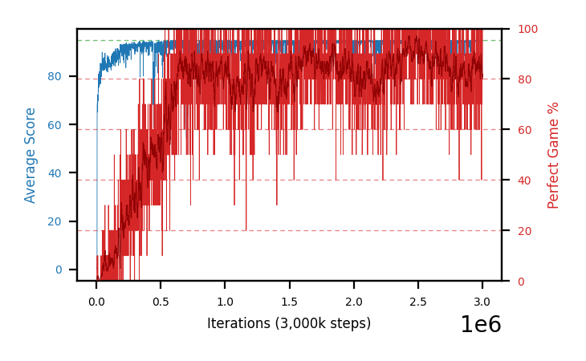
**b25d-fc200x100x100noisseed4-r2**

## Batch 24 — FC width `320` under IS-off (`SNEK_IS_WEIGHTS=0`), `td_error`, seeds 1-4

Batch 22's exact IS-off config with the network widened to a single `320` layer (batch 20's `320`
shape) — width is the only change. It asks the question batch 20 could not answer under the β→1.0
control: **does width matter once the prioritisation is fixed at IS-off?** The seed-matched control is
b22 (`50,100,50`, IS off). Trained on the desktop.

**Width raises consolidation under IS-off, and the batch set a new record.** All four peak at **95.00**, so
width does not move the ceiling. But the close-out pools **87.9** (eq-effort, gate 95): **+12.2 over the b22
control's 75.7, and higher on every seed** — above every prior gate-95 arm, the b18b record's 78.5 included.
This is the project's first sign that width and prioritisation interact: width paid nothing under β→1.0
(batch 20), and it pays here under IS-off.

**The HOF-500 re-measured all 199 ≥97%/100 checkpoints; 9 held ≥97%/500 and the batch took the record.** The
new record is **`b24d` @1342k, 98.0%/500** (490/500, CI [96.4,98.9]), edging `b18b` @1588k (97.6%/700) and
tied by `b24b` @2860k (98.0%/500). The /100 rows were badly inflated — `b24a`'s two 100%/100 highs produced
**0 survivors** at 500 episodes (b23b's 97%/100 → 92.4%/500 was the same pattern) — so read the `best HOF-500`
column, not `best /100`.

All at the 3M cap, sorted by close-out pooled. Close-out and HOF-500 ran on the desktop (gate 95 / gate 97,
`EVAL_WORKERS=4`).

| arm | peak trail | best-30 | `sef` | close-out pooled | best /100 | best HOF-500 |
|---|---|---|---|---|---|---|
| `b24a` | 95.00 | 95.3% | 60.5% | **89.03** | **100.0%** @1633k | — (0 of 43 held) |
| `b24b` | 95.00 | **96.7%** | **73.2%** | 88.84 | 99.0% @1031k | **98.0%** @2860k |
| `b24c` | 95.00 | 96.0% | 67.4% | 87.68 | **100.0%** @2126k | 97.4% @2982k |
| `b24d` | 95.00 | 96.7% | 62.9% | 85.97 | 99.0% @1292k | **98.0%** @1342k ← **record** |
| **mean — b24 fc320 IS-off** | **95.00** | **96.2%** | **66.0%** | **87.9** | — | — |
| **mean — b22 fc50,100,50 IS-off** | 94.88 | 86.2% | 30.5% | 75.7% | — | — |

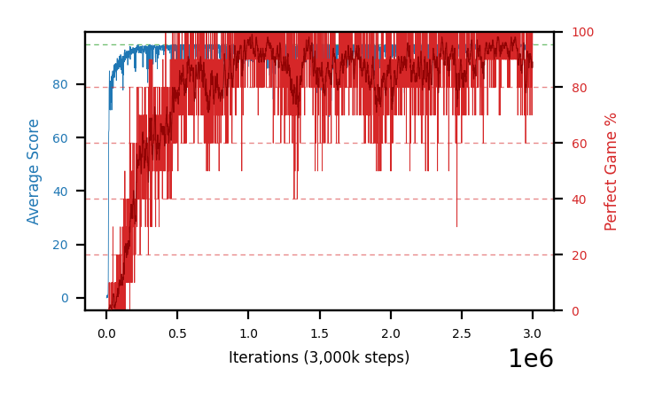
**b24b-fc320noisseed2**

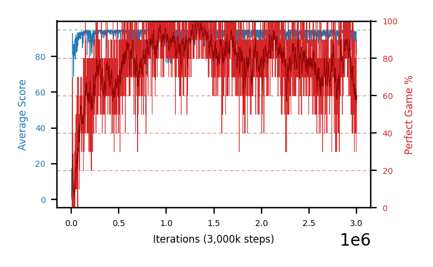
**b24d-fc320noisseed4**

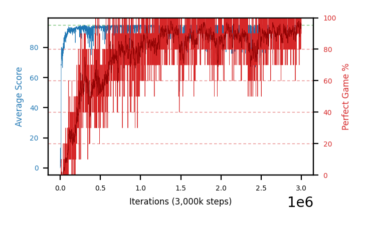
**b24c-fc320noisseed3**

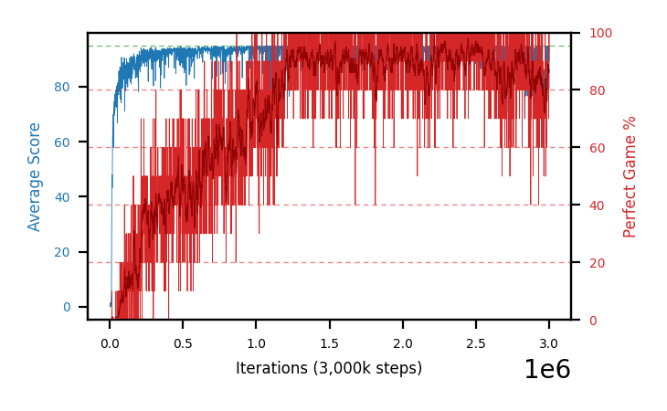
**b24a-fc320noisseed1**

## Batch 23 — β annealed 0→0.1, `td_error` priority, fc 50,100,50

One step further down the IS-β ladder than batch 21: β annealed from **0 to 0.1** over 300k
(`SNEK_IS_BETA=0`, `SNEK_IS_BETA_FINAL=0.1`), so the update keeps **α·(1−β)=0.54** of the priority
signal at the target — between b21's 0.30 (β→0.5) and the full 0.6 with IS off. Otherwise batch 20's
control. It asks whether dialing β toward 0 approaches the no-IS behaviour smoothly.

**β→0.1 lands at the no-IS consolidation level, and the close-out confirms it.** Training graph: mean
best-30 **85.8**, `sef` **33.1** (n=4, `sef` spread 23.5-56.0). The desktop close-out then reads **pooled
75.7** (eq-effort, gate 95) — **+20.7 over the control, +11.4 over b21, and higher on all four seeds than
either** (sign-test p=0.0625 each, the n=4 floor) — closing most of the gap to b18's no-IS ~78.8 (ESS/N
0.21, a different base). Both metrics climb monotonically down the β ladder: pooled control 55.0 → b21
64.3 → **b23 75.7** → b18 ~78.8; `sef` 11.2 → 14.3 → **33.1** → 34.6. Peak trailing **94.90** is flat with
every batch since 11 — ceiling unmoved, only consolidation differs. `b23b` holds a dense strong region on
the graph — **five full-length checkpoints ≥95/100 around 777k, best 97/100** — and looked like a
hall-of-fame candidate, but the re-measurement protocol falsified it: at **500 fresh episodes the
close-out-selected @777k reads 92.4%**, the *worst* of its own cluster (textbook selection bias) and well
below the 97.6% record. No b23 checkpoint enters the hall of fame.

All at the 3M cap, sorted by best-30. Close-out under gate 95, `EVAL_WORKERS=4`.

| arm | peak trail | best-30 | `sef` | close-out pooled | best row |
|---|---|---|---|---|---|
| `b23b` | **95.00** | **91.0%** | **56.0%** | **82.1%** | **97.0% @777k (n=100)** |
| `b23a` | **95.00** | 87.0% | 23.5% | 77.2% | 80.0% @1039k (n=20) |
| `b23c` | 94.78 | 83.0% | 24.0% | 71.5% | 75.0% @1393k (n=20) |
| `b23d` | 94.82 | 82.3% | 28.7% | 72.1% | 75.0% @603k (n=20) |
| **mean — b23 β→0.1** | 94.90 | 85.8% | 33.1% | **75.7%** | — |
| **mean — b21 β→0.5** | 94.69 | 74.1% | 14.3% | 64.3% | — |
| **mean — control β→1.0** | 94.44 | 64.0% | 11.2% | 55.0% | — |
| **mean — b18 no IS** | — | 87.3% | 34.6% | ~78.8% | — |

**Only `b23b` cleared gate 95 at full length** (12 rows, top-3 96.3%); the other three have no full-length
row, so their `best row` is a 20-episode screen (a bound), while `pooled` is exact.

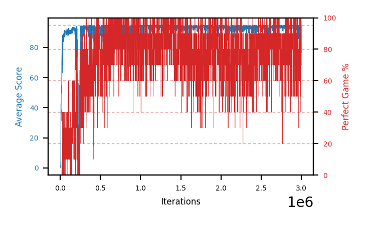
**b23b-beta01seed2**

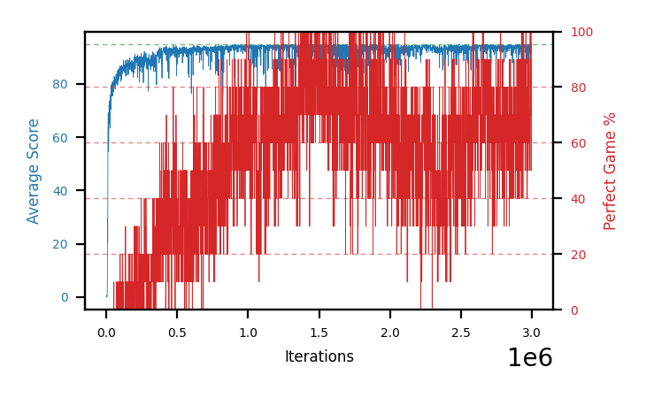
**b23a-beta01seed1**

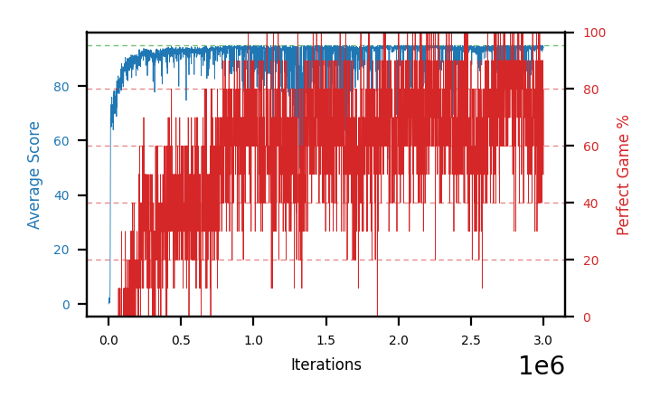
**b23c-beta01seed3**

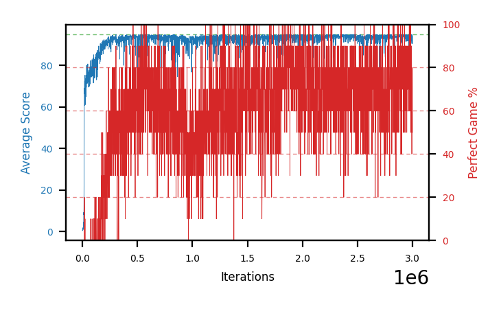
**b23d-beta01seed4**
