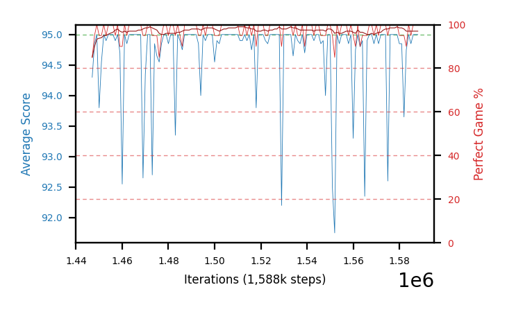
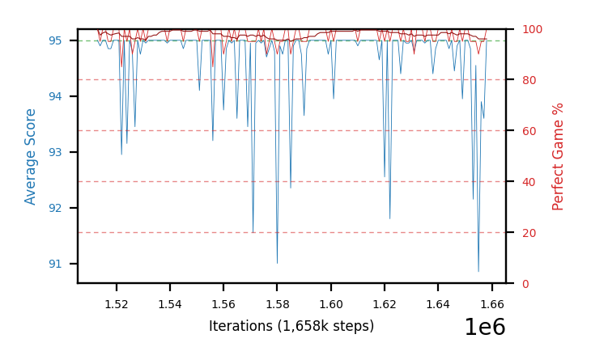
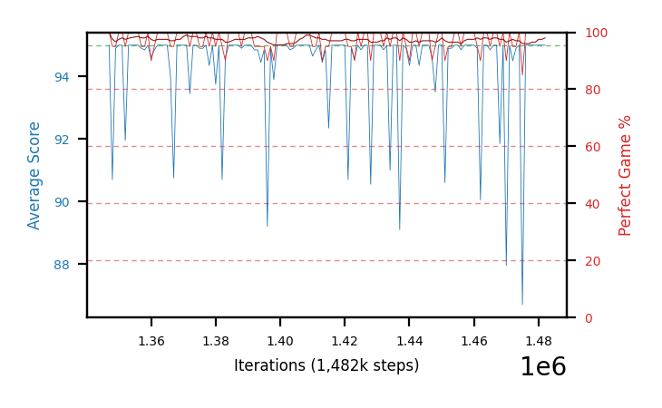
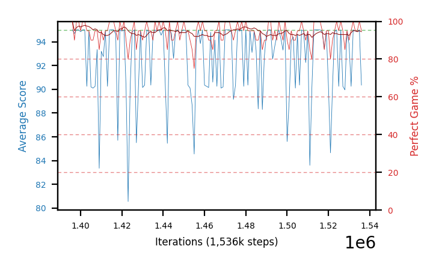
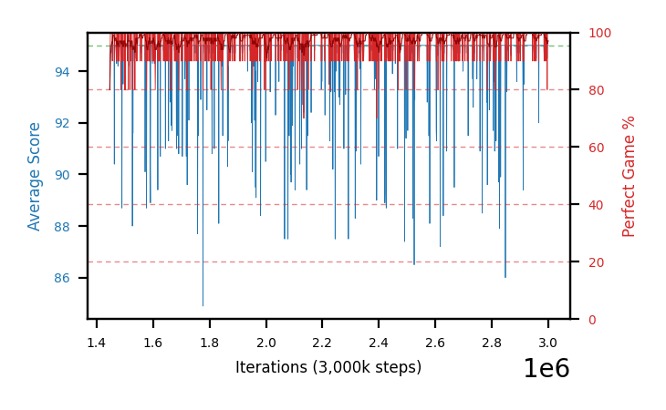
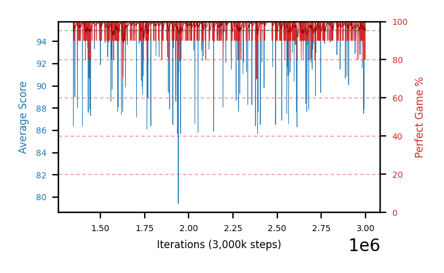
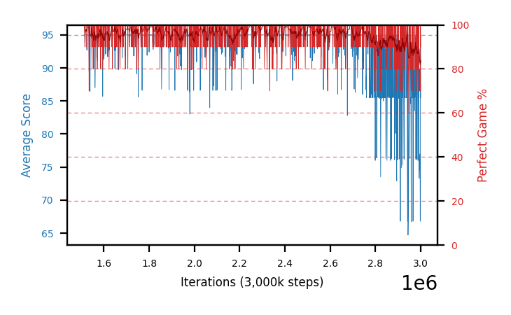
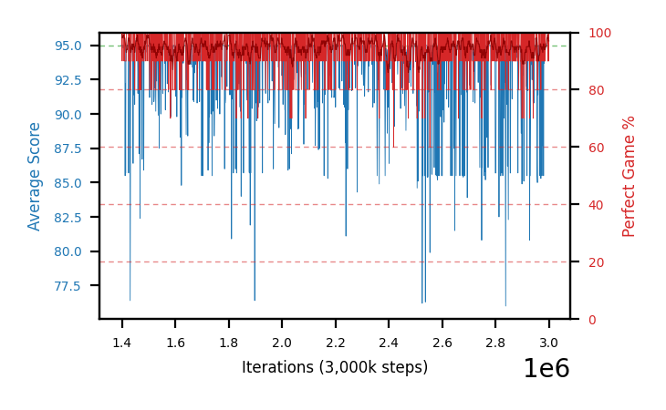

# Charts

Progress graphs for the most recent batches — **28, 37, 40, 42, 43 and 44**, a cap of six, newest first.
Per-arm numbers live in [`completedRuns.md`](completedRuns.md); this file is images plus a short reading of
each. A batch appears here **while it is still running**, with training-only numbers, not just once it has
closed. Batch 27 was retired to [`archive/charts-archive.md`](archive/charts-archive.md) when 36 launched,
**batch 30** followed when 34's results arrived, **batch 31** (a void, stopped C51 arm) when 35's arrived,
**batch 33** when 38 launched, **batch 32** when 39 did, **batches 34 and 35** when 37's and 40's results
landed, and **the C51 pilot plus batch 38** when 42/43 launched, and **batch 39** when 42 got its section, and **batch 36** when 44 got its. 36 was being held only as the named control for 39, and 39 is now archived itself. 39 went ahead of the strict-oldest 28-29 for the same reason 28-29 has been held four times now: it is the source of three of the four checkpoints 42/43/44 continue, and it is what they are read against. 39 bears on none of that.

**`b37`, `b40` and `b42` are fully closed** — training, close-out *and* HOF-500. **`b43` and `b44` are through
their close-outs** (2026-08-19: 15 h on the laptop, 11.2-14.9 h on the desktop) **and their HOF-500 re-measures
are running** — `b43`'s on the laptop at ~25%, `b44`'s on the desktop at ~6%, the latter ~18 h of work. Both
passes are **slow by nature, not stuck** — see
[the cost warning](#-a-continuation-batchs-close-out-costs-10-20x-a-normal-ones) in batch 44's section. **`b42`
was stopped early** at +385-421k, once its answer had resolved on 4 of 4 seeds. The gate ladder's two null rungs (34, 70 and 35, 40) were retired earlier,
since the ladder's conclusion is now carried by 28-29, 37 and 40 — the batches that bear on whether gate 75's
record region was real.

**`b37` and `b39` are not a numbering slip:** `b37` was queued from the desktop the same evening `b38` was
launched from the laptop, so the two hosts took adjacent numbers out of order. **`b41` has no section here
either** — it is the b29 same-seed determinism probe, still closing out on the desktop.

**Batch 42 and 43 arms do not start at step 0**, so their curves begin mid-chart at the step of the checkpoint
each one continues. There is no resume line at the left edge because the graph history was deliberately not
carried over: these are fresh policy dirs seeded from one checkpoint, not resumes of the source arm.

**Older sections are retired, not deleted.** Batches 1-11 are in
[`archive/batches1-11.md`](archive/batches1-11.md) and anything retired since is in
[`archive/charts-archive.md`](archive/charts-archive.md). **The PNGs are all still in `charts/`**, so
an archived caption still renders. See
[when an arm is stopped](hyperparamTuning.md#when-you-stop-a-batch-of-arms) for the procedure.

In every chart: **blue is average score** (food eaten, out of 95) on the left axis, **red is
perfect-game percentage** on the right. Grey dashed vertical lines mark resumes; faint red dashed
horizontals mark 20/40/60/80% on the right axis, because the perfect rate is the objective and
was unreadable against left-axis ticks.

**Newest batch first.** Within a batch, best result first.

## These are snapshots, on purpose

The images are **copies** from `snek2/runs/`, not links. The live graphs there are rewritten every
eval and would be lost if that directory were cleaned out, silently blanking this file. Refresh with
`scripts/refresh_charts.sh`, which re-copies every `runs/*.png` into `charts/` and prints each one's step.

**The script does not touch this file** — it copies images only, so a new arm gets a PNG and no
entry unless one is written by hand. That drifted once, to 12 undocumented arms across batches 5-7,
because a successful `refresh_charts.sh` looked like the charts were handled. Check this file **and both
archives**, since captions now live in three places — `archive/charts-archive.md` was missing from this
snippet until 2026-08-08, which would have reported every retired arm as undocumented:

```
cd snek2/hyperparamTuning
ls charts/*.png | sed 's|.*/||;s|\.png||' | sort > /tmp/have
grep -ho 'charts/[a-zA-Z0-9-]*\.png' charts.md archive/batches1-11.md archive/charts-archive.md \
  | sed 's|.*charts/||;s|\.png||' | sort -u > /tmp/doc
comm -23 /tmp/have /tmp/doc   # anything listed is an undocumented arm
```

**Six PNGs in `charts/` are not arm charts and will always appear in that list** —
`champion-vs-mediocre`, `drawdown-b23b-vs-b18`, `per-b18-vs-b20-priorities`, `plasticity-metrics`,
`best30-drivers` and `gate-behavior-b27-vs-b29` are diagnostic figures referenced from
[`findings.md`](findings.md) and [`perDiagnostics/`](perDiagnostics/README.md), not training graphs.
Anything *else* the check prints is a real gap.

## Batch 45 — the **same four checkpoints at `lr 1e-8`** — *training on the desktop, 85% of a 5M cap: **flat on all four**, and the flatness is the answer*

The fourth and lowest rung. `b42`-`b44` walked the rate down 1e-5 → 1e-6 → 1e-7 and each step beat the last, so
`b45` asks whether that is monotone or whether there is an optimum. **It is the first rung with a longer cap —
5M rather than 3M** — because `b43c` did not peak until 2803k and `b44`'s best rows sit at 2.2-2.9M, so 3M was
starting to look like the binding constraint rather than the arms' own limit.

| arm | continues | step | past seed | best-30 | **best-30, equal-episode** | `sef` | recent-30 |
|---|---|---|---|---|---|---|---|
| `b45a` | `b29b` @1447k | 4297k | +2850k | 99.2 @2990k | **100.0** @2990k | **100.0** | 97.5 |
| `b45c` | `b40b` @1513k | 4421k | +2908k | 99.2 @1621k | 99.7 @1616k | 99.9 | 97.2 |
| `b45b` | `b29a` @1347k | 4098k | +2751k | 98.5 @1662k | 99.3 @1957k | **100.0** | 97.5 |
| `b45d` | `b29c` @1396k | 4195k | +2799k | 97.3 @3788k | 98.3 @3040k | 99.8 | 94.7 |

**`zero_since` is null on all four** and every arm is ~2.8M steps past its seed, so this is no longer an early read.

**Read the `best-30, equal-episode` column, not the plain one — and this batch is where that starts to matter.**
`training.num_eval_episodes` went 10 → 20 on 2026-08-19, so `b45` is the first arm set on the new instrument, and
`best_perfect30` is a maximum over a *less noisy* statistic than `b43`/`b44` computed theirs from. The correction is
not hypothetical: recomputing every arm on windows holding the **same 300 episodes** (30 evals × 10 for `b43`/`b44`,
15 × 20 for `b45`) raises every `b45` arm by **+0.8 to +1.0 pp** and leaves the older rungs untouched. Mean best-30
then reads **b44 99.17 vs b45 99.32** — level — where the uncorrected numbers read 99.17 vs 98.55 and look like a
regression. **The apparent `b45 < b44` deficit is entirely the instrument.**

**What is real is that the arms stopped moving.** Mean perfect rate per 0.5M band, first band vs last:

| rung | drift, worst → best arm | band-to-band spread |
|---|---|---|
| `b43` @1e-6 | **−6.3** → −0.0 | 0.91 - 2.89 |
| `b44` @1e-7 | −2.7 → **+1.2** | 0.19 - 1.67 |
| `b45` @1e-8 | **−0.6 → +0.3** | **0.19 - 0.37** |

`1e-8` bought stability by buying inaction. It stopped the decay — `b43d` shed 6.3 pp and `b44c` 2.7 pp over their
runs, while `b45`'s *worst* arm moves 0.6 pp — but it equally stopped the gain: `b44a` climbed +1.2 pp and `b45a`,
the same seed, drifts −0.4. Every arm sits within ±0.5 pp of its own opening band across 2.8M steps. That is the
**"flat from early on"** branch of `b45`'s pre-registration, i.e. the step has fallen below the scale that changes
the greedy action — not "too slow, raise the cap", which would show as a curve still climbing at 4.3M.

**So `sef` at 99.8-100.0, the highest of any rung, is a symptom rather than a result.** It asks whether an arm ever
dropped below 80% perfect, which an arm that never moves satisfies for free. The same warning applies to the metric
the ladder has been scored on: **a count of checkpoints ≥98%/500 is trivially maximised by a frozen arm parked near
98%**, so expect `b45`'s close-out to hold *more* rows than `b44`'s 874 without being better, and read it on its
**best row's rate**, not its count. Comparisons across the four rungs are in
[`runs.md`](runs.md#batches-42-45--what-happens-if-you-keep-training-a-champion--yes-and-lower-is-better-down-to-1e-7-4--187--874-rows-98500-across-1e-51e-61e-7-and-1e-8-is-the-frozen-floor).

**`b45d` is the flat seed again**, 94.7 recent-30 against its siblings' 97.2-97.5 — the same `b29c` seed that held 0
rows at both `1e-6` and `1e-7`. Four rungs in, that seed has never produced a ≥98%/500 checkpoint under continuation.

The close-out is queued behind the training, and on
[the re-measurement result](findings.md#-the-winners-curse-measured-four-selected-champions-all-fell-and-the-500500-did-not-reproduce-2026-08-20)
its selected best should be read as ~1.4 pp optimistic when it lands.

### b45a-lowlr8-b29b — continues `b29b` @1447k



### b45c-lowlr8-b40b — continues `b40b` @1513k



### b45b-lowlr8-b29a — continues `b29a` @1347k



### b45d-lowlr8-b29c — continues `b29c` @1396k, the flat seed on every rung



## Batch 44 — the **same four checkpoints at `lr 1e-7`** — *done: **874** checkpoints at ≥98%/500, 4.7x `b43`'s 187 — and both of its two 500/500 rows are selection artefacts*

The third rung, and **the rung that falsified its own pre-registration.** `b44` was queued expecting a null
against `b43` (~65% by the estimate written into its specs) on the reasoning that if `1e-6` is already doing
nothing but failing to damage the policy, `1e-7` cannot do better than the same nothing. That was wrong: the
~25% "better than `b43`" branch is what happened, on every seed.

| arm | continues | from | `best_perfect30` | `sef` | recent-30 | `b43` best-30 / `sef` |
|---|---|---|---|---|---|---|
| `b44b` | `b29a` | @1347k | **100.0** @2460k | **99.9** | 96.7 | 100.0 / 99.5 |
| `b44a` | `b29b` | @1447k | **99.7** @2190k | **99.9** | 98.3 | 98.7 / 96.5 |
| `b44c` | `b40b` | @1513k | 99.0 @1814k | 98.7 | 86.7 | 98.7 / 98.5 |
| `b44d` | `b29c` | @1396k | 98.0 @2230k | 98.7 | 96.3 | 98.3 / 96.6 |

**The ladder is monotone across all three rungs**, banded mean self-eval perfect rate over the +385k window
matched across all twelve arms:

| band past seed | `b42` 1e-5 | `b43` 1e-6 | `b44` 1e-7 |
|---|---|---|---|
| 0-100k | 93.6 | 95.4 | **96.3** |
| 100-200k | 91.6 | 96.3 | **96.6** |
| 200-300k | 89.1 | **96.2** | 96.1 |
| 300-385k | 89.5 | 95.6 | **96.8** |

**But `1e-7` vs `1e-6` is a much smaller effect than `1e-6` vs `1e-5`, and it is not uniform in time.** Over
their full common window (+1487k — both reached the 3M cap):

| band past seed | `b43` 1e-6 | `b44` 1e-7 | diff | seeds `1e-7` ahead |
|---|---|---|---|---|
| 0-250k | 95.9 | 96.3 | +0.4 | 3 of 4 |
| 250-500k | 95.4 | 96.5 | +1.1 | **4 of 4** |
| 500-750k | 92.2 | **96.6** | **+4.4** | **4 of 4** |
| 750-1000k | 93.4 | 97.0 | **+3.6** | **4 of 4** |
| 1000-1250k | 94.8 | 96.6 | +1.8 | 3 of 4 |
| 1250-1487k | 94.5 | 95.2 | +0.7 | 2 of 4 |

Per seed over the whole window: **+4.6, +1.0, +1.6, +0.8** — 4 of 4, mean **+2.0 pp**, against **+4.9 pp** for
the `1e-5` → `1e-6` step. So **the ladder is monotone but decelerating**, which is what approaching a plateau
looks like without having arrived. The gap opens widest at 500-1000k because that is where `b43` dips (92.2)
while `b44` does not — `1e-6` still wanders on the timescale of half a million steps, `1e-7` largely does not.

**The mechanism reading:** `b44`'s best-30 peaks arrive **late** — 1814k, 2190k, 2230k, 2460k, i.e. 300-1100k
steps past seed — against 1527k-2803k for `b43` and *at the seed step* for `b42`. A lower rate does not merely
preserve; it improves more slowly and for longer. That is why the "it will just freeze" prediction failed: at
`1e-7` these arms are still moving, just not far enough per step to fall out of the basin.

### ✅ Close-out (100 episodes) — the self-eval result survives the deeper instrument, larger

| arm | checkpoints measured | ≥98%/100 | ≥99%/100 | =100%/100 | `b43` twin's ≥98%/100 |
|---|---|---|---|---|---|
| `b44a` | 1516 | **853 (56.3%)** | 497 | 160 | 166 (12.8%) |
| `b44b` | 1616 | **867 (53.7%)** | 514 | 160 | 607 (38.7%) |
| `b44c` | 1377 | **415 (30.1%)** | 200 | 50 | 133 (10.0%) |
| `b44d` | 1450 | 100 (6.9%) | 27 | 4 | 83 (6.0%) |

**More than half of `b44a`'s and `b44b`'s checkpoints are in the ≥98%/100 tier**, against one in eight and two in
five for their `1e-6` twins and one in fifteen for `1e-5`. `b44d` is the flat seed on every rung. Note that
`b44`'s pool is the *least* selected of the three batches — 98% of all its checkpoints on two arms — so it
carries the most dead weight in the denominator and still wins; the full comparison, with the caveats, is in
[`archive/runs-archive.md`](archive/runs-archive.md#retired-from-runsmd-2026-08-22--the-closed-rungs-of-the-b42-b45-ladder).

**The HOF-500 finished 2026-08-20 — all 2235 measurements — and it decides the ladder against `b43`
emphatically: 874 rows ≥98%/500 against `b43`'s 187**, a 4.7x gap on a *less* selected pool, and 90 rows at
≥99% against 19.

| arm | rows | ≥98%/500 | ≥99%/500 | best /500 | `b43` twin's ≥98%/500 |
|---|---|---|---|---|---|
| `b44a` | 853 | **429** | **48** | **100.0% @2798k** (500/500) | 16 |
| `b44b` | 867 | 403 | 41 | **100.0% @1886k** (500/500) — re-measures **98.2%/1000** | 170 |
| `b44c` | 415 | 42 | 1 | 99.0% @2600k | 1 |
| `b44d` | 100 | 0 | 0 | — (all 100 gate-abandoned) | 0 |
| **total** | 2235 | **874** | **90** | | **187** |

**Two 500/500 rows, one per good seed — and both are selection artefacts, not perfect policies.** @1886000 was
re-measured on 1000 fresh episodes and scored **982/1000 = 98.2%**; @2798000 has not been re-measured but there
is no reason to expect it to behave differently. With **90 checkpoints at ≥99%/500**, two flawless rows is
roughly what chance produces — a checkpoint whose true rate is 99% returns 500/500 about 0.7% of the time. So
read the *count*, not the maximum: that is what separates this rung from `b43`.

**`b44d` finished too**, and its zero is real: all **100** of its candidates were measured and every one was
gate-abandoned, i.e. arithmetically unable to reach 98%. (Its file carries `complete: false` only because no row
survived to full length.)

**‡ It failed to replicate, and that caution was the right one.** The 500/500 was re-measured the same day on
**1000 fresh episodes and scored 982/1000 = 98.2%** (97.2-98.9) — a **−1.8 pp** drop, p=0.0025. All four of the
project's best checkpoints were re-measured together and **all four fell**, mean −1.35 pp, which puts a number
on the winner's curse for the first time: [full result in
`findings.md`](findings.md#-the-winners-curse-measured-four-selected-champions-all-fell-and-the-500500-did-not-reproduce-2026-08-20). Nothing was promoted into `hallOfFame/`, and on
these numbers nothing should be until a candidate is chosen on a fresh measurement rather than a selected one.
See
the ⚠ note in [batch 42's section](#batch-42--the-same-four-checkpoints-at-the-default-lr-1e-5--stopped-early-at-177-191m-closed-out-and-hof-500d-it-decays-and-its-surviving-98-checkpoints-are-its-own-starting-weights)
on why `peak_trailing` is useless for this family, and the [close-out cost
warning](#-a-continuation-batchs-close-out-costs-10-20x-a-normal-ones) below.

### b44a-lowlr7-b29b — continues the project record, `b29b` @1447k (99.0%/500)

`best_perfect30` **99.7** at 2190k, `sef` **99.9**, recent-30 98.3. **The largest single gain in the ladder:**
its `b42` twin sat at `sef` 87.0 and its `b43` twin at 96.5, so the same weights under three rates give
87.0 / 96.5 / 99.9. This is the arm that carried the project record in, and it is the one the rate matters most
for — consistent with the record checkpoint sitting in a narrow basin the default step size walks out of.



### b44b-lowlr7-b29a — continues `b29a` @1347k (98.4%/500)

`best_perfect30` **100.0** at 2460k, `sef` **99.9**, recent-30 96.7. Ties `b43b`'s 100.0 best-30 window but
reaches it 793k steps later and holds a higher `sef`, so the two are not the same result. **Its close-out is the
long pole across both hosts** — 1196 of its checkpoints qualify for the mandatory ≥90% tier.



### b44c-lowlr7-b40b — continues `b40b` @1513k (98.2%/500)

`best_perfect30` 99.0 at 1814k, `sef` 98.7, but **recent-30 86.7 — the one arm ending weak**, and the only one
whose `sef` is not clearly above its `b43` twin (98.7 vs 98.5). Carries the free-space confound: trained *with*
the global free-space term and continued *without* it, so its restored value function is mis-calibrated against
its new reward. The confound is identical on the `b42` and `b43` sides, so the three-way comparison holds.



### b44d-lowlr7-b29c — continues `b29c` @1396k (97.1%, 378 ep)

`best_perfect30` 98.0 at 2230k, `sef` 98.7, recent-30 96.3. **The one seed where `1e-7` does not beat `1e-6` on
best-30** (98.0 against 98.3) though it does on `sef` (98.7 against 96.6) — the weakest starting checkpoint of
the four and the narrowest pair, as it was at every other rung.



### ⚠ A continuation batch's close-out costs 10-20x a normal one's

`top20` measured **791, 1196, 803 and 826** checkpoints on `b43`'s four arms, not 20. That is documented
behaviour, not a bug: **"N is a target, not a quota"** — every checkpoint whose 10-episode graph eval reached
**≥90%** is measured, past N. A normal arm climbs from 0, so few checkpoints qualify; **an arm continued from a
98% checkpoint spends its entire run above the mandatory threshold, so nearly every checkpoint qualifies.**
`b42` shows the contrast from the other side — it *decayed*, so only 261-373 of its checkpoints qualified.

Practical consequence: budget a continuation batch's close-out at **8-15 hours per wave**, not one, and do not
read a close-out still running after 7 hours as hung. `b43`'s was launched 01:07 and is still going.

## Batch 43 — **continuing the four best checkpoints at `lr 1e-6`** — *closed out (15 h) and HOF-500'd: **187** checkpoints at ≥98%/500 against `b42`'s 4, topping out at 99.6% — which `b44` then beat*

**The question:** every record in this project is a checkpoint some arm *passed through* on its way to a worse
endpoint. No arm has ever been continued from its own best checkpoint. `b43` continues the top four of eight
across b29 and b40 — ranked by their best **500-episode** perfect rate — to a 3M absolute cap under b29's
config (`fc 320`, chase-safe `c=0.10` gate 75, no free-space term), with **`SNEK_LEARNING_RATE=1e-6`** the only
change. The desktop's **`b42`** runs the identical four at the default `1e-5` as the seed-matched control.
Rationale, the pre-registered outcome readings and the selection-bias warning are in
[`runs.md`](runs.md#batches-42-45--what-happens-if-you-keep-training-a-champion--yes-and-lower-is-better-down-to-1e-7-4--187--874-rows-98500-across-1e-51e-61e-7-and-1e-8-is-the-frozen-floor);
launcher [`scripts/launch_b43_lowlr.sh`](scripts/launch_b43_lowlr.sh), seeding
[`scripts/seed_from_checkpoint.sh`](scripts/seed_from_checkpoint.sh).

| arm | continues | from | its 500-ep rate there | training-self-eval so far | `b42` best-30 / `sef` |
|---|---|---|---|---|---|
| `b43b` | `b29a-chase10g75seed1` | @1347k | 98.4% | best-30 **100.0** @1667k, `sef` **99.5**, recent-30 96.3 | its `b42` twin: 97.3 / 97.9 |
| `b43a` | `b29b-chase10g75seed2` | @1447k | **99.0%** (the record at the time) | best-30 98.7 @1527k, `sef` 96.5, recent-30 94.0 | 97.3 / **87.0** |
| `b43c` | `b40b-chasefree10g75seed2` | @1513k | 98.2% | best-30 98.7 @**2803k**, `sef` 98.5, recent-30 88.0 | **93.3** / 91.2 |
| `b43d` | `b29c-chase10g75seed3` | @1396k | 97.1% (378 ep, gate-abandoned) | best-30 98.3 @1539k, `sef` 96.6, recent-30 90.3 | 97.7 / 95.9 |

**All four reached the 3M cap** (+1487-1653k past seed) and the close-out launched at 01:07, still running.
Final training numbers: `best_perfect30` **98.3-100.0**, `sef` **96.5-99.5**, `max_single_eval` 100,
`zero_since` null on all four. **`b43b` reached a `best_perfect30` of 100.0 at 1667k — 320k steps past its own
seed checkpoint**, a 30-eval window with no imperfect game in it. So `1e-6` is not merely preservation.

**`b44` at `1e-7` then beat it on 4 of 4 seeds** (+2.0 pp mean over the full common window), so `b43` is the
*middle* rung, not the answer — see [batch 44 above](#batch-44--the-same-four-checkpoints-at-lr-1e-7--done-874-checkpoints-at-98500-47x-b43s-187--and-both-of-its-two-500500-rows-are-selection-artefacts). That nothing fell apart is itself a result: **the same four checkpoints fell
80% → 50% perfect in 5k steps when the replay buffer was *not* carried over**, and holding 95-100% here is what
the buffer copy bought.

**Against `b42`, the seed-matched `1e-5` control, `b43` leads on 4 of 4 seeds on every *training* metric** —
`best_perfect30` 98.3-100.0 against 93.3-97.7, `sef` 96.5-99.5 against 87.0-97.9, and banded perfect rate +4.7/+7.1/+6.1 pp over
the 100-200k, 200-300k and 300-385k bands past seed. The full banded table is in
[batch 42's section below](#batch-42--the-same-four-checkpoints-at-the-default-lr-1e-5--stopped-early-at-177-191m-closed-out-and-hof-500d-it-decays-and-its-surviving-98-checkpoints-are-its-own-starting-weights),
which is where the pair's result lives since `b42` is the arm that moved. **`b44`** extended the ladder to **`1e-7`** and won on 4 of 4 seeds.

**On the deeper instruments the lead is 4 of 4 but the margin is not uniform, and one seed inverts.** `b43`
takes ≥98%/100 on all four seeds (607/166/133/83 against 27/17/6/48), but pooled equal-effort is **3 of 4 plus a
dead heat** — `b43d` 93.50 against `b42d` 93.54 — and ≥98%/**500** is 3 of 4 with the `b29c` seed *reversed*,
`b42d` holding 3 where `b43d` held 0. Per-seed table in
[`completedRuns.md`](completedRuns.md#batch-43--continuing-the-four-best-checkpoints-at-lr-1e-6-a-record-region-10x-wider-than-anything-before-it-and-the-best-checkpoint-was-the-wrong-one-to-continue).

**Do not read these best-30 numbers against the 500-episode column beside them.** A 10-episode self-eval
averaged over 30 evals and a flat 500-episode measurement are different instruments, and the 500-ep column is
additionally **the maximum of a noisy statistic over 8 arms and hundreds of checkpoints** — biased upward. The
comparison that means something is `b43` against `b42`, which starts from byte-identical weights. Everything
here is training self-eval; the close-outs will be the real numbers.

**`sef` is not comparable with any other batch in this file.** It is the share of an arm's *own* evals above
80% perfect, and these arms started at ~98% instead of 0 — so 99.5 says "it never dropped", not "it learned
fast". Only `b42`'s `sef` is a fair reference, and it is in the last column of the table above; `b44`'s will be
the other one. **`b42` and `b43` are also not at a common step horizon** (`b42` was stopped at +385-421k,
`b43` is past +541k) and `sef` is a fraction of each arm's own evals, so the banded comparison — not this
column — is the rigorous one.

### ✅ Close-out (100 episodes) and HOF-500 — both complete

| arm | checkpoints measured | ≥98%/100 | ≥99%/100 | best /100 | ≥98%/500 | ≥99%/500 | best /500 |
|---|---|---|---|---|---|---|---|
| `b43a` | 1297 | 166 (12.8%) | 78 | 100% @1502k | 16 | 2 | 99.4% @1618k |
| `b43b` | 1568 | **607 (38.7%)** | 311 | 100% @1356k | **170** | **17** | **99.6% @1661k** (also @1708k) |
| `b43c` | 1325 | 133 (10.0%) | 47 | 100% @1516k | 1 | 0 | 98.0% @1760k |
| `b43d` | 1378 | 83 (6.0%) | 27 | 100% @1539k | 0 | 0 | — |

Against `b42`'s 17 / 27 / 6 / 48 ≥98%/100 rows on the same four seeds, and `b44`'s 853 / 867 / 415 / 100 — so
`b43` sits where the ladder says it should on 3 of 4 seeds and loses to `b42` on `b29c`.

**187 checkpoints at ≥98%/500 against `b42`'s 4** is the headline, and it is a 47× gap from byte-identical
starting weights. But **one seed carries 170 of the 187**, and `b43c`/`b43d` contribute 1 and 0 — so the count
is a **seed effect amplified by the rate**, not a config effect. That is the same shape as [the retired b29
record region](findings.md#-corrected-2026-08-18-the-record-region-does-not-replicate--the-98500-count-is-seed-noise-and-pooled-is-the-only-metric-of-this-family-worth-reading),
and the reason to read the pooled figures rather than the counts.

Pooled rate over each arm's own measured checkpoints: `b43b` **97.3%** (228404/234625, 607 checkpoints),
`b43a` 96.6% (166), `b43c` 95.9% (133), `b43d` 95.0% (83) — the same ordering as every other instrument here.
**These pool rows of unequal length and so read high**: the 98% gate abandons the weak rows early, which makes
them short, so the winners carry more of the denominator than they should. Compare the ordering, not the level.

**The prediction written here yesterday was wrong in its subject and right in its substance.** `b43a` was
carrying the candidate record at ~25% of the pass; it finished at 99.4% and was passed by its sibling `b43b` at
**99.6%** (498/500), and both were then beaten by `b44b`'s **500/500** — which itself
[fell to 98.2% on 1000 fresh episodes](findings.md#-the-winners-curse-measured-four-selected-champions-all-fell-and-the-500500-did-not-reproduce-2026-08-20), as did `b43b` @1708000
(98.1%). The note said the number worth watching
was the count and not the maximum, and that is exactly how it turned out — see
[`archive/runs-archive.md`](archive/runs-archive.md#retired-from-runsmd-2026-08-22--the-closed-rungs-of-the-b42-b45-ladder).

**`b43` is finished on all three instruments, and its canonical write-up is now in
[`completedRuns.md`](completedRuns.md#batch-43--continuing-the-four-best-checkpoints-at-lr-1e-6-a-record-region-10x-wider-than-anything-before-it-and-the-best-checkpoint-was-the-wrong-one-to-continue)** — the per-seed `b42` comparison, the pooled equal-effort figures
and the cost breakdown live there. This section keeps the graphs and the batch's rationale because the ladder
it belongs to is still running (`b44`'s HOF-500, then `b45`).

### b43b-lowlr-b29a — continues `b29a` @1347k, 98.4%/500 — **the batch's best arm on every instrument**

Best-30 **100.0** at 1667k, `sef` **99.5**, recent-30 96.3, `max_single_eval` 100. **The strongest evidence in
the pair that `1e-6` improves rather than merely holds** — a 30-eval window with no imperfect game, 320k steps
past its seed, against 97.3 for its byte-identical `b42` twin. The close-out and HOF-500 then agreed on all
three counts: **607 ≥98%/100, 170 ≥98%/500, 17 ≥99%/500, best 99.6% @1661k** (498/500), and a pooled 97.3%.

**Note which seed this is.** `b43b` continues `b29a`, whose 500-episode rate at its seed checkpoint was 98.4% —
*second* of the four, not the 99.0% record. The arm continued *from* the record, `b43a`, finished with 16
≥98%/500 rows against this arm's 170. **So a checkpoint's own /500 rate did not predict how well it continues**,
which is one more reason not to treat the b29 record region as a property of the weights.


### b43a-lowlr-b29b — continues `b29b` @1447k, **99.0%/500, the record at the time**

Best-30 **98.7** at 1527k, `sef` 96.5, recent-30 94.0 — against 97.3 / **87.0** for `b42a` from
byte-identical weights, the widest `sef` gap of the four (+9.5 pp). The arm that matters most: it starts from the head
of b29b's 18-checkpoint band, and [that band is now known to be a
seed rather than a config](findings.md#-corrected-2026-08-18-the-record-region-does-not-replicate--the-98500-count-is-seed-noise-and-pooled-is-the-only-metric-of-this-family-worth-reading),
so whether the region can be *extended by training inside it* is the open question `b42`/`b43` exist to answer.

**The answer, from its own HOF-500: yes, but this was not the arm that showed it.** `b43a` produced **16**
≥98%/500 rows and a best of **99.4% @1618k** — 171k steps past the record checkpoint it continues, so the region
*was* extended, and by more than `b42a`'s 1 row from the same weights. But its sibling `b43b`, starting from a
*worse* checkpoint, produced 170. **Continuing the best checkpoint was not the best move**, which is the sharpest
form of the seed-not-config result and worth remembering the next time a champion is picked by its /500 rate.


### b43c-lowlr-b40b — continues `b40b` @1513k, 98.2%/500

Best-30 **98.7** at **2803k**, `sef` 98.5, recent-30 88.0 — its `b42` twin is the weakest arm of the eight at
best-30 **93.3**. **Its best-30 peaked 1.1M steps later than any sibling's**, so `1e-6` was still finding
gains at 2.8M — the clearest single sign that the cap, not the rate, ended this arm. **The one arm with a confound worth stating:** `b40b`
was trained *with* the free-space PBRS term and is being continued *without* it, because the batch pins b29's
config for all four. PBRS leaves the optimal policy unchanged but the value function absorbs the potential, so
this arm's restored `Q` is mis-calibrated against its new reward in a way the other three are not. It is the
same change on the `b42` side, so the host comparison stays clean — but do not read `b43c` against `b43a/b/d`
as though only the seed differed.


### b43d-lowlr-b29c — continues `b29c` @1396k, 97.1% over 378 episodes

Best-30 **98.3** at 1539k, `sef` 96.6, recent-30 90.3. The weakest starting point of the four and still the
weakest arm of the `b43` four, which is the expected ordering — though it has closed most of the gap, and its
`b42` twin is the *best* of the `b42` four, making this the narrowest pair (+1.7 pp over the matched window). Its starting figure is **not** a 500-episode number — the row was
abandoned by the 98% gate at 378 episodes — so it is not strictly comparable with the three above it.


## Batch 42 — the **same four checkpoints at the default `lr 1e-5`** — *stopped early at 1.77-1.91M, closed out and HOF-500'd: it decays, and its surviving ≥98% checkpoints are its own starting weights*

**Finished on all three instruments; canonical write-up in [`completedRuns.md`](completedRuns.md#batch-42--the-same-four-checkpoints-at-the-default-lr-1e-5-stopped-early-it-decays).** This section keeps the graphs.

`b43`'s seed-matched control, and the reason the pair exists. Identical in every respect — same four seeded
policy dirs, same source checkpoints, same seeds, byte-identical env on all nine of b29's knobs — except the
learning rate is left at the default **`1e-5`**, the rate these checkpoints were originally trained at.
**Stopped by hand after ~400k steps past resume** rather than run to its 3M cap, because by then the
comparison had resolved 4 of 4 and the arms were spending compute going downhill. Close-out and HOF-500 were
queued explicitly so stopping cost no measurement, and both are now done.

**The close-out confirms it, and the HOF-500 is the sharpest form of the result.** Pooled equal-effort
**90.75 / 93.77 / 90.29 / 93.54** (mean **92.1**, gate 96). Every arm found a 99-100%/100 checkpoint, but
**the only checkpoints that survived a flat 500 episodes at ≥98% sit within 75k steps of the seed**: `b42a` one
row, **98.4% at 1453k** — 6k steps past its seed and *below* `b29b`'s own 99.0% start — and `b42d` three rows at
1399k/1457k/1470k (98.2/98.0/98.2%), 3-74k past seed. `b42b` and `b42c` produced **none at all**, from 27 and 6
candidates. So at `1e-5` the arm's ≥98% quality is the checkpoint it was handed, re-measured; nothing it earned
survives the 500-episode instrument.

| arm | continues | from | `best_perfect30` | `sef` | recent-30 | steps past seed |
|---|---|---|---|---|---|---|
| `b42d` | `b29c` | @1396k | 97.7 | 95.9 | 90.0 | +410k |
| `b42a` | `b29b` | @1447k | 97.3 | **87.0** | 87.0 | +385k |
| `b42b` | `b29a` | @1347k | 97.3 | 97.9 | 92.7 | +421k |
| `b42c` | `b40b` | @1513k | **93.3** | 91.2 | 86.0 | +398k |

**The result: at `1e-5` a champion loses about 5 pp of perfect rate and settles at a lower plateau.** Banded
mean perfect rate over the **+385k window matched across all eight `b42`/`b43` arms** — the largest window
where every arm has data:

| band past seed | `b42` (1e-5) | `b43` (1e-6) | diff | seeds favouring 1e-6 |
|---|---|---|---|---|
| 0-100k | 93.6 | 95.4 | +1.8 | 3 of 4 |
| 100-200k | 91.6 | 96.3 | **+4.7** | **4 of 4** |
| 200-300k | 89.1 | 96.2 | **+7.1** | **4 of 4** |
| 300-385k | 89.5 | 95.6 | **+6.1** | **4 of 4** |

It is a **one-time drop to a lower level, not an ongoing collapse** — the last two bands are flat at ~89, so
the arm re-equilibrates rather than unravelling. `best_perfect30` and `sef` agree on all four seeds
(93.3-97.7 against 98.3-100.0, and 87.0-97.9 against 97.9-99.8). Read against
[the record region being seed noise](findings.md#-corrected-2026-08-18-the-record-region-does-not-replicate--the-98500-count-is-seed-noise-and-pooled-is-the-only-metric-of-this-family-worth-reading),
the reading is that the default rate is simply too large to *sit still* in a narrow high-performing basin: the
step size that found the basin is bigger than the basin.

**⚠ Do not judge these arms with `peak_trailing`.** It is trailing average *score*, which maxes at 95/95, and
**all eight `b42`/`b43` arms read exactly 95.0 with the peak timestamped at their own seed step** — the metric
is saturated from the first eval, because a policy restored from a 98% checkpoint already fills the board. An
earlier pass here misread that as "no arm ever beat its starting checkpoint", which is false: `b43b` reached a
**100.0** best-30 window 320k steps past its seed. Use `perfect_percent`, `best_perfect30` or `sef`.

### b42a-cont3m-b29b — continues the project record, `b29b` @1447k (99.0%/500)

`sef` **87.0**, the worst of the eight arms in this pair of batches, against **99.6** for `b43a` from
byte-identical weights. The arm that starts highest falls furthest — which is what a basin-too-narrow reading
predicts, since the record checkpoint sits at the head of b29b's 18-checkpoint band.


### b42c-cont3m-b40b — continues `b40b` @1513k (98.2%/500)

`best_perfect30` **93.3**, the lowest of the four. Carries the same free-space confound as `b43c` — trained
*with* the global free-space term and continued *without* it — so its restored value function is
mis-calibrated against its new reward. The confound is identical on the `b43` side, so the pairwise comparison
holds.


### b42b-cont3m-b29a — continues `b29a` @1347k (98.4%/500)

`sef` 97.9, the best-holding of the four and the smallest gap to its `b43` twin (+1.7 pp over the whole matched
window). Went furthest past its seed, +421k.


### b42d-cont3m-b29c — continues `b29c` @1396k (97.1%, 378 ep)

`best_perfect30` **97.7**, the highest of the four, from the weakest starting checkpoint — its start is a
gate-abandoned 378-episode row, not a 500-episode number, so it is not strictly comparable with the others.


## Batch 40 — chase-safe **plus a global free-space term** — *done on the desktop: null, and it makes b29's record region look like seed luck*

**`b29`'s config with `SNEK_FREE_SPACE_SHAPING` added on top** — `Φ = 1 / (number of open regions)`, the tail
cell freed before the count, *added to* chase-safe rather than replacing it (PBRS terms sum). `fc 320`,
`c=0.10`, **gate 75**, IS off, `td_error`, 2M, seeds 1-4. The hypothesis was that an explicit
"don't cut the board in two" signal would carry the last few meals, where the chase-safe potential is
measurably exhausted (98-99 carries 0.00-0.04).

| arm | best-30 | `sef` | pooled/eq | ≥98%/100 | held ≥98%/500 |
|---|---|---|---|---|---|
| `b40b` | **97.7** | **62.7** | 89.52 | **63** | **1 — 98.2% @1513k** |
| `b40c` | 95.3 | 61.5 | 89.11 | 9 | 0 |
| `b40a` | 96.3 | 45.0 | 88.28 | 16 | 0 |
| `b40d` | 94.0 | 56.8 | 85.68 | 2 | 0 |
| **group** | | | **88.15** | **90, 4 of 4 seeds** | **1** |

**Two arms produced a flawless 100.0%/100 checkpoint** — `b40a` @1562k and `b40b` @1424k — and every seed
reached the ≥98%/100 tier, which no unshaped batch has done.

**‡ But against `b29` it is a null, and the /100 agreement is what makes that convincing.** b40's ≥98%/100
counts are **16 / 63 / 9 / 2** against b29's **59 / 64 / 9 / 1** — nearly the same distribution, same
4-of-4 shape — and pooled ties the family (**88.15** vs b29 87.83, b35 88.20, b34 86.43). The free-space term
moved neither metric.

**Where they diverge is the tier that turns out to be noise.** b29 held **21** checkpoints at ≥98%/500; b40
holds **1**. And `b37`, an exact `b29` replication on fresh seeds, holds **0** — see below. So the honest
reading is that **the ≥98%/500 band is seed-dependent, not config-dependent**: three batches with
indistinguishable /100 tiers produced 21, 1 and 0 held checkpoints. **90 ≥98%/100 checkpoints in b40 yielded
one that survived 500 episodes**, which is the attrition rate to expect, and `b40b` @1513k (**98.2%/500**) is
a HOF-promotion candidate — third-best /500 on record behind `b29b`'s 99.0 and `b29a`'s 98.4.


**b40a-chasefree10g75seed1** — 100.0%/100 @1562k, 16 at ≥98%/100, none held at 500


**b40b-chasefree10g75seed2** — the batch's arm: 100.0%/100 @1424k, 63 at ≥98%/100, **98.2%/500 @1513k**


**b40c-chasefree10g75seed3** — pooled 89.11, 9 candidates, none held


**b40d-chasefree10g75seed4** — the weak seed, as in every batch of this family

## Batch 37 — **`b29` replicated on fresh seeds 5-8** — *done on the desktop: the /100 band replicates, the /500 record does not*

**Byte-identical to `b29` except `SNEK_SEED`** — `fc 320`, chase-safe `c=0.10`, **gate 75**, IS off,
`td_error`, 2M. Queued because b29's 21-checkpoint ≥98%/500 band rested on **2 of its 4 seeds**, and a
record region that depends on the seed is a different claim from one that depends on the config.

| arm | best-30 | `sef` | pooled/eq | ≥98%/100 | held ≥98%/500 |
|---|---|---|---|---|---|
| `b37b` | **97.7** | 56.0 | **90.50** | **43** | 0 — best 97.0%, abandoned at 361 ep |
| `b37c` | 97.0 | **58.6** | 87.88 | 16 | 0 — best 96.9%, abandoned at 357 ep |
| `b37a` | 91.3 | 49.8 | 82.19 | 0 | 0 |
| `b37d` | 90.0 | 40.8 | 80.72 | 0 | 0 |
| **group** | | | **85.32** | **59, 2 of 4 seeds** | **0 of 4** |

**The 2-of-4 pattern replicates exactly** — two strong seeds carrying the ≥98%/100 tier, two contributing
nothing — and `b37b`'s pooled **90.50** is the highest single arm in the chase-safe family. **The record tier
does not replicate at all:** 59 candidates at ≥98%/100 produced **zero** that held 98% over 500 episodes, with
the two best abandoned around 360 episodes at 96.9-97.0%.

**Read this together with `b40` above.** The same config, fresh seeds, gives 0 where b29 gave 21; a different
config with an added shaping term gives 1. **The ≥98%/500 count is the noisiest metric in this project** and a
single batch's value should not be treated as a property of its config. Pooled equal-effort is what
distinguishes these batches, and on that b37 (85.32) is the *weakest* of the family despite holding its best
single arm.


**b37a-chase10g75seed5** — seed 5, no ≥98%/100 checkpoint at all


**b37b-chase10g75seed6** — strongest arm of the family on pooled (90.50), yet 0 held at 500


**b37c-chase10g75seed7** — highest `sef` of the batch (58.6), 16 candidates, 0 held


**b37d-chase10g75seed8** — the weak seed
