# Charts

Progress graphs for the most recent batches — **27, 28, 30, 31, 32 and 33**, a cap of six, newest first,
plus the **C51 pilot** as a temporary seventh while its arms are still a live control. Per-arm numbers live in
[`completedRuns.md`](completedRuns.md); this file is images plus a short reading of each. A batch appears
here **while it is still running**, with training-only numbers, not just once it has closed.

**Older sections are retired, not deleted.** Batches 1-11 are in
[`archive/batches1-11.md`](archive/batches1-11.md) and anything retired since is in
[`archive/charts-archive.md`](archive/charts-archive.md). **The PNGs are all still in `charts/`**, so
an archived caption still renders. See
[when an arm is stopped](hyperparamTuning.md#when-you-stop-a-batch-of-arms) for the procedure.

In every chart: **blue is average score** (food eaten, out of 95) on the left axis, **red is
perfect-game percentage** on the right. Grey dashed vertical lines mark resumes; faint red dashed
horizontals mark 20/40/60/80% on the right axis, because the perfect rate is the objective and
was unreadable against left-axis ticks.

**Newest batch first.** Within a batch, best result first.

## These are snapshots, on purpose

The images are **copies** from `snek2/runs/`, not links. The live graphs there are rewritten every
eval and would be lost if that directory were cleaned out, silently blanking this file. Refresh with
`refresh_charts.sh`, which re-copies every `runs/*.png` into `charts/` and prints each one's step.

**The script does not touch this file** — it copies images only, so a new arm gets a PNG and no
entry unless one is written by hand. That drifted once, to 12 undocumented arms across batches 5-7,
because a successful `refresh_charts.sh` looked like the charts were handled. Check this file **and both
archives**, since captions now live in three places — `archive/charts-archive.md` was missing from this
snippet until 2026-08-08, which would have reported every retired arm as undocumented:

```
cd snek2/hyperparamTuning
ls charts/*.png | sed 's|.*/||;s|\.png||' | sort > /tmp/have
grep -ho 'charts/[a-zA-Z0-9-]*\.png' charts.md archive/batches1-11.md archive/charts-archive.md \
  | sed 's|.*charts/||;s|\.png||' | sort -u > /tmp/doc
comm -23 /tmp/have /tmp/doc   # anything listed is an undocumented arm
```

**Five PNGs in `charts/` are not arm charts and will always appear in that list** —
`champion-vs-mediocre`, `drawdown-b23b-vs-b18`, `per-b18-vs-b20-priorities`, `plasticity-metrics` and
`best30-drivers` are diagnostic figures referenced from [`findings.md`](findings.md) and
[`perDiagnostics/`](perDiagnostics/README.md), not training graphs. Anything *else* the check prints is a
real gap.

## Batch 33 — a filled board pays **10**, not 100 — *running on the laptop, 3M cap*

**`SNEK_PERFECT_GAME_REWARD=10`, `SNEK_V_MAX=40`, otherwise batch 32's config at `eps 1.5e-4`, seeds
1-4.** `b32a`/`b32b` are an exact paired control differing only in the win reward. Launched 01:32 on
2026-08-16 alongside b32, 8 trainers, the user's explicit call. Rationale and the two failure predictions
are in [`runs.md`](runs.md); launcher [`launch_win10.sh`](launch_win10.sh).

**The motivation:** the win reward is what forces a 125-unit support, so at 51 atoms the spacing is 2.5
while `FOOD_REWARD` is 1.0 — **a meal is 0.40 atoms**. At `v_max=40` spacing is 0.9 and a meal is 1.11
atoms, a 2.8× resolution gain. **`v_max` is measured, not `120/10`:** the maximum return moves from "just
before the win" (104.4 at `W=100`) to the *opening of an episode* at `W=10`, measured **32.46**, and 40
gives the same 21% headroom the shipped 120 has.

**Expected to underperform — the point is the shape of the failure**, and this table is the reason to
expect it. Realised returns at `W=10`, γ=0.9975, on `b18b-ckpt1588000`:

| length band | median return | max |
|---|---|---|
| 10-49 | **19.42** | **30.79** |
| 50-84 | 18.43 | 29.04 |
| 90-94 | 15.47 | 18.18 |
| 98-99 | **10.95** | 10.98 |

**The value ordering over states inverts.** A length-20 state is worth ~19 and a length-98 state ~11,
because 95 discounted meals beat four meals plus a 10-point win — where at `W=100` the endgame was the
high-value region. So there is no value gradient pulling the agent toward finishing, and urgency drops
10× on top of that (`W·(1−0.9975¹⁰⁰)` = 22 against 2.2). **Watch steps-per-meal at length 85+ and the
starve/death split, not best-30.**

No readings yet; charts are the first evals only.


**b33a-c51win10seed1** — paired with `b32a`

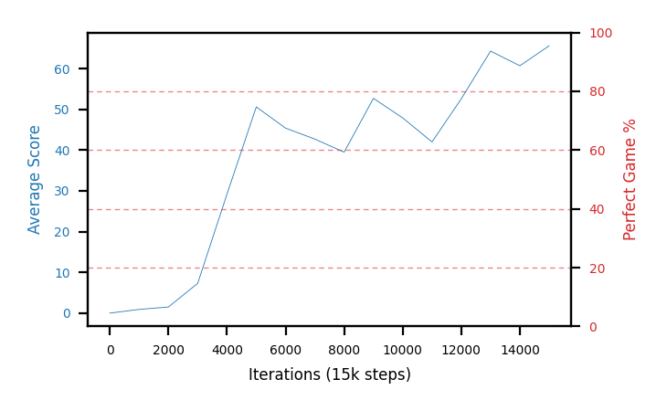
**b33b-c51win10seed2** — paired with `b32b`

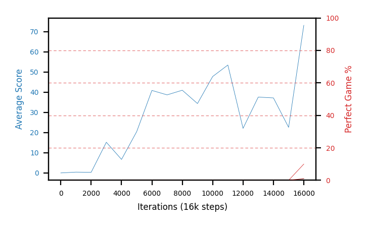
**b33c-c51win10seed3**


**b33d-c51win10seed4**

## Batch 32 — **Adam's `epsilon`** on C51, `lr 1e-4`, two reference values — *running on the laptop, 1M cap*

**Whether `epsilon` can separate C51's learning speed from its churn.** Adam steps by
`lr·m/(√v + ε)`, so `ε` is the gradient magnitude below which the update stops being scale-invariant —
above it a parameter moves ~`lr` per step whatever its gradient, below it a small gradient buys a small
step. We had been at Keras's default **1e-7**, where essentially everything is in the first regime, so a
coordinate carrying nothing but batch noise takes a full-size step. That matters far more for a 3×51 = 153
output categorical head than a 3-output scalar one, and the reference implementations do not use the
framework default. Full argument and the measurements behind it:
[`findings.md`](findings.md#-the-c51-arms-chaos-is-the-learning-rate-not-c51--and-the-rate-is-high-because-c51-needs-it).

| arms | `SNEK_ADAM_EPSILON` | source |
|---|---|---|
| `b32a`, `b32b` (seeds 1, 2) | **1.5e-4** | Dopamine's Rainbow config |
| `b32c`, `b32d` (seeds 1, 2) | **3.125e-4** | Dopamine's C51 config |
| *control, already on disk* | 1e-7 | `c51pilotB-lr1e4seed1/2`, same config, 600k |

`lr 1e-4` throughout, otherwise b25's config plus `ALGO=c51`. **The control is not in this wave** — the two
pilot arms at `lr 1e-4` ran it at the default, so seeds 1 and 2 are reused deliberately and the comparison
is paired at 600k with the extra 400k free. `lr 1e-4` rather than the pilot's chosen `5e-5` because that is
where the defect is largest while the rate still learns: churn **0.117-0.245** against the ddqn control's
0.033-0.058, never settling, yet seed 2 reached best-30 66.3 still rising at 599k.

**The readout is churn and drawdown depth, not `best_perfect30`** — within-rate seed spread at `1e-4` is
54.6 pp, so at n=2 per side the score resolves nothing. Measured with
[`perDiagnostics/c51_stability.py`](perDiagnostics/c51_stability.py) at `--end 600000`.

**Launched 23:14 on 2026-08-15. Status at 01:06 on 2026-08-16 — 370-403k of 1M, all four alive, no zero
stretch, and the readout is moving the right way.** Churn per 5k steps on a fixed 800-state set, paired
against each arm's own seed at `eps 1e-7`:

| `eps` | churn @200k | churn @360k | best-30 ≤364k | peak trailing |
|---|---|---|---|---|
| **1e-7** (control, `c51pilotB`) | 0.166 / 0.127 → **0.147** | 0.167 / 0.106 → **0.137** | 11.7 / 56.0 → 33.9 | 85.6 / 90.1 |
| **1.5e-4** (`b32a`/`b32b`) | 0.115 / 0.104 → **0.110** | 0.101 / 0.119 → **0.110** | 66.3 / 61.3 → **63.8** | **93.0 / 92.3** |
| **3.125e-4** (`b32c`/`b32d`) | 0.099 / 0.062 → **0.081** | 0.099 / 0.097 → **0.098** | 73.3 / **10.0** → 41.7 | 92.5 / 87.2 |
| *ddqn `b30e`/`b30f` — **`lr 1e-5`, not comparable*** | 0.042 / 0.056 | 0.035 / 0.058 | — | — |

**7 of 8 paired comparisons across two independent horizons churn less than their own control**, and the
group means are monotone in dose at both. **It did not cost learning speed** — the failure mode where
`epsilon` acts as a smaller learning rate in disguise — since both `1.5e-4` arms beat their controls on
best-30 *and* peak trailing, and the treated groups hold the two highest peaks here.

**Quote the paired figures only.** The ddqn row is there for scale and **is not a target**: it was measured
at `lr 1e-5` against these arms' `lr 1e-4`, so treating the distance to it as "how much is left to fix"
re-commits the rate-vs-algorithm confound this whole line of work started by correcting. No ddqn-at-`1e-4`
measurement exists.

**The confound to keep in view is reverse causation:** churn falls as a policy converges, and these arms are
also *better*, so "a better policy settles" would produce the same table. The evidence against it is
`b32d` — **lowest churn of all six arms (0.062) and the worst best-30 (10.0)**, epsilon still near the
exploration ceiling. Churn fell in an arm that did not learn better, which is what acting on the optimizer
rather than on performance looks like. Not settled at n=2; the 600k pairing is the one to judge on.

**Unchanged by this:** `aeff` is 28-33 of 51 atoms in every arm and boundary mass stays ~0. That is **not**
a defect — realised returns at γ=0.9975 have pooled **sd 24.89**, implying a calibrated net should read ~41
effective atoms, so ours are slightly *over*confident rather than never sharpening. The n-step candidate
that reading supported is [retracted](findings.md#-the-c51-arms-chaos-is-the-learning-rate-not-c51--and-the-rate-is-high-because-c51-needs-it).

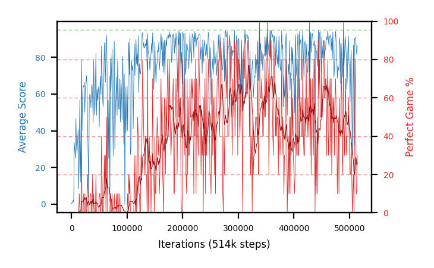
**b32a-c51eps15e4seed1** — `eps 1.5e-4`, seed 1

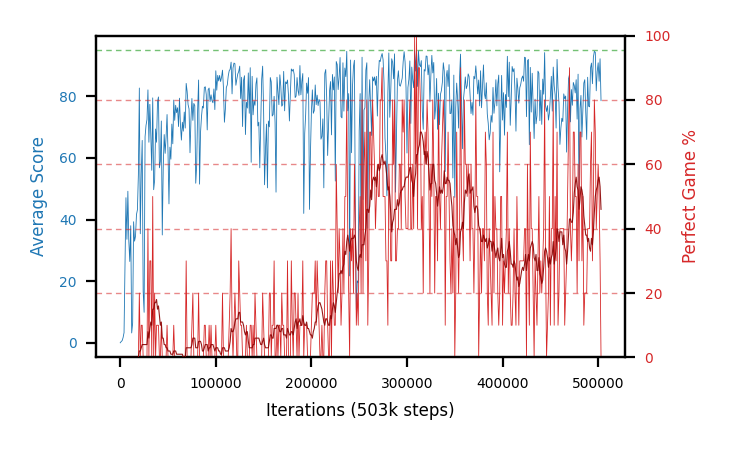
**b32b-c51eps15e4seed2** — `eps 1.5e-4`, seed 2

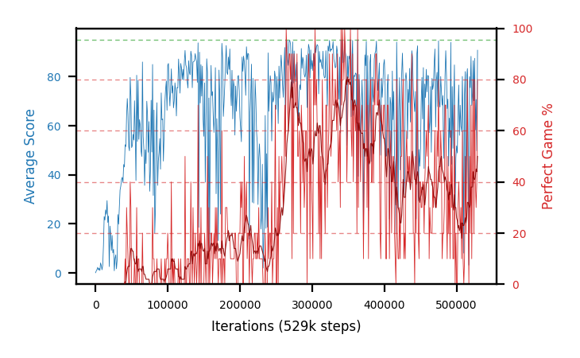
**b32c-c51eps3125e4seed1** — `eps 3.125e-4`, seed 1

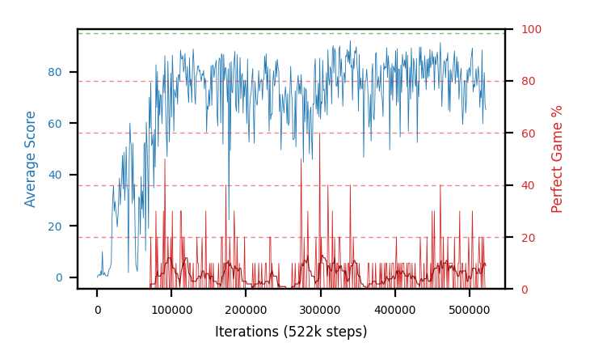
**b32d-c51eps3125e4seed2** — `eps 3.125e-4`, seed 2

## Batch 31 — **C51** at `lr 5e-5`, 2M — *stopped at 538-569k, no close-out*

**The first C51 batch, and void.** b25's config verbatim plus `ALGO=c51` (51 atoms over `[-5, 120]`, KL
priority) at the rate [`pick_c51_lr.py`](pick_c51_lr.py) chose from the pilot, seeds 1-4, 2M cap. Killed at
23:10 after `c51_stability.py` showed the chaos these curves show is the **learning rate, not C51** — which
made 2M at a rate chosen under the old reading not worth four slots. **No close-out was run**, by decision.

| arm | step | best-30 | `sef` | peak trail |
|---|---|---|---|---|
| `b31d-c51lr5e5seed4` | 569k | **71.7** | 16.5 | 92.86 |
| `b31a-c51lr5e5seed1` | 555k | 66.7 | 9.5 | **94.86** |
| `b31b-c51lr5e5seed2` | 538k | 53.3 | 1.7 | 92.26 |
| `b31c-c51lr5e5seed3` | 562k | 21.0 | 0.0 | 89.76 |

All four healthy at the kill (no zero stretch). The **50.7 pp best-30 spread at one config** is the n=4
noise problem restated, not a result — which is the other reason not to spend a close-out on it.

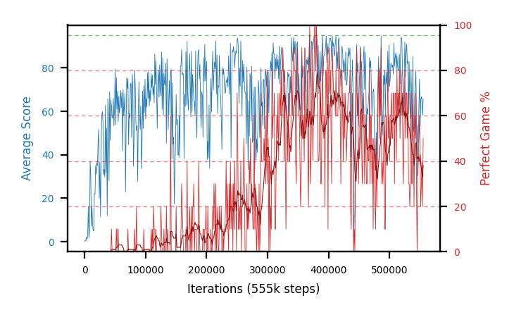
**b31a-c51lr5e5seed1**

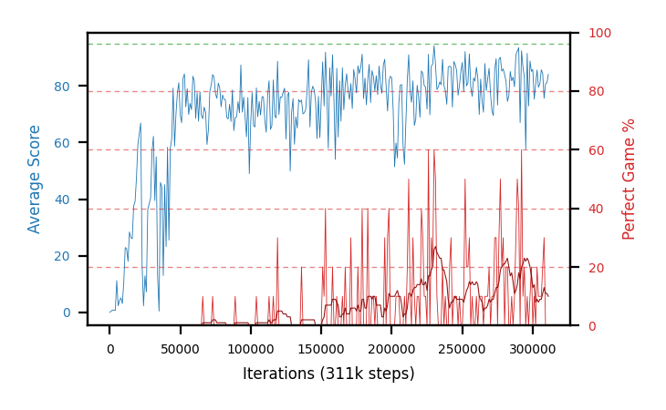
**b31b-c51lr5e5seed2**

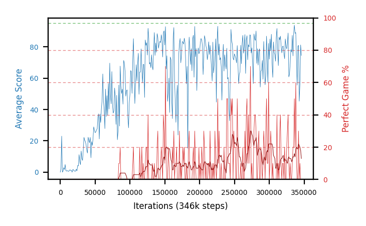
**b31c-c51lr5e5seed3**

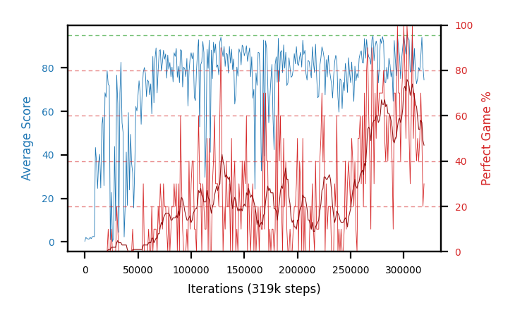
**b31d-c51lr5e5seed4**

## C51 pilot — distributional RL, learning-rate screen — *closed at 600k, chose `5e-5`*

**A seventh section on purpose, and temporary.** The cap of six counts numbered batches. This screen
became `b31`, which is now void — but its two `lr 1e-4` arms are **batch 32's control**, so the section
stays until b32 closes rather than being retired with b31.

**The table and the graphs below this paragraph are regenerated by
[`pick_c51_lr.py`](pick_c51_lr.py)** between the `C51-PILOT-STATUS` markers, so they are current as of
whenever it last ran, and the prose outside them is hand-written. **Editing inside the markers is
pointless** — the next run overwrites it.

The first C51 arms in this project, from
[`../plans/distributional-c51.md`](../plans/distributional-c51.md): the scalar head is replaced by a
distribution over the return on **51 atoms over `[-5, 120]`** trained by cross-entropy, with the PER
priority as the KL. Everything else is **b25's config verbatim** — `fc 200,100,100`, IS off, target 1000,
discount 0.9975, `FORK_BRANCHES=4`, no food-distance shaping — so `b25a-d` is the seed-matched control
when this becomes a batch.

**Closed 2026-08-15 at 20:09, and `5e-5` was chosen for `b31` on consistency rather than on being
best.** The two readings worth carrying: at n=2 the **between-seed spread (up to 57.6 pp) is twice the
spread between the rate means (30.5 pp)**, so the ranking is thin; and **time to the first perfect game
predicted nothing** about where an arm finished (Spearman ρ = 0.05 — the 8k starter finished at 11.7, the
141k starter at 85.3). `2.5e-4` is the one clear failure, with one arm collapsing to zero at 599k. Three
arms had not stopped improving at the cap, so for `1e-5` and `1e-4` the **600k horizon** may be what bound
them rather than the rate. Full account:
[`findings.md`](findings.md#-the-c51-learning-rate-screen-the-seed-spread-beat-the-rate-effect-and-time-to-first-win-predicted-nothing).

**It is a learning-rate screen, not a result.** A cross-entropy loss starts at `ln 51 ≈ 3.93` where the
Huber TD loss starts near 0, so b25's `1e-5` is not obviously the same step size for a categorical head.
**Four rates × two seeds, seed-matched across the rates**, launched as two waves an hour and a half apart:
`1e-5` and `5e-5` at 15:06 (`c51pilot-`), then `1e-4` and `2.5e-4` at 16:41 (`c51pilotB-`) — so wave B is
several hundred thousand steps behind and the horizon line in the generated block is what makes the
comparison fair. Eight trainers on a 14-core laptop is deliberate and was measured first: ~2.3 GB per arm
against 36 GB, and a swap-in rate of 244 pages per 20 s, so the cost is throughput and not paging.

<!-- C51-PILOT-STATUS:BEGIN -->
*Generated by `pick_c51_lr.py` at 2026-08-15 20:09, when the last pilot arm stopped — the numbers below are read straight off the eval series, and the prose around this block is hand-written.*

**Compared at a common horizon of 600k steps**, the lowest final step any arm reached, because both metrics accumulate over an arm's own evals and a longer arm would otherwise win on horizon alone.

| lr | seeds | mean best-30 | mean `sef` | mean peak trail |
|---|---|---|---|---|
| 5e-05 **← chosen** | 2 | 69.5 | 12.6 | 92.42 |
| 1e-05 | 2 | 56.5 | 3.6 | 89.89 |
| 0.0001 | 2 | 39.0 | 5.3 | 88.19 |
| 0.00025 | 2 | 4.0 | 0.0 | 68.79 |

| arm | lr | seed | step | best-30 | `sef` | peak trail | first perfect |
|---|---|---|---|---|---|---|---|
| `c51pilot-lr1e5seed1` | 1e-05 | 1 | 600k | 85.3 | 7.3 | 93.56 | 141k |
| `c51pilot-lr5e5seed2` | 5e-05 | 2 | 600k | 71.7 | 13.0 | 93.30 | 20k |
| `c51pilot-lr5e5seed1` | 5e-05 | 1 | 600k | 67.3 | 12.1 | 91.54 | 15k |
| `c51pilotB-lr1e4seed2` | 0.0001 | 2 | 600k | 66.3 | 10.6 | 90.80 | 46k |
| `c51pilot-lr1e5seed2` | 1e-05 | 2 | 600k | 27.7 | 0.0 | 86.22 | 92k |
| `c51pilotB-lr1e4seed1` | 0.0001 | 1 | 600k | 11.7 | 0.0 | 85.58 | 8k |
| `c51pilotB-lr25e4seed1` | 0.00025 | 1 | 600k | 5.7 | 0.0 | 70.82 | 49k |
| `c51pilotB-lr25e4seed2` | 0.00025 | 2 | 600k | 2.3 | 0.0 | 66.76 | 59k |

**Chosen: `5e-05`** — best_perfect30 69.5 against 56.5 for the next rate (1e-05).

**Batch `b31` launched at 2026-08-15 20:09** on this rate, 4 seeds, 2M cap, `fc 200,100,100`, otherwise b25's config — so `b25a-d` is the seed-matched control.

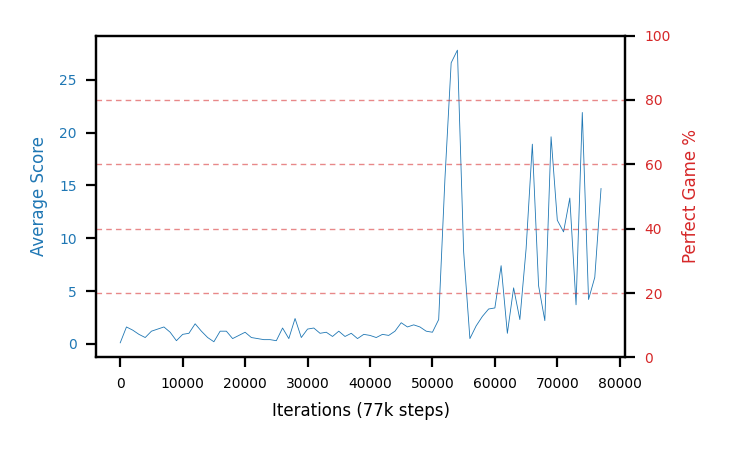
**c51pilot-lr1e5seed1** — lr 1e-05, best-30 85.3, first perfect 141k

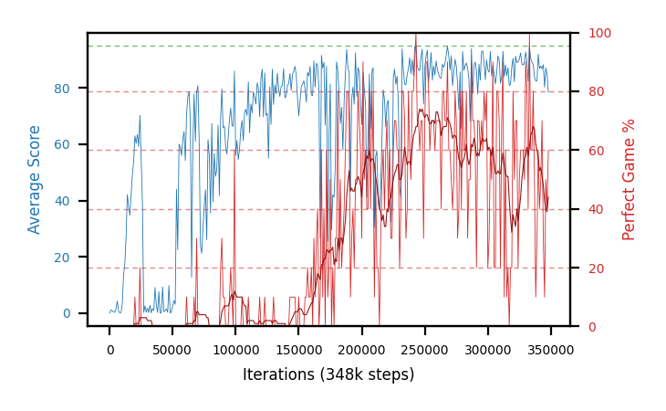
**c51pilot-lr5e5seed2** — lr 5e-05, best-30 71.7, first perfect 20k

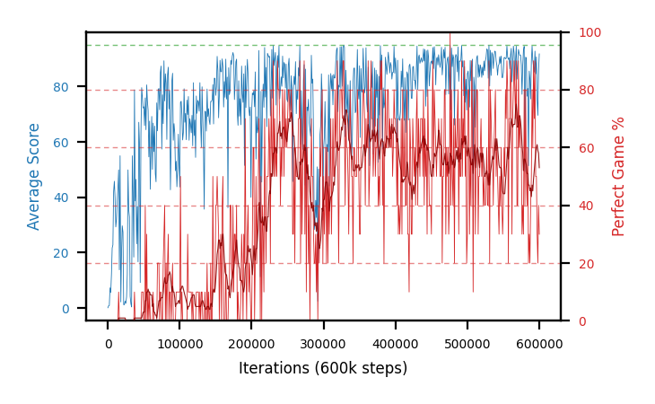
**c51pilot-lr5e5seed1** — lr 5e-05, best-30 67.3, first perfect 15k

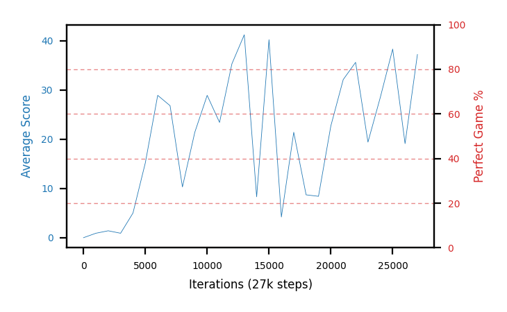
**c51pilotB-lr1e4seed2** — lr 0.0001, best-30 66.3, first perfect 46k


**c51pilot-lr1e5seed2** — lr 1e-05, best-30 27.7, first perfect 92k


**c51pilotB-lr1e4seed1** — lr 0.0001, best-30 11.7, first perfect 8k

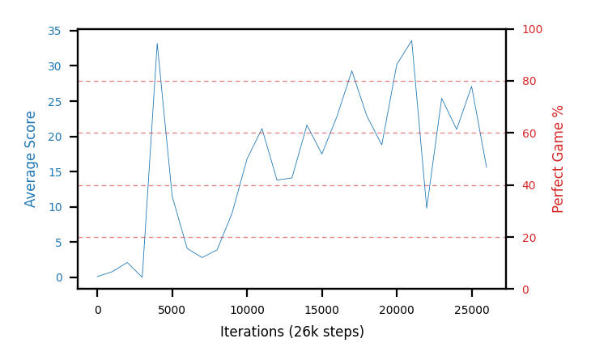
**c51pilotB-lr25e4seed1** — lr 0.00025, best-30 5.7, first perfect 49k

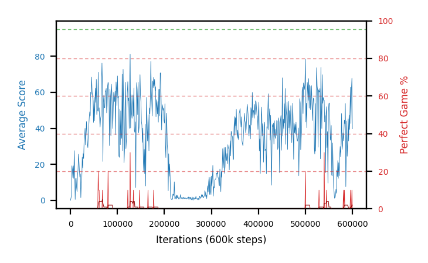
**c51pilotB-lr25e4seed2** — lr 0.00025, best-30 2.3, first perfect 59k
<!-- C51-PILOT-STATUS:END -->

## Batch 28 — chase-safe shaping at **`c=0.20`**, gate 85 (b24 config) — *b28a-d running on the desktop*

The dose rung above b27. Identical to it — `fc 320`, gate 85, IS off, `td_error`, target 1000, discount
0.9975, `FORK_BRANCHES=4`, 2M cap, seeds 1-4, the same `b24a-d` control — with the shaping coefficient
**doubled to `c=0.20`**. Its job is the one ambiguity a single dose cannot resolve: **b27 came back null**
(below — pooled 85.2 vs the control's 87.9, and **0 of 4** record-tier checkpoints against the control's
two), so b28 separates *"chase-safe is the wrong idea"* from *"`c=0.10` was too small to see."*

**Status at 08:46 on 2026-08-15: 262-275k of 2M (~13%), all four healthy** — epsilons off the 0.0125
ceiling (0.003-0.005), no dead or zero stretch, peak trailing ~93.7. **A dead heat with the control this
early, exactly like b27 was**: at the matched ≤275k horizon mean best-30 **56.9 vs 57.4 (−0.5), 2 of 4
seeds ahead**, `sef` ~3 for both (near zero this early). Nothing to read yet — best-30 at 13% of the cap
measures *when* an arm started winning, not the endgame consolidation this batch is about. Shaped first,
control in parentheses:

| arm | step | best-30 (control) | `sef` (control) |
|---|---|---|---|
| `b28b-chase20g85seed2` | 275k | **65.3** (`b24b` 58.3, +7.0) | 5.4 (2.2) |
| `b28d-chase20g85seed4` | 269k | 63.3 (`b24d` 73.7, −10.4) | 6.7 (13.8) |
| `b28c-chase20g85seed3` | 274k | 53.3 (`b24c` 58.7, −5.4) | 0.0 (1.8) |
| `b28a-chase20g85seed1` | 262k | 45.7 (`b24a` 39.0, +6.7) | 0.4 (0.0) |

**The verdict is the 2M close-out's ≥98%/500 count, read against b24's two records — not best-30 at 275k.**
`b29` (gate 75) is queued behind these four.


**b28a-chase20g85seed1**


**b28b-chase20g85seed2**


**b28c-chase20g85seed3**


**b28d-chase20g85seed4**

## Batch 30 — the same shaping on `fc 200,100,100`, `c=0.10`, gate 85 — *done: close-out + HOF-500 null (laptop)*

b27's config with one change, the net: **`200,100,100`** instead of `320`. Everything else is identical —
`c=0.10`, gate 85, IS off, `td_error`, target 1000, discount 0.9975, `FORK_BRANCHES=4`, no food-distance
shaping, **2M cap**, seeds 1-4. Together with b24/b25/b27 it makes a **2×2 of shaping × architecture**, so
the shaping result stops depending on one net.

**Done at the 2M cap on the laptop, all four — and the early edge washed out.** At ~0.95M this wave read
`sef` **+6.9, 4 of 4 ahead** of its b25 control; **carried to the full 2M cap the lead is gone.** Matched
at ≤2M, mean best-30 **92.9 vs 93.6 (−0.7)** and mean `sef` **56.9 vs 58.6 (−1.7)** — a dead heat, if
anything a shade behind, and now pointing the *same* way as b27. The +6.9 was the ~10 pp `n=4` noise
resolving as the control caught up, not a shaping effect. All four healthy throughout (peak trailing ~95,
no dead or zero stretch), so the potential-based term is not destabilizing — it just is not helping. Final
training numbers, shaped first, b25-r2 control at the matched ≤2M horizon in parentheses:

| arm | seed | best-30 (control) | `sef` (control) | peak trail |
|---|---|---|---|---|
| `b30e-chase10fc200x100x100seed1` | 1 | 93.7 (`b25a` 93.7, +0.0) | 58.4 (61.4, −3.0) | 95.00 |
| `b30g-chase10fc200x100x100seed3` | 3 | 93.3 (`b25c` 93.7, −0.4) | 58.3 (61.0, −2.7) | 95.00 |
| `b30f-chase10fc200x100x100seed2` | 2 | 92.3 (`b25b` 95.3, −3.0) | 55.9 (57.9, −2.0) | 94.92 |
| `b30h-chase10fc200x100x100seed4` | 4 | 92.3 (`b25d` 91.7, +0.6) | 55.0 (54.2, +0.8) | 95.00 |
| **mean** | | **92.9 (93.6, −0.7)** | **56.9 (58.6, −1.7)** | — |

**Close-out landed 15:05 on 2026-08-15 — all four `complete`, and it points the same way as the training
numbers: below the control.** A first pass (4 parallel `top20`, gate 95) was killed ~13:29 with all four
`complete=false`; the relaunch with `EVAL_RESUME=1` reused every banked measurement (~75k episodes across
the four) and finished the remainder.

| arm | pooled (equal-effort, gate 95) | full-length rows | ≥98%/100 | best full-length row |
|---|---|---|---|---|
| `b30f-chase10fc200x100x100seed2` | **84.32** | 22 | 1 | 98.0% @643k |
| `b30g-chase10fc200x100x100seed3` | 84.28 | 39 | 3 | **99.0% @738k** |
| `b30e-chase10fc200x100x100seed1` | 83.75 | 28 | **6** | **99.0% @641k** |
| `b30h-chase10fc200x100x100seed4` | 81.00 | 10 | 0 | 97.0% @614k |
| **mean** | **83.34** | | **10 total** | |

**83.3 against b25-r2's ~86.1** on the same equal-effort figure — the shaped wave is ~2.8 behind its
seed-matched control on `fc 200,100,100`, which is the *same direction and about the same size* as b27's
85.2 vs 87.9 on `fc 320`. Two architectures, two nulls-or-worse.

**HOF-500 re-measure (gate 98, flat, laptop, 15:33 on 2026-08-15): 0 of the 10 close-out checkpoints
clear ≥98%/500.** Every `99%/100` and `98%/100` row deflated below the gate at 500 episodes — b30e best
**96.1%** @651k, b30g **95.3%** @709k, b30f **90.9%** @643k, all abandoned — the selection-inflation this
project documents (`100`-episode tops read high because they are the arm's best). Its seed-matched control
**`b25`-r2 is also 0** (25 checkpoints, best 97.2%), so on `fc 200,100,100` shaped and unshaped are a
**dead heat at zero records**.

**That completes the shaping×architecture 2×2 on the decisive metric.** On `fc 320` the control (`b24`)
held **two** records and the shaped arm (`b27`) **none**; on `fc 200,100,100` neither reaches one.
Chase-safe shaping produces no record-tier checkpoint on either net and removes the control's records on
the wider one — **null-to-negative, confirmed on two architectures.**


**b30e-chase10fc200x100x100seed1**


**b30f-chase10fc200x100x100seed2** — the first red mark of the relaunch, at step 6k.


**b30g-chase10fc200x100x100seed3**


**b30h-chase10fc200x100x100seed4**

**`b30a-d` are the same config killed at 137-139k** and are captioned here only so the completeness check
above stops reporting them. They ran while `perfect_percent` read 0 for every eval — the reward-identified
perfect game, [`findings.md`](findings.md#-a-perfect-game-was-identified-by-its-final-reward-and-the-shaping-term-silenced-every-counter)
— so their curves are mismeasured *and* their epsilon was pinned at the 0.0125 ceiling, which makes them
unusable as arms rather than merely short. `savedPolicies/b30[a-d]` is gone; `runs/b30a-d*` is kept
deliberately, so `refresh_charts.sh` keeps copying these four PNGs. Nothing should be read off them.


## Batch 27 — potential-based chase-safe shaping, `c=0.10`, gate 85 (b24 config) — *done, close-out null*

The first arms to carry the new shaping term. `Snake.step` adds `c·(γΦ(s′) − Φ(s))` with **Φ = 1 iff the
head and tail share a free region that also holds the food, and the snake is ≥85 long**; potential-based,
so the optimal policy is untouched and only the gradient on the way there changes. Everything else is
b24's config — `fc 320`, IS off, `td_error`, target period 1000, discount 0.9975, `FORK_BRANCHES=4`,
seeds 1-4 — which makes **`b24a-d` the seed-matched control**. Cap **2M** (b24 ran 3M; its record
checkpoints land at 1.03-1.39M). Design and the Phase 0 calibration of `c`:
[the plan](../plans/chase-safe-reward-shaping.md) and [`runs.md`](runs.md).

**Done at the 2M cap, closed out on the desktop — and it is a null.** The close-out pools **85.6 / 84.2 /
83.2 / 88.0** (eq-effort, gate 95), **mean 85.2**, against the b24 control's **~87.9** — a shade *below*, not
above. And on the metric that matters, **no b27 seed produced a ≥98%/500 checkpoint**: the auto-chained
HOF-500 re-measure (gate 98, 500 episodes) found `b27e` empty, `b27f` a single 92.6% partial, `b27g` best
96.6%, `b27h` best **97.5%** (435 ep) — all short of the bar the control cleared **twice** (`b24b`, `b24d`
both 98.0%/500, the record). So `c=0.10` chase-safe shaping on `fc 320` did not reproduce the record, let
alone beat it. All four healthy throughout (trailing 93.6-94.1, no dead or zero stretch), so the term is
not destabilizing — it simply bought nothing. Close-out and HOF-500, shaped first, b24 control in
parentheses:

| arm | close-out pooled (control) | HOF-500 best (≥98% held) |
|---|---|---|
| `b27h-chase10g85seed4` | **88.0** (`b24d` 85.97) | 97.5% @1945k, 435 ep — **0 held** |
| `b27e-chase10g85seed1` | 85.6 (`b24a` 89.03) | none reached the gate |
| `b27f-chase10g85seed2` | 84.2 (`b24b` 88.84) | 92.6% @1431k (partial) — 0 held |
| `b27g-chase10g85seed3` | 83.2 (`b24c` ~87.8) | 96.6% @1975k — 0 held |
| **mean** | **85.2 (≈87.9)** | **0 of 4 ≥98%/500 (control: 2 of 4)** |

Read together with b30 (same `c=0.10`, other net, also a dead-heat-to-slightly-behind after the early edge
washed out), **both architectures agree that `c=0.10` chase-safe shaping does not help.** Whether that is
the idea or the dose is exactly what **b28** (`c=0.20`, above) is running to answer; **b29** (gate 75) is
queued behind it.


**b27e-chase10g85seed1**


**b27f-chase10g85seed2**


**b27g-chase10g85seed3**


**b27h-chase10g85seed4** — first filled board at step 8k, and the first arm whose epsilon left the 0.0125
ceiling.
