# Charts

Progress graphs for the most recent batches — **41, 42, 43, 44, 45 and 46**, a cap of six, newest first.
**Batch 40 was retired to [`archive/charts-archive.md`](archive/charts-archive.md) on 2026-08-27**, when batch 41's late write-up made seven. `b41` is out of launch order here on purpose: it is the `b29` control the b42-b45 ladder and `b47` both read against, so it sits with them rather than in the archive.
Per-arm numbers live in [`completedRuns.md`](completedRuns.md); this file is images plus a short reading of
each. A batch appears here **while it is still running**, with training-only numbers, not just once it has
closed. Batch 27 was retired to [`archive/charts-archive.md`](archive/charts-archive.md) when 36 launched,
**batch 30** followed when 34's results arrived, **batch 31** (a void, stopped C51 arm) when 35's arrived,
**batch 33** when 38 launched, **batch 32** when 39 did, **batches 34 and 35** when 37's and 40's results
landed, and **the C51 pilot plus batch 38** when 42/43 launched, and **batch 39** when 42 got its section, **batch 36** when 44 got its, **batches 28-29** when 45 got its, and **batch 37** when 46 got its. 36 was being held only as the named control for 39, and 39 is now archived itself. 39 went ahead of the strict-oldest 28-29 for the same reason 28-29 has been held four times now: it is the source of three of the four checkpoints 42/43/44 continue, and it is what they are read against. 39 bears on none of that.

**`b40`, `b42`, `b43`, `b44` and `b45` are fully closed** — training, close-out *and* HOF-500. `b45` was
measured **twice**, by both engines, and they agree. **`b46` is the only live batch** — 16 arms at n=4, run as four
waves of one config each; wave 1 (`b46a`, batch 512) is on the desktop now. A continuation batch's HOF pass is **slow by nature, not stuck** —
see [the cost warning](#-a-continuation-batchs-close-out-costs-10-20x-a-normal-ones) in batch 44's section.
**`b42` was stopped early** at +385-421k, once its answer had resolved on 4 of 4 seeds. The gate ladder's two
null rungs (34, 70 and 35, 40) were retired earlier, since the ladder's conclusion is now carried by 28-29, 37
and 40 — the batches that bear on whether gate 75's record region was real.

**`b37` and `b39` are not a numbering slip:** `b37` was queued from the desktop the same evening `b38` was
launched from the laptop, so the two hosts took adjacent numbers out of order. **`b41` now has a section**
(added 2026-08-27) — it is the b29 same-seed determinism probe, and it finished around 2026-08-18 but went
unanalysed for nine days.

**Batch 42 and 43 arms do not start at step 0**, so their curves begin mid-chart at the step of the checkpoint
each one continues. There is no resume line at the left edge because the graph history was deliberately not
carried over: these are fresh policy dirs seeded from one checkpoint, not resumes of the source arm.

**Older sections are retired, not deleted.** Batches 1-11 are in
[`archive/batches1-11.md`](archive/batches1-11.md) and anything retired since is in
[`archive/charts-archive.md`](archive/charts-archive.md). **The PNGs are all still in `charts/`**, so
an archived caption still renders. See
[when an arm is stopped](hyperparamTuning.md#when-you-stop-a-batch-of-arms) for the procedure.

In every chart: **blue is average score** (food eaten, out of 95) on the left axis, **red is
perfect-game percentage** on the right. Grey dashed vertical lines mark resumes; faint red dashed
horizontals mark 20/40/60/80% on the right axis, because the perfect rate is the objective and
was unreadable against left-axis ticks.

**Newest batch first.** Within a batch, best result first.

## These are snapshots, on purpose

The images are **copies** from `snek2/runs/`, not links. The live graphs there are rewritten every
eval and would be lost if that directory were cleaned out, silently blanking this file. Refresh with
`scripts/refresh_charts.sh`, which re-copies every `runs/*.png` into `charts/` and prints each one's step.

**The script does not touch this file** — it copies images only, so a new arm gets a PNG and no
entry unless one is written by hand. That drifted once, to 12 undocumented arms across batches 5-7,
because a successful `refresh_charts.sh` looked like the charts were handled. Check this file **and both
archives**, since captions now live in three places — `archive/charts-archive.md` was missing from this
snippet until 2026-08-08, which would have reported every retired arm as undocumented:

```
cd snek2/hyperparamTuning
ls charts/*.png | sed 's|.*/||;s|\.png||' | sort > /tmp/have
grep -ho 'charts/[a-zA-Z0-9-]*\.png' charts.md archive/batches1-11.md archive/charts-archive.md \
  | sed 's|.*charts/||;s|\.png||' | sort -u > /tmp/doc
comm -23 /tmp/have /tmp/doc   # anything listed is an undocumented arm
```

**Six PNGs in `charts/` are not arm charts and will always appear in that list** —
`champion-vs-mediocre`, `drawdown-b23b-vs-b18`, `per-b18-vs-b20-priorities`, `plasticity-metrics`,
`best30-drivers` and `gate-behavior-b27-vs-b29` are diagnostic figures referenced from
[`findings.md`](findings.md) and [`perDiagnostics/`](perDiagnostics/README.md), not training graphs.
Anything *else* the check prints is a real gap.

## Batch 46 — **four c51 knobs, each at n=4** — *running on the desktop, one config per wave, launched 2026-08-25*

**Waves 1, 2 and 3 are complete, closed out, and all three are null-to-worse; wave 4 is ~17% in**
(2026-08-27). Waves 1-3's charts came off the `results` branch, wave 4's by `rsync`, since `results`
only publishes when a job *finishes*.

**‡ Three of the four knobs are now closed and none of them moved anything**, which takes most of the
weight out of the "c51's shortfall is variance in the loss" hypothesis the batch was built on.

| wave | arms | the one change from `b38` |
|---|---|---|
| 1 | `b46a-c51batch512seed1..4` | `BATCH_SIZE` 128 → **512** |
| 2 | `b46b-c51softtgtseed1..4` | `TARGET_UPDATE_TAU=0.005`, `PERIOD=1` (soft, not a hard copy every 1000) |
| 3 | `b46c-c51atoms21seed1..4` | `NUM_ATOMS` 51 → **21** |
| 4 | `b46d-c51atoms201seed1..4` | `NUM_ATOMS` 51 → **201** |

16 arms, 3M steps, everything else `b38`'s config verbatim, **each arm paired against the b38 arm of
its own seed**. Design rationale, the pre-registered readings and the confound in wave 2 are in
[`runs.md`](runs.md#batch-46--four-c51-knobs-each-at-n4--running-on-the-desktop-launched-2026-08-25).

**Read these charts against b38's, not against each other's absolute height.** b38's four arms pooled
78.51 / 71.79 / 72.53 / 72.66 — a **6.7 pp** seed spread — so the comparison that carries information
is per-seed and paired, then a sign test across the four. Churn
([`perDiagnostics/c51_stability.py`](perDiagnostics/c51_stability.py)) is the primary signal; even n=4
cannot resolve an effect below ~10 pp on score alone.

**‡ Three graph eras run through this one batch, and the bias does NOT cancel within b46.** That was
the claim here until 2026-08-27 and it is wrong: the 100-episode self-eval landed mid-batch, so the
sixteen arms do not share a footing. Measured off the granularity of their own `perfect_percent` values
(gcd 10 → 10 episodes, 5 → 20, 1 → 100):

| arms | episodes | how it reads |
|---|---:|---|
| `b38` (control) | **10** | values in steps of 10 |
| `b46a` | **20** | steps of 5 throughout |
| `b46b` | **20 → 100 at 821-904k** | steps of 5, then 1 — **~71% of each arm is at 100** |
| `b46c`, `b46d` | **100** | steps of 1 throughout |

**So every cross-wave comparison in this section is corrected, and two of the corrections point in
opposite directions.** `sef` is a threshold-crossing fraction, so more episodes means *fewer* crossings
and the newer wave looks **worse** than it is — corrected onto a common 10-episode footing with
[`perDiagnostics/sef_common_footing.py`](perDiagnostics/sef_common_footing.py). Close-out **pooled**
moves the other way: the selection thresholds are absolute percentages of a sample, so at 100 episodes
they admit only the very best checkpoints, a thinner and better pool reads **higher**, and the newer
wave looks **better** than it is. Banded mean perfect rate is the only column that needs no correction.

And the close-out runs on the **vec** engine, flat and ungated (`min_achievable: null`), where b38's
rows were gated at 95.

### ✅ Wave 1 complete — **`BATCH_SIZE=512` is a null-to-worse at 4 seeds, for 4x the compute**

Full 3M on all four arms, 3,001 evals a side, paired against each seed's own `b38` arm. `sef` is on a
common 10-episode footing via
[`perDiagnostics/sef_common_footing.py`](perDiagnostics/sef_common_footing.py).

| seed | mean pp `b46a`/`b38` | Δ | `sef` corrected | `b38` `sef` | Δ | `best30` Δ | trailing Δ |
|---|---|---|---|---|---|---|---|
| 1 | 56.2 / 60.4 | −4.2 | 20.9% | 31.0% | **−10.1** | −3.1 | −0.3 |
| 2 | 47.6 / 51.0 | −3.4 | 12.8% | 15.5% | −2.7 | −5.3 | **+11.1** |
| 3 | 55.5 / 53.9 | **+1.6** | 19.6% | 18.6% | **+1.0** | **+9.5** | −0.8 |
| 4 | 50.5 / 54.4 | −3.9 | 13.3% | 22.2% | −8.9 | −5.1 | +0.1 |
| **mean** | **52.5 / 54.9** | **−2.5** | **19.1%** | **21.8%** | **−5.2** | −1.0 | +2.5 |
| | | *1 of 4* | | | *1 of 4* | *1 of 4* | *2 of 4* |

**Three of four seeds behind on both the unbiased and the primary metric, and the exception is the
same seed on both.** Banded mean perfect rate −2.5 pp, corrected `sef` −5.2 pp, `best_perfect30` −1.0,
each at 1 of 4. Only trailing *score* favours `b46a` (+2.5, 2 of 4), and that metric saturates at 95 so
it is the least informative of the set. Seed 3 is the one arm ahead, on all three.

**This is the batch's most informative null, and it is a clear cost.** Batch size changes how many
*replayed* transitions a gradient step consumes, not how many *environment* transitions are collected,
so both sides had equal environment interaction across the whole 3M and `b46a` spent **~4x the
backward-pass compute** to finish slightly behind. Wave 1 was pre-registered as the largest single lever
on the "c51's shortfall is variance in the loss" hypothesis — so a null here takes most of that
hypothesis's weight with it, and there is no case for a 1024 rung.

**Half of the apparent deficit was measurement, and that part generalises.** The raw `sef` comparison
reads **−12.0 pp**; the correction moves it to **−5.2** without changing the conclusion. `sef` counts
evals at ≥80% perfect, so it rewards noise, and b38's 10-episode evals cross that line far more often at
equal quality. **Any cross-boundary `sef` figure that has not been put on a common footing is roughly
double its true size.**

**Its close-out has not run yet** — the auto one failed on a `sys.path` bug and was re-queued by hand;
see [`runs.md`](runs.md#what-is-running). So everything above is training self-eval, and the
100-episode instrument could still move it, though not plausibly reverse a −5 pp.

### b46a-c51batch512seed3 — the one arm ahead, on every metric that matters

Mean pp **55.5** against 53.9, corrected `sef` **19.6%** against 18.6%, `best30` **89.5** against 80.0 —
the only arm of the four ahead of its control, and ahead on all three. Its `b38` twin was the batch's
lowest `best30` (80.0), so part of this is a weak control.

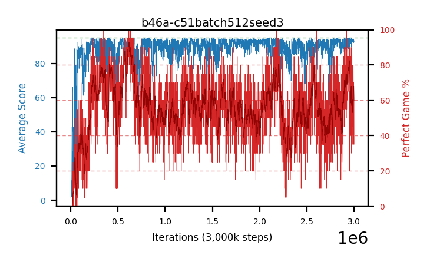

### b46a-c51batch512seed1 — the widest deficit, against the strongest control

Mean pp **56.2** against **60.4** and corrected `sef` **20.9%** against **31.0%**. It is the highest
absolute mean pp in the wave and still the biggest loss, because `b38a` is the best c51 arm this project
has trained — the only one of its batch whose best checkpoint arrived late (2355k) and whose pooled
figure rose past 2M. Its recent-30 fell to **45.0** against b38a's 66.7.


### b46a-c51batch512seed4 — the early lead that reversed

Mean pp **50.5** against 54.4, corrected `sef` **13.3%** against 22.2%. **At 185k this arm led by +10.3
pp**, the wave's only clear gain at the time; it finished −3.9. Worth remembering the next time a 6%
reading looks like a result.


### b46a-c51batch512seed2 — level on the curve, and the one place batch 512 helped stability

Mean pp **47.6** against 51.0 (the lowest pair on both sides) but trailing score **85.7** against
`b38b`'s **74.6** — a +11.1 gap, the widest in the wave. `b38b` was the arm whose trailing fell
81.2 → 74.6 over its last 700k, and this arm did not do that. **The one hint in the wave that a bigger
batch buys stability**, on the seed selected for exactly that defect — but it comes with mean pp and
`sef` both behind, so it did not convert into perfect games.

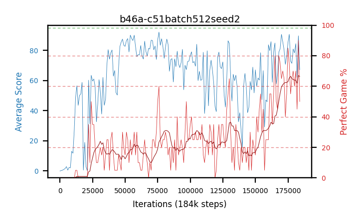

### ✅ Wave 2 complete — **the soft target is a null-to-worse too: −1.7 pp mean perfect, 2 of 4**

`TARGET_UPDATE_TAU=0.005`, `PERIOD=1`, full 3M on all four arms. **The +11.2 pp early lead was the
slow-starter trap and it closed exactly as predicted** — at 16% seed 4 led its control by +38.3 pp
because `b38d` sat at 17.3 there and finished at 54.4.

Paired against each seed's own `b38` arm. `sef` is on a common **10-episode** footing, which here needs
a per-row correction rather than a per-arm one — see the boundary note below.

| seed | `b46b` meanPP | `b38` meanPP | Δ meanPP | `b46b` sef@10 | `b38` sef@10 | Δ sef |
|---|---:|---:|---:|---:|---:|---:|
| 1 | 51.4 | **60.4** | **−9.0** | 14.7 | 31.0 | −16.3 |
| 2 | 52.6 | 51.0 | +1.6 | 16.3 | 15.5 | +0.9 |
| 3 | 54.8 | 53.9 | +0.9 | 18.0 | 18.6 | −0.6 |
| 4 | 54.0 | 54.4 | −0.4 | 17.4 | 22.2 | −4.9 |
| **mean** | 53.2 | 54.9 | **−1.7** | 16.6 | 21.8 | **−5.2** |
| **seeds ahead** | | | **2 of 4** | | | **1 of 4** |

**The raw `sef` here would have been −15.8 and it would have been nonsense.** These arms' last ~2.15M
steps are 100-episode evals against `b38`'s 10, and `sef` is a threshold-crossing fraction, so the
uncorrected gap is mostly estimator noise. The correction is per row, using each row's own era: the
switch step is detectable because a 20-episode reading is always a multiple of 5, and the first
non-multiple lands at **821k / 904k / 856k / 845k** — matching each arm's own resume line exactly.

**As with wave 1, seed 1 carries the deficit against the strongest control.** `b38a` is the best of the
four controls at 60.4 mean pp against 51.0-54.4; both treatments lose most against it. Two arms of four
is the batch's own noise floor.

**‡ These four curves cross a measurement boundary mid-run, and the close-out could not see past it.**
The arms were restarted at 821-904k onto the vec self-eval at 100 episodes, so each curve gets visibly
*smoother* partway along without getting better. The consequence is not cosmetic:
`select_top_checkpoints` reads the graph, and **172 of 175 selected checkpoints came from before the
switch** — seed 2's selection tops out at step 883k on an arm that ran to 3M. So **wave 2's close-out
measures its arms' first ~28% and essentially nothing after.** Cause and size in
[`findings.md`](findings.md#-a-selection-threshold-is-a-statement-about-an-estimator-not-a-quality-2026-08-27).

**Part of that is real decline, not artifact**, and the two separate cleanly because a mean rate is
unbiased across episode counts: post-switch mean pp fell **−4.2 / −10.1 / −0.7 / −7.3** (mean **−5.6**)
against wave 1's **+0.2** over the same step range. So these arms did get worse late; the threshold
merely made it impossible to see how much.

**Close-out (vec, 100 episodes, flat/ungated) — reported, but not comparable with wave 1's:**

| arm | rows | pooled % | best % | best step | rows ≥98% |
|---|---:|---:|---:|---:|---:|
| `b46b-c51softtgtseed1` | 44 | 80.59 | 94.0 | 321k | 0 |
| `b46b-c51softtgtseed2` | 50 | **87.10** | **97.0** | 198k | 0 |
| `b46b-c51softtgtseed3` | 35 | 78.86 | 92.0 | 103k | 0 |
| `b46b-c51softtgtseed4` | 46 | 81.74 | 92.0 | 477k | 0 |
| **batch** | 175 | **82.41** | | | **0** |

Wave 1 pooled 80.77% over 18,700 episodes against this 82.41% over 17,500 — **do not read that +1.6 as
soft target winning.** Wave 1's selection spans 191k-2.96M while wave 2's is concentrated below 900k,
and these arms decline with training, so the selection era alone favours wave 2. The graph's mean
perfect rate is the only unbiased comparison available for this batch, and it says **−1.7**.

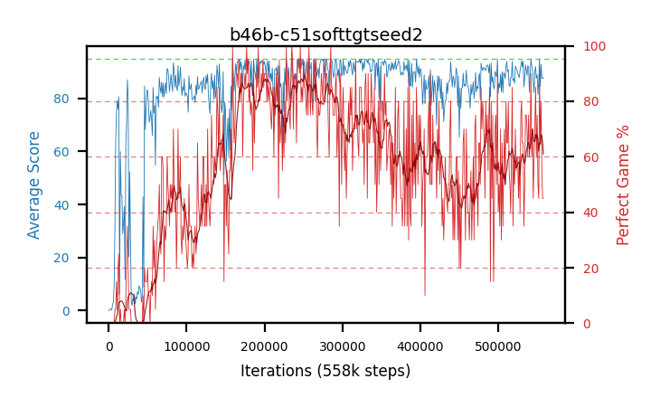
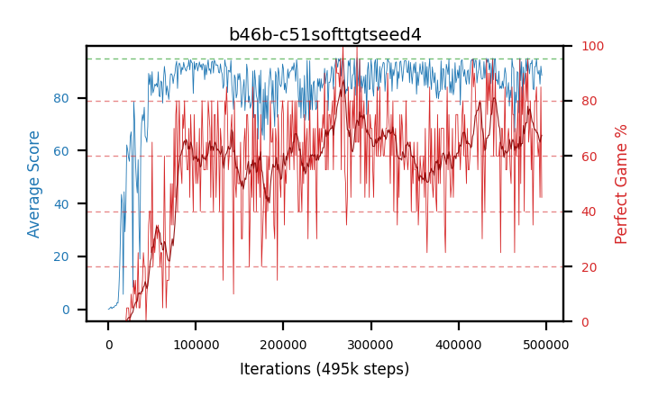
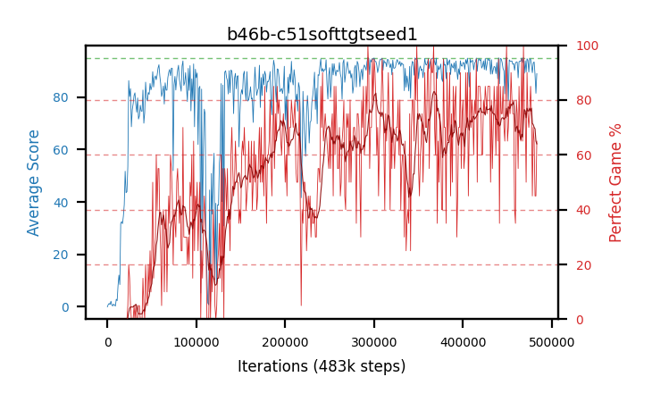
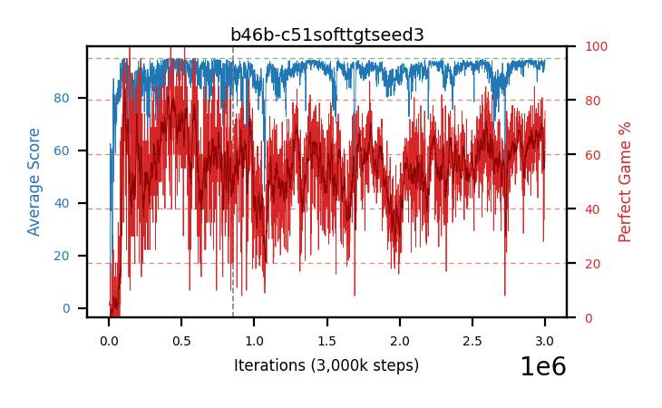

### ✅ Wave 3 complete — **`NUM_ATOMS=21` is a third null-to-worse: −1.6 pp mean perfect, 1 of 4**

Full 3M on all four arms, 3,001 evals a side, paired against each seed's own `b38` arm. These are the
first arms whose **whole run** is 100-episode graph evals, so their curves carry no internal boundary —
but that is exactly why `sef` needs the 100 → 10 correction below rather than wave 1's 20 → 10.

| seed | mean pp `b46c`/`b38` | Δ | `sef` corrected | `b38` `sef` | Δ | `best30` Δ | trailing Δ |
|---|---|---|---|---|---|---|---|
| 1 | 55.5 / 60.4 | −4.8 | 23.1% | 31.0% | **−7.9** | −0.7 | +3.3 |
| 2 | 49.2 / 51.0 | −1.8 | 13.6% | 15.5% | −1.9 | **−12.6** | **+18.0** |
| 3 | 54.3 / 53.9 | **+0.4** | 19.4% | 18.6% | **+0.8** | −0.2 | −3.4 |
| 4 | 54.1 / 54.4 | −0.3 | 18.2% | 22.2% | −4.0 | −4.7 | −1.9 |
| **mean** | **53.3 / 54.9** | **−1.6** | **18.6%** | **21.8%** | **−3.2** | −4.6 | +4.0 |
| | | *1 of 4* | | | *1 of 4* | *0 of 4* | *2 of 4* |

**Same shape as waves 1 and 2, and the same lone seed carries it.** Seed 3 is the only arm ahead, on
both the unbiased and the primary metric — as it was in wave 1. `best_perfect30` is behind on **all
four** arms, which is the worst column of the three waves.

**‡ The raw `sef` here would have read −16 pp, and that would have been an artefact.** Uncorrected these
arms post **9.1 / 2.9 / 6.4 / 5.0** (mean 5.9%) against b38's 21.8% — a catastrophic-looking deficit
that is almost entirely the episode count. The 100 → 10 correction triples them to a mean of 18.6%, and
the honest answer is **−3.2 pp at 1 of 4**. The correction is ~3x here against ~1.4x across the older
20 → 10 boundary, so **the newer the arm, the more indispensable it is.**

#### ✅ Close-out — pooled 88.54%, and the number is not comparable with waves 1-2

| wave | rows | episodes | pooled | best row |
|---|---:|---:|---:|---:|
| 1 `b46a` | 187 | 18,700 | 80.77% | 98.0% |
| 2 `b46b` | 175 | 17,500 | 82.41% | 97.0% |
| **3 `b46c`** | **82** | **8,200** | **88.54%** | **98.0%** |

**Wave 3 looks 6-8 pp better and mostly is not.** It selected **82** checkpoints against 187 and 175 —
under half — because the selection thresholds gate on an absolute percentage of a sample and at 100
episodes admit only the very best. Seeds 2 and 3 contributed **8 and 9 rows**. A thinner, better pool
reads higher, so this column is censored in the newer wave's favour and **pooled must not be compared
across the boundary** any more than raw `sef` can be. Per-arm: 88.27 / 87.00 / 89.11 / 89.14.

**The recalibration to 92/87 recommended before this close-out did not happen in time** — wave 3 was
measured on the miscalibrated 95/90. That cost coverage, not correctness: every row is full length and
ungated, so the rows that exist are sound and the ranking among them holds. It is wave 4 that should
get the recalibrated thresholds.

**HOF-500: seed 3's 98.0% checkpoint at step 249k re-measured to 94.8% over 500 episodes** — a −3.2 pp
winner's curse, against wave 1's −6.2. That is **the batch's best checkpoint so far** and still far
short of the project record of 99.0%.


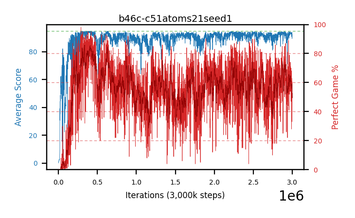
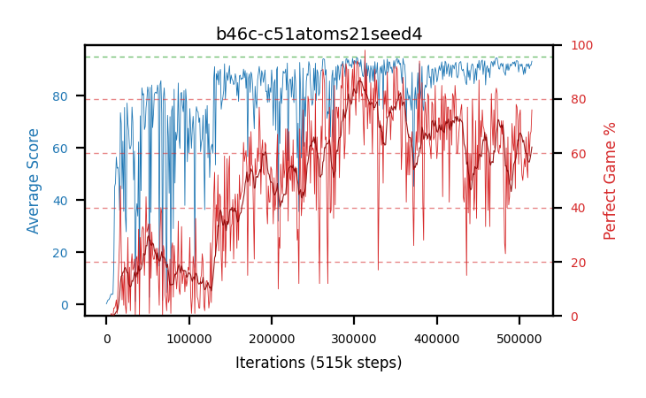
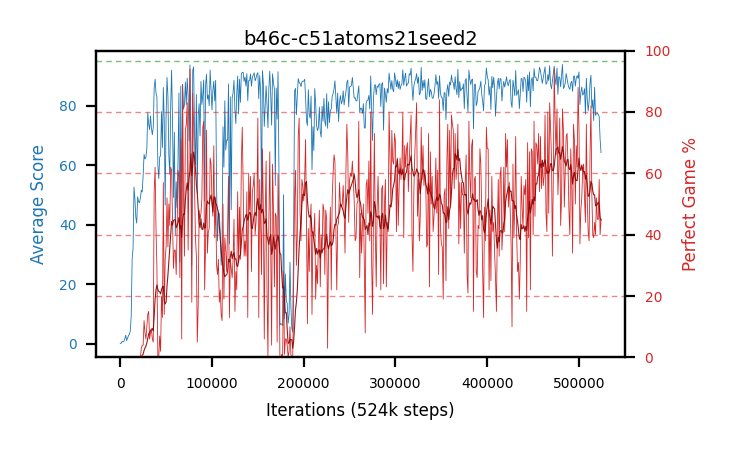

### ⏳ Wave 4 (`NUM_ATOMS=201`) at ~17% — the last rung, and the one with the weakest prior

`SNEK_NUM_ATOMS=201` against b38's 51, at **485-578k of 3M**, 3.4 h in, 100-episode graph evals
throughout. The pre-registered reason it is last: returns cluster near a win, and at 2.50 reward an atom
the win/no-win distinction may fall inside a single bin — so 201 is the bracket opposite wave 3's 21.

| seed | meanPP | best30 (step) | trailing | `sef` raw | max single eval |
|---|---:|---:|---:|---:|---:|
| 1 | — | 65.8 (423k) | **52.7** | **0.4** | 86 |
| 2 | — | **90.9** (249k) | 89.8 | 21.7 | 99 |
| 3 | — | 73.5 (363k) | 86.7 | 4.4 | 89 |
| 4 | — | 81.7 (211k) | **92.7** | **26.4** | 94 |

**Too early to read against b38, and the spread is the story so far**: seed 1 is badly behind on every
column while seeds 2 and 4 are the strongest early arms of the whole batch. Waves 1 and 2 both led early
and finished behind, and wave 3's seed 2 was a visible slow starter that recovered — so a 4-arm spread
this wide at 17% is normal for this batch and carries no signal yet. `sef` is left **raw** here on
purpose: it is not comparable with b38 until corrected, and at this step count the correction would be
fitted to a fifth of a run.

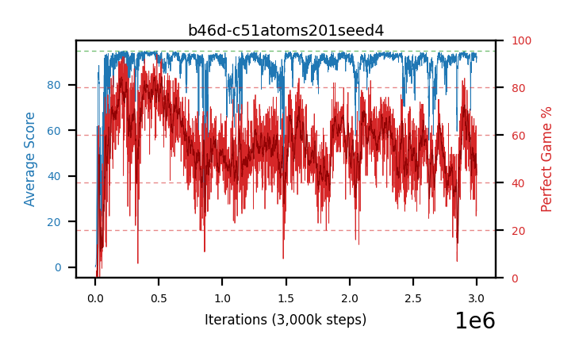
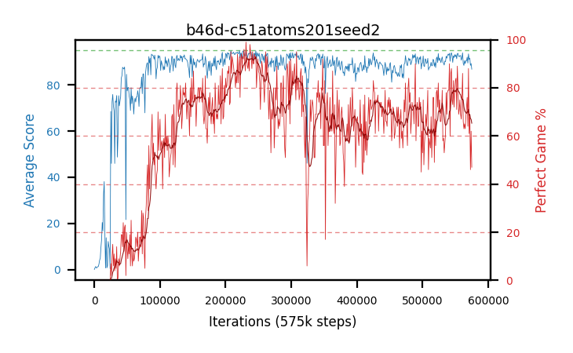
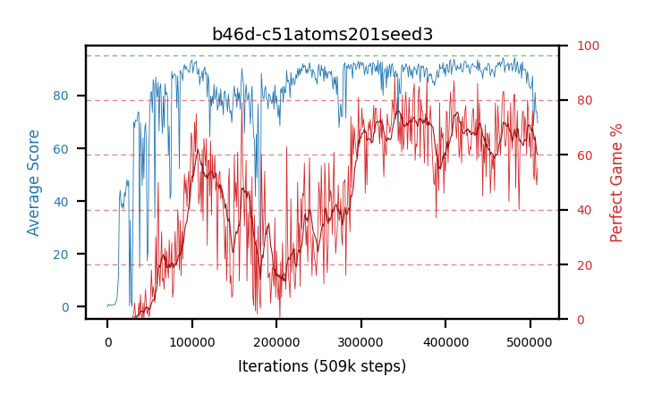
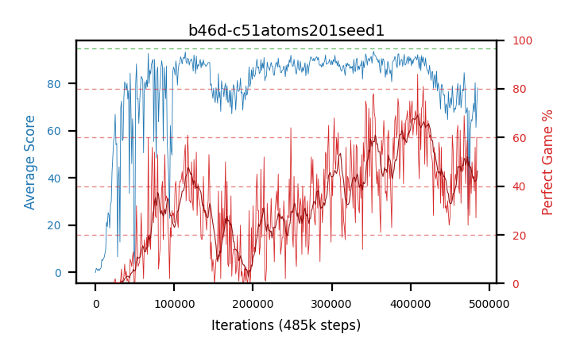

## Batch 45 — the **same four checkpoints at `lr 1e-8`** — *complete, and measured twice on two engines: **flat on all four**, and `1e-7` still holds the rung — 593 rows ≥98%/500 against `b44`'s 874*

The fourth and lowest rung. `b42`-`b44` walked the rate down 1e-5 → 1e-6 → 1e-7 and each step beat the last, so
`b45` asks whether that is monotone or whether there is an optimum. **It is the first rung with a longer cap —
5M rather than 3M** — because `b43c` did not peak until 2803k and `b44`'s best rows sit at 2.2-2.9M, so 3M was
starting to look like the binding constraint rather than the arms' own limit.

| arm | continues | step | past seed | best-30 | **best-30, equal-episode** | `sef` | recent-30 |
|---|---|---|---|---|---|---|---|
| `b45a` | `b29b` @1447k | 4297k | +2850k | 99.2 @2990k | **100.0** @2990k | **100.0** | 97.5 |
| `b45c` | `b40b` @1513k | 4421k | +2908k | 99.2 @1621k | 99.7 @1616k | 99.9 | 97.2 |
| `b45b` | `b29a` @1347k | 4098k | +2751k | 98.5 @1662k | 99.3 @1957k | **100.0** | 97.5 |
| `b45d` | `b29c` @1396k | 4195k | +2799k | 97.3 @3788k | 98.3 @3040k | 99.8 | 94.7 |

**`zero_since` is null on all four** and every arm is ~2.8M steps past its seed, so this is no longer an early read.

**Read the `best-30, equal-episode` column, not the plain one — and this batch is where that starts to matter.**
`training.num_eval_episodes` went 10 → 20 on 2026-08-19, so `b45` is the first arm set on the new instrument, and
`best_perfect30` is a maximum over a *less noisy* statistic than `b43`/`b44` computed theirs from. The correction is
not hypothetical: recomputing every arm on windows holding the **same 300 episodes** (30 evals × 10 for `b43`/`b44`,
15 × 20 for `b45`) raises every `b45` arm by **+0.8 to +1.0 pp** and leaves the older rungs untouched. Mean best-30
then reads **b44 99.17 vs b45 99.32** — level — where the uncorrected numbers read 99.17 vs 98.55 and look like a
regression. **The apparent `b45 < b44` deficit is entirely the instrument.**

**What is real is that the arms stopped moving.** Mean perfect rate per 0.5M band, first band vs last:

| rung | drift, worst → best arm | band-to-band spread |
|---|---|---|
| `b43` @1e-6 | **−6.3** → −0.0 | 0.91 - 2.89 |
| `b44` @1e-7 | −2.7 → **+1.2** | 0.19 - 1.67 |
| `b45` @1e-8 | **−0.6 → +0.3** | **0.19 - 0.37** |

`1e-8` bought stability by buying inaction. It stopped the decay — `b43d` shed 6.3 pp and `b44c` 2.7 pp over their
runs, while `b45`'s *worst* arm moves 0.6 pp — but it equally stopped the gain: `b44a` climbed +1.2 pp and `b45a`,
the same seed, drifts −0.4. Every arm sits within ±0.5 pp of its own opening band across 2.8M steps. That is the
**"flat from early on"** branch of `b45`'s pre-registration, i.e. the step has fallen below the scale that changes
the greedy action — not "too slow, raise the cap", which would show as a curve still climbing at 4.3M.

**So `sef` at 99.8-100.0, the highest of any rung, is a symptom rather than a result.** It asks whether an arm ever
dropped below 80% perfect, which an arm that never moves satisfies for free. The same warning applies to the metric
the ladder has been scored on: **a count of checkpoints ≥98%/500 is trivially maximised by a frozen arm parked near
98%**, so expect `b45`'s close-out to hold *more* rows than `b44`'s 874 without being better, and read it on its
**best row's rate**, not its count. Comparisons across the four rungs are in
[`runs.md`](runs.md#batches-42-45--what-happens-if-you-keep-training-a-champion--yes-and-lower-is-better-down-to-1e-7-4--187--874-rows-98500-across-1e-51e-61e-7-and-1e-8-is-the-frozen-floor).

**`b45d` is the flat seed again**, 94.7 recent-30 against its siblings' 97.2-97.5 — the same `b29c` seed that held 0
rows at both `1e-6` and `1e-7`. Four rungs in, that seed has never produced a ≥98%/500 checkpoint under continuation.

### ✅ Close-out and HOF-500 — all four arms, measured independently by both engines

The desktop measured the batch on the TF path (three waves, wave 1 alone ran 42.8 h); the laptop
re-measured all four arms with the new vectorised engine. **Two independent instruments, same
conclusion.** One row per starting checkpoint, never pooled across seeds:

| starting checkpoint | | `b43` 1e-6 | `b44` 1e-7 | `b45` 1e-8, TF | `b45` 1e-8, vec |
|---|---|---|---|---|---|
| `b29b` @1447k (the record) | candidates ≥98%/100 | 166 | 853 | 1584 | 1568 |
| | rows ≥98%/**500** | 16 | **429** | 349 | 360 |
| | share of candidates held | 10% | **50%** | 22.0% | 23.0% |
| | best /500 | 99.4% @1618k | 100.0% @2798k → [98.2%/1000](findings.md#-the-winners-curse-measured-four-selected-champions-all-fell-and-the-500500-did-not-reproduce-2026-08-20) | **99.4% @1621k** | 99.2% @2129k |
| `b29a` @1347k | candidates ≥98%/100 | 607 | 867 | 961 | 1264 |
| | rows ≥98%/**500** | 170 | **403** | 106 | 152 |
| | share of candidates held | 28% | **46%** | 11.0% | 12.0% |
| | best /500 | 99.6% @1661k | 100.0% @1886k | **99.4% @1504k** | 99.0% @1639k |
| `b40b` @1513k | candidates ≥98%/100 | 133 | 415 | 1171 | 1173 |
| | rows ≥98%/**500** | 1 | 42 | 137 | 99 |
| | share of candidates held | 1% | 10% | 11.7% | 8.4% |
| | best /500 | 98.0% @1760k | 99.0% @2600k | 99.0% @1793k | 99.2% @1686k |
| `b29c` @1396k (the flat seed) | candidates ≥98%/100 | 83 | 100 | 197 | 298 |
| | rows ≥98%/**500** | 0 | 0 | **1** | **0** |
| | best /500 | — | — | 98.0% @3454k | 97.8% @3695k |
| **batch total** | rows ≥98%/**500** | **187** | **874** | **593** | **611** |

**`1e-7` holds the rung. The ladder is not monotone.** 593 rows against `b44`'s 874 — and `b45` had
the *larger* pool to draw from, since its 5M cap gave each arm ~2.75-2.91M steps past seed against
`b44`'s ~1.49-1.65M. Read the **share**, not the count, and it is the same story on all three seeds
that produce anything: 22-23% against 50% on `b29b`, 11-12% against 46% on `b29a`, 8-12% against 10%
on `b40b`. `1e-8` also produced **no** 100%/500 row where `b44` produced two, and its best rate ties
at 99.4 rather than beating it. Count, share and rate all say what the training curves said — level to
behind.

**The prediction on this page was wrong, and usefully so.** It said a frozen arm parked near 98%
would trivially beat `b44`'s 874 without being better, so the count would need discounting. It did not
beat it. The count needed no discounting; `1e-8` simply did less.

**`b29c` is 0 for 4 rungs.** The one TF row at 98.0% @3454k is a coin-flip at the gate — vec measured
the same arm's 298 candidates and found **none** at 98%, best 97.8%. Four rungs of continuation and that
seed has never produced a checkpoint this instrument will certify.

#### ‡ The two engines agree, and the one place they look 1 pp apart is the gate, not the engine

Paired on the checkpoints both passes measured at full length, vec reads **0.8-1.0 pp lower** than TF
(−0.78 on `b45a` over 191 steps, −1.00 on `b45b` over 48, −0.97 on `b45c` over 62). **That is
gate-conditioning and must not be read as an engine difference.** The TF pass abandons any checkpoint
that can no longer reach 98%, so *every* full-length TF row is one whose TF sample was running above the
gate — selection on the very value being compared. The symmetric check is the one that settles it:

| arm | TF on TF's top-N | vec on TF's top-N | vec on vec's own top-N |
|---|---|---|---|
| `b45a` (N=191) | 98.29% | 97.50% | **98.32%** |
| `b45b` (N=48) | 98.34% | 97.34% | **98.33%** |
| `b45c` (N=62) | 98.23% | 97.26% | **98.08%** |

Each engine on **its own** top-N, same size and same candidate pool, reads the same rate to within
0.03 / 0.01 / 0.15 pp. Each reads ~1 pp lower on the *other's* selection. That is the signature of
selection, not bias.

**The reverse direction cannot be measured from these files at all**, and that is the point worth
carrying: a gated file has no full-length rows outside its own gate, so there is no unbiased TF value
for a checkpoint TF abandoned. It is exactly why the engines' head-to-head had to select its 24
checkpoints **by step, in advance, with both gates off** — where they agreed to **−0.058 pp (z = −0.28)**
over 500 episodes each. See [`vectorized/README.md`](../vectorized/README.md).

**Which figure to quote for `b45`.** The **vec** column, because its rows are uncensored: 611 rows
≥98%/500 out of 4303 candidates measured at full length, no abandonment. The TF column's count is
conditional on its own gate and its share is the more honest of its two numbers.

### b45a-lowlr8-b29b — continues `b29b` @1447k


### b45c-lowlr8-b40b — continues `b40b` @1513k


### b45b-lowlr8-b29a — continues `b29a` @1347k


### b45d-lowlr8-b29c — continues `b29c` @1396k, the flat seed on every rung


## Batch 44 — the **same four checkpoints at `lr 1e-7`** — *done: **874** checkpoints at ≥98%/500, 4.7x `b43`'s 187 — and both of its two 500/500 rows are selection artefacts*

The third rung, and **the rung that falsified its own pre-registration.** `b44` was queued expecting a null
against `b43` (~65% by the estimate written into its specs) on the reasoning that if `1e-6` is already doing
nothing but failing to damage the policy, `1e-7` cannot do better than the same nothing. That was wrong: the
~25% "better than `b43`" branch is what happened, on every seed.

| arm | continues | from | `best_perfect30` | `sef` | recent-30 | `b43` best-30 / `sef` |
|---|---|---|---|---|---|---|
| `b44b` | `b29a` | @1347k | **100.0** @2460k | **99.9** | 96.7 | 100.0 / 99.5 |
| `b44a` | `b29b` | @1447k | **99.7** @2190k | **99.9** | 98.3 | 98.7 / 96.5 |
| `b44c` | `b40b` | @1513k | 99.0 @1814k | 98.7 | 86.7 | 98.7 / 98.5 |
| `b44d` | `b29c` | @1396k | 98.0 @2230k | 98.7 | 96.3 | 98.3 / 96.6 |

**The ladder is monotone across all three rungs**, banded mean self-eval perfect rate over the +385k window
matched across all twelve arms:

| band past seed | `b42` 1e-5 | `b43` 1e-6 | `b44` 1e-7 |
|---|---|---|---|
| 0-100k | 93.6 | 95.4 | **96.3** |
| 100-200k | 91.6 | 96.3 | **96.6** |
| 200-300k | 89.1 | **96.2** | 96.1 |
| 300-385k | 89.5 | 95.6 | **96.8** |

**But `1e-7` vs `1e-6` is a much smaller effect than `1e-6` vs `1e-5`, and it is not uniform in time.** Over
their full common window (+1487k — both reached the 3M cap):

| band past seed | `b43` 1e-6 | `b44` 1e-7 | diff | seeds `1e-7` ahead |
|---|---|---|---|---|
| 0-250k | 95.9 | 96.3 | +0.4 | 3 of 4 |
| 250-500k | 95.4 | 96.5 | +1.1 | **4 of 4** |
| 500-750k | 92.2 | **96.6** | **+4.4** | **4 of 4** |
| 750-1000k | 93.4 | 97.0 | **+3.6** | **4 of 4** |
| 1000-1250k | 94.8 | 96.6 | +1.8 | 3 of 4 |
| 1250-1487k | 94.5 | 95.2 | +0.7 | 2 of 4 |

Per seed over the whole window: **+4.6, +1.0, +1.6, +0.8** — 4 of 4, mean **+2.0 pp**, against **+4.9 pp** for
the `1e-5` → `1e-6` step. So **the ladder is monotone but decelerating**, which is what approaching a plateau
looks like without having arrived. The gap opens widest at 500-1000k because that is where `b43` dips (92.2)
while `b44` does not — `1e-6` still wanders on the timescale of half a million steps, `1e-7` largely does not.

**The mechanism reading:** `b44`'s best-30 peaks arrive **late** — 1814k, 2190k, 2230k, 2460k, i.e. 300-1100k
steps past seed — against 1527k-2803k for `b43` and *at the seed step* for `b42`. A lower rate does not merely
preserve; it improves more slowly and for longer. That is why the "it will just freeze" prediction failed: at
`1e-7` these arms are still moving, just not far enough per step to fall out of the basin.

### ✅ Close-out (100 episodes) — the self-eval result survives the deeper instrument, larger

| arm | checkpoints measured | ≥98%/100 | ≥99%/100 | =100%/100 | `b43` twin's ≥98%/100 |
|---|---|---|---|---|---|
| `b44a` | 1516 | **853 (56.3%)** | 497 | 160 | 166 (12.8%) |
| `b44b` | 1616 | **867 (53.7%)** | 514 | 160 | 607 (38.7%) |
| `b44c` | 1377 | **415 (30.1%)** | 200 | 50 | 133 (10.0%) |
| `b44d` | 1450 | 100 (6.9%) | 27 | 4 | 83 (6.0%) |

**More than half of `b44a`'s and `b44b`'s checkpoints are in the ≥98%/100 tier**, against one in eight and two in
five for their `1e-6` twins and one in fifteen for `1e-5`. `b44d` is the flat seed on every rung. Note that
`b44`'s pool is the *least* selected of the three batches — 98% of all its checkpoints on two arms — so it
carries the most dead weight in the denominator and still wins; the full comparison, with the caveats, is in
[`archive/runs-archive.md`](archive/runs-archive.md#retired-from-runsmd-2026-08-22--the-closed-rungs-of-the-b42-b45-ladder).

**The HOF-500 finished 2026-08-20 — all 2235 measurements — and it decides the ladder against `b43`
emphatically: 874 rows ≥98%/500 against `b43`'s 187**, a 4.7x gap on a *less* selected pool, and 90 rows at
≥99% against 19.

| arm | rows | ≥98%/500 | ≥99%/500 | best /500 | `b43` twin's ≥98%/500 |
|---|---|---|---|---|---|
| `b44a` | 853 | **429** | **48** | **100.0% @2798k** (500/500) | 16 |
| `b44b` | 867 | 403 | 41 | **100.0% @1886k** (500/500) — re-measures **98.2%/1000** | 170 |
| `b44c` | 415 | 42 | 1 | 99.0% @2600k | 1 |
| `b44d` | 100 | 0 | 0 | — (all 100 gate-abandoned) | 0 |
| **total** | 2235 | **874** | **90** | | **187** |

**Two 500/500 rows, one per good seed — and both are selection artefacts, not perfect policies.** @1886000 was
re-measured on 1000 fresh episodes and scored **982/1000 = 98.2%**; @2798000 has not been re-measured but there
is no reason to expect it to behave differently. With **90 checkpoints at ≥99%/500**, two flawless rows is
roughly what chance produces — a checkpoint whose true rate is 99% returns 500/500 about 0.7% of the time. So
read the *count*, not the maximum: that is what separates this rung from `b43`.

**`b44d` finished too**, and its zero is real: all **100** of its candidates were measured and every one was
gate-abandoned, i.e. arithmetically unable to reach 98%. (Its file carries `complete: false` only because no row
survived to full length.)

**‡ It failed to replicate, and that caution was the right one.** The 500/500 was re-measured the same day on
**1000 fresh episodes and scored 982/1000 = 98.2%** (97.2-98.9) — a **−1.8 pp** drop, p=0.0025. All four of the
project's best checkpoints were re-measured together and **all four fell**, mean −1.35 pp, which puts a number
on the winner's curse for the first time: [full result in
`findings.md`](findings.md#-the-winners-curse-measured-four-selected-champions-all-fell-and-the-500500-did-not-reproduce-2026-08-20). Nothing was promoted into `hallOfFame/`, and on
these numbers nothing should be until a candidate is chosen on a fresh measurement rather than a selected one.
See
the ⚠ note in [batch 42's section](#batch-42--the-same-four-checkpoints-at-the-default-lr-1e-5--stopped-early-at-177-191m-closed-out-and-hof-500d-it-decays-and-its-surviving-98-checkpoints-are-its-own-starting-weights)
on why `peak_trailing` is useless for this family, and the [close-out cost
warning](#-a-continuation-batchs-close-out-costs-10-20x-a-normal-ones) below.

### b44a-lowlr7-b29b — continues the project record, `b29b` @1447k (99.0%/500)

`best_perfect30` **99.7** at 2190k, `sef` **99.9**, recent-30 98.3. **The largest single gain in the ladder:**
its `b42` twin sat at `sef` 87.0 and its `b43` twin at 96.5, so the same weights under three rates give
87.0 / 96.5 / 99.9. This is the arm that carried the project record in, and it is the one the rate matters most
for — consistent with the record checkpoint sitting in a narrow basin the default step size walks out of.


### b44b-lowlr7-b29a — continues `b29a` @1347k (98.4%/500)

`best_perfect30` **100.0** at 2460k, `sef` **99.9**, recent-30 96.7. Ties `b43b`'s 100.0 best-30 window but
reaches it 793k steps later and holds a higher `sef`, so the two are not the same result. **Its close-out is the
long pole across both hosts** — 1196 of its checkpoints qualify for the mandatory ≥90% tier.


### b44c-lowlr7-b40b — continues `b40b` @1513k (98.2%/500)

`best_perfect30` 99.0 at 1814k, `sef` 98.7, but **recent-30 86.7 — the one arm ending weak**, and the only one
whose `sef` is not clearly above its `b43` twin (98.7 vs 98.5). Carries the free-space confound: trained *with*
the global free-space term and continued *without* it, so its restored value function is mis-calibrated against
its new reward. The confound is identical on the `b42` and `b43` sides, so the three-way comparison holds.


### b44d-lowlr7-b29c — continues `b29c` @1396k (97.1%, 378 ep)

`best_perfect30` 98.0 at 2230k, `sef` 98.7, recent-30 96.3. **The one seed where `1e-7` does not beat `1e-6` on
best-30** (98.0 against 98.3) though it does on `sef` (98.7 against 96.6) — the weakest starting checkpoint of
the four and the narrowest pair, as it was at every other rung.


### ⚠ A continuation batch's close-out costs 10-20x a normal one's

`top20` measured **791, 1196, 803 and 826** checkpoints on `b43`'s four arms, not 20. That is documented
behaviour, not a bug: **"N is a target, not a quota"** — every checkpoint whose 10-episode graph eval reached
**≥90%** is measured, past N. A normal arm climbs from 0, so few checkpoints qualify; **an arm continued from a
98% checkpoint spends its entire run above the mandatory threshold, so nearly every checkpoint qualifies.**
`b42` shows the contrast from the other side — it *decayed*, so only 261-373 of its checkpoints qualified.

Practical consequence: budget a continuation batch's close-out at **8-15 hours per wave**, not one, and do not
read a close-out still running after 7 hours as hung. `b43`'s was launched 01:07 and is still going.

## Batch 43 — **continuing the four best checkpoints at `lr 1e-6`** — *closed out (15 h) and HOF-500'd: **187** checkpoints at ≥98%/500 against `b42`'s 4, topping out at 99.6% — which `b44` then beat*

**The question:** every record in this project is a checkpoint some arm *passed through* on its way to a worse
endpoint. No arm has ever been continued from its own best checkpoint. `b43` continues the top four of eight
across b29 and b40 — ranked by their best **500-episode** perfect rate — to a 3M absolute cap under b29's
config (`fc 320`, chase-safe `c=0.10` gate 75, no free-space term), with **`SNEK_LEARNING_RATE=1e-6`** the only
change. The desktop's **`b42`** runs the identical four at the default `1e-5` as the seed-matched control.
Rationale, the pre-registered outcome readings and the selection-bias warning are in
[`runs.md`](runs.md#batches-42-45--what-happens-if-you-keep-training-a-champion--yes-and-lower-is-better-down-to-1e-7-4--187--874-rows-98500-across-1e-51e-61e-7-and-1e-8-is-the-frozen-floor);
launcher [`scripts/launch_b43_lowlr.sh`](scripts/launch_b43_lowlr.sh), seeding
[`scripts/seed_from_checkpoint.sh`](scripts/seed_from_checkpoint.sh).

| arm | continues | from | its 500-ep rate there | training-self-eval so far | `b42` best-30 / `sef` |
|---|---|---|---|---|---|
| `b43b` | `b29a-chase10g75seed1` | @1347k | 98.4% | best-30 **100.0** @1667k, `sef` **99.5**, recent-30 96.3 | its `b42` twin: 97.3 / 97.9 |
| `b43a` | `b29b-chase10g75seed2` | @1447k | **99.0%** (the record at the time) | best-30 98.7 @1527k, `sef` 96.5, recent-30 94.0 | 97.3 / **87.0** |
| `b43c` | `b40b-chasefree10g75seed2` | @1513k | 98.2% | best-30 98.7 @**2803k**, `sef` 98.5, recent-30 88.0 | **93.3** / 91.2 |
| `b43d` | `b29c-chase10g75seed3` | @1396k | 97.1% (378 ep, gate-abandoned) | best-30 98.3 @1539k, `sef` 96.6, recent-30 90.3 | 97.7 / 95.9 |

**All four reached the 3M cap** (+1487-1653k past seed) and the close-out launched at 01:07, still running.
Final training numbers: `best_perfect30` **98.3-100.0**, `sef` **96.5-99.5**, `max_single_eval` 100,
`zero_since` null on all four. **`b43b` reached a `best_perfect30` of 100.0 at 1667k — 320k steps past its own
seed checkpoint**, a 30-eval window with no imperfect game in it. So `1e-6` is not merely preservation.

**`b44` at `1e-7` then beat it on 4 of 4 seeds** (+2.0 pp mean over the full common window), so `b43` is the
*middle* rung, not the answer — see [batch 44 above](#batch-44--the-same-four-checkpoints-at-lr-1e-7--done-874-checkpoints-at-98500-47x-b43s-187--and-both-of-its-two-500500-rows-are-selection-artefacts). That nothing fell apart is itself a result: **the same four checkpoints fell
80% → 50% perfect in 5k steps when the replay buffer was *not* carried over**, and holding 95-100% here is what
the buffer copy bought.

**Against `b42`, the seed-matched `1e-5` control, `b43` leads on 4 of 4 seeds on every *training* metric** —
`best_perfect30` 98.3-100.0 against 93.3-97.7, `sef` 96.5-99.5 against 87.0-97.9, and banded perfect rate +4.7/+7.1/+6.1 pp over
the 100-200k, 200-300k and 300-385k bands past seed. The full banded table is in
[batch 42's section below](#batch-42--the-same-four-checkpoints-at-the-default-lr-1e-5--stopped-early-at-177-191m-closed-out-and-hof-500d-it-decays-and-its-surviving-98-checkpoints-are-its-own-starting-weights),
which is where the pair's result lives since `b42` is the arm that moved. **`b44`** extended the ladder to **`1e-7`** and won on 4 of 4 seeds.

**On the deeper instruments the lead is 4 of 4 but the margin is not uniform, and one seed inverts.** `b43`
takes ≥98%/100 on all four seeds (607/166/133/83 against 27/17/6/48), but pooled equal-effort is **3 of 4 plus a
dead heat** — `b43d` 93.50 against `b42d` 93.54 — and ≥98%/**500** is 3 of 4 with the `b29c` seed *reversed*,
`b42d` holding 3 where `b43d` held 0. Per-seed table in
[`completedRuns.md`](completedRuns.md#batch-43--continuing-the-four-best-checkpoints-at-lr-1e-6-a-record-region-10x-wider-than-anything-before-it-and-the-best-checkpoint-was-the-wrong-one-to-continue).

**Do not read these best-30 numbers against the 500-episode column beside them.** A 10-episode self-eval
averaged over 30 evals and a flat 500-episode measurement are different instruments, and the 500-ep column is
additionally **the maximum of a noisy statistic over 8 arms and hundreds of checkpoints** — biased upward. The
comparison that means something is `b43` against `b42`, which starts from byte-identical weights. Everything
here is training self-eval; the close-outs will be the real numbers.

**`sef` is not comparable with any other batch in this file.** It is the share of an arm's *own* evals above
80% perfect, and these arms started at ~98% instead of 0 — so 99.5 says "it never dropped", not "it learned
fast". Only `b42`'s `sef` is a fair reference, and it is in the last column of the table above; `b44`'s will be
the other one. **`b42` and `b43` are also not at a common step horizon** (`b42` was stopped at +385-421k,
`b43` is past +541k) and `sef` is a fraction of each arm's own evals, so the banded comparison — not this
column — is the rigorous one.

### ✅ Close-out (100 episodes) and HOF-500 — both complete

| arm | checkpoints measured | ≥98%/100 | ≥99%/100 | best /100 | ≥98%/500 | ≥99%/500 | best /500 |
|---|---|---|---|---|---|---|---|
| `b43a` | 1297 | 166 (12.8%) | 78 | 100% @1502k | 16 | 2 | 99.4% @1618k |
| `b43b` | 1568 | **607 (38.7%)** | 311 | 100% @1356k | **170** | **17** | **99.6% @1661k** (also @1708k) |
| `b43c` | 1325 | 133 (10.0%) | 47 | 100% @1516k | 1 | 0 | 98.0% @1760k |
| `b43d` | 1378 | 83 (6.0%) | 27 | 100% @1539k | 0 | 0 | — |

Against `b42`'s 17 / 27 / 6 / 48 ≥98%/100 rows on the same four seeds, and `b44`'s 853 / 867 / 415 / 100 — so
`b43` sits where the ladder says it should on 3 of 4 seeds and loses to `b42` on `b29c`.

**187 checkpoints at ≥98%/500 against `b42`'s 4** is the headline, and it is a 47× gap from byte-identical
starting weights. But **one seed carries 170 of the 187**, and `b43c`/`b43d` contribute 1 and 0 — so the count
is a **seed effect amplified by the rate**, not a config effect. That is the same shape as [the retired b29
record region](findings.md#-corrected-2026-08-18-the-record-region-does-not-replicate--the-98500-count-is-seed-noise-and-pooled-is-the-only-metric-of-this-family-worth-reading),
and the reason to read the pooled figures rather than the counts.

Pooled rate over each arm's own measured checkpoints: `b43b` **97.3%** (228404/234625, 607 checkpoints),
`b43a` 96.6% (166), `b43c` 95.9% (133), `b43d` 95.0% (83) — the same ordering as every other instrument here.
**These pool rows of unequal length and so read high**: the 98% gate abandons the weak rows early, which makes
them short, so the winners carry more of the denominator than they should. Compare the ordering, not the level.

**The prediction written here yesterday was wrong in its subject and right in its substance.** `b43a` was
carrying the candidate record at ~25% of the pass; it finished at 99.4% and was passed by its sibling `b43b` at
**99.6%** (498/500), and both were then beaten by `b44b`'s **500/500** — which itself
[fell to 98.2% on 1000 fresh episodes](findings.md#-the-winners-curse-measured-four-selected-champions-all-fell-and-the-500500-did-not-reproduce-2026-08-20), as did `b43b` @1708000
(98.1%). The note said the number worth watching
was the count and not the maximum, and that is exactly how it turned out — see
[`archive/runs-archive.md`](archive/runs-archive.md#retired-from-runsmd-2026-08-22--the-closed-rungs-of-the-b42-b45-ladder).

**`b43` is finished on all three instruments, and its canonical write-up is now in
[`completedRuns.md`](completedRuns.md#batch-43--continuing-the-four-best-checkpoints-at-lr-1e-6-a-record-region-10x-wider-than-anything-before-it-and-the-best-checkpoint-was-the-wrong-one-to-continue)** — the per-seed `b42` comparison, the pooled equal-effort figures
and the cost breakdown live there. This section keeps the graphs and the batch's rationale because the ladder
it belongs to is still running (`b44`'s HOF-500, then `b45`).

### b43b-lowlr-b29a — continues `b29a` @1347k, 98.4%/500 — **the batch's best arm on every instrument**

Best-30 **100.0** at 1667k, `sef` **99.5**, recent-30 96.3, `max_single_eval` 100. **The strongest evidence in
the pair that `1e-6` improves rather than merely holds** — a 30-eval window with no imperfect game, 320k steps
past its seed, against 97.3 for its byte-identical `b42` twin. The close-out and HOF-500 then agreed on all
three counts: **607 ≥98%/100, 170 ≥98%/500, 17 ≥99%/500, best 99.6% @1661k** (498/500), and a pooled 97.3%.

**Note which seed this is.** `b43b` continues `b29a`, whose 500-episode rate at its seed checkpoint was 98.4% —
*second* of the four, not the 99.0% record. The arm continued *from* the record, `b43a`, finished with 16
≥98%/500 rows against this arm's 170. **So a checkpoint's own /500 rate did not predict how well it continues**,
which is one more reason not to treat the b29 record region as a property of the weights.


### b43a-lowlr-b29b — continues `b29b` @1447k, **99.0%/500, the record at the time**

Best-30 **98.7** at 1527k, `sef` 96.5, recent-30 94.0 — against 97.3 / **87.0** for `b42a` from
byte-identical weights, the widest `sef` gap of the four (+9.5 pp). The arm that matters most: it starts from the head
of b29b's 18-checkpoint band, and [that band is now known to be a
seed rather than a config](findings.md#-corrected-2026-08-18-the-record-region-does-not-replicate--the-98500-count-is-seed-noise-and-pooled-is-the-only-metric-of-this-family-worth-reading),
so whether the region can be *extended by training inside it* is the open question `b42`/`b43` exist to answer.

**The answer, from its own HOF-500: yes, but this was not the arm that showed it.** `b43a` produced **16**
≥98%/500 rows and a best of **99.4% @1618k** — 171k steps past the record checkpoint it continues, so the region
*was* extended, and by more than `b42a`'s 1 row from the same weights. But its sibling `b43b`, starting from a
*worse* checkpoint, produced 170. **Continuing the best checkpoint was not the best move**, which is the sharpest
form of the seed-not-config result and worth remembering the next time a champion is picked by its /500 rate.


### b43c-lowlr-b40b — continues `b40b` @1513k, 98.2%/500

Best-30 **98.7** at **2803k**, `sef` 98.5, recent-30 88.0 — its `b42` twin is the weakest arm of the eight at
best-30 **93.3**. **Its best-30 peaked 1.1M steps later than any sibling's**, so `1e-6` was still finding
gains at 2.8M — the clearest single sign that the cap, not the rate, ended this arm. **The one arm with a confound worth stating:** `b40b`
was trained *with* the free-space PBRS term and is being continued *without* it, because the batch pins b29's
config for all four. PBRS leaves the optimal policy unchanged but the value function absorbs the potential, so
this arm's restored `Q` is mis-calibrated against its new reward in a way the other three are not. It is the
same change on the `b42` side, so the host comparison stays clean — but do not read `b43c` against `b43a/b/d`
as though only the seed differed.


### b43d-lowlr-b29c — continues `b29c` @1396k, 97.1% over 378 episodes

Best-30 **98.3** at 1539k, `sef` 96.6, recent-30 90.3. The weakest starting point of the four and still the
weakest arm of the `b43` four, which is the expected ordering — though it has closed most of the gap, and its
`b42` twin is the *best* of the `b42` four, making this the narrowest pair (+1.7 pp over the matched window). Its starting figure is **not** a 500-episode number — the row was
abandoned by the 98% gate at 378 episodes — so it is not strictly comparable with the three above it.


## Batch 42 — the **same four checkpoints at the default `lr 1e-5`** — *stopped early at 1.77-1.91M, closed out and HOF-500'd: it decays, and its surviving ≥98% checkpoints are its own starting weights*

**Finished on all three instruments; canonical write-up in [`completedRuns.md`](completedRuns.md#batch-42--the-same-four-checkpoints-at-the-default-lr-1e-5-stopped-early-it-decays).** This section keeps the graphs.

`b43`'s seed-matched control, and the reason the pair exists. Identical in every respect — same four seeded
policy dirs, same source checkpoints, same seeds, byte-identical env on all nine of b29's knobs — except the
learning rate is left at the default **`1e-5`**, the rate these checkpoints were originally trained at.
**Stopped by hand after ~400k steps past resume** rather than run to its 3M cap, because by then the
comparison had resolved 4 of 4 and the arms were spending compute going downhill. Close-out and HOF-500 were
queued explicitly so stopping cost no measurement, and both are now done.

**The close-out confirms it, and the HOF-500 is the sharpest form of the result.** Pooled equal-effort
**90.75 / 93.77 / 90.29 / 93.54** (mean **92.1**, gate 96). Every arm found a 99-100%/100 checkpoint, but
**the only checkpoints that survived a flat 500 episodes at ≥98% sit within 75k steps of the seed**: `b42a` one
row, **98.4% at 1453k** — 6k steps past its seed and *below* `b29b`'s own 99.0% start — and `b42d` three rows at
1399k/1457k/1470k (98.2/98.0/98.2%), 3-74k past seed. `b42b` and `b42c` produced **none at all**, from 27 and 6
candidates. So at `1e-5` the arm's ≥98% quality is the checkpoint it was handed, re-measured; nothing it earned
survives the 500-episode instrument.

| arm | continues | from | `best_perfect30` | `sef` | recent-30 | steps past seed |
|---|---|---|---|---|---|---|
| `b42d` | `b29c` | @1396k | 97.7 | 95.9 | 90.0 | +410k |
| `b42a` | `b29b` | @1447k | 97.3 | **87.0** | 87.0 | +385k |
| `b42b` | `b29a` | @1347k | 97.3 | 97.9 | 92.7 | +421k |
| `b42c` | `b40b` | @1513k | **93.3** | 91.2 | 86.0 | +398k |

**The result: at `1e-5` a champion loses about 5 pp of perfect rate and settles at a lower plateau.** Banded
mean perfect rate over the **+385k window matched across all eight `b42`/`b43` arms** — the largest window
where every arm has data:

| band past seed | `b42` (1e-5) | `b43` (1e-6) | diff | seeds favouring 1e-6 |
|---|---|---|---|---|
| 0-100k | 93.6 | 95.4 | +1.8 | 3 of 4 |
| 100-200k | 91.6 | 96.3 | **+4.7** | **4 of 4** |
| 200-300k | 89.1 | 96.2 | **+7.1** | **4 of 4** |
| 300-385k | 89.5 | 95.6 | **+6.1** | **4 of 4** |

It is a **one-time drop to a lower level, not an ongoing collapse** — the last two bands are flat at ~89, so
the arm re-equilibrates rather than unravelling. `best_perfect30` and `sef` agree on all four seeds
(93.3-97.7 against 98.3-100.0, and 87.0-97.9 against 97.9-99.8). Read against
[the record region being seed noise](findings.md#-corrected-2026-08-18-the-record-region-does-not-replicate--the-98500-count-is-seed-noise-and-pooled-is-the-only-metric-of-this-family-worth-reading),
the reading is that the default rate is simply too large to *sit still* in a narrow high-performing basin: the
step size that found the basin is bigger than the basin.

**⚠ Do not judge these arms with `peak_trailing`.** It is trailing average *score*, which maxes at 95/95, and
**all eight `b42`/`b43` arms read exactly 95.0 with the peak timestamped at their own seed step** — the metric
is saturated from the first eval, because a policy restored from a 98% checkpoint already fills the board. An
earlier pass here misread that as "no arm ever beat its starting checkpoint", which is false: `b43b` reached a
**100.0** best-30 window 320k steps past its seed. Use `perfect_percent`, `best_perfect30` or `sef`.

### b42a-cont3m-b29b — continues the project record, `b29b` @1447k (99.0%/500)

`sef` **87.0**, the worst of the eight arms in this pair of batches, against **99.6** for `b43a` from
byte-identical weights. The arm that starts highest falls furthest — which is what a basin-too-narrow reading
predicts, since the record checkpoint sits at the head of b29b's 18-checkpoint band.


### b42c-cont3m-b40b — continues `b40b` @1513k (98.2%/500)

`best_perfect30` **93.3**, the lowest of the four. Carries the same free-space confound as `b43c` — trained
*with* the global free-space term and continued *without* it — so its restored value function is
mis-calibrated against its new reward. The confound is identical on the `b43` side, so the pairwise comparison
holds.


### b42b-cont3m-b29a — continues `b29a` @1347k (98.4%/500)

`sef` 97.9, the best-holding of the four and the smallest gap to its `b43` twin (+1.7 pp over the whole matched
window). Went furthest past its seed, +421k.


### b42d-cont3m-b29c — continues `b29c` @1396k (97.1%, 378 ep)

`best_perfect30` **97.7**, the highest of the four, from the weakest starting checkpoint — its start is a
gate-abandoned 378-episode row, not a 500-episode number, so it is not strictly comparable with the others.


## Batch 41 — **`b29`'s record config re-run on the same four seeds** — *complete; the config reproduces and the champion does not*

Written up 2026-08-27, nine days late. The cleanest paired comparison in this project: env byte-identical to
`b29`'s, both 2.00M steps, both 2,001 graph evals at **10 episodes**, both close-outs at **gate 95.0 / 100
episodes**. **No era correction applies to any column here** — which is not true of anything after batch 44.

| seed | mean pp `b41`/`b29` | Δ | `sef` `b41`/`b29` | Δ | `best30` Δ | ≥98%/100 `b41`/`b29` | ≥98%/500 `b41`/`b29` |
|---|---|---|---|---|---|---|---|
| 1 | 62.5 / 72.6 | **−10.1** | 39.7 / 60.3 | **−20.6** | −6.0 | **1 / 59** | 0 / 3 |
| 2 | 72.0 / 70.9 | **+1.1** | 58.8 / 55.6 | +3.2 | −1.3 | **0 / 64** | **0 / 18** |
| 3 | 73.7 / 77.2 | −3.5 | 63.4 / 67.9 | −4.5 | **+1.4** | **38 / 9** | **1 / 0** |
| 4 | 76.0 / 74.5 | **+1.5** | 62.1 / 59.7 | +2.4 | **+3.4** | **15 / 1** | 0 / 0 |
| **mean** | **71.1 / 73.8** | **−2.7** | **56.0 / 60.9** | −4.9 | −0.6 | 13.5 / 33.3 | 0.25 / 5.25 |
| | | *2 of 4* | | *2 of 4* | *2 of 4* | | |

**The two halves of this table disagree, and that is the result.** On the graph the config reproduces — mean
perfect −2.7 at 2 of 4, `best_perfect30` −0.6 at 2 of 4, i.e. a coin flip. On the tail it scrambles
completely: the ≥98%/100 counts go 59/64/9/1 → **1/0/38/15**, an inversion of the seed ranking.

**‡‡ The record seed produced nothing.** `b29b` gave 64 rows ≥98%/100, an 18-checkpoint ≥98%/500 band at
1446k-1529k, and the 99.0%/500 project record. On the same seed and the same config, `b41b`'s best close-out
row is **97.0%/100**, zero rows reached 98, and **no HOF stage ran because nothing qualified** — while its
graph metrics came out slightly *ahead* of `b29b`'s (+1.1 mean perfect). **The record was a property of the
run.** Full derivation, the per-metric noise floor it calibrates, and why mean per-eval difference is a
worthless divergence metric here:
[`findings.md`](findings.md#-the-process-noise-floor-measured-the-config-reproduces-the-champion-does-not-b41-vs-b29-2026-08-27).

**Divergence is immediate**: the first differing eval lands at step **10k-44k of 2M**. A same-seed re-run does
not track and then part; it separates inside the first 2%.

### b41c-b29repro-seed3 — the re-run's best arm, on the seed `b29` ranked third

38 rows ≥98%/100 against `b29c`'s 9, and the batch's only ≥98%/500 (98.0% @1279k). Pooled 90.61%, the highest
of either batch.


### b41b-b29repro-seed2 — **the record seed, and it produced no candidate at all**

The single most informative arm in the pair. Graph curve is level with `b29b`'s; the tail is empty.

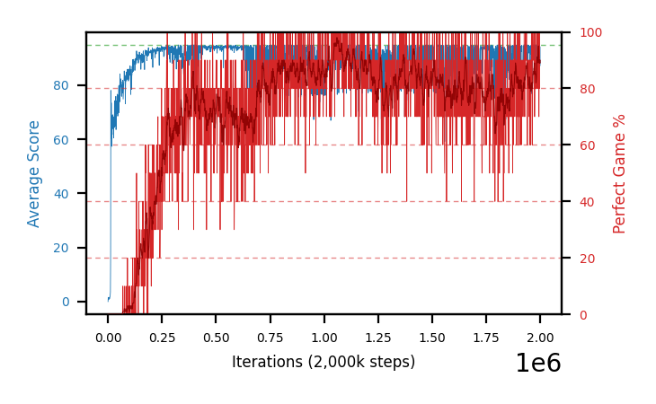

### b41d-b29repro-seed4 — `b29`'s weak seed, second-best here

15 rows ≥98%/100 against `b29d`'s 1. Best partial 97.4% abandoned at 421 episodes, so 0 held ≥98%/500.

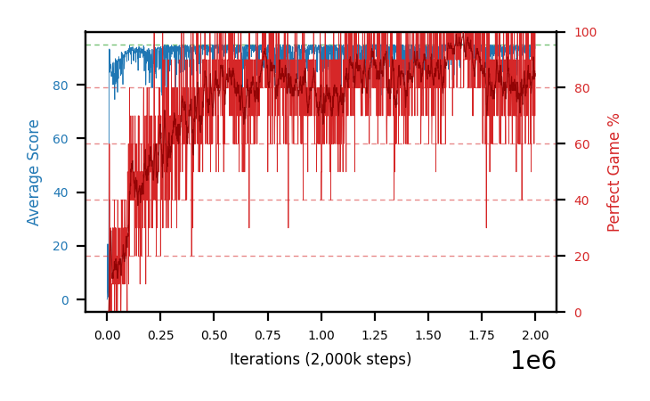

### b41a-b29repro-seed1 — the worst per-seed swing in the project's paired data

−10.1 mean perfect and −20.6 `sef` against `b29a`, plus 1 row ≥98%/100 against 59. **This arm is the number
behind the ~10 pp resolution floor** — it is what a same-config, same-seed re-run can cost.

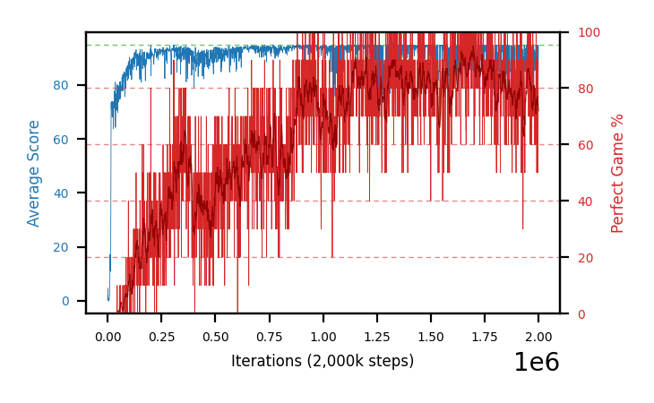
