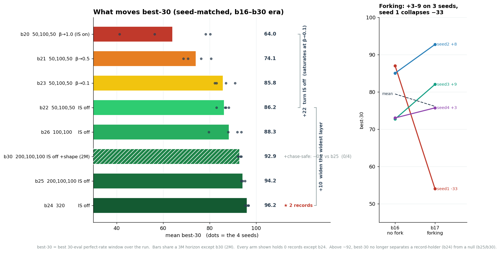
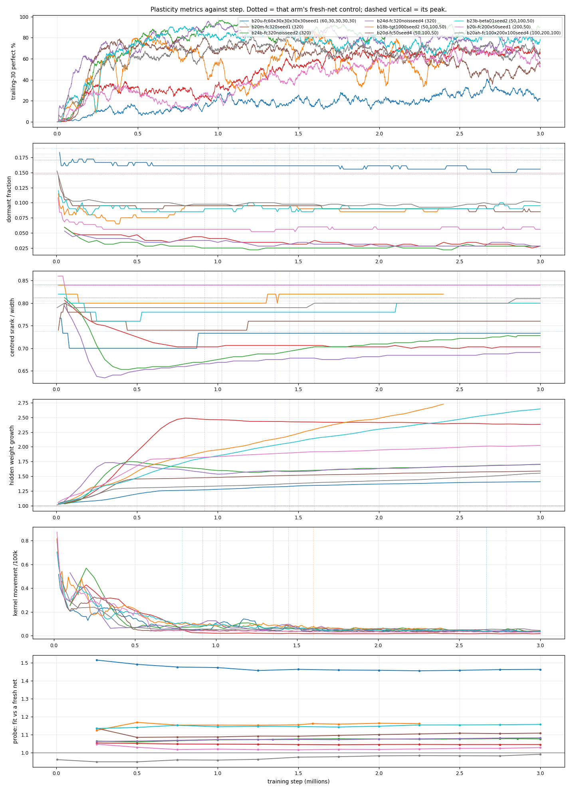

# Findings

What is established, what is falsified, and what is still open. Organized by topic rather than
by when it was discovered.

**Read this before proposing an experiment** — several questions here are closed, and a few were
closed *narrowly* in ways worth checking before reopening them.

| | |
|---|---|
| what is running, what is next | [`runs.md`](runs.md) |
| per-arm numbers and verdicts | [`completedRuns.md`](completedRuns.md) |
| how to measure and judge | [`hyperparamTuning.md`](hyperparamTuning.md) |
| the four degradation patterns | [`failureModes.md`](failureModes.md) |
| superseded findings, batches 1-10 | [`archive/`](archive/) — history only, don't load it |

## Status at a glance

Only current and load-bearing findings. Results about observation vectors this project has
replaced (20, 21, 23, 26 values) and per-batch config results that later batches settled live in
[`archive/findings-superseded.md`](archive/findings-superseded.md).

**Environment and checkpoints**

| finding | status |
|---|---|
| **‡‡ A perfect game was identified by its final reward, so the chase-safe shaping made every counter read 0%** | **found and fixed 2026-08-14**. b27 and b30 trained blind for 300k+ steps *and* had their epsilon pinned at 0.0125, because the schedule's skill signal is the perfect rate. Counting is off the **score** now. See below |
| The vector is **30 values**; only batch 11+ checkpoints load on `master` (`450e66e` = 26, `e4514a8` = 20) | **breaking** |
| A same-width observation change loads silently and plays like a beginner — 90.3% → scoring 0 | **standing hazard** |
| Index 29 (food-space) reads 1 in **99.95%** of states, so its weights are barely trained | **hazard**, don't repurpose it |
| ~~Nothing in the vector distinguishes snake lengths 50 to 99~~ | **fixed 2026-08-02** — index 22 is linear board-fill, so 50 and 99 differ |
| The 2026-08-03 observations gave +4 to +5 pp on three metrics, none significant | **open**, n=4, p 0.14-0.24 |
| **‡‡ The C51 arms' chaos is the learning rate, not C51** — rate-matched at `1e-5`, greedy-action churn on a fixed state set is **0.036-0.051 against the ddqn control's 0.033-0.058**, at every phase | **measured 2026-08-15**. Only `2.5e-4` churns (0.20-0.23) and it never settles. The support is **not** clipping (outer-atom mass 0.000-0.017) and actions are **not** near-tied (gap no smaller than the control's). The trade-off is the finding: C51 at the control's rate is stable and too slow (peak 89.9 vs 94.6). Leading suspect **Adam ε=1e-7** (Dopamine's C51 uses 3.125e-4) is **supported, at half the size first reported**: on a *shared* state set b32 cuts churn **0.119 → 0.088 (−26%)** paired at 600k, 4 of 4, flat to 1M — the 360k figures below were on per-arm sets and inflated ~2×. No dose effect. See below |
| **‡ Cross-arm churn requires `--states-from`; every per-arm figure comparing arms of different quality is inflated ~2×** | **corrected 2026-08-16**. `churn` depends on the action gap, which is ~0.2 early-game against 20-24 in the endgame, so a weak arm that dies early is scored on near-tied states that flip for free. b32's controls carried state-set mean lengths of **11.9 and 21.2** against the treated arms' 34.9-38.0. On a shared champion set the effect halves but survives, and **gap stops explaining churn** — the highest-gap arm of the six is now a control. Within-arm trends across phases are unaffected |
| **‡‡ A terminal reward must clear `W > 1/(1 − γ^k)` (`k` = steps per meal) or progress lowers value** — at γ=0.9975 that is **34-58** at the realistic pace, so the shipped `PERFECT_GAME_REWARD=100` clears it 2-3× and **10 misses it 3-6×** | **derived and measured 2026-08-16** by b33. Every meal costs the win-10 arm **1.7-4.4** points of `V` while paying 1, so it correctly avoids finishing. **The win reward is the potential, not the prize** — its job is keeping `V` rising as the board fills. Shrinking `W` requires shrinking γ. See below |
| **‡‡ Falsified: shrinking the win reward 100 → 10 does not buy C51 resolution-for-free** | **measured 2026-08-16**, b33 vs a paired b32 control. Best-30 **18.3-25.3 vs 77.0/63.0**; the 2.8× atom-per-food gain arrived and bought nothing, so **spacing is not the C51 constraint**. It stalls (32-42 steps/meal at length 95+ vs 2.0) and dies of geometry — **73-90% collisions, not starvation**, 44 of 48 losses still winnable a median 1 move from death. See below |
| **‡ Corrected same day: the win-10 arm's value function is *not* miscalibrated** — it is within **9-16%** of the optimal value; the first diagnosis compared `V` against the realised on-policy return, which Q-learning is not estimating | **correction 2026-08-16**. The defect is the gradient's **sign**, not its level, and "greedy play declines the win" was withdrawn with it. Endgame action gap is **19.8-24.3, larger than `V`**, so actions are not near-tied either |
| **‡‡ Indices 18-20 (`perfect_game_move`) are constant zeros — nonzero in 0.000-0.025% of states** | **measured 2026-08-16**, 12,000 greedy states per arm. A third instance of the `game_over` trap after index 29: `perfect_game_obs` only fires at `snake_len == PERFECT_SCORE − 1`. Forcing the flag moves `Q` by **+0.53** (`b33a`) and **−0.94** (`b32a`) — the wrong sign in the arm that wins 92%. **Neither arm learns to win from it.** Board-fill, by contrast, is **rank 1 of 30** by saliency in both |
| **‡ A C51 learning-rate screen at n=2 could not separate `1e-5` from `1e-4`** — within-rate seed spread 57.6 pp against a 30.5 pp spread between rate means | **measured 2026-08-15**. `2.5e-4`+ is out (collapse); `5e-5` chosen for `b31` on consistency, not on being best. Time-to-first-win predicted nothing (ρ=0.05). See below |

**Records and the horizon**

| finding | status |
|---|---|
| **The record is 97.6%** — `b18b-tgt1000seed2` @1588k, **683/700 fresh episodes** (CI 96.1-98.5) | **measured 2026-08-09**. Beats `b17b`'s 94.24%/5120 by **+3.33 pp, p=0.0002**, intervals **non-overlapping** — the first move in the ceiling that is a different class, not a better sample |
| **A selected high can survive re-measurement** — @1588k was selected at 98/100 and re-measures at 97.4%/500, a **0.6 pp** change | **first instance**, 2026-08-09. Every prior one shrank (99→94.2, 97→93.0, 96→93.5, 96→~94); across nine batch-18 checkpoints >95% the mean shrinkage was **−5.2 pp**, so this is an outlier, not a new norm |
| The record is a **narrow peak, not a region** — @1578k is 10k steps away and reads **91.6%/500** | **standing caveat** — a position-chosen grid is still the only way to claim a region |
| **‡‡ `peak_trailing` is saturated: capped at 95, and all four b24 arms read exactly 95.00** | **measured 2026-08-14**, 36,012 evals. It is a mean of *food eaten*, which moves **2.2 points across 60 pp of perfect rate** — a 100%-perfect arm and `b24a` read the same number. **Stop using it as the ceiling metric**; `max_single_eval` is 100 on 12 of 12 arms and carries no information at all. See below |
| **‡ `best_perfect30` ordered batch 24's hall-of-fame outcomes 4 of 4** | **observation**, n=4 — 96.7/96.7 produced the two ≥98%/500 holders, 96.0 a 97.4% near-miss, 95.3 **zero** full-length rows despite two 100%/100 highs. The leading indicator of a record is the *width* of the strong region |
| **‡ The metric variance ranking inverts near the ceiling** — `best_perfect30` resolves **~3.6 pp** paired at n=4 against `sef`'s ~21.3 | **re-measured 2026-08-14** on batches 22-24. Between-seed sd at b24's level is **0.67** for `best_perfect30` and **5.59** for `sef`, reversing the batch-11 table that made `sef` primary. Wins on signal-to-noise too (3.9 vs 2.3), so it is not only cap compression. **3.8 pp of headroom left** |
| ~~The record is ~95%, `b17b` @1190k at 95.17%/600~~ | **superseded 2026-08-09** by `b18b` @1588k. The `b17b` figure itself was later refined to 94.24% over 5,120 |
| ~~The record is ~96%, `b17b` @1205k reads 99/100~~ | **falsified by re-measurement the same day** — 99/100 → **92.4% over 500**; all four ≥98% rows shrank a mean of **5.05 pp** |
| The previous record was ~93-94% — `b15b` @3245k (93.0% /300), `b14a` @3702k (93.5% /200), `b11b` @855k | **narrowly superseded 2026-08-08** |
| **The frontier is reachable at ~1.2-1.6M steps**, not millions | **measured** — `b17b` @1190k for 94.2% and `b18b` @1588k for 97.6%, against `b15b`'s 3.2M and `b14a`'s 3.7M for ~93.5%. The higher record did **not** cost more steps |
| Two of the four record jumps came from the **horizon** and the **env audit**, not hyperparameters | **established** |
| An arm has a lifetime: peak ~2.5-3M steps, dead by ~7M | **established**, 2 arms to the end |
| Arms peak by ~3.4M | **falsified** — 2 of batch 14's 4 peaked past 3.5M, and 2 of batch 15's were still gaining at **5.5-6.0M**; the old rule tracked where humans stopped arms |
| The horizon was the binding constraint — records live past 2.5M, early arms stopped at ~1.06M | **established** |
| Degradation after 236-312k is systemic across configs | **established**, 5 arms |
| Arms recover from long zero stretches — `b8g` came back from 1.2M steps at zero | **established** |

**Config**

| finding | status |
|---|---|
| **Architecture does not raise the ceiling** — **all 9 shapes** against a seed-matched control at 3M, depths 1-5, **12.7× param range** | **complete 2026-08-12**, batch 20. Peak trailing spans 93.75-94.69 across the whole range and **no shape produced a single full-length row under gate 95**. `FC_LAYERS` is closed as a tuning direction. See below |
| **Capacity binds only *below* the control** — knee between 0.29× and 0.55× | **established** — `25,50,25` at 0.29× is the first shape to move the ceiling, and **down**: peak −0.69, pooled −11.9, **4/4 seeds worse, p 0.125**. `60,30,30,30,30` at 0.55× still holds it (−0.18, p 0.375) |
| A wider or wide-early net raises consolidation (`best-30`, pooled) | **not supported under β→1.0** (batch 20) — the apparent edges are **1 of 4** seeds for `200,50` (p=1.000) and **2-3 of 4** for `200,100,50`/`320` (p ≥ 0.25), carried by the control's weak seeds. Sub-capacity nets also forget ~2× more (drawdown 11-12 vs 5.4). **But reopened under IS-off** — batch 24's `320` reads **+12.2 pooled higher on all 4 seed-matched controls** (b22), cleaner than batch 20's within-batch confound. **Provisional** (n=4, p=0.0625); the HOF-500 confirmed 9 genuine ≥97%/500 checkpoints and a new record (`b24d` @1342k, 98.0%/500), so the gain is real consolidation not /100 inflation — but **4 more `320` seeds** are still owed to move it off the n=4 floor. **Refined 2026-08-14 by b25/b26:** the lift is **the widest layer, not the size** — `200,100,100` at 3.09× the params gives +10.3, `100,100` at 1.14× gives only +3.5, and `320` is the *smallest* of the four nets |
| **‡ Two nets of the same size straddle the control by 18.8 pp on pooled** | **established 2026-08-12** — `100,50,50` 46.3% and `320` 65.1% differ by 0.3% in params. The consolidation columns in batch 20 measure seed draw, not architecture; a ~10 pp pooled gap at n=4 is indistinguishable from an iso-capacity relabelling |
| **‡ Batch 20's control seed spread is wider than any between-shape gap it measured** | **established** — control `sef` spans 0.2-26.3%, pooled 33.2-71.3%. At n=4 this design cannot see an architecture effect smaller than that |
| **Removing the food-distance shaping raises how long an arm stays good** | **the first non-null in six batches** — batch 16 `sef` +11.35 pp at a matched 1.25M (p=0.250) and `best_perfect30` +12.58 pp with 4/4 seeds (p=0.125). **Needs replication**; see below |
| `DISCOUNT=0.995` matches the best ceiling and survives 3 of 3 seeds | **measured**, ~2.3x expected value |
| Higher discount is monotonically better | **falsified** — 0.999 died 2 of 2 |
| `0.995` vs `0.9975` on the current environment | **falsified as a difference** — batch 14 null vs 13, `pooled_equal_effort` +0.01 pp, n=4 paired |
| `td_loss` + alpha 0.8 + no IS is effectively alpha 1.6 | **established** — arithmetic, and now **measured**: the log-log slope of Huber against `\|δ\|` is 1.92-1.99 on 8 arms, so alpha 0.6 + `td_loss` is an effective **1.15-1.20** |
| **The two priority signals prioritize the *same* transitions** | **established** — Huber is monotone in `\|δ\|`, so the ranking is identical; top-1000 Jaccard is **1.0000** on 8 of 8 arms. The signal changes how much mass the top gets, never which rows are at the top |
| **‡ IS at β=1.0 cancels prioritization outright, so batches 19-20 were uniform replay past their anneal** | **measured 2026-08-10** — expected update `∝ raw^(α(1−β))`, flat at β=1.0. Realised ESS/N **0.951** against a 0.975 same-effort noise floor, versus **0.213** for batch 18. See below |
| **‡‡ Batch 20 never learned to read observation 15-17, "is it safe to chase the food"** | **measured 2026-08-10** and still correct. Counterfactual ΔQ **+11.70 vs +0.228** (4/4, p=0.125); **6.9x** on the conservative safe-actions-only version; `b20a`'s weight is *negative* |
| ~~Reading observation 15-17 is the mechanism behind batch 18's perfect rate~~ | **‡ demoted 2026-08-11** — the reading rises with steps in every arm and *anti*-correlates with skill inside batch 18 (worst two arms hold the highest ratios); corr with `sef` across 8 arms **+0.04**. `b23b` reads it like batch 20 and scores like batch 18. It marks how much prioritisation survives IS, not skill |
| **‡‡ The elite-vs-mediocre difference is endgame hunting speed, not blunders** | **measured 2026-08-11**, 12 checkpoints × the same 100 games. p90 steps per meal at length 95-99: **5-13 for the records, 86-226 for batch 20's peaks**; `steps_per_food` at 85-94 correlates **−0.967** with perfect rate. Packing, fragmentation and straightness all move with it — one factor, not five |
| **‡‡ A perfect game is 95 consecutive meals, so 99% needs a 5× cut in per-meal error** | **arithmetic on measured rates** — the record checkpoint already plays **1,850 meals per mistake**; 99% needs one per **9,450**. Reframes the objective: the remaining gap is per-meal reliability in the ~5 meals played at length 95+ |
| **‡‡ Free space in one piece at length 90-94 separates the records from a dud by 87 points** | **measured 2026-08-14** — one-piece share **92% / 77% / 5%** for `b24d` / `b18b` / `b20d`, per meal, identical food, exact (one flood fill, no search). The gap opens **ten meals before the end**, and all three reach those lengths equally often. Largest per-policy separation on record here |
| **‡ The chase-safe potential self-attenuates: ~35 flips per episode for a dud, ~4.6 for a record** | **measured 2026-08-14**, 60 episodes × 3 checkpoints. Genuine flips per endgame meal are **2.5-3.6** for `b20d` against **0.21-0.63** for the records, which spend 10.8% of steps at length ≥85 against `b20d`'s 41.2%. Sets `c = 0.10`. **98-99 carries 0.00-0.04 — the last meals cannot be shaped by this quantity.** See below |
| **‡‡ Realised chase-safety is the only marker that still separates the top seven** | **best available lead**, n=7, ~18 tests — pearson **+0.860** (85-94) and **+0.822** (95-99). The *behaviour*, not the Q-sensitivity to obs 15-17 that this file demotes below |
| **‡‡ Chase-safe shaping: the gate is the lever, and gate 75 is an isolated sweet spot — null at 85, 70 *and* 40, records only at 75** | **measured 2026-08-16/17**, 6 batches. Gate 85 held **0 records** across b27 (`fc 320`), b30 (`fc 200,100,100`) and b28 (`c=0.20`); **gate 70 (b34) 0 of 4**; **gate 40 (b35) 0 of 4** (b35c HOF-500 pending) *despite the highest pooled of any shaped batch, 88.2*. Only gate 75 (b29) produced records — **21 checkpoints ≥98%/500 in 2 seeds**, best `b29b` @1447k **99.0%/500**. The window is a **narrow band around 75**, not "everything below 85", and consolidation (pooled) is decoupled from the record tier. See below |
| **‡‡ Why gate 75 wins, at the board level** — seed-matched greedy replay: gate 75 keeps the board healthier at **every** length (better packing, ~½ the isolated pockets, food reachable ~1.5× more), and gate 85's failures arrive at the gate already fragmented | **measured 2026-08-16**, 4×400 episodes. All losses are **starves, not walls**; the divergence opens *below* gate 85, so gate 85 grades decisions already made. **Prediction confirmed both ways:** it read "sweet-spot, not monotone" and gate 70 (b34) *and* gate 40 (b35) are both null. See below |
| **‡‡ An arm's best checkpoint is set by its median (r=+0.971) — there is no lucky checkpoint** | **established** on 3,712 full-depth rows. `b10b` measured **624** and never cleared 90%; `b18b` measured 9 and all 9 cleared it. **Screening more checkpoints is not a route to a better policy** |
| **‡ Checkpoints under 20k steps apart are indistinguishable at 100 episodes** | **measured** — mean \|Δperfect\| **5.90 pp** against a **6.48 pp** noise floor. Selecting the max of 20-50 such reads inflates by **5-6 pp**, which fully accounts for the project's documented −5.05 to −5.2 pp shrinkage |
| **‡‡ A drawdown is not how a policy escapes a local minimum** | **falsified 2026-08-11** on `b23b`'s 217-242k collapse plus four batch-18 windows. Endgame value structure, input rankings and churn are all unchanged through it, and the sibling with **no** drawdown gained **more** (+48.6 vs +40.9 pp). A drawdown is a *mid-game* failure: median death length **30** inside it, 96-97 either side |
| **‡‡ The seed decides which arm in a wave wins, and it does not wash out** | **measured 2026-08-11** — seed 2 or 4 is the best arm in **18 of 18** config waves at 550k, mean `sef` gap **+5.41 pp**, exact paired **p=0.00005**; still +8.73 pp at 2M. Comparable to the largest config effect on record. Paired designs difference it out; nothing else does |
| **‡‡ There is no plasticity loss — a collapsed network fits a new target *better* than its own peak did** | **falsified 2026-08-14** on 9 arms, all three published signatures plus a direct fit-a-new-target probe. Dormancy *falls* from the fresh control, centred srank ends at 95-99% of it, and the probe reads **0.96-1.52× a fresh net** with a paired 3M change of **-0.021 to +0.022**. `b20d` collapses 80.3 → 42.7 while its probe fit rises 0.546 → 0.555. **Closes resets / ReDo / shrink-and-perturb as directions.** See below |
| **‡‡ The one real ageing signature is weight growth with movement decay, not lost capacity** | **measured 2026-08-14** — hidden norms reach **1.4-2.7×** initialisation and kernel movement falls **3-10×**, nearly all of it inside the first 500k. A shrinking effective step size along the current trajectory; the probe hands the network a fresh optimiser and it fits fine |
| Batch 20's low endgame Q means the terminal reward propagates slowly | **superseded the same day** — it is not lagging, it is **undiscriminating**: ~2-3 for winnable and doomed boards alike, against batch 18's 34-66 vs 18-35 |
| ~~**‡‡ Losses are never trapped positions — the food is reachable until the last 0-2 moves, 75/75**~~ | **retracted 2026-08-14** — `geom` asked only whether a path to the food exists, never whether eating it is survivable. Eating leaves the head **no legal move in 54%** of losses, and the food cell has **no open neighbour in 86%**. The positions are trapped; the test could not see it. See below |
| **‡‡ Starvation is now the modal failure: 55% of losses in both batches, at median length 98** | **measured 2026-08-10**, and **reinterpreted 2026-08-14** — it is not dithering. In **22 of 38** starvations eating the reachable meal would have killed the snake, so there was no safe meal to go and get. **The binding constraint is finishing from length 96-98 inside the starve budget** |
| Removing the food-distance shaping may have bought `sef` and paid in starvations | **untested, motivated** — the modal failure is now failing to go get reachable food, and every arm since batch 16 has the shaping off. Confounded by era; see below |
| `td_error` + `IS_WEIGHTS=0` sits halfway up the concentration ladder | **predicted, untested** — ESS/N 0.454 between batch 18's 0.213 and uniform's 1.0. The one PER cell with a live hypothesis |
| No prioritization setting tested so far survives reliably | **established**, 7 seeds |
| `GRADIENT_CLIPPING=10` on 0.995 helps | **falsified** — 1 of 3 seeds, no ceiling gain |
| n-step returns help | **falsified on speed** — batch 15 at n=3 reached pf30 >= 40% **128k later** than its control, 3 of 4 seeds slower; evals null too (best ckpt +0.05 pp, p=1.000) |
| Forking the collect line at endgame decision points helps | **the batch failed to measure it** — `sef` -1.67 pp and eq-effort -5.02 pp, both entirely from one arm at -30.64; the other **3 of 3 seeds read +3.34 / +3.66 / +3.56 pp on eq-effort**, and the batch holds the project record. Dose was ~60% of design. **Neither established nor falsified**; see below |
| **The replay buffer holds no endgame experience at eps ~0.003** | **falsified** — 20-34% of every current-era buffer is at length >= 80, and 12-81% of collected episodes end perfect. True only of batch 12; see below |
| A larger replay buffer prevents the collapse | **not settled** — opposite results twice |
| Epsilon reaching 0.0 causes the collapse | **falsified**, *but only at 0.001 vs 0.0* |
| **96.8% of batches 10-11's steps ran at epsilon exactly 0.0**, the ladder bottoming out at ~15k | **measured**, 8 arms, 31.1M steps |
| Elevated exploration (handover 0.05) helps | **falsified** — batch 12 deadlocked, 0% perfect 4 of 4 |
| Elevated exploration (handover 0.0125) helps | **falsified** — batch 13 null on **five** metrics, n=4 paired |
| A one-step exploration shield helps | **open**, confounded twice — nothing to fix at 0.0125, and `GUIDED_FRACTION` 0.8 moved with the discount in batch 14 |
| A seed number is a stable unit of quality across configs | **falsified** — batch 11's best seed became batch 13's worst |
| The same `SNEK_SEED` reproduces a run | **falsified** — same seed and config diverge in weights inside 1000 steps; `cpprb`'s sampling RNG is unseeded and unseedable |
| The epsilon *ratchet* was a real defect | **standing**, on mechanism: no recovery from a collapse |
| **‡‡ The best-30 lever order: IS off (+22) ≈ β→0.1 ≫ widen the net (+10) ≈ drop food-distance shaping (+13) ≫ forking (+3-9, one seed −33) ≫ chase-safe shaping at gate 85 (~0)** | **synthesised 2026-08-15**, seed-matched pairs across b16-b30. IS off is the whole story below the ceiling and **saturates at β→0.1**; above ~92 best-30 stops separating a record-holder from a null (b24 96.2 → 2 records, b25 94.2 / b30 92.9 → **0**). Gate 85 shaping is null at any dose; **gate 75 (b29) produces records** — see below |

**Measurement**

| finding | status |
|---|---|
| **`fraction of evals >= 80%` has the lowest between-seed variance** of the candidate metrics | **measured**, sd 5.8 vs 8.6 for best-30 |
| Abandoning a checkpoint eval early is not worth it | **falsified for an arithmetic rule** — full-length work falls to 71 / 52 / 31% at gates of 85 / 90 / 95; only the *predictive* version was a mere 14% |
| **n=4 cannot resolve an effect below ~10 pp**; 5 pp needs n≈17-37 depending on the metric | **established** |
| 100-episode measurement reproduces within binomial noise | **established**, 51 repeats |
| The max of N noisy measurements is upward-biased — **re-measure** before quoting it | **established, twice** — 96/100 → 93.5%, 97/100 → 93.0% |
| A high selected reading means a near-perfect policy | **falsified twice** — `b15b`'s 97/100 → 93.0%, `b17b`'s 99/100 → **92.4% over 500**. No exceptions found yet |
| ~~The distribution of an arm's full-length rows tests whether its max is real~~ | **falsified, and it was my argument** — those rows reached full depth *because* they screened well, so their mean is inflated by the same mechanism as the max. `b17b`'s selected rows read **96.2%**; a position-chosen grid over the same region reads **84.06%** |
| **Only a sample chosen by position can describe a region** | **established** — the 12 pp gap above is the selection effect, measured directly on 1,700 fresh episodes |
| The graph-100% tier is comparable across arms and batches | **falsified under a gate** — `EVAL_MIN_ACHIEVABLE` censors it from below; reads +15.6 pp on batch 14 as pure artifact |
| A 100% single graph eval is the only graph value with a usable floor | **measured**, 9 of 9 above 64% |
| A high single 10-episode eval predicts a good checkpoint; smoothing is anti-predictive | **established**, +0.64 vs −0.40 |
| Policy quality changes materially within 1000 training steps | **established**, up to 27 points |
| Checkpoint-to-checkpoint variance is large, and it is not sampling noise | **established** |
| The graph misranks arms badly — `b5c` is 2nd by graph, last by measurement | **established** |
| This domain is very noisy: the same config has produced 62.5 and 18.0 | **established** |

---

## ‡ The C51 learning-rate screen: the seed spread beat the rate effect, and time-to-first-win predicted nothing

Eight arms, four rates × two seeds, all to a 600k cap on b25's config plus `SNEK_ALGO=c51`
(51 atoms over `[-5, 120]`). Run 2026-08-15 to pick one rate for batch `b31`; the picker's rule and the
generated tables are in [`charts.md`](charts.md) and `runs/c51pilot_lr_choice.json`.

| rate | mean best-30 | **spread between its two seeds** | mean `sef` | what it did |
|---|---|---|---|---|
| `5e-5` | **69.5** | **4.4** | **12.6** | the only rate whose seeds agreed. Both peaked early (256k, 269k) and plateaued |
| `1e-5` | 56.5 | **57.6** | 3.6 | contains the **best single arm of the eight** — 85.3, and *still rising* at the cap |
| `1e-4` | 39.0 | **54.6** | 5.3 | bimodal like `1e-5`: one arm 66.3 and still rising at 599k, one 11.7 |
| `2.5e-4` | 4.0 | 3.4 | 0.0 | **broken.** Max single eval 30-40%, and seed 1 collapsed to `zero_since=599000` |

**The two findings are about the method, not the rate.**

**1. At n=2 the between-seed spread is twice the between-rate effect, so "5e-5 won" is weaker than it
reads.** Within-rate spread reaches **57.6 pp**; the spread between the *means* of the three rates that
work at all is **30.5 pp**. `5e-5` won the ranking mostly by being *consistent* — its two seeds differ by
4.4 — not by being best, and the highest-scoring arm in the whole screen came from the rate that placed
second. This is the ~10 pp / n=4 rule biting harder at n=2: the docs' own sd of 0.67 for `best_perfect30`
was measured on same-config arms near the ceiling at 2-3M steps, and it does not transfer to 600k screens
where arms are still climbing.

**2. Time to the first perfect game carries no information about where an arm ends up — Spearman
ρ = 0.05 over the eight arms.** The fastest starter (`1e-4` seed 1, first win at **8k**, faster than
b25's ~9k) finished at best-30 **11.7**; the slowest (`1e-5` seed 1, first win at **141k**) finished at
**85.3**, the best of the screen. That was the C51 plan's own second question, and it should not be used
to select a rate again — a mid-screen reading of it called `1e-5` "under-stepping" and the same arms
falsified that within four hours.

**Three arms had not stopped improving at 600k** (`1e-5` seed 1 peaking at 579k, `1e-4` seed 2 at 599k),
so for those two rates the **cap** rather than the rate may be what bounded them. A screen that ends
while a third of its arms are still climbing cannot rank them; the horizon has to be past the plateau,
which for `5e-5` was ~270k and for the slower rates is beyond 600k.

**What is safe to take from it:** `2.5e-4` and above is out — that failure is consistent across seeds and
one arm collapsed outright. Everything between `1e-5` and `1e-4` is unresolved, and `5e-5` is the
defensible pick because it reaches its plateau ~2x sooner and does so from both seeds.

## ‡‡ The C51 arms' chaos is the learning rate, not C51 — and the rate is high because C51 needs it

The pilot's eval curves swing far more than their controls, which invited the reading that distributional
RL is intrinsically less stable here. It is not. Measured 2026-08-15 with
[`perDiagnostics/c51_stability.py`](perDiagnostics/c51_stability.py) — greedy-action flips on a **fixed**
800-state set, which removes the 10-episode eval sampling that a curve cannot separate out — against
`b30e-h`, the only local ddqn arms on the same `fc 200,100,100` and observation era.

| arm | churn @200k | @400k | @600k | eval \|Δtrailing\| | max drawdown |
|---|---|---|---|---|---|
| c51 @ **1e-5** | 0.051 | 0.051 | 0.036 | 1.52 | 35.6 |
| c51 @ `5e-5` | 0.112 | 0.059 | 0.057 | 2.43 | 60.7 |
| c51 @ `1e-4` seed 1 / seed 2 | 0.189 / 0.117 | 0.147 / 0.127 | **0.245** / 0.138 | 2.99 | 66.3 |
| c51 @ **`2.5e-4`** | **0.207** | **0.197** | **0.225** | 2.38 | **67.8** |
| **ddqn @ 1e-5** (`b30e`, `b30f`) | 0.042 / 0.056 | 0.035 / 0.058 | 0.033 / 0.056 | 0.66 | 13.4 |

**1. Rate-matched, C51's *policy* is as stable as the scalar control.** `1e-5` is the repo default, so
b25 and b30 ran there while the pilot swept to 25× it — the first version of this comparison pooled all
eight pilot arms against a 1e-5 control and read "2.5× noisier", which was the rate, not the algorithm.
At a matched rate the churn is 0.036-0.051 against 0.033-0.058, at every phase. Only `2.5e-4` is
pathological, and it never settles.

**2. The eval curve is still noisier at a matched rate** — `|Δtrailing|` 1.52 vs 0.66-0.92, drawdown 35.6
vs 13.4-26.2 — but `1e-5` also has the *highest* trailing sd of any pilot group with the *shallowest*
drawdown, which is the signature of an arm still climbing rather than one collapsing. **Drawdown depth is
what scales monotonically with the rate** (35.6 → 60.7 → 66.3 → 67.8), and that is the quantity to watch.

**3. So the trade-off is the finding, not the instability.** C51 at the control's rate is stable and too
slow (peak 89.9 against 94.6-94.8 at 600k); buying speed with a larger rate buys churn in the same move.
Anything that separates those two is the lever — **not** a smaller learning rate, which the screen already
shows costs the peak.

**One hypothesis this closes cheaply.** The **support's *range* is not the problem**: mass on the outermost
atoms is 0.000-0.017, so `v_max=120` sitting above a ~104 maximum return is not clipping the projection.

**~~And the actions are not near-tied~~ — corrected 2026-08-16. Most of them are; it just does not matter.**
The original claim rested on the *mean* action gap being no smaller for C51 (5.5-12.9 against 5.9-8.4). That
comparison is still valid, but the absolute reading was wrong, because the gap distribution is violently
**bimodal** and the mean sits in neither mode. Measured over 3,000 states on `b32c` and `c51pilotB-lr1e4seed2`
(spacing 2.5, `FOOD_REWARD` 1.0 = **0.40 atoms**):

| percentile | gap, reward units | gap, atoms |
|---|---|---|
| 25% | 0.11 | 0.05 |
| **50%** | **0.28** | **0.11** |
| 75% | 42.7 | 17.1 |

**59-67% of states have a gap under one atom.** But splitting by length shows where they are:

| length | median gap | atoms | share < 1 atom |
|---|---|---|---|
| 1-49 | 0.27 | 0.11 | **79%** |
| 50-84 | 1.01 | 0.40 | 57% |
| **85-94** | **62.8** | **25.1** | **17.7%** |

So the sub-atomic gaps are early-game open-board states where several moves genuinely are interchangeable —
the grid correctly reporting that the choice does not matter — while the endgame this project has established
decides games carries **25-atom** gaps. **Grid resolution is not binding where it counts**, and a flip in the
lower mode is not a mistake.

**That is also why shrinking `PERFECT_GAME_REWARD` to buy finer atoms is the wrong trade.** The win reward is
correctly identified as what forces a 125-unit support and hence 2.5 spacing at 51 atoms — but the 62.8-unit
endgame gap *is* the +100 being in or out of reach. At win=10 with support `[-5, 30]` (spacing 0.7) that gap
becomes ~6.3 units ≈ **9 atoms**, so resolution on the decisions that matter gets ~2.8× *worse* in exchange
for improving the ones that do not. Worse, at γ=0.9975 delaying the win 100 steps costs `100·(1−0.9975¹⁰⁰)`
≈ **22** reward at win=100 and **2.2** at win=10, which cuts the pressure to finish fast 10× — and endgame
hunting speed is [the elite-vs-mediocre discriminator](#-what-the-record-checkpoints-do-differently-they-find-food-in-the-endgame-and-that-is-nearly-all-of-it)
(p90 steps/meal 5-13 for the records against 86-226), with starvation the modal failure at median length
98 (glance table above).
**The clean way to test resolution is `num_atoms` 51 → 201 at constant reward** (spacing 0.625, a meal = 1.6
atoms): one variable, objective untouched, every existing comparison still valid, and nearly free in learning
terms since the head's outputs already occupy only ~5 of 153 dimensions. Ranked **below** the
exploration-schedule ratchet, because of the table above.

**The leading suspect is Adam's epsilon, on the argument rather than on a measurement.** `snek2.py` builds
`Adam(learning_rate=learning_rate)` in both branches — Keras default `1e-7`. Dopamine's C51 uses
**3.125e-4** and Rainbow 1.5e-4, ~3000× larger, deliberately. Adam steps by `lr·m̂/(√v̂ + ε)`, so where
`√v̂ ≪ ε` the update stays proportional to the gradient instead of saturating at ±`lr`; a categorical head
has 3×51 = 153 outputs against a scalar head's 3 and cross-entropy pushes mass at two atoms per sample, so
far more coordinates are noise-dominated at any moment. That predicts exactly the observed shape — the
signal needs a big step and the big step amplifies the noise — and a larger ε is what separates them.
**Untested here**; the clean experiment is two seeds at `1e-4` with `ε=3.125e-4` against
`c51pilotB-lr1e4seed1/2`, which are already a same-rate same-seed control, so it costs two arms rather
than four.

**`1e-4` is the rate to run that A/B at, and the churn table is why.** It churns **3-7× the control at
every phase and never settles** — seed 1 goes 0.189 → 0.147 → **0.245**, worsening at the end, with its
state set collected at mean snake length **9.8**, so it is dying almost immediately (this is the arm that
finished at best-30 11.7). Yet seed 2 at the same rate reached 66.3 and was **still rising** at 599k. That
combination is what makes the rate a good test bed: the defect is large and unambiguous while the rate can
still learn, where at `2.5e-4` the arm is broken outright and a working fix could be invisible underneath
whatever else has gone wrong.

**Judge that A/B on churn and drawdown depth, not on `best_perfect30`.** The within-rate seed spread at
`1e-4` is **54.6 pp**, so at n=2 the score cannot resolve anything — the same n=2 trap the screen above
already fell into. Churn can: it is measured over 800 fixed states × 6 checkpoint pairs, and the effect
being looked for is ~4× rather than a few pp.

**A second, algorithm-independent amplifier is real and measured.** `training.epsilon_for` drives the
refinement phase off the trailing perfect rate, so a dip re-injects exploration and deepens the dip.
Upward epsilon reversals: **b25 = 0, 0, 0, 0** against **C51 = 2, 3, 4, 7, 7, 8, 10, 19**, with the
`2.5e-4` arms at the exploration ceiling for 64-70% of the run. A ratchet that never lets the schedule
regress once refinement is reached would decouple it, and that applies to every arm, not only C51's.

**~~A third: `n_step_update=1`.~~ Retracted 2026-08-16, before it cost anything.** The argument was that
the effective atom count (`exp(entropy)`) sitting at **28-40 of 51** all the way to the cap meant the
predicted distribution never sharpens, so n-step would cut the ~400 one-hop backups that γ=0.9975 implies.
Both halves fail:

- **A wide distribution is the *correct* answer here, and ours are already narrower than the truth.**
  `return_distribution.py`'s existing payload measures realised discounted returns at γ=0.9975 over 32,750
  champion states: pooled **sd 24.89** reward units, ~10 atoms at Δ=2.5. A Gaussian of sd σ discretised at
  width Δ reads `exp(entropy) ≈ σ·4.13/Δ`, so a *calibrated* net should show **~41 effective atoms**. The
  nets read 28-33. The returns genuinely spread that far — food placement is random and outcomes bifurcate
  (length 90-94 piles mass at both −0.5 and +101) — so this was correctness mistaken for a defect.
- **n-step is separately falsified in this project**, and for a reason C51 does not touch: batch 15's n=3
  reached pf30 ≥ 40% **128k later** than its control, 3 of 4 seeds slower, evals null, and the diagnosis was
  that credit propagation was never binding — **286 of 286 winnable positions won and 285 of 285 unwinnable
  ones lost** at the final decision, so there is no terminal-value error for a faster backup to fix. See
  [above](#re-opened-2026-08-02-n-step-returns-were-never-cleanly-tested).

So the candidate list after `epsilon` is the **exploration-schedule ratchet**, and nothing else.

**A related correction to how the `epsilon` result is quoted.** "Churn closed a third of the way to the ddqn
floor" appeared in a progress report and should not be repeated: the arithmetic is 43-67% rather than a
third, and more importantly **the ddqn reference (0.047) was measured at `lr 1e-5` while every C51 arm here
runs at `lr 1e-4`** — the same rate-vs-algorithm confound this section opens by correcting, reintroduced.
There is no ddqn-at-1e-4 measurement, so no floor is known for this rate.

### ‡ Corrected 2026-08-16: every per-arm churn figure above is inflated ~2x, and the fix is a shared state set

**The `epsilon` result survives, at about half the size.** Deepening the measurement from 360k to 600k
exposed a confound in `c51_stability.py`'s design, not in the arms. The script collected the fixed state
set **per arm, from that arm's own newest checkpoint** — and `churn` is the share of states where the argmax
flips, which depends on the margin between the top two actions. That margin is **~0.2 reward units in
early-game states against 20-24 in the endgame** ([measured](#the-board-fill-input-is-not-being-ignored--but-three-inputs-are-dead)).
A weak arm dies early, so *its* state set is dominated by near-tied early-game states that flip for free.

The `len` column was printing the mismatch all along and it was read past:

| arm | `eps` | per-arm `len` | per-arm churn | **shared-set churn** |
|---|---|---|---|---|
| `b32a` seed1 | 1.5e-4 | 36.4 | 0.095 | **0.085** |
| `b32b` seed2 | 1.5e-4 | 36.9 | 0.107 | **0.088** |
| `b32c` seed1 | 3.125e-4 | 38.0 | 0.097 | **0.092** |
| `b32d` seed2 | 3.125e-4 | 34.9 | 0.118 | **0.087** |
| `c51pilotB` seed1 | 1e-7 | **11.9** | **0.207** | **0.134** |
| `c51pilotB` seed2 | 1e-7 | **21.2** | **0.185** | **0.103** |

Churn, gap and `len` were **rank-correlated across all six arms** in exactly the direction that inflates the
effect. On a shared set the group gap falls from **0.196 vs 0.104 (−47%)** to **0.119 vs 0.088 (−26%)**.

**`--states-from` is the fix**, and it is now the required form for any cross-arm churn reading: it draws
one state set from a **neutral third policy** — `hallOfFame/b29b-chase10g75seed2-ckpt1447000`, 1500 states,
mean length **50.5**, spanning whole games — and scores every arm on it. Prefer neutral to "one of the arms
being compared", which tilts toward whichever arm supplied the set. **`--end` deliberately does not filter
the reference policy**: it anchors the phase of the arms under comparison, while the yardstick should be the
source's best checkpoint whatever phase is read.

**Two things the shared set establishes that the per-arm reading could not.**

1. **Gap no longer explains churn.** On the shared set `c51pilotB` seed 2 has the **largest** action gap of
   all six arms (16.0 against the treated arms' 11.3-13.9) and still churns more than every one of them. On
   per-arm sets the two controls had the two *smallest* gaps, so the artifact was indistinguishable from the
   effect.
2. **It is the optimizer, not policy quality.** The strongest remaining reverse-causation story was "a better
   policy is simply more settled". `b32d` refutes it: best-30 **10.0**, the worst of the six by far, yet
   churn **0.087** — indistinguishable from the three good arms and well below both controls. Churn tracked
   the `epsilon` value, not the score.

**What it still does not establish.** Only **2 independent seeds** sit behind 4 paired comparisons, and the
per-seed effect ranges from **−15%** (seed 2) to **−37%** (seed 1) — a 2.5x spread in the effect itself. A
sign test on 2 independent seeds is p=0.25. **Direction consistent 4 of 4, magnitude ~26%, not significant** —
so `eps 1.5e-4` is a reasonable default for C51 on the evidence, and is not a demonstrated one.

**The dose question is closed, as pre-registered:** `1.5e-4` 0.0865 against `3.125e-4` 0.0895 is nothing, and
n=2 per side was never going to resolve a 2x dose.

**Churn does not fall further between 600k and 1M** — b32's shared-set mean is **0.0875 at 600k and 0.086 at
1M**, flat. So it is neither converging away nor degrading, and the earlier worry that the 200k/360k readings
were an early-training transient is answered: the gap persists, it just was never as wide as it looked.

**Every churn number in this file measured before 2026-08-16 used per-arm state sets** and carries the same
inflation whenever it is used to compare *arms of different quality*. Within-arm trends across phases are
unaffected, since the set is fixed for that arm.

## ‡‡ Falsified 2026-08-16: shrinking the win reward 100 → 10 does not buy C51 stability — it teaches the agent that winning is a mistake

Batch 33 ran `SNEK_PERFECT_GAME_REWARD=10` with a measured `v_max=40`, four seeds, against `b32a`/`b32b`
as an exact paired control differing only in the win reward. **Stopped at 1.64-1.77M of 3M.** The
motivation was resolution: the win is what forces a 125-unit support, so at 51 atoms a meal is 0.40
atoms, against 1.11 at `v_max=40`.

**The resolution gain arrived exactly as designed and bought nothing.** `return_distribution.py` on the
trained arm confirms 1.22 atoms per food against the control's 0.44 — 2.8×, as predicted. Best-30 went
**18.3-25.3 against the paired control's 77.0 and 63.0**, the largest single-knob regression this project
has measured, and all four seeds peaked at **150-353k** and then declined to a trailing perfect rate of
3.7-8.7. **So atom spacing is not what limits C51 here**, which retires the hypothesis this batch existed
to test.

**‡ Corrected 2026-08-16, same day: the first diagnosis here was wrong, and the correction is the
finding.** The original claim was that the network was *badly miscalibrated* in the endgame — believing
16.65 where the realised return was 0.02 — and that greedy play therefore "declined the win". Both halves
were mistakes, and the same mistake: **`V` was compared against the realised on-policy return `G`, but
Q-learning targets the value of the *optimal* policy, so `V` exceeding a suboptimal policy's own return is
expected rather than a defect.** Against the optimal value the network is accurate. With `k` steps per meal,
`m` meals remaining and `f = γ^k`, the optimal value is `Σ_{j<m} f^j + W·f^m`; at `k=7`, `γ=0.9975`, `W=10`
that gives **15.9 at length 91** and **13.0 at length 95**, against measured **18.50** and **14.20** — 9-16%
optimistic, which is ordinary. **The value function is not the broken part.**

**What is actually wrong is the *sign of its gradient*.** Measured with the new
[`perDiagnostics/endgame_gradient.py`](perDiagnostics/endgame_gradient.py), 12,000 greedy states per arm:

| length band | `b33a` V | `b33a` dV | `b33a` gap p50 | `b32a` V | `b32a` dV | `b32a` gap p50 |
|---|---|---|---|---|---|---|
| 20-49 | 27.55 | — | 0.22 | 33.48 | — | 0.17 |
| 50-79 | 23.17 | **−4.38** | 8.87 | 37.85 | **+4.37** | 1.03 |
| 80-89 | 20.23 | **−2.94** | 24.32 | 50.00 | **+12.14** | 51.12 |
| 90-93 | 18.50 | **−1.73** | 23.16 | 60.92 | **+10.92** | 63.05 |
| 94-96 | 14.20 | **−4.31** | 19.82 | 72.19 | **+11.27** | 74.76 |

**Every meal of progress costs the win-10 arm value.** Eating moves board-fill up one notch and `V` down
1.7-4.4 points while the meal pays 1, so `Q(don't eat) > Q(eat)` — and the agent is *correct*, because
that is what its objective says. It is not confused, not blind, and not miscalibrated. It is maximising
faithfully. (The 97-99 band is dropped from the table: n=27-79 across runs and it flips sign between them.)

**And it is not a case of near-tied actions either** — the endgame action gap is **19.8-24.3, larger than
`V` itself** (gap/`V` 101-126%), because the alternative to a safe move is death at −5. The policy
separates fatal from non-fatal perfectly. What it cannot do is prefer the move that makes *progress*.

**The design rule, which is the transferable part.** From `V(m) = Σ_{j<m} f^j + W·f^m`, one meal of
progress is worth `f^{m−1}·[W(1−f) − 1]`, so **progress is locally attractive only when**

    W > 1 / (1 − γ^k)          k = steps per meal

At γ=0.9975 that threshold is **34 at k=12, 58 at k=7, 100 at k=4**. The project's realistic endgame pace
is 7-12 steps per meal, so the shipped `PERFECT_GAME_REWARD=100` clears the threshold by 2-3× and **10
misses it by 3-6×** — which is the whole result, derivable in three lines before any GPU time. Two
corollaries: the rule couples the win reward to the discount, so **shrinking `W` requires shrinking γ**
(`W=10` needs `γ^k < 0.9`, i.e. γ≈0.974 at k=4); and at very small `k` the threshold rises above 100,
which is why the very last band is not where the rule bites.

**The win reward is not the prize, it is the potential.** Its real job is to keep `V` rising as the board
fills; the 100 points at the end are almost incidental. That is the same mechanism as potential-based
shaping, arrived at from the opposite direction.

### The board-fill input is not being ignored — but three inputs are dead

The obvious hypothesis, that the net stops reading how full the board is, is **false in both arms**.
`endgame_gradient.py`'s saliency panel, mean `|dV/dobs_i|` at length ≥90:

| | `b33a` | `b32a` |
|---|---|---|
| index 22 (board-fill) rank | **1 of 30** | **1 of 30** |
| its share of total gradient | **29.0%** | **28.4%** |
| next input (21, starve budget) | 11.9% | 7.3% |

It is the most-read input in the vector, in both, by ~2.5×. The win-10 arm reads board-fill *correctly*;
it is the value it maps it to that makes finishing unattractive.

**Indices 18-20 (`perfect_game_move`, "this move wins") are effectively constant zeros — a third instance
of the `game_over` trap.** `perfect_game_obs` returns `[0, 0, 0]` unless `snake_len == PERFECT_SCORE − 1`,
which is the single step before a win, so occupancy over 12,000 greedy states is:

| index | `b33a` nonzero | `b32a` nonzero |
|---|---|---|
| 18 / 19 / 20 | 0.000% / 0.008% / 0.000% | 0.008% / 0.008% / 0.025% |
| 29 (food space, the documented near-constant) | 83.4% | 97.1% |

**So the explicit "you can win right now" signal has untrained weights, and neither arm learns to win from
it** — forcing it to 1 moves `Q` for that action by **+0.53** in `b33a` and **−0.94** in `b32a`, the wrong
sign in the arm that wins 92% of its games. The record-holding configs win because the win reward carved a
steep board-fill response, not because they read this flag. Index 29 is already flagged in CLAUDE.md as
nearly constant at 99.95%; **18-20 are three more, and far more extreme.** Worth knowing before anyone
tries to fix an endgame by adding a flag that only fires at the endgame's last step: an input that is on
in 0.01% of states cannot be trained, however informative it looks.

**What the failure looks like, measured greedy** with `behaviour_profile.py` and `point_of_no_return.py`,
60 episodes per arm on one seed:

| arm | outcomes | median steps/meal, length 95+ | starve headroom | `chase_safe` |
|---|---|---|---|---|
| `b33a` @852k | 44 coll / 4 starve / 12 perfect | **32.5** | 468 | 0.054 |
| `b33b` @1640k | 54 / 4 / 2 | 33.5 | 466 | 0.044 |
| `b33c` @1772k | 44 / 14 / 2 | 42.5 | 458 | 0.051 |
| `b33d` @1708k | 53 / 3 / 4 | 36.0 | 464 | 0.052 |
| **`b32a` @724k** (control) | **5 / 0 / 55** | **2.0** | 498 | 0.158 |

It stalls in the last band — 16-21× the control's steps per meal, and 3.5× as many steps spent there
while winning 4.6× less often — and then dies of **geometry, not the clock**: `point_of_no_return.py`
finds **44 of 48 lost episodes still winnable at the moment of death, a median of 1 move before it, at
median length 96** — two meals short — with 458-468 steps of starve budget still in hand.

**Predictions this confirms and one it falsifies.** The launcher recorded two before the batch ran.
Prediction 1, that the value ordering over states inverts, is **confirmed and monotone** — `V` falls
28.02 → 13.39 with length where the control rises 33.44 → 100.19. Prediction 2's *mechanism*, that
urgency to finish collapses, is **confirmed and larger than predicted** (16-21×, not 10×). Prediction 2's
*symptom* — "watch the starve/death split", on the standing finding that starvation is the modal endgame
failure — is **wrong**: starvation is 6-23% of losses and collision is 73-90%, with starve headroom
barely moved. **A collapse in urgency does not have to show up on the starve clock**; here dawdling on a
96-full board runs out of space long before it runs out of time, and `chase_safe` at 0.044-0.054 against
0.158 is where it shows instead.

**An amplifier, not the cause.** The low perfect rate holds `training.epsilon_for` near its refinement
ceiling — b33 ends at **0.0102-0.0115** where three of four b32 arms annealed to **0.0035** — so ~3× the
random moves on a board where one wrong move kills. Same ratchet as the counter bug
[below](#-a-perfect-game-was-identified-by-its-final-reward-and-the-shaping-term-silenced-every-counter).
It is not the cause here: every measurement above is from **greedy** play with no epsilon at all.

**The general lesson, which is the part worth keeping.** A terminal reward's size is not a free scale
factor even when the support is re-derived for it. It has to stay above the value of continuing, or
optimal play is to refuse it — so **check `V(pre-terminal state)` against the terminal payoff before
changing either.** `value_by_length.py` is one command and would have killed this batch before it ran.

## ‡‡ What moves best-30: turn IS off first, then widen — shaping and forking barely register

**Reading `best_perfect30` across the b16-b30 era, paired (seeds 1-4) wherever a batch pair changed one
knob, horizon-matched within each pair.** best-30 is the near-ceiling primary metric (lowest between-seed
variance up there) and a *leading indicator* of a record — it ranked batch 24's four HOF outcomes correctly
— so what raises it is worth stating in one place.



| lever | comparison | Δ best-30 | seeds better |
|---|---|---|---|
| **Turn IS off** (β→1.0 cancels PER; off restores it) | b22 vs b20 control (`50,100,50`) | **+22.2** | 4/4 |
| β→0.1 (captures almost all of the IS gain) | b23 vs b20 control | +21.8 | 4/4 |
| **Remove food-distance shaping** | b16 vs b14 (crosses the era) | +12.6 | 4/4 |
| **Widen the widest layer**, IS-off | `50,100,50`→`320` (b22→b24) | +10.0 | monotone |
| β→0.5 (partial IS) | b21 vs b20 control | +10.1 | 3/4 |
| Forking | b17 vs b16 | +3 to +9 | 3/4 (one seed **−33**) |
| **Chase-safe shaping** `c=0.10` | b30 vs b25 | −0.7 | **0/4** |

**IS is the whole story below the ceiling, and it saturates.** Turning importance sampling off — restoring
the prioritization that [β→1.0 silently cancels](#-measured-batches-19-20-compared-aggressive-per-against-uniform-replay)
— is worth **+22 pp**, four times any other single knob. But nearly all of it is already bought at
**β→0.1**: IS-off vs β→0.1 is +0.4, a dead heat. So the ladder is β→1.0 (64) → β→0.5 (74) → {β→0.1, IS-off}
(~86), and it flattens there.

**Above that, only width still moves it**, and it tracks the *widest layer*, not the parameter count:
`50,100,50` 86 → `100,100` 88 → `200,100,100` 94 → `320` 96 — `100,100` has more parameters than `320` and
gains far less ([the widest-layer finding](#-corrected-2026-08-14-the-is-off-architecture-lift-tracks-the-widest-layer-not-the-parameter-count)).

**Forking helps the seeds that train normally and blows one up.** b17 (forking) vs b16 (identical, forking
off): seeds 2-4 gained +7.7 / +9.3 / +2.7, seed 1 collapsed −33 (never reached ε ≤ 0.003). The mean is
negative and the batch is [officially unmeasured](#forked-endgame-collection-null-at-60-of-the-intended-dose-and-the-premise-it-was-built-on-is-false),
but the signal on the healthy seeds is a real +3 to +9. **Chase-safe shaping at gate 85 does nothing** to
best-30, 0 of 12 seeds producing a ≥98%/500 record; but [gate 75 does](#-chase-safe-reward-shaping-null-at-gate-85-at-any-dose-records-at-gate-75--the-gate-is-the-lever),
so the gate, not the shaping term, is the lever.

**Two caveats on the metric itself.** (1) It **compresses near the top and stops discriminating what you
actually want**: above ~92 a 3.3 pp best-30 gap is the difference between b24's *two* records and b25/b30's
*zero* — best-30 leads a record, it does not prove one, and ≥98%/500 still decides. (2) **Horizon inflates
it** — it is the best window over the whole run, so a 3M arm reads higher than a 2M or 1.25M arm for
nothing. The paired rows above control for both; raw cross-batch means do not.

## Network shape: the sweep is complete — nine shapes, and architecture never raises the ceiling

`FC_LAYERS` sat at `(50, 100, 50)` from batch 1 to batch 19 with no measurement behind it. Batch 20 is
the first test, and it is now **finished**: nine shapes spanning a **12.7× parameter range and depths
1-5**, each against the same seed-matched control at a matched 3M under β=300k, closed out under gate 95:

| shape | params | vs control | depth | peak trailing | `sef` | best-30 | pooled | drawdown |
|---|---|---|---|---|---|---|---|---|
| `25,50,25` (small) | 3,428 | **0.29×** | 3 | **93.75** | 2.1% | 52.8% | 43.1% | 11.13 |
| `60,30,30,30,30` (deep-narrow) | 6,573 | 0.55× | **5** | 94.25 | 4.7% | 59.3% | 51.6% | 12.31 |
| `100,50,50` (reshuffle) | 10,853 | 0.92× | 3 | 94.16 | 1.9% | 51.2% | 46.3% | 6.35 |
| `320` (depth-1) | 10,883 | 0.92× | **1** | 94.67 | 16.5% | 74.7% | 65.1% | 7.44 |
| `50,100,50` (control) | 11,853 | 1.00× | 3 | 94.44 | 11.2% | 64.0% | 55.0% | 5.42 |
| `93,93` (iso-param depth-2) | 11,907 | 1.00× | 2 | 94.41 | 6.7% | 61.4% | 51.5% | 6.60 |
| `200,50` (wide-early) | 16,403 | 1.38× | 2 | 94.56 | 8.6% | 67.4% | 59.3% | 8.56 |
| `200,100,50` (capacity) | 31,503 | **2.66×** | 3 | 94.69 | 12.8% | 71.4% | 64.6% | 8.31 |
| `100,200,100` (escalation) | 43,703 | **3.69×** | 3 | 94.61 | 16.6% | 71.3% | 63.4% | 7.83 |

**Peak trailing spans 93.75-94.69 across a 12.7× parameter range.** Every shape at or above 0.55× sits
inside the 94.16-94.69 band; the sole shape to leave it does so downward. That is the whole architecture
result in one line.

**Three conclusions, all firm across the sweep:**

1. **Architecture does not raise the ceiling.** At and above the control's capacity — `320` (depth 1),
   `93,93` (depth 2), `200,50` (depth 2), `200,100,50` (2.66×), `100,200,100` (3.69×) — peak trailing stays
   inside the band every batch since 11 has held, and **not one of the nine shapes produced a single
   full-length row under gate 95**. Removing all depth cost nothing; 3.69× capacity bought nothing. Where
   the consolidation columns tick up the paired per-seed differences are seed-driven noise straddling zero
   (p ≥ 0.25, 2-3 of 4 seeds, carried by the control's weak seeds 1 and 3), never a real effect.

2. **Capacity binds only *below* the control, with a knee between 0.29× and 0.55×.** `25,50,25` at 0.29×
   is the first shape in the batch to move the ceiling, and it moves it **down** — peak −0.69, `sef` −9.1,
   pooled −11.9, drawdown +5.7, **all four seeds worse on every column, p at the n=4 floor of 0.125**. It
   is the cleanest directional result batch 20 produced. `60,30,30,30,30` at 0.55× still holds the ceiling
   (peak −0.18, p 0.375), so the knee sits between the two — the net stops being able to reach the control's
   ceiling somewhere under 0.55× the parameters.

3. **‡ The consolidation columns are noise, and the sweep now prices that directly.** `100,50,50` and
   `320` differ in capacity by **0.3%** (10,853 vs 10,883 params) and land on **pooled 46.3% and 65.1%** —
   an 18.8 pp spread that **brackets the control from both sides**. Two nets of the same size disagree by
   more than any shape disagrees with the control, so `sef`/best-30/pooled across this batch are measuring
   seed draw, not architecture. This is the independent confirmation of the per-seed downgrades already
   applied to `320` (+10.1) and `200,100,50` (+9.6), and it is why the batch's verdict rests on peak
   trailing and drawdown. **The corollary is a warning for future batches: a ~10 pp pooled gap at n=4 in
   this design is indistinguishable from an iso-capacity relabelling.**

**Depth costs steadiness below capacity.** Both sub-capacity shapes forget about twice as much as the
control (drawdown 11-12 vs 5.4), and the deep-narrow `60,30,30,30,30` is worst — worse on all four seeds,
+6.9, p 0.125 — the only column that separates it from the control. So the higher-drawdown signature tracks
narrowness/depth below capacity, not capacity alone. Above capacity, drawdown stays in batch-19 territory
(7.4-8.6), far from batch 18's ~57: the base's anti-forgetting property is intact everywhere the net has
enough capacity.

**The transferable lesson is still about the design, not the architecture.** The control's own four seeds
span `sef` **0.2-26.3%** and pooled **33.2-71.3%** — a spread larger than any between-shape gap among the
shapes at or above the control's capacity. An architecture effect there has to exceed the control's seed
variance before n=4 can see it, and none does. The only shapes that cleared that bar are the two that
*under*-provision capacity, and they clear it by getting worse. **Keep `50,100,50`**: nine shapes, none
raised the ceiling, and the smaller nets lowered it. **`FC_LAYERS` is closed as a tuning direction** —
the constraint is elsewhere, which is what the β ladder (batches 21-23) went after next and where it
found real movement in consolidation.

**Reopened for consolidation under IS-off (batch 24).** This whole sweep ran under the β→1.0 control
(β=300k anneal), the weakest base on the ladder. Batch 24 re-ran the `320` shape under IS-off — the
strongest base — and it reads **pooled 87.9, +12.2 over the b22 control and higher on all four
seed-matched seeds** (p=0.0625). The **ceiling conclusion is untouched** (peak 95.00, unmoved), but "the
consolidation columns are pure seed noise" and "`FC_LAYERS` is closed" were established under β→1.0 and do
**not** carry to IS-off unchanged: width and prioritisation appear to interact, so width pays only when the
gradient is prioritised. This stays **provisional** — n=4 at the sign-test floor — until 4 more `320` seeds
move it off. The HOF-500 has settled the *peak* question, though: 9 of the batch's 199 ≥97%/100 checkpoints
held ≥97%/500, and `b24d` @1342k took the record at **98.0%/500** — so the consolidation is real, deeply
measured, not /100 selection inflation.
Full result: [`completedRuns.md`](completedRuns.md#batch-24--fc-width-320-under-is-off-the-first-architecture-result-and-a-new-record).

**Two more shapes have since run under IS-off, and they say the lift is width rather than size** —
`200,100,100` (b25) +10.3 at 3.09× the control's parameters, `100,100` (b26) only +3.5 at 1.14×. See
the correction immediately below.

## ‡‡ Corrected 2026-08-14: the IS-off architecture lift tracks the widest layer, not the parameter count

Batches 24-26 ran three shapes against the same b22 IS-off control. b25's write-up read the
replication as "so the gain tracks capacity, not width per se". **b26 falsifies that, and the
parameter counts were never actually run until now:**

| shape | params | ×control | widest layer | depth | pooled (gate 95) | lift vs b22 |
|---|---|---|---|---|---|---|
| `320` (b24) | 11,204 | **0.94×** | **320** | 1 | **87.9** | **+12.2** |
| `200,100,100` (b25) | 36,804 | **3.09×** | 200 | 3 | 86.0 | +10.3 |
| `100,100` (b26) | 13,604 | 1.14× | 100 | 2 | 79.2 | +3.5 |
| `50,100,50` (b22 control) | 11,904 | 1.00× | 50 | 3 | 75.7 | — |

**Parameter count is not even monotone with the result.** `320` is the *smallest* of the four nets and
gets the largest lift; `100,100` has 21% *more* parameters than `320` and gets a quarter of it; `3.09×`
lands between them. Widest layer orders all four rows without an inversion — 320 > 200 > 100 > 50 gives
+12.2 > +10.3 > +3.5 > 0.

Two caveats that keep this a correction rather than a law. **Width and depth are not separated here**:
`320` is also the only depth-1 net, so "one wide layer" and "widest layer 320" are the same arm. And
each row is n=4, where a ~10 pp pooled gap is not resolvable — but the *ordering* holds across four
shapes × four seeds, and the falsified claim (capacity) requires `100,100` to beat `320`, which it
does not.

**Counts are from `under_the_hood.build_q_net` at `obs_len=30`, `num_actions=4`.** They run ~970 above
the numbers in the nine-shape table earlier in this file, which were computed at an obs length of 29;
the ratios there are unaffected.

**What this changes for the next architecture arm:** the implied test is a *wider* first layer — `512`
under the b24 config — not a larger net. `200,100,100` at 3.09× already shows that spending the
parameters on depth returns less than spending them on width.

## The food-distance shaping was a drag on consistency — the first signal in six batches

**Batch 16 removed `FOOD_DISTANCE_REWARD` (0.001 subtracted on every ordinary move that increases the
distance to food) and beat its control on every level metric.** Against batch 14 — the same four seeds
and the same config in every other respect — at a matched 1.25M horizon:

| metric | shaping on | shaping off | delta | p |
|---|---|---|---|---|
| `strong_eval_fraction` | 5.80% | **17.15%** | **+11.35 pp** | 0.250 |
| `best_perfect30` | 66.83% | **79.42%** | **+12.58 pp** | **0.125** (4/4 seeds) |
| mean perfect, back half | 51.15% | 62.27% | +11.13 pp | 0.250 |
| steps to pf30 ≥ 40% | 429k | 424k | -6k | 0.875 |
| peak trailing | 94.31 | 94.71 | +0.41 | 0.250 |

**The mechanism is consolidation, and the two nulls are what pin it down.** Speed is unchanged (the
pf30 crossing, and the epsilon handover at 11.5k against 12.5k) and the ceiling is unchanged (peak
trailing, which batches 11-16 hold inside 0.3 points). What roughly **tripled** is the share of evals
at ≥80% perfect. So an arm without the shaping learns to win at the same moment and then *stays*
winning, where a shaping-on arm oscillates back down.

That is the predicted failure of a hand-designed reward: 0.001 per retreating move is a small
permanent tax on exactly the detours a 93% endgame requires. It never stopped an arm learning to win —
it stopped it holding the win.

**‡ Not a horizon artifact.** 1.25M is where batch 16 stopped, so the obvious objection is a
cherry-picked slice. The `sef` delta is **-0.25 pp at 400k, +1.37 at 600k, +3.68 at 800k, +8.17 at
1.0M, +11.35 at 1.25M** — absent early and growing monotonically, which is arms consolidating rather
than a lucky window.

**Why this is a lead and not established.** One batch at n=4, so p bottoms out at 0.125 even with every
seed agreeing. **The arms were stopped at 1.25M**, so nothing is known past that horizon — batch 14's
own curve was still climbing there, and its full-run `sef` (21.53%) exceeds batch 16's 17.15% at 1.25M.
A replication at a longer horizon is what would settle it. In the meantime the shaping stays **off**,
since nothing here argues for restoring it, and batch 17 onward runs with `FOOD_DISTANCE_REWARD=0`.

**Also corrected by this batch:** an interim read at 500k called it a sixth null, on the grounds that
the pf30 crossing was flat (424k vs 429k) and the ceiling had not moved. Both facts were right and the
conclusion was wrong — they are the two metrics this effect does *not* touch. **"Read crossings early,
read levels late" cuts both ways: an early crossing read is trustworthy and says nothing about level.**


## ‡‡ Chase-safe reward shaping: null at gate 85 at any dose, records at gate 75 — the gate is the lever

**Potential-based chase-safe shaping adds `c·(γΦ(s′) − Φ(s))` to every step, with Φ = 1 iff the head and
tail share a free region that also holds the food and the snake is ≥ *gate* long** — potential-based, so the
optimal policy is untouched and only the gradient on the way there changes ([the plan](../plans/chase-safe-reward-shaping.md);
Φ calibration [below](#-measured-the-chase-safe-potential-is-nearly-static-for-a-record-policy-and-busy-for-a-bad-one)).
Four batches walk three axes — architecture, dose `c`, and the length **gate** — all against seed-matched
IS-off controls:

| shaped | net | `c` | gate | control | shaped ≥98%/500 | best HOF-500 |
|---|---|---|---|---|---|---|
| `b27e-h` | `fc 320` | 0.10 | 85 | `b24` (2 records) | **0 of 4** | 97.5 (`b27h`) |
| `b30e-h` | `fc 200,100,100` | 0.10 | 85 | `b25` (0) | **0 of 4** | 96.1 (`b30e`) |
| `b28a-d` | `fc 320` | **0.20** | 85 | `b24` (2 records) | **0 of 4** | 96.8 (`b28d`) |
| `b29a-d` | `fc 320` | 0.10 | **75** | `b24` (2 records) | **21, in 2 seeds** | **99.0 (`b29b` @1447k)** |
| `b34a-d` | `fc 320` | 0.10 | **70** | `b24` (2 records) | **0 of 4** | 97.2 (`b34d`, 392 ep ab.) |
| `b35a-d` | `fc 320` | 0.10 | **40** | — (none on seeds 1-4) | **0 of 4** (b35c pending) | 97.0 (`b35d`, 367 ep ab.) |

**Gate 85 is null on every axis it was pushed.** Two architectures agree (`b27`, `b30`), doubling the dose to
`c=0.20` changes nothing (`b28`), and none of the twelve gate-85 arms produced a single checkpoint that holds
≥98% over 500 fresh episodes — while the `fc 320` control produced two (`b24b`, `b24d`, both 98.0%/500). The Φ
calibration says why, and it is not a dose problem: [the potential carries 0.00-0.04 at lengths 98-99](#-measured-the-chase-safe-potential-is-nearly-static-for-a-record-policy-and-busy-for-a-bad-one),
so a gate that only switches the term on at 85 is grading the final approach, exactly where Φ is already flat.
There is nothing there to shape, at any `c`.

**Gate 75 is where it pays — and this overturns the reading written earlier in this batch.** Dropping the gate
ten meals earlier, into the packing decisions that decide whether the endgame is winnable at all, `b29`
produced **21 checkpoints at ≥98%/500 across two of its four seeds**, including an unprecedented **18-checkpoint
band in `b29b`** and a peak of **`b29b` @1447k = 99.0%/500 (495/500)** — a point estimate *above* the project
record `b24d`/`b24b` at 98.0%/500. This is the design's own hypothesis — shape the *setup*, not the finish —
and it is the first evidence for it. It corrects the mid-batch conclusion that "chase-safe is null on two
architectures": that was true, but gate-85-specific; the lever is the **gate**, not the dose or the net.

**And the gate is a narrow sweet spot, not a threshold — gate 70 (`b34`) is back to null.** The obvious next
question is whether lower is simply better, so `b34` drops the gate 5 lengths, 75 → 70, everything else `b29`'s
config. It **loses the effect**: pooled equal-effort **86.4** (82.9 / 83.8 / 89.4 / 89.5, ~1.5 under the b24
control's 87.9 and just under `b29`'s 87.8), best-30 group mean 95.3, and **0 of 4 seeds held any ≥98%/500
checkpoint** — every HOF-500 candidate abandoned under gate 98 (best partials `b34d` 97.2% at 392 ep, `b34c`
96.0% at 321, `b34a` 95.2% at 248, `b34b` 93.8% at 193). So a single 5-length step off 75 already collapses the
record region to nothing. This confirms the [board-level prediction](#-why-gate-75-wins-at-the-board-level-b29-keeps-the-board-healthier-at-every-length-and-b27s-failures-arrive-at-the-gate-already-broken)
that gate 75 is a sweet spot rather than a monotone ladder: the useful window is a **band** around 75, and
shaping either too late (85) or too early (70) grades the wrong decisions.

**Gate 40 (`b35`) closes the ladder, and it is null too — the sweet spot is isolated, not a plateau below 75.**
The deep rung reaches down into length 40, holding the per-flip dose at `c=0.10` while letting the total
episode dose rise ~2.5×. It produced **0 of 4** ≥98%/500 checkpoints on the three seeds measured (`b35a`/`b35b`/`b35d`;
`b35c`'s HOF-500 was still running at check time), best partials all abandoned at 96-97% over 310-367 episodes
(`b35d` 97.0% @1480k, `b35b` 96.5% @1353k, `b35a` 96.2% @1409k) — the same near-miss shape as b34. The twist is
that gate 40 posts the **highest pooled equal-effort of any shaped batch (88.2**, above b29's 87.8, b34's 86.4
and even the b24 control's 87.9), yet reaches no record tier — so **consolidation and the record tier are
decoupled**, and a batch can grade the mid-game into a slightly healthier average board without ever producing
the record-tier endgame that only gate 75 found. So across four gates — 85, 75, 70, 40 — only 75 records: the
sweet spot is a **narrow, isolated band**, not a monotone ladder or a broad "anything below 85" region.

**Read the lead honestly.** `b29b`'s 99.0% over `b24d`'s 98.0% is inside the 500-episode confidence intervals —
a one-run point lead, not a resolved win. What is *outside* noise is the **region**: `b24` produced 2 isolated
≥98%/500 checkpoints across 4 seeds, `b29` produced 21 across 2, an 18-wide contiguous band in one arm. A record
this project has only ever hit as isolated points now appears as a plateau — that is the signal worth chasing.
**`b29b` @1447k is now the folder record**, promoted to [`../hallOfFame/`](../hallOfFame/README.md) on
2026-08-16 (rsynced off the desktop, the copy re-measured 98/100 on fresh laptop episodes); its 99.0%/500
edges `b24d`'s 98.0%/500 within the CI, but it is the first record that is a genuine region rather than a point.

**Every wave is healthy throughout** — trailing 93-94 (b27/b29), peak ~95 (b30), no dead or zero stretch — so
the potential-based term never destabilizes; it simply grades the wrong decisions until the gate moves. Every
close-out `99%/100` and `98%/100` row still deflates at 500, the selection-inflation this project
[already documents](#checkpoint-to-checkpoint-variance-is-large-and-it-is-not-sampling-noise); the counts above
are the survivors of the 500-episode re-measure, not close-out highs.

**A caveat on the runs themselves.** The first launches of both batches — `b27a-d` and `b30a-d` — trained
under the [perfect-counting bug](#-a-perfect-game-was-identified-by-its-final-reward-and-the-shaping-term-silenced-every-counter)
that pinned epsilon at 0.0125 and are discarded; the valid, unhandicapped runs are `b27e-h` and `b30e-h`,
relaunched after the fix, and are the only ones read above.

### ‡‡ Why gate 75 wins, at the board level: b29 keeps the board healthier at *every* length, and b27's failures arrive at the gate already broken

The gate result above says gate 75 produces a region where gate 85 is null; it does not say *what the two
policies do differently*. To answer that, [`gate_behavior.py`](perDiagnostics/gate_behavior.py) replays the
**seed-matched** checkpoint pairs — `b27e`/`b29a` (seed 1) and `b27f`/`b29b` (seed 2), only the gate differs —
for **400 greedy episodes on one fixed seed**, so the two arms in a pair face the identical food sequence, and
logs board-state metametrics at every step from length 40 up. There is no shaping at eval time, so every
difference is what the arm *learned*. Figure: [`charts/gate-behavior-b27-vs-b29.png`](charts/gate-behavior-b27-vs-b29.png).

**Seed-matched, gate 75 wins on both seeds, and every loss is a starve — never a wall.**

| pair | gate 85 (b27) | gate 75 (b29) | b27 losses | b29 losses |
|---|---|---|---|---|
| seed 1 | 91.2% | **98.2%** | 33 starve, 2 collide | **7 starve, 0 collide** |
| seed 2 | 94.5% | **97.2%** | 19 starve, 3 collide | **11 starve, 0 collide** |

**The difference is not a switch at the gate — it is a continuously healthier board that widens with length.**
The policy cannot see its own gate at eval time, so neither arm changes behaviour *at* 75 or 85; instead b29
packs better at **every** length, and its lead is already open in the 65-84 window — below b27's gate of 85,
the range b29 was shaped in and b27 was not. Pooled over all 800 episodes per arm-pair, at matched length:

| length band | one-piece packing (b27→b29) | % steps head cut off from free space (b27→b29) | % steps food unreachable (b27→b29) |
|---|---|---|---|
| 65-74 | 0.83 → **0.90** | 56% → **35%** | 31% → **21%** |
| 75-79 | 0.80 → **0.90** | 62% → **34%** | 40% → **23%** |
| 80-84 | 0.78 → **0.88** | 63% → **38%** | 46% → **27%** |
| 90-94 | 0.75 → **0.84** | 66% → **44%** | 58% → **40%** |

Every metric moves the same way on both seeds (the figure shows the two b29 lines above the two b27 lines with
almost no crossing). **Food-unreachability is the mechanism of the starve losses**: b27's head cannot path to
the food ~1.5× as often, which forces detours that burn the starve clock. Starve *headroom* itself is nearly
identical between arms until length 95+ — the clock only bites at the very end, but b27 arrives there having
spent it on detours around fragmentation.

**When b27 fails, the board was already broken at the gate — confirming the "already bad at the gate"
hypothesis.** Board quality at the step length first reaches the arm's gate, split by outcome:

| arm | perfect games at gate | failed games at gate |
|---|---|---|
| `b27e` s1 (gate 85) | packing 0.89, iso-pockets 33%, food-unreach 12% | packing **0.71**, iso-pockets **65%**, food-unreach 15% |
| `b27f` s2 (gate 85) | packing 0.91, iso-pockets 28%, food-unreach 10% | packing **0.68**, iso-pockets **100%**, food-unreach **50%** |
| `b29b` s2 (gate 75) | packing 0.95, iso-pockets 17%, food-unreach 6% | packing 0.80, iso-pockets 64%, food-unreach 9% |

b27's failures cross their gate with the free space already fragmented (packing 0.68-0.71 vs 0.89-0.91 for the
wins) — the game was lost before length 85, with only ten meals left to undo it. b27's *wins* also arrive at
its gate more fragmented (0.89-0.91) than b29's wins arrive at their earlier gate (0.95): fragmentation
accumulates with length, so the later the gate, the worse the board it grades. **This is the board-level reason
gate 85 is null — by the time it activates in training, the packing that decides the game has already happened,
which is exactly the Φ-is-flat-at-the-endgame [calibration finding](#-measured-the-chase-safe-potential-is-nearly-static-for-a-record-policy-and-busy-for-a-bad-one)
seen from the behaviour side.**

**Longer repair window: real but secondary.** Both arms constantly create and resolve isolated pockets — ~230
of 400 episodes touch a "bad" board (iso>0 or φ=0) near the gate even among the winners, so transient
fragmentation is normal snake play, not doom. What differs is recovery: b29 recovers-and-still-wins **97.8% /
95.4%** of bad boards vs b27's **91.4% / 92.8%**. b29's edge here is both a longer window (a 75→95 board has 20
meals to recover vs 10 from 85) and less-severe damage to begin with (fewer isolated cells), so the user's
"more time to fix a bad board" is a contributing cause, but the dominant story is that b29 *reaches* trouble in
better shape and less often.

**Prediction for b35 (gate 40, queued).** The packing gap between arms is already near-saturated in the 40-64
band (b29 only slightly ahead) and opens mostly from 75 up. If the divergence is set in the 75-95 window,
gate 40 buys little over gate 75 — favouring a **sweet-spot** reading (there is a best gate, near 75) over a
**monotone-earlier-is-better** one. b34 (gate 70) and b35 (gate 40) test exactly this; re-running
`gate_behavior.py` on their checkpoints against these same curves is the direct check.


## Forked endgame collection: null at 60% of the intended dose, and the premise it was built on is false

**Batch 17 forked the collect trajectory at endgame decision points** — at snake length ≥ 85, with
more than one non-fatal action available, it snapshotted the game and played the untaken action out on
a branch for up to 60 steps, up to 3 branches alongside the main line, all feeding the replay buffer.
Against its seed-matched batch-16 control at a matched 1.245M: **`sef` -1.67 pp, p=0.875**, every level
metric slightly negative, speed 21.8k better at p=0.750. Full numbers in
[`completedRuns.md`](completedRuns.md#batch-17--forked-endgame-collection-a-null-that-produced-the-project-record).

**‡ The premise it was proposed on is false, and this is the more reusable finding.** The idea was
that the endgame is never explored at epsilon ~0.003, so the buffer holds no endgame experience.
Measured across all 20 current-era arms' saved replay buffers:

| arm group | buffer at len ≥ 80 | at len ≥ 90 | collected episodes ending perfect |
|---|---|---|---|
| batches 11, 13, 14, 15, 16 (eps ~0.003) | **20-34%** | 9-21% | **12-81%** |
| batch 12 (eps 0.05, the deadlock) | **0.0%** | 0.0% | **0 of 3142** |

Batch 12 is the calibration: the metric reads exactly zero when the endgame really is missing, so
20-34% is not a floor artifact. **The old claim that "the buffer holds no trajectories that eat the
last ~10 food" is a true description of batch 12 and false of every arm since.** Any future proposal
that starts "the agent never sees the endgame" has to clear this table first.

**What survived the correction, and what the batch actually tested.** At an endgame decision point the
buffer holds the consequence of the action taken and **never** that of the alternative — mean **2.06
safe actions** per eligible state at length ≥ 85, so ~1.06 per state are never tried. An arm that dies
from state `s` learns `Q(s, a_bad)` is low, but nothing raises `Q(s, a_good)` for the action it did not
take, so the argmax has no reason to flip. That is **counterfactual coverage**, and naming it that way
is what made the null closable. Branch points are also **not rare**, contrary to the original design:
≥ 2 safe actions on **42-45%** of steps at length 80-84, falling to **9-11%** at 95-100 — about
**74-104 eligible states per episode** at length ≥ 85. "Only a few points" holds above ~95, not from 85.

**Why this is not a falsification.** The delivered dose was **24-29% branch share against a predicted
~46%**, with ~30% of eligible fork points skipped because the 4-branch cap was full — so the cap bound,
not the fork probability. And one seed carries the whole result: dropping `b17a` turns `sef` from
-1.67 to **+4.23 pp**. The honest reading is "no effect at ~60% of the intended dose, measured at a
sample size that cannot resolve one bad seed." `SNEK_FORK_BRANCHES=6-8` is the experiment that would
settle it.

**‡ The close-out points the other way, and consistently.** On `pooled_equal_effort` the three
non-outlier seeds read **+3.34 / +3.66 / +3.56 pp** — a 0.32 pp spread on a metric with several points
of between-seed sd, which is the most consistent signal any batch has produced — while `b17a` reads
**-30.64** and drags the mean to -5.02 (p=1.000). **And the batch produced the project record**:
`b17b-forkseed2` @1205k at 99/100 with a 96.2% region, at 1.2M steps. None of that makes forking
established; all of it makes "forking is null" the wrong summary. **The accurate summary is that the
batch failed to measure its own effect**, because at n=4 one arm at -30 pp is larger than the effect
being looked for.

**‡ Also a correction to how the interim read was made.** A 900k read called it a null and was right,
but a 500-700k read would have called it a **win** (`sef` +2.30 to +3.67 pp) — the sweep rises to
~700k and then reverses. Batch 16's signal grew monotonically to its horizon; this one did not.
**A non-monotone sweep is the tell for a noise effect**, and it is worth reading the shape rather than
any single truncation.

## The discount: an optimum near 0.995-0.9975, and now a closed question

The one hyperparameter that has reliably helped. Not monotone — the sweep has a peak and falls off
hard on both sides:

| discount | eff horizon | outcome | verdict |
|---|---|---|---|
| 0.99 | ~100 | 12.0% measured, dies 2 of 4 seeds | too short |
| **0.995** | ~200 | 38.8% measured, **survived 3 of 3**; the current default | best expected value |
| **0.9975** | ~400 | held the record twice (92%, then 69.3% best-30), but 1 of 2 on survival | best ceiling |
| 0.999 | ~1000 | **dead 2 of 2**, at 452k and 398k, peak trailing 63.1 / 31.8 | too long |

**`0.995`'s gain is reliability, not ceiling.** Priced for survival it is ~2.3x the best previous
config: 28.2% mean level at 3 of 3 surviving, against `b4c`'s 37.1% at 1 of 3 (expected value 12.4%).
The ceiling claim made for it originally would have been wrong — `0.9975` beats it there.

**`0.995` vs `0.9975` is settled on the current vector, and the answer is "no difference".**
Batch 14 ran 0.9975 against batch 13's 0.995 at n=4 paired and came back null on every metric that
survives its abandonment gate — `pooled_equal_effort` **72.08% against 72.07%**, best checkpoint
+2.75 pp at p=1.000, `best_perfect30` +1.08 pp at p=0.625. Write-up:
[`completedRuns.md`](archive/batches12-15.md#batch-14--disc-09975-at-guided-08-and-the-widest-seed-spread-yet).

That closes the question batch 9 left open at n=2, and it closes it against a specific hypothesis
worth recording as dead: **the 2026-08-03 endgame observations do not need a longer horizon to be
usable.** The argument for re-asking was that following-tail (26-28), food-space (29) and
reachable-tail (9-14) all describe structure 300+ steps out, while 0.995's effective horizon is ~200
against a perfect game's ~1780. Measured, it makes no difference. **Do not re-ask at n=4.**

Batch 9's reason for staying open still describes the shape of the problem: the two values won
*different* things there (0.995 better expected value, one 0.9975 seed dead at 328k; 0.9975 the
steadier single arm), and **the seed spread exceeded the effect** — batch 9's two 0.995 seeds were 18
points apart on best checkpoint. Batch 14 is the same story with more arms: -16.2 to +24.8 pp per
seed on the primary around a +2.05 pp mean.

**Stop sweeping the discount.** Above 0.9975 is measured dead, 0.995 and 0.9975 are measured
indistinguishable, and an interior point like 0.996 cannot plausibly differ from either by more than
the ~10 pp n=4 can resolve. This is now a closed question, not a narrower one.

Two process notes that came out of batch 9 and still apply:

- **A partial close-out is not a small version of a complete one.** `b9d` at 12 of 17 checkpoints
  reported numbers that moved materially once the rest landed.
- **The best checkpoint and the trailing peak are in different places** — `b9a`'s best is at 1735k
  while its trailing peaked at 3277k. Confirmed again across batches 10-11, where the gap ran to 3M
  steps on `b10b`. Do not use a graph peak to decide where to look for a checkpoint.

Per-batch tables: [`archive/findings-superseded.md`](archive/findings-superseded.md) and
[`archive/batches1-11.md`](archive/batches1-11.md).

## Graph evals are a filter, not a ranker

A graph point is 10 episodes, so `perfect_percent` only takes values 0, 10, … 100. What that
signal can and cannot do, from 88 checkpoints measured on 2026-07-30 — the largest sample here:

| question | answer | evidence |
|---|---|---|
| Does a high single eval beat a smoothed one for *selecting*? | Yes, decisively | +0.64 vs **−0.40** correlation; outlier picks measured 41.3% vs 27.1%, CIs disjoint |
| Among already-high checkpoints, does the graph value rank them? | No | +0.10; 90% and 80% points are indistinguishable (57.9% vs 58.6%) and both span ~50 points |
| Does the *surrounding* rate rank them? | Yes | **+0.48** |
| Is any graph value trustworthy on its own? | Only 100% | 9 of 9 measured at ≥64%, mean 72.5%; 90%/80% reach into the 20s |

**The −0.40 and the +0.48 are not a contradiction**, and it took a while to see why: the first
compares *selecting* on smoothed vs raw across a wide range, the second asks whether — among
checkpoints that already spiked — the region rate picks the best. Both are true. Range
restriction attenuates every correlation in the second column.

So: **measure 100% points first** (rare and reliably top-decile), measure the whole ≥90% tier
because there is no way to tell the 88% from the 33% in advance, and use the surrounding rate as
the tiebreak. That is what `eval_checkpoints.py` implements.

**A 100% graph point is not a shortlist of champions**, though — 6 of the 8 arms measured across
batches 10-11 found their best checkpoint in the 90% tier, which is ~4x larger. See
[`hyperparamTuning.md`](hyperparamTuning.md).

**`b6b-alpha06` and `b6a-alpha04` were measured with the old smoothed selector and are
underestimates.** They cannot be fixed by re-measuring — `b6a`'s best graph point in 1415 evals is
50%, so the current thresholds yield nothing from it. The alpha comparison needs new seeds.

## Three measurement caveats

**‡ An abandonment gate silently invalidates every pooled figure except `pooled_equal_effort`.**
Learned on batch 14, the first batch measured under `EVAL_MIN_ACHIEVABLE=90`. The gate stops a
checkpoint once its ceiling drops below 90%, which means every surviving full-length row is a
*winner* — so any statistic pooled over "the rows that reached full length" is censored from below.
Two casualties:

| statistic | what the gate does to it |
|---|---|
| **graph-100% tier** | reads 90.3% on batch 14 against batch 13's 74.6%, a +15.6 pp artifact. Tier sizes fell from 31-114 checkpoints per arm to 1-28. **Unusable.** |
| **winner's-curse shrinkage** | was fitted on each arm's *unselected* graph-100% rows; under a gate those rows are abandoned and biased low by optional stopping. **Not computable.** |
| `pooled_equal_effort` | **exact at any gate** — it truncates every checkpoint to the 20-episode screen depth, and abandonment cannot fire before the floor |

The reason this was easy to miss is that the gate's safety argument is about *rankings* — an
abandoned row can never outrank a kept one, which is true — and says nothing about *pooling*. Check
`min_achievable` in a payload before pooling anything from it, and never compare a gated figure to an
ungated one. The substitute for shrinkage is a second independent 100-episode run on the champion,
which is stronger evidence anyway: `b14a`'s 96/100 re-measured **91/100**, pooling to 93.5%.

**Pooled rates only compare when the selection rule matches.** The rule has changed several times
and the checkpoint count now varies per arm (1 to 660), so pooling over 16 checkpoints and over 1
are not the same statistic. **Use best checkpoint for cross-arm comparison**, and read pooled as a
within-arm consistency check: a config whose best and pooled figures are close is producing a
strong *region*, which is what the project is actually chasing.

**A single 100-episode figure is usable at ±10.** 51 checkpoints were measured twice on the same
day: mean spread **4.8** points, 47 of 51 within ±10, no systematic direction — comfortably inside
binomial expectation. An earlier warning here, built on `b4c` @869000 reading 51 / 42 / 32 across
three runs, should be read as "one checkpoint once behaved strangely" rather than a property of
the instrument. Pooling over many checkpoints is still what shrinks the interval (±1.3 at 6300
episodes).

## ‡‡ A perfect game was identified by its final reward, and the shaping term silenced every counter

**Found 2026-08-14, after the user asked why the desktop batch had no perfect games at all.** It was not
the charts and it was not the policies: b27 and b30 were winning boards and nothing was counting it.

Three counters asked the same question the same wrong way — `final_reward == PERFECT_GAME_REWARD`, an
exact float comparison:

| site | what it feeds |
|---|---|
| `under_the_hood.compute_avg_return` | `perfect_percent` on every training eval → the graph's red line, `best_perfect30`, `sef`, `max_single_eval` |
| `eval_workers` (independent path) | every close-out and HOF-500 row |
| `eval_checkpoints` (batched path) | the same, with `EVAL_INDEPENDENT=0` |

`CHASE_SAFE_SHAPING` adds `c·(γΦ(s′) − Φ(s))` to every step including the last, and `Φ(terminal) = 0` is
what the invariance theorem requires — so **a perfect game pays `100 − c·Φ(s)`**, which is **99.9** at
`c=0.10` whenever the pre-win board was chase-safe. It always is: at length 99 exactly one cell is free,
the head's only legal move is into it, and in the tail-chasing endgame the tail borders it too. Measured
on a constructed full-tour board — Φ = 1.0, reward 99.9, at gates 0, 85 and 95 alike.

**What it cost.** Both live batches, for their whole run so far:

| arm | step | trailing score | first filled board | perfect % ever | epsilon |
|---|---|---|---|---|---|
| `b27a-chase10g85seed1` | 309k | 92.6 | step **16k** | **0** in 310 evals | 0.0125 |
| `b27b-chase10g85seed2` | 326k | 91.7 | step **14k** | **0** in 327 evals | 0.0125 |
| `b27c-chase10g85seed3` | 319k | 90.5 | step **13k** | **0** in 320 evals | 0.0125 |
| `b27d-chase10g85seed4` | 318k | 93.0 | step **9k** | **0** in 319 evals | 0.0125 |
| `b30a-d` (laptop) | 137-139k | 88.4-93.5 | step 81-100k | **0** in ~110 evals each | 0.0125 |

The `max_score` column is what gives it away: it reads `95/95`, and 95 *is* a perfect game, since
`check_perfect_game` fires at exactly that score. An arm cannot record a filled board and 0% perfect
games. Seed-matched controls at the same step were already reporting 10-20% (`b25a` first non-zero at
**25k**, `b24a` at **14k**).

**The damage is not only to the measurement, and this is the part that decides what to do with the runs.**
`training.epsilon_for`'s refinement phase is driven by the **trailing perfect rate**, so a rate stuck at 0
returns the phase ceiling — `initial_epsilon / 2**5` = **0.0125** — forever. All eight arms sat there:
b27 for 318k+ steps, against `b25a` which was at 0.0088 and descending by 108k. A forced random move every
~80 steps is what [batch 12](#falsified-epsilon-reaching-00-does-not-cause-the-collapse) measured as
ruinous in the endgame. **So b27 and b30 are not merely unmeasured, they are handicapped, and neither is a
valid test of the shaping.**

**Why nothing caught it.** The shaping's own 24 tests pin the reward at every terminal branch *including*
`PERFECT_GAME_REWARD − c`, correctly; nothing connected that value to the three consumers that compare it
with `==`. The `Snake.step` comment even predicted the arithmetic — "a perfect game therefore pays −c at
the winning step. Required, and negligible against PERFECT_GAME_REWARD = 100" — negligible to the
gradient, fatal to an equality test. And [the Phase 0 diagnostic](#-measured-the-chase-safe-potential-is-nearly-static-for-a-record-policy-and-busy-for-a-bad-one)
saw this exact transition and set it aside as bookkeeping: *"all 56 of `b18b`'s flips at 98-99 are the
episode ending"*. That flip is the one that changed the reward.

**The fix, and the rule that follows from it.** `state_helpers.is_perfect_score(score)` is now the single
definition, used by `Snake.check_perfect_game` and all three counters; `run_parallel_eval_episodes` no
longer even returns the final reward. **A reward is a sum of terms and any new term shifts it; a score is
a count of food.** Never identify an outcome by comparing a reward. `tests/test_perfect_game_counting.py`
pins the predicate, the shaped winning step, the counter, and — because two of the three sites are inside
a spawned worker and a batched step loop that no unit test reaches — an `ast` tripwire that fails if
`PERFECT_GAME_REWARD` reappears in an `==` anywhere in the four modules.

One further hazard found while mutation-testing the fix: shifting `check_perfect_game` by one food does
not raise, it **hangs**. The board ends full with no perfect game declared, and `Food.__init__` spins
forever looking for a free cell. Another reason the rule and the counters share one definition.

## ‡ Measured: the chase-safe potential is nearly static for a record policy and busy for a bad one

Measured 2026-08-14 with
[`perDiagnostics/chase_safe_potential.py`](perDiagnostics/chase_safe_potential.py), 60 episodes per
checkpoint on identical food streams (seeds 201/202), payloads kept. This is the state form of
observation 15-17 — "do the head, the food and the tail share one open region **now**" — and it was
validated against `obs[15 + a]` on the post-move board first: **4,460 agreements, 0 disagreements** under
the `b24d` greedy policy across every length band, with three deliberate mutations each producing
disagreements.

| genuine flips per meal | `b24d` (98.0%) | `b18b` (97.6%) | `b20d` (~47%) |
|---|---|---|---|
| 50-84 | 0.52 | 0.63 | **1.44** |
| 85-89 | 0.27 | 0.41 | **2.52** |
| 90-94 | 0.45 | 0.21 | **2.72** |
| 95-97 | 0.33 | 0.38 | **3.61** |
| 98-99 | **0.02** | **0.00** | 0.04 |
| share of steps at length ≥85 | 0.109 | 0.108 | **0.412** |

"Genuine" excludes the mandatory terminal transition, and that exclusion is load-bearing: **all 56 of
`b18b`'s flips at 98-99 are the episode ending**, which is how a band with a constant Φ reads 40 flips
per 100 steps.

- **The deepest endgame carries no signal at all** — 0.00-0.04 genuine flips per meal at 98-99. With one
  free cell no region can hold head, food and tail, and at two cells it is nearly as rare, so the last
  two or three meals are outside the reach of anything built on this quantity.
- **A record policy's Φ barely moves: 0.21-0.63 flips per meal.** `b20d` moves 4-10× faster in the
  endgame *and* spends **41.2%** of its steps at length ≥85 against the records' 10.8% — it thrashes
  there, at 107 and 165 steps per meal in the top two bands.
- **Φ's base rate at 85-94 separates the records from `b20d` by 3-5×** (0.52/0.46 against 0.145/0.091),
  at exactly the band where [the packing gap opens](#-the-packing-property-the-records-keep-their-free-space-in-one-piece-and-it-separates-them-by-87-points).
  Independent support for that finding, measured on state rather than on chosen moves.
- **For `b20d` in the deep endgame Φ is ~0.05 and ~0.01**, meaning there is essentially never a safely
  chaseable meal — the state form of [the entrapment retraction](#-retracted-2026-08-14-the-positions-are-trapped--geom-counts-routes-that-eat-and-die).

**Why this matters beyond the calibration it was run for.** A potential-based term on Φ would fire ~35
times per episode for a struggling policy and ~4.6 for a record one, so **the dose self-attenuates as an
arm improves** — loud where the endgame is being played badly, quiet once it is not. That is the shape a
learning aid should have, and it is now measured rather than assumed. It also sets `c = 0.10`; see
[the plan](../plans/chase-safe-reward-shaping.md#-phase-0-results-2026-08-14).

## ‡‡ Peak trailing is a saturated metric — it is capped at 95 and four arms already sit on the cap

Measured 2026-08-14 over the 12 arms of batches 22-24 (36,012 evals). `trailing_avg_score` is the mean
`avg_score` of the last **5** evals (`training.trailing_avg_window`), `avg_score` is **food eaten**, and
`MAX_POSSIBLE_SCORE` is **95** — so 95.00 is a hard ceiling meaning 50 consecutive perfect episodes.

| metric | max | batches 22-24 | headroom |
|---|---|---|---|
| `peak_trailing` | **95** | **95.00 on all four b24 arms**, and on 2 of 4 b23 arms | **none** |
| `max_single_eval` | 100 | **100 on 12 of 12 arms** | none |
| `best_perfect30` | 100 | 82.3-96.7 | real |
| `strong_eval_fraction` | 100 | 22.5-73.2 | real |

**And below the cap it is compressed to nearly nothing.** Pooled over b24's evals, mean `avg_score`
against that eval's perfect rate:

| perfect % | 0 | 20 | 40 | 60 | 80 | 90 | 100 |
|---|---|---|---|---|---|---|---|
| mean `avg_score` | 65.9 | 89.6 | 91.1 | 90.8 | 91.8 | 93.4 | 95.0 |

**2.2 points of score across 60 pp of perfect rate**, and non-monotone inside it. The cause is that a
*failed* endgame episode still eats ~88-90 food, so food count cannot separate policies that differ
enormously in what this project is trying to maximise.

**Two consequences, and the first is a caution about this file.** Peak trailing is quoted throughout as
the ceiling evidence — "peak trailing spans 93.75-94.69 across a 12.7× parameter range", "the ceiling
unmoved at 95.00". Those statements are true and they remain the correct *reading*, because the
substantive ceiling claims rest on other evidence (batch 20 produced **0** full-length rows under gate
95 in 36 arms; the re-measured column moves 94.2 → 97.6 → 98.0). But **peak trailing itself can no
longer register an improvement** — a hypothetical 100%-perfect arm reads 95.00, exactly what `b24a`
reads — so it must stop being used as the ceiling metric. Where a saturating indicator is wanted, the
*count* of trailing-95.00 windows still discriminates: 0 · 0 · 0 · 0 (b22), 1 · 2 · 0 · 0 (b23),
7 · 22 · 10 · 17 (b24).

**‡ And `best_perfect30` ordered batch 24's hall-of-fame outcomes 4 for 4.** Read from the arms' own
HOF-500 payloads on the `results` branch:

| arm | `best_perfect30` | full-length rows at 500 episodes | ≥98%/500 |
|---|---|---|---|
| `b24b` | **96.7** | 3 | **1** (98.0%) |
| `b24d` | **96.7** | 3 | **1** (98.0%, the record) |
| `b24c` | 96.0 | 3 | 0 (best 97.4%) |
| `b24a` | 95.3 | **0** | 0 — despite two 100%/100 highs |

n=4 across a 1.4-point range, so this is an observation and not a result. It is still the only training
metric on record that separates an arm which produced a hall-of-fame checkpoint from one that produced
none, and it says the leading indicator of a record is **the width of the strong region, not the height
of the best point** — the same thing [there is no lucky checkpoint](#-there-is-no-lucky-checkpoint-an-arms-best-is-set-by-its-median)
found from the checkpoint side.

**‡ And it is now the *sharpest* metric here, not the noisiest.** The sd table that made `sef` the primary
in 2026-08-04 was measured on batch 11, at a much lower and more dispersed level:

| | `best_perfect30` | `strong_eval_fraction` |
|---|---|---|
| between-seed sd, b22 / b23 / b24 | 2.28 / 4.02 / **0.67** | 10.75 / 15.48 / 5.59 |
| seed-paired b24−b22: mean, sd | **+9.93, 2.56** | +35.53, 15.35 |
| resolves at n=4 paired | **~3.6 pp** | ~21.3 pp |

**~6× sharper in the paired design**, and ahead on signal-to-noise as well as scale (effect/sd 3.9 against
2.3), so it is not merely the variance compression that comes with sitting near a cap. An sd from four
points carries ~±40% of its own uncertainty, so read the ratio as a strong hint rather than a
calibration — and note `best_perfect30` has **3.8 pp of headroom**, so it is on the same road
`peak_trailing` has already finished travelling. How to use it:
[`hyperparamTuning.md`](hyperparamTuning.md#-the-variance-ranking-above-inverts-near-the-ceiling--re-measured-2026-08-14).

## Policy quality changes materially within 1000 training steps

Evaluating each high-single-eval checkpoint **together with the checkpoints immediately
either side of it** — 100 episodes each — settles whether "this checkpoint is good" can be
distinguished from "this part of the run is good". It can:

| cluster | centre | neighbours at +/-1000 | centre advantage |
|---|---|---|---|
| 851000 (`b4c`) | **40.0%** | 28.5% | **+11.5 points** |
| 869000 (`b4c`) | **32.0%** | 23.0% | **+9.0 points** |
| 970000 (`b4c`) | **35.0%** | 7.5% | **+27.5 points** |
| 2806000 (`b8f`) | **80.0%** | 74.0% | **+6.0 points** |

Pooled over the first three, centres measure 35.7% (CI 30.5-41.2) against neighbours' 19.7%
(CI 16.7-23.0) — non-overlapping, and the effect is in the same direction in **4 of 4** clusters.

The `b8f` cluster is the weakest confirmation and the most informative one. Its graph values read
80% / **100%** / 70% and measured 74% / **80%** / 74%, so the centre still won — but by 6 points
with overlapping intervals, on an arm where *every* checkpoint in the region is strong. **The
advantage shrinks as the surrounding region improves**, which is what you would expect if the
spike reflects a genuinely better policy rather than a measurement artefact: there is less room
above a 74% neighbourhood than above a 7.5% one.

The 970000 cluster is the extreme case: **969000 measures 8%, 970000 measures 35%, 971000
measures 7%.** Those are 100-episode measurements, so **1000 training steps can gain or
lose 27 points of perfect-game rate.** Training is far more non-stationary at the
checkpoint level than this investigation previously assumed, and adjacent checkpoints are
not interchangeable samples of one policy.

## Checkpoint-to-checkpoint variance is large, and it is not sampling noise

Within `b6b`'s 1455-1464k cluster — 9000 train steps end to end, checkpoints that should
be nearly identical policies — measured rates at 100 episodes each:

| ckpt | 1455k | 1456k | 1461k | 1462k | 1463k | 1464k |
|---|---|---|---|---|---|---|
| perfect % | **36** | 25 | 24 | **16** | 24 | 31 |

**A 20-point spread across 9000 steps.** At 100 episodes each these are real differences,
not sampling error. Consequences:

- **One checkpoint does not characterise a policy region.** Evaluating a single checkpoint
  from this cluster would have yielded anywhere from 16% to 36% depending on the draw.
- **Pool across several checkpoints** for any number that gets compared across arms. This
  is why `top20` deliberately allows adjacent picks: spacing them out hides exactly this.
- The published **51% for `b4c` at 869000 is one checkpoint**, so it is the top of a
  distribution like this one, not the config's level. `b4c`'s pooled 31.8% is the fairer
  figure.
## The mechanism: `td_loss` doubles the effective priority exponent

`common.element_wise_huber_loss` uses delta 1.0, so for `|td_error| < 1` — most transitions once
a policy is decent — `td_loss = 0.5 * td_error^2`. Priorities are then raised to alpha, so
squaring inside and exponentiating outside **compounds**: `PRIORITY_SIGNAL=td_loss` with alpha
0.8 is really an exponent of ~1.6.

**So alpha 0.8 was never the config under test**, and every `td_loss` arm is incomparable to its
alpha label. The three "PER changes" recovered from `theSchlong` were also never independent:
`td_loss` and alpha 0.8 multiply into an extreme exponent, and dropping IS weights removes the
only thing correcting the resulting bias.

The current config is alpha 0.6 + `td_loss` = **effective ~1.2**.

**Sharpness is a variance dial, not a quality dial.** Among surviving arms the ceiling rises
monotonically with the effective exponent (~1.6 → 34%, ~1.2 → 21.7%, ~0.8 → 14.3%), and so does
the death risk (2 of 3 arms at ~1.6 died outright). The two best arms were also the two with the
most near-death excursions.

Two caveats that weakened the original version of this finding:

- **Lower sharpness may only delay death.** Seeding eff ~1.2 four times gave 2 deaths of 4, at
  573k and 1162k, against eff ~1.6's 2 of 3 at 246k and 272k. At these sample sizes 50% and 33%
  are not different, so "safer" has no support — but "later" does. **Any survival rate quoted
  here needs a fixed step horizon attached**, or it is partly an artefact of run length.
- **The "stability cliff" between eff 0.8 and 1.2 is retracted** — `b6b` crossed it and thrived.

Full per-arm tables and the batch-by-batch derivation:
[`archive/findings-superseded.md`](archive/findings-superseded.md).

## ‡ Measured: batches 19-20 compared aggressive PER against *uniform replay*

Measured 2026-08-10 from the saved replay buffers and final checkpoints of batch 18 and batch 20
wave 1 — eight arms, all `(50, 100, 50)`, all alpha 0.6, differing only in the two PER knobs. The
script is
[`perDiagnostics/per_priorities.py`](perDiagnostics/per_priorities.py); the chart is
[`charts/per-b18-vs-b20-priorities.png`](charts/per-b18-vs-b20-priorities.png).

The question was whether `td_loss` priorities put *different states* in the buffer's top than
`td_error` does. **They cannot, and the real difference is elsewhere.**

| claim | verdict |
|---|---|
| The signals rank different transitions | **false, by construction** — Huber is monotone in `\|δ\|`, top-1000 Jaccard **1.0000** on 8/8 arms |
| The signals concentrate the update differently | **true, and large** — realised ESS/N **0.213** vs **0.951** |
| Batch 19/20's IS correction left prioritization partly intact | **false past the anneal** — β=1.0 is uniform in expectation |
| The buffers held different states | **only mildly**, and downstream of policy quality |
| Batch 18's value function is better fit | **false — it is worse fit and shaped differently**, 4/4 seeds |

### The effect being explained is real, and it is the largest config effect on record

`sef` is a share of each arm's own evals, so the two batches have to be truncated to a common
horizon — batch 20 ran 400-600k steps longer. At **2.401M**, exact paired permutation over 16 sign
flips:

| metric | b18 (`td_loss`, no IS) | b20 (`td_error`, IS) | delta | p |
|---|---|---|---|---|
| **`strong_eval_fraction`** | **33.84%** | 12.45% | **+21.39 pp** | **0.125** (4/4) |
| `best_perfect30` | 87.25% | 64.08% | **+23.17 pp** | **0.125** (4/4) |
| peak trailing | 94.94 | 94.41 | +0.52 | **0.125** (4/4) |
| max drawdown | 55.52 | 5.41 | +50.11 | **0.125** (4/4) |

0.125 is the floor at n=4. This reproduces the batch 18 vs 19 table almost exactly (`sef` −17.78
there, −21.39 here) on a **different** control batch, so the two PER knobs now have eight seeds
behind them rather than four.

### What the signal actually changes: mass, not membership

`element_wise_huber_loss` is strictly increasing in `|td_error|`, so both signals induce the
**identical ordering** — verified as a top-1000 Jaccard of exactly 1.0000 on every arm. The
log-log slope of Huber against `|δ|` measures **1.92-1.99**, confirming the effective-exponent
arithmetic empirically for the first time: alpha 0.6 + `td_loss` is an effective **1.15-1.20**.

What differs is the share of the update the top rows receive. The quantity that matters is
sampling probability **times** the IS weight, because that product is what reaches the gradient:
`p ∝ raw^α` and cpprb's mean-normalised weights give `w ∝ p^-β`, so

    exposure  ∝  raw^(α(1 − β))

**At β=1.0 the exponent is zero and prioritization cancels exactly.** Not "weakens" — cancels, in
expectation. Realised exposure over 768,000 actual cpprb draws, against a same-effort uniform
noise floor:

| config | top 1% of the update | ESS/N |
|---|---|---|
| uniform noise floor (flat priorities) | 1.46% | 0.975 |
| **b18**: `td_loss`, no IS | **14.98%** | **0.213** |
| `td_error`, no IS — **never run** | 8.67% | 0.454 |
| b19/b20 early: `td_error`, IS β=0.4 | 3.94% | 0.764 |
| **b19/b20 past the anneal**: `td_error`, IS β=1.0 | 1.83% | **0.951** |

Batch 20 reached β=1.0 at **300k** steps and batch 19 at **1M**, and every arm in both peaked after
its own anneal completed — batch 19 at 1299-1932k, batch 20 at 332-2493k, with `b20d`'s 332k the only
close call. **So neither batch tested "standard PER" against "aggressive PER" — past the anneal they
tested uniform replay against an effective-alpha-1.2 prioritized buffer**, and batch 19's
"standard PER falsified" is better read as *uniform replay is worse here, 8 seeds*. Batch 18's
update behaves as though the buffer were **21%** of its size; batch 20's uses all of it evenly.

One residue the algebra misses: `normalize_is_weights` divides by the **batch** mean rather than a
global constant, so cancellation is per-batch and imperfect. `td_loss` + IS at β=1.0 reads ESS/N
0.868, clearly above the floor, and the gap grows with priority skew. It does not change the
reading above, where `td_error` at β=1.0 sits within noise of uniform.

### Where the concentrated mass goes

The top of the buffer is **the last few moves of a nearly-finished game**. Top-100 by priority has
mean snake length **94.6-96.3** against a buffer mean of 66.5-70.1, and the largest `|δ|` rows are
almost all "ate food at length 97-98" — one or two foods from the 100-point payoff. Share of the
expected update by category, on batch 18's buffers:

| category | in buffer | b18 signal | `td_error` α=.6 | β=1.0 | mean `\|δ\|` |
|---|---|---|---|---|---|
| ate food | 4.48% | **11.22%** | 8.15% | 4.48% | 1.645 |
| ordinary, len ≥ 80 | 46.75% | **56.59%** | 52.13% | 46.75% | 0.730 |
| ordinary, len < 80 | 48.51% | **31.69%** | 39.33% | 48.51% | 0.360 |
| died (wall/body) | 0.194% | 0.405% | 0.313% | 0.194% | 1.403 |
| won the game | 0.055% | **0.046%** | 0.051% | 0.055% | 0.410 |
| starved | 0.005% | 0.053% | 0.029% | 0.005% | 7.398 |

**Prioritization does not chase wins — it deprioritizes them.** A won game is the one outcome the
network predicts *well* (mean `|δ|` 0.410, below the 0.573 arm mean), so it gets slightly less than
its buffer share. What the sharper signal buys is food transitions at 2.5x and late-game ordinary
moves at 1.2x, paid for by early-game moves dropping to 0.65x. Starvation is the most mispredicted
event in the buffer by a wide margin and is far too rare to matter.

### The buffers are similar; the value functions are opposites

Buffer composition differs about as much as two policies of different quality would predict, and
no more — batch 18's last 100k transitions hold **3.4x** the wins (0.055% vs 0.016%) and **half**
the deaths (0.194% vs 0.404%). Endgame share is comparable (46.8% vs 50.8% at length ≥ 80), so the
"buffer holds no endgame experience" idea stays falsified for both.

The networks are the opposite of similar. Batch 18's arms show **4.4x** the mean `|td_error|`
(0.52-0.64 vs 0.12-0.17), and **crossing the arms settles that this lives in the network rather than
the data**: run each seed's two checkpoints over both seeds' buffers and every network keeps its own
level, 4/4 seeds. Each fits its own buffer slightly better, as expected, but the batch gap survives
the swap intact. Some of the gap is scale — batch 18's Q values are ~3x larger — and normalising by
mean max-Q leaves batch 18 still worse fit, 0.0173 vs 0.0124, 4/4.

**The shape is the finding, and it is scale-free.** Mean max-Q against snake length:

| network | len 10 | len 50 | len 85 | len 95 | len 97 |
|---|---|---|---|---|---|
| `b18a` | 29.15 | 37.34 | 39.63 | 42.71 | **43.32** |
| `b18c` | 19.98 | 35.43 | 39.84 | 42.71 | **38.95** |
| `b18d` | 20.25 | 34.27 | 43.20 | 43.09 | **48.55** |
| `b18b` | 26.72 | 30.40 | 26.44 | 22.37 | 21.72 |
| `b20a` | 28.90 | 16.65 | 6.33 | 3.64 | **3.09** |
| `b20b` | 30.76 | 18.58 | 8.92 | 5.09 | **4.16** |
| `b20c` | 29.42 | 16.76 | 6.56 | 4.02 | **3.09** |
| `b20d` | 30.33 | 18.45 | 8.04 | 4.76 | **3.92** |

Three of four batch-18 arms **rise** with length — the value function says a longer snake is closer
to the payoff, which can only be true if the terminal 100 is being counted, because the remaining
*food* is worth less at length 90 than at length 10. All four batch-20 arms instead **decline
steadily from length ~10 to 98**, by **6.04-7.93x** between lengths 10 and 95, reaching 0.12, −0.04,
0.10 and 0.20 at length 98. The separation is total: at length 95 batch 18 spans 22.4-43.1 and batch
20 spans 3.6-5.1, with no overlap in either direction. Both then dip at 98 and spike at 99-100, so
the terminal reward is represented in the states that *collect* it and the difference is how far back
it has propagated.

**‡ But batch 20's low endgame values are not obviously an error — they may be correct pessimism**, and
this is the reading to prefer. The grid holds 100 cells and the snake starts at 5, so length 98 means
93 food eaten with two to go, and `b20a`'s final eval averages **93.2** food at a 20% perfect rate.
Length 98 is *literally where these arms stop*. A value of 0.12 for arriving there is close to right
for a policy that is about to fail, and batch 18's 12-29 is close to right for one that often
finishes. So the profile is a faithful readout of each policy's own endgame competence rather than an
independent defect.

**What survives that, and makes it more than a restatement of the score:** batch 20 is not failing to
*reach* the endgame. It spends **more** time at length ≥ 98 than batch 18 does — 3.34%, 5.31%, 6.25%,
8.17% against 3.64%, 3.91%, 3.73%, 3.11% — so 3 of 4 batch-20 arms have more endgame experience in
the buffer than any batch-18 arm, and still value it at zero. So **endgame coverage is not the
mechanism** — the transitions are there and are being sampled in proportion.

What the update concentration plausibly buys instead is gradient on the *rare* endgame states, and the
section below identifies which ones: the 5-7% where observation 15-17 fires. Under β=1.0 those get
exactly their population share, which turns out not to be enough to train the weight that reads them.
This paragraph originally proposed "propagation speed through the endgame"; that reading is
**superseded** by the counterfactual measurement below, which finds the value function undiscriminating
rather than lagging.

`b18b` is the honest exception — its profile declines like batch 20's, though only by 1.19x and from
a level three times higher, and it is the batch-18 arm with the worst drawdown (85.08).

### ‡ The gap is decided before the last move, not at it

**Retracted 2026-08-10, within a day of being written: this section first claimed "the whole gap is
one move wide."** That was wrong, and the measurement that refutes it is in the same buffers.

Transitions at snake length **99** are the last move of the game: the board is one cell short, so the
action either wins 100 or dies. They are directly countable, and the conversion rates separate the
batches completely.

| arm | attempts | wins | deaths | converted |
|---|---|---|---|---|
| `b18d` | 83 | 56 | 27 | **67.5%** |
| `b18a` | 89 | 59 | 30 | **66.3%** |
| `b18c` | 104 | 65 | 39 | **62.5%** |
| `b18b` | 74 | 41 | 33 | **55.4%** |
| `b20b` | 55 | 22 | 33 | 40.0% |
| `b20c` | 79 | 22 | 57 | 27.8% |
| `b20a` | 45 | 7 | 38 | 15.6% |
| `b20d` | 106 | 14 | 92 | 13.2% |
| **pooled** | | | | **63.1%** (221/350) vs **22.8%** (65/285) |

**4/4 with no overlap**, and the attempt counts are comparable — 350 against 285 — so batch 20 arrives
at the final move nearly as often and converts it a third as well. `b20d` gets there the most times of
any arm in either batch, 106, and converts 14.

**But splitting those attempts by whether a winning move was even legal shows there is no decision
left to make.** Observation indices 18-20 flag, per action, "does this move win the game", and they
fire only when the snake is exactly one food short:

| | states with a winning move | won | states with none | won |
|---|---|---|---|---|
| batch 18, all four arms | 221 | **221** | 132 | **0** |
| batch 20, all four arms | 65 | **65** | 224 | **0** |

**286 of 286 winnable positions were won and 285 of 285 unwinnable ones were lost, in both batches.**
Play at length 99 is already perfect and identical; the conversion rate is not measuring last-move
skill at all, it is measuring **whether the arm arrived in a position that was still winnable.** By
length 99 the game is decided.

So the failure is upstream, and the observations locate roughly where. Tail reachability — at least one
move that is safe and keeps the tail reachable — sits at **98.5-99.8% for every arm of both batches at
every length from 85 to 98**, so neither batch is trapping itself in the sense that signal measures.
What does differ is whether the food can be chased *safely*, head, food and tail in one region:

| length | 85 | 90 | 95 | 98 |
|---|---|---|---|---|
| batch 18 mean | **27.9%** | 20.9% | 12.8% | 6.9% |
| batch 20 mean | 17.5% | 15.2% | 9.6% | 5.1% |

Batch 18's boards more often admit a safe route to the food, and the gap is already open at length 85,
roughly ten food from the end.

**That gap is suggestive, not decisive, and the reason is in the same table.** At length 98 both
batches sit at 5-7% — the food is usually *not* safely chaseable for either of them — yet batch 18
still converts 63%. So a low food-chase rate plainly does not prevent winning, and the 85-98 gap
cannot be read as the mechanism. What is established is narrower and still useful:

- **The last move is not a target.** Play there is already perfect and identical in both batches.
- **What differs is the rate of arriving winnable**, which is a property of everything upstream.
- **Where upstream is unknown.** These proxies do not pin it, and the length-99 result shows how
  easily a downstream readout can look like a cause.

**That measurement has now been run** — see the next section. It read as "there is no trapped position
to find", and **that reading was retracted 2026-08-14**: the test could not see the traps.

### ‡‡ Ran it: the modal loss is starvation at length 98 — and the "never a dead end" reading is retracted below

Measured 2026-08-10 with [`perDiagnostics/point_of_no_return.py`](perDiagnostics/point_of_no_return.py),
360 greedy episodes over six shards, **0 simulator mismatches** against the live game. For every lost
episode it walks back from the death and asks, by exact breadth-first search over real game states,
the last point at which the current food could still be eaten. Three criteria, because they separate
different causes:

| criterion | question | last held, moves before death |
|---|---|---|
| **`geom`** | is the food reachable at all, ignoring the starve clock | **median 0, max 2, 100% of 75 losses** |
| `reach` | reachable *within* the remaining starve budget | median 9-15 |
| `safe` | `reach`, and the tail still reachable after eating | median 20-82, over half censored |

**`geom` holds until the very last move in every single loss, for both checkpoints.** A *path* to the
food is always there. **This was read as killing the trapped-position hypothesis, and that reading is
retracted** — a path existing says nothing about whether following it is survivable, and in the
majority of these losses it is not. See the retraction at the end of this section.

What there is instead, and it splits almost evenly:

| | b18b HoF @1588k | b20d final @3000k |
|---|---|---|
| episodes | 240 | 120 |
| perfect | **229 (95.4%)** | 56 (46.7%) |
| **starved** | 6 | **35** |
| collision | 5 | 29 |
| loss rate | **4.6%** | **53.3%** |
| starvations as a share of losses | **55%** | **55%** |
| median length at death, starvations | 82 | **98** |
| median length at death, collisions | 98 | 98 |

- **Starvation, 55% of losses in both.** Dies at median length 98 for `b20d` — two food short — with the
  food geometrically reachable at **every step including the last**. The snake burns its entire starve
  budget without going to get a reachable meal. That is dithering, not entrapment.
- **Collision, 45%.** Dies at median length 98 with a food-reaching sequence available **1-2 moves**
  earlier, so the fatal move had a non-fatal food-reaching alternative.

`b18b`'s 95.4% perfect over 240 fresh episodes is a useful side-check on the record: consistent with
the recorded 97.6% (CI 96.1-98.5) to within sampling, on different food.

**‡ Starvation being the modal failure is new and is recorded nowhere.** The 2026-08-02 diagnostics on
`b8f-disc9975seed2` @3149000 measured 360 episodes and found **288 perfect, 72 collisions, 0
starvations** ([`diagnostics/README.md`](diagnostics/README.md)). The starvation *rule* is unchanged —
`533556c` split the observation from the rule and its docstring records that the rule fires at the same
moment — so the failure mode has genuinely shifted. The likely reason is that these policies now reach
length 96-98 routinely, which `b8f` did not (its fatal decisions sat at median length 83), so they now
have somewhere to get stuck. **The binding constraint is finishing from length 96-98 inside the starve
budget**, which is a narrower target than "the endgame".

**A candidate that falls straight out, with its confound named.** Every arm in batches 16 onward runs
`SNEK_FOOD_DISTANCE_REWARD=0`; removing that shaping is [the one non-null in six
batches](#status-at-a-glance). Its job was to pull the snake towards food, and the modal failure is now
*not going to get reachable food*. So the shaping removal may have bought `sef` and paid for it in
starvations, which nobody measured either way. `b8f` had the shaping and starved zero times in 360
episodes — but it is a different environment era and never reached length 96, so that is a motivating
coincidence, not evidence. The clean test is this same script on a batch-16 arm against a
shaping-enabled control, which is cheap and needs no new training.

**What this does not establish.** The full point of no return is still unpinned. `geom` asks only "can
this food be eaten", not "can the game still be won", so a state can pass it and be doomed two food
later. `safe` is the criterion strong enough to answer that, and it is **not trustworthy here**: it
tests tail reachability on the static body, and [`diagnostics/README.md`](diagnostics/README.md) already
records that the static test flags a fatal move only **22.1%** of the time against **94.1%** for the
advanced-tail variant. So `safe` is biased pessimistic, which is consistent with it being censored in
over half the losses, and its 20-82 move figure should not be quoted as the distance.

### ‡‡ Retracted 2026-08-14: the positions *are* trapped — `geom` counts routes that eat and die

**`geom` returns success on the first move sequence that reaches the food and asks nothing about the
board it leaves behind.** Eating is the one move that does not vacate the tail (`add_segment` refills
the tile), so arriving on a food with no open neighbour fills the pocket's last cell with a head that
has nowhere to go. Measured with
[`perDiagnostics/eat_and_survive.py`](perDiagnostics/eat_and_survive.py), same two checkpoints and
protocol, **0 simulator mismatches**, 70 losses (the shard seeds behind the original 75 were never
recorded, so this is a fresh food draw at matching loss rates), enumerating **every** eating route
rather than the shortest:

| at the last state where the food was reachable | pooled n=69 | b18b @1588k | b20d @3000k |
|---|---|---|---|
| head has **no legal move** after eating | **37 (54%)** | 2 of 7 | 35 of 62 |
| dies within 5 moves of eating | **39 (57%)** | 2 of 7 | 37 of 62 |
| can eat and survive ≥100 moves | 30 (43%) | 5 of 7 | 25 of 62 |
| food cell had **no open neighbour** | **59 (86%)** | 4 of 7 | 55 of 62 |

The split is sharp, not graded: 37 sealed instantly, 2 dead within five moves, 30 fine for 100+.

**Two consequences.** The starvation reading above becomes entrapment one food earlier — in 22 of 38
starvations there was no survivable meal, so the snake was not declining one. And **"no routing
mistake tens of moves earlier" does not hold**: walking back 40 moves and asking whether *any* state
offered a survivable meal, **36 of 70 losses had none in the whole window**, while the other 34 had one
up to the last 0-2 moves.

**What it points at.** At length 98 the board holds two free cells and whether eating is survivable
depends on whether they are arranged so the head can enter one and still move — set by packing many
moves earlier, not by the move being chosen. That is a computable form of this file's open
"what differs is the rate of arriving winnable", and it is the argument for
[`CHASE_SAFE_SHAPING`](../plans/chase-safe-reward-shaping.md) rather than against it: the flag reading
0 through 95-99 is the board having no safe meal, not the flag going blind.

### ‡‡ The packing property: the records keep their free space in one piece, and it separates them by 87 points

Measured 2026-08-14 with [`perDiagnostics/endgame_packing.py`](perDiagnostics/endgame_packing.py), 60
episodes per checkpoint on **identical food streams** (seeds 201/202), **one sample per meal** so a
dithering policy cannot weight its own statistics, 0 simulator mismatches. `regions` counts connected
components of free space with the food counted as free, so **1 means the remaining space is a single
pocket**. It is one bitwise flood fill — no search, exact.

| checkpoint | perfect | one-piece @90-94 | @95-97 | @98 | mean regions @90-94 | safe meal at spawn @90-94 |
|---|---|---|---|---|---|---|
| `b24d` @1342k | 98.0% | **92%** | 96% | 98% | 1.09 | 97% |
| `b18b` @1588k | 97.6% | **77%** | 88% | 100% | 1.31 | 93% |
| `b20d` @3000k | ~47% | **5%** | 16% | 58% | 3.75 | 64% |

- **The gap opens at length 90-94, about ten meals before the end** — upstream of every loss this
  project has pinned. 87 points between `b24d` and `b20d`, against the ~10 pp effect this folder can
  resolve at n=4.
- **Not a "reaches the endgame less often" artifact.** All three reach 90-94 about equally often (290,
  299, 292 meals in 60 episodes). `b20d` arrives at the same lengths *fragmented*, it does not arrive
  less.
- **Fragmentation is what puts food where eating it kills.** Food spawns uniformly on a free cell, so
  a shredded board is a board where the food lands in a pocket: food with no open neighbour is **0-1%**
  for the records and **24%** for `b20d` at 90-94. That is the upstream cause of the trapped positions
  retracted above.
- **The two records order correctly** — `b24d` (98.0%) is better packed than `b18b` (97.6%) at every
  band. n=2, so this is an observation, not a result.
- **This does not contradict "`lg(num_groups)` points the wrong way".** That finding compares the
  *three actions* at one fatal decision, where splitting space is often the correct move — cleaning a
  pocket while the tail still adjoins it. This compares *policies* at meal spawns. Locally splitting is
  fine; chronically fragmented is fatal.
- **Read within a band only.** With two free cells at length 98, adjacency is far likelier than 6-10
  cells forming one region, so the baseline moves with length. The length-99 row is uninformative by
  construction: one free cell, always one region, always no open neighbour.

**Why it matters beyond diagnosis.** "Free space in one piece" is a bounded state function that is
already computed every step — `count_groups` runs for the observation — so it is available as the
graded potential [`chase-safe-reward-shaping.md`](../plans/chase-safe-reward-shaping.md) holds in
reserve, and as a candidate observation. It is also the first quantity measured here that separates
elite from mediocre **before** the endgame it decides.

### ‡‡ Batch 20 never learned to read "is it safe to chase the food" — but reading it does not make an arm good

> **‡ Demoted 2026-08-11, and the demotion is the useful part.** This was written up as "the best
> mechanism found" for the batch-18 gap. Tracking the same counterfactual *over training* on eight
> arms breaks that reading. The chase/is-safe ratio **rises monotonically with steps in every arm
> measured**, and **inside batch 18 it is anti-correlated with skill**: at a matched 1.0M the two
> worst arms carry the two highest ratios (`b18c` 0.635 at sef 7.4, `b18a` 0.577 at 14.8) and the two
> best carry the lowest (`b18d` 0.189 at 27.2, `b18b` 0.273 at 26.5). Across all eight arms the
> correlation with sef is **+0.04** — nothing. `b23b` is the clincher: at 540k it reads the flag like
> a batch-20 arm (ratio 0.154) and performs like a batch-18 one (sef 26.6 at 550k, against `b18b`'s
> 26.5 at 1.0M).
>
> So the batch-18-vs-batch-20 contrast below is real and correctly measured, but it is a **marker of
> how much prioritisation survives the IS correction, not a cause of the perfect rate**. The ratio at
> a matched ~500k walks down the β ladder exactly as the concentration figures do — b18 (no IS) mean
> 0.205, b23 (β→0.1) mean 0.110, b20 (β→1.0) ~0.02. Measured with
> `perDiagnostics/input_sensitivity_over_time.py`; chart in
> [`charts/drawdown-b23b-vs-b18.png`](charts/drawdown-b23b-vs-b18.png) panel C.

Observation indices **15-17** are, per action, "head, food and tail all end up in one region" — the
signal added specifically so a policy could tell a reachable meal from one that seals it in. The
question is whether a board where it fires is valued higher, and it separates the batches more
sharply than anything else measured. Mean max-Q over lengths 95-98, split by whether any action is
chase-safe:

| arm | n | Q, chase-safe available | Q, none | delta |
|---|---|---|---|---|
| `b18a` | 12,265 | **65.95** | 34.25 | **+31.71** |
| `b18d` | 9,502 | **63.78** | 35.27 | **+28.51** |
| `b18c` | 11,680 | **53.89** | 34.44 | **+19.44** |
| `b18b` | 16,491 | **33.53** | 18.39 | **+15.14** |
| `b20b` | 20,406 | 5.03 | 2.98 | +2.05 |
| `b20c` | 22,068 | 3.30 | 1.89 | +1.41 |
| `b20a` | 9,006 | 2.59 | 1.27 | +1.33 |
| `b20d` | 19,452 | 3.26 | 2.03 | +1.23 |
| **mean** | | | | **+23.70 vs +1.50**, 4/4, p=0.125 |

**A correlational split cannot show the network reads the input**, so the load-bearing measurement is
a counterfactual: flip index 15+a on the real board, hold everything else at its measured value, and
re-read that action's Q. Index 6+a (is the move survivable) gets the same treatment as a positive
control, because every network must weigh that one.

| | idx 15-17 (chase-safe) | idx 6-8 (is safe) | ratio |
|---|---|---|---|
| batch 18 mean | **+11.70** | +12.39 | **1.051** |
| batch 20 mean | **+0.228** | +5.587 | **0.045** |
| | 4/4, p=0.125 | 4/4, p=0.125 | 4/4, p=0.125 |

**Batch 18's networks weigh "the food is safely reachable" about as heavily as "this move will not
kill me". Batch 20's weigh it at 4.5% of that** — and `b20a`'s weight is **negative** (−0.97), so it
treats a safely reachable meal as marginally bad. That is a wrong weight, not merely an untrained one.

The ratio matters because batch 20's Q values are ~3x smaller overall, which shrinks every derivative.
The control absorbs that: the is-safe sensitivity differs by only 2.2x, tracking the scale gap, while
the chase-safe sensitivity differs by 51x.

**Robustness.** Setting `chase=1` on a move the board says is fatal is a contradictory input, so the
whole measurement was repeated on **safe actions only**, where the flag is meaningful. The effect
shrinks but survives: **+3.708 vs +0.541, 4/4, p=0.125** — a 6.9x gap rather than 51x. Take 6.9x as
the conservative figure. Do **not** normalise this restricted version by the wall-hug flag at 23-25 as
a control: its sensitivity is near zero (−0.50 to +1.15), so the ratio is unstable and reads p=0.625
purely from dividing by noise.

**This supersedes the slow-propagation reading of the length-98 dip.** Batch 20's Q at 98 is not low
because the terminal reward has not arrived; it is low *and flat* because the network cannot tell a
winnable board from a doomed one and assigns ~2-3 to both. Batch 18 assigns 34-66 against 18-35. The
value function is not lagging, it is **undiscriminating** — and routing through the endgame is exactly
the decision that needs that discrimination.

**Why prioritization is the plausible cause.** Index 15-17 fires in only **5-7%** of endgame states.
Under β=1.0 those transitions receive exactly their population share of the update, so the weights on
a rare-but-decisive input stay weakly determined. This is the same hazard the root `CLAUDE.md` records
for index 29 (1 in 99.95% of states) and for the `game_over` input whose unconstrained weights turned a
90.3% champion into one scoring 0 — **rare rather than constant, so a milder form, but pointed at the
one input that predicts the 100-point reward.** It also reframes the next experiment: what
`IS_WEIGHTS=0` would be buying is not faster backups but enough gradient on the rare informative
states to fix a weight. **That last sentence is the part the demotion above bites**: more gradient on
the rare states does reliably raise this reading, and raising this reading does not raise the perfect
rate, so `IS_WEIGHTS=0` has to be justified by the concentration ladder rather than by this input.

### The record checkpoint, specifically

`hallOfFame/b18b-tgt1000seed2-ckpt1588000`, the 97.6% record, restored and confirmed at
`global_step 1588000`:

| length | n | mean max-Q | Q chase-safe | Q none |
|---|---|---|---|---|
| 95 | 4,695 | 19.71 | **26.40** | 18.92 |
| 98 | 3,815 | 9.85 | **32.94** | 8.42 |
| 99 | 74 | 53.10 | — | — |

**Its mean Q at length 98 is 9.85, and that average is misleading** — 222 of 3,815 boards offer a safe
chase and are valued at 32.94, while the other 94% are valued at 8.42, correctly, because they are
losing positions. So "the value function goes flat at the endgame" was partly an artefact of averaging
over a state distribution that is overwhelmingly unfavourable.

At length 99, **41 of 74 states have a winning move and their mean max-Q is 99.73** — the terminal 100
is learned essentially exactly, with no propagation deficit at the final step. Note also that the
chase-safe flag is **structurally 0 at length 99** for every arm: with one cell free there is no region
containing head, food and tail, so indices 18-20 take over the job. The two blocks are complementary
rather than redundant, which is worth knowing before anyone prunes either.

Measured with `perDiagnostics/per_priorities.py`'s sibling probes; the buffer boards come from ~2.40M
while this checkpoint is from 1.588M, so they are real length-98 boards but not the ones it would
generate itself.

### What this does not establish

- **Two knobs moved together.** Batch 18 changed the signal *and* dropped IS, so nothing here
  attributes the outcome to one. The concentration ladder prices them separately (0.213 → 0.454 →
  0.951), which is what makes `td_error` + `IS_WEIGHTS=0` worth running: it is a **pre-registered
  midpoint**, and the docs already wanted it for the drawdown result.
- **Priorities were recomputed, not recovered.** `save_transitions()` resets them to the max, so
  these are fresh priorities under each arm's final network. Real in-buffer priorities were
  **staler** and therefore flatter, so treat the concentration figures as the sharpest the config
  could be.
- **One snapshot per arm, after its peak** — the final 100k transitions at 2.4-2.6M (b18) and 3.0M
  (b20). The direction is 4/4 on every comparison, but nothing here tracks how the picture evolves,
  and the value-shape gap could as easily be a *consequence* of batch 20 winning less as a cause.
- **Sample sizes per cell of the Q table run 251 to 8,056, and the thin end is the *early* game,
  not the endgame** — length 10 rests on 251-493 rows against length 98's 3,003-8,056. The buffer is
  the last 100k transitions of a policy that spends most of its time long, so the early game is a
  few dozen steps per episode and the endgame is hundreds. Length 99 holds 45-107 real decision
  points. **Length 100 is 25-32 rows and every one is a boundary frame** — `step_type` LAST, reward
  0, `next_step_type` FIRST — so the policy never acts there and that column's Q is unconstrained,
  the same shape as the `game_over` trap in the root `CLAUDE.md`. Read the spike at the end of the
  curve as length **99** only.

## ‡‡ What the record checkpoints do differently: they find food in the endgame, and that is nearly all of it

Twelve checkpoints spanning 30-95% perfect, each played over **the same 100 greedy games** so the
comparison is paired and the game set cancels. `perDiagnostics/behaviour_profile.py` logs, per step,
the observation values of the action the policy *actually chose*. Chart:
[`charts/champion-vs-mediocre.png`](charts/champion-vs-mediocre.png).

The separation is almost entirely one quantity — **how long a meal takes at length 95-99**:

| checkpoint | perfect % | p90 steps/meal at 95-99 | meals over 200 steps | budget left, worst tenth |
|---|---|---|---|---|
| `b17b` @1190k | 95 | **5.0** | 0.2% | **495** |
| `b18b` @1588k | 93 | **5.5** | 1.0% | **495** |
| `b11b` @855k | 92 | **5.5** | 0.2% | **495** |
| `b13d` @986k | 89 | **5.4** | 0.2% | **495** |
| `b15b` @3245k | 87 | 7.9 | 0.6% | 492 |
| `b14a` @3702k | 86 | 13.4 | 2.5% | 487 |
| `b23b` @549k | 80 | 45.2 | 0.2% | 455 |
| `b20d` peak | 78 | **85.8** | 2.2% | 414 |
| `b20b` peak | 72 | **92.5** | 5.0% | 408 |
| `b20c` peak | 36 | **226.2** | **11.3%** | **274** |
| `b20a` peak | 30 | **175.4** | 9.1% | 325 |

The records reach the food in **2 moves at the median and 5-6 at the 90th percentile**. The batch-20
peaks take **86-226 moves at the 90th percentile**, and one meal in ten costs `b20c` more than 200
moves against a 500-step budget. That is the starvation finding made mechanical: the mediocre
policies are not trapped and are not making fatal blunders, they are **wandering**, and at length 96+
wandering runs out the clock.

Across all twelve, `steps_per_food` at 85-94 correlates **−0.967** with perfect rate. Every other
marker moves with it: packing (`hug` +0.944), fragmentation (`regions` −0.942), straight-line movement
(`forward` +0.917), tail reachability (+0.899). These are one factor, not five.

**Within the top seven** (all 85-95%, so the two failures cannot drive it) most of those markers wash
out — and the one that survives is **realised chase-safety**: the share of chosen moves that keep
head, food and tail in one region. Pearson **+0.860** at 85-94 and **+0.822** at 95-99, the only
marker strong in both bands. Note what this is *not*: it is not the Q-sensitivity to observation
15-17, which the section below demotes for failing to predict skill. **The network does not need to
value the flag; the policy needs to keep the property true.** With n=7 across ~18 tested
correlations, treat it as the best available lead rather than as established.

**The arithmetic of what is left.** A perfect game is **95 consecutive meals**, so the per-meal error
rate is the quantity that matters and it compounds brutally:

| checkpoint | perfect % | per-meal failure | needed for 99% | reduction |
|---|---|---|---|---|
| `b17b` @1190k | 95 | 0.054% | 0.011% | **5.1×** |
| `b18b` @1588k | 93 | 0.076% | 0.011% | 7.2× |
| `b20d` peak | 78 | 0.261% | 0.011% | 24.7× |
| `b20a` peak | 30 | 1.259% | 0.011% | 119× |

So the best checkpoint on record already plays 1,850 meals per mistake, and a 99% perfect rate needs
one per 9,450. **Chasing perfect-game percentage points understates how good the policy already is
and how much is left**: 5× on per-meal reliability, concentrated in the ~5 meals per game played at
length 95+. The reason those meals are special is not skill but geometry — the free space is a thin
corridor, so a wrong turn costs a long detour under a clock that no longer scales with length (the
budget caps at 500 from length 50 up).

## ‡‡ There is no lucky checkpoint: an arm's best is set by its median

From the project's own close-out measurements — 3,712 full-depth rows (≥100 episodes, not abandoned)
across 68 files, no new compute:

| arm | rows | best | median | ≥90% | ≥95% |
|---|---|---|---|---|---|
| `b18b-tgt1000seed2` | 9 | 97.4 | **95.0** | **100%** | **67%** |
| `b17b-forkseed2` | 39 | 97.0 | **95.0** | 77% | 59% |
| `b15b-nstep3seed2` | 94 | 97.0 | 90.0 | 69% | 9% |
| `b11b-obs30seed2` | 204 | 96.0 | 83.0 | 19% | 1% |
| `b13d-shieldseed4` | 148 | 95.0 | 79.0 | 3% | 1% |
| `b10d-disc995seed4` | 660 | 93.0 | 75.5 | **0%** | 0% |
| `b10b-disc995seed2` | 624 | 90.0 | 72.0 | **0%** | 0% |

**An arm's best measured checkpoint is predicted by its median at r=+0.971.** `b10b` had 624
checkpoints measured at full depth and **not one cleared 90%**; `b18b` had nine and **all nine did**.
There is no lottery to win inside a mediocre arm — the high checkpoints live in arms that are high
everywhere, and `b18b` held ≥90% across **1.2M steps** of measured rows.

The practical consequence is that **screening more checkpoints is not a route to a better policy**,
which matters because that is where a lot of close-out compute goes. Raising an arm's median is the
only thing that moves its best.

### ‡ And the corollary: most of a selected high is selection

Two measured checkpoints of the same arm **less than 20k steps apart differ by no more than binomial
noise** — mean |Δperfect| 5.90 pp against a 6.48 pp noise floor at these episode counts. Only past
~50k does real signal exceed noise. So a 100-episode read cannot resolve neighbouring checkpoints at
all, and picking the maximum of many such reads buys mostly luck:

| checkpoints screened | pp the max reads high, all truly at 90% |
|---|---|
| 5 | +3.4 |
| 20 | +5.2 |
| 50 | +6.1 |
| 100 | +6.7 |

This **fully accounts for the shrinkage this project has documented four times** — `b17b` 99/100 →
94.2%, `b15b` 97/100 → 93.0%, `b14a` 96/100 → 93.5%, mean **−5.05 to −5.2 pp**. No extra mechanism is
needed, and in particular the "the record is a narrow peak, not a region" reading is not required by
the data: neighbouring checkpoints are indistinguishable at the depth used to call them different.

**Confirmed against fresh games, with one caveat that cuts the other way.** Re-measuring the two most
heavily measured entries on games neither had seen:

| checkpoint | recorded | fresh /200 | delta |
|---|---|---|---|
| `b17b` @1190k | 94.24% /5120 | **95.5%** | +1.3 |
| `b18b` @1588k | 97.57% /700 | **94.0%** | −3.6 |

`b17b`'s 5,120-episode figure reproduces within noise, which is the check that says the protocol here
matches the project's. `b18b`'s reads 3.6 pp low, about 2σ — **suggestive that even the 700-episode
record figure is a little optimistic, not conclusive.** The five remaining hall-of-fame entries also
read 2.0-7.5 pp below their recorded values, but those share one game set that the two cross-checks
show runs ~1-2 pp hard, and they are therefore **not seven independent observations** — an earlier
draft of this section quoted a paired p-value over them, which was wrong for exactly that reason.

## ‡‡ Falsified: a drawdown is not how a policy escapes a local minimum

`b23b` collapsed from score 94 to 4 over 217-242k and came out the other side with a much higher
perfect rate — trailing-30 perfect ran ~35% before, bottomed at 9.7%, and reached 55% by 300k and
75% by 550k. The hypothesis that suggested itself is that the collapse *is* the escape: a forced
excursion that breaks a mediocre optimum. **It is not.** Five measurements, one direction.

| question | measurement | answer |
|---|---|---|
| Did the endgame value structure reorganise? | dQ from flipping "safe to chase food" (obs 15-17) on 5,973 fixed boards | **no** — 0.993 → 0.990 → 1.020 across 218k/223k/236k, on a smooth curve from 0.90 at 180k to 1.11 at 300k |
| Did the network start reading different inputs? | mean gradient per input, all 30 | **no** — the same rank order before and after, everything scaling together (total mass 96 → 170) |
| Did the greedy policy churn faster? | share of the 5,973 boards changing argmax per 2,000 steps | **mildly** — 0.034 inside vs 0.020 before, but the run's two *largest* churn events (0.055, 0.048) happen at score 93 |
| Was the rise the drawdown's doing? | the three sibling seeds, same config, no collapse | **no** — `b23d` gained **+48.6 pp** with no drawdown at all, against `b23b`'s +40.9 |
| Is it a batch-18 pattern too? | four dip windows, 2,000-step ladders | **no** — churn 1.10-1.33× in dips, and the chase-reading slope is *unchanged* (faster in 2 windows, slower in 1, flat in 1) |

The sibling control is the decisive one. All four `b23` arms make the same level shift over the same
steps — `b23a` +27.1, `b23c` +25.8, `b23d` +48.6, `b23b` +40.9 pp between 150-215k and 450-550k —
so the rise is ordinary continued learning that `b23b`'s collapse briefly interrupted, not a
consequence of it. Chart: [`charts/drawdown-b23b-vs-b18.png`](charts/drawdown-b23b-vs-b18.png).

**What a drawdown actually is: the mid-game breaks, not the endgame.** Fresh greedy episodes per
checkpoint, `perDiagnostics/point_of_no_return.py`, 0 simulator mismatches:

| checkpoint | episodes | perfect % | starved | collision | median length at death | starve share of losses |
|---|---|---|---|---|---|---|
| 200k, healthy, before | 160 | 46.9 | 73 | 12 | **96** | 86% |
| 216k, entering the collapse | 80 | 20.0 | 62 | 2 | **30** | 97% |
| 300k, recovered | 80 | 61.2 | 30 | 1 | **97** | 97% |
| 549k, now | 160 | 76.2 | 19 | 19 | **98** | 50% |

Outside the collapse the policy reaches length 96-98 and loses to the starve clock at the very end,
which is the failure mode already on record. Inside it, the median death length is **30** and 97% of
losses are starvation — the snake stops finishing the *mid* game and starves early. So a drawdown is
not a reorganisation of endgame skill; it is a temporary loss of the ability to keep eating, and the
endgame machinery sits untouched underneath it, which is exactly why recovery is fast.

The one thing that did improve monotonically is the **failure mix**: starvation falls from 86% of
losses at 200k to 50% at 549k, while collisions rise from 12 to 19 in the same number of episodes.
Progress toward a high perfect rate looks like trading starvations for collisions, not like escaping
an optimum — and it puts a number on how much headroom the starve clock still holds.

**Two caveats.** `SNEK_MIN_CHECKPOINT_SCORE=40` gates on `max(avg_score, trailing_avg_score)`, so the
entry and exit of a collapse are always checkpointed but a deep trough is thin: `b23b`'s 26-eval
collapse left only 218k, 223k and 236k. The three agree with each other and with the smooth curve
through them, but a transient excursion *between* them cannot be excluded — and pre-gate arms with
full trough coverage (`b8d`, `b10c`) are the 20- and 26-value observation eras, where indices 15-17
do not exist at all. Second, the rollout rows are **one checkpoint each**, and checkpoint-to-
checkpoint variance is large in this project; the 200k row reads 46.9% where the training graph's
eval at that step read 50%, which is agreement, but the before/after gap should be read against the
training curve rather than these two numbers.

## ‡‡ Falsified 2026-08-14: there is no plasticity loss — the collapsed networks fit a new target *better* than their own peak

The loss-of-plasticity literature describes this project's shape almost exactly: an arm peaks around
1-3M steps, declines, and thirteen batches of optimiser, PER and architecture knobs have not moved the
ceiling once. So the three published signatures were measured against step on **9 arms**, plus a direct
probe that asks the question the signatures are only correlates of.

**Every part of it comes back negative, and two parts come back with the sign reversed.**

| the claim | what the measurement says |
|---|---|
| dormant units accumulate | **no** — dormancy *falls* from the fresh-net control in 9 of 9 arms (`b18b` 0.171 → 0.090) and is flat after ~500k. `dead` and `const` likewise |
| the feature matrix collapses onto a subspace | **no** — centred srank ends at **95-99% of its fresh value** in every arm, and *rises* over the second half in 5 of 9 |
| weights grow until the effective step size vanishes | **the one true signature** — hidden-layer norm reaches **1.4-2.7×** its initialisation, and kernel movement falls 3-10× |
| the network loses the ability to fit a new target | **no, and reversed** — the direct probe reads **0.96-1.52× a fresh net of the same shape**, and the paired first→last change over 3M steps is **-0.021 to +0.022** on a fit of ~0.6 |
| this is why some arms never recover from forgetting | **no, and reversed** — see the two collapse cases below |

Instruments: [`perDiagnostics/plasticity.py`](perDiagnostics/plasticity.py) for the signatures,
[`plasticity_probe.py`](perDiagnostics/plasticity_probe.py) for the probe,
[`plasticity_analysis.py`](perDiagnostics/plasticity_analysis.py) for the tables and the figure. All
three read a fixed board set from one finished arm's buffer, so nothing moves underfoot; each reports a
**fresh net of the same shape** as its control, which is the only way to say whether srank 41 is high.



Top panel: the perfect rate, collapsing repeatedly. Bottom panel: the same networks' ability to fit a
new target, flat and above 1.0 throughout. That pair is the finding.

### The two collapse cases, which are the decisive ones

`b20d-fc50seed4` peaks at **80.3** @917k and falls to **42.7** by 2.75M — a 44.7 pp drawdown it never
recovers from. `b24d-fc320noisseed4` peaks at **96.0** @1342k and ends at **60.3**.

| arm | trailing at peak → end | probe `fit` at peak → end | `fit_frozen` |
|---|---|---|---|
| `b20d-fc50seed4` | 80.3 → 42.7 | 0.5458 → **0.5551** | 0.4413 → **0.4429** |
| `b24d-fc320noisseed4` | 96.0 → 60.3 | 0.6995 → **0.7060** | 0.6500 → **0.6562** |

Both go **up**. The network that has forgotten how to play is marginally *better* at learning something
new than the network that held the record. Whatever catastrophic forgetting is here, it is not the
network losing capacity to learn — the capacity is intact and slightly improved, and the policy is
simply somewhere else.

### The four questions this was built to answer

1. **Does plasticity loss precede the peak?** There is nothing to precede it. Between the mid-rise, the
   peak and the end, dormancy moves ≤0.01 and srank ≤2 counts in every arm.
2. **Did the wide configs lose plasticity before reaching endgame?** No, and the arm that never reached
   it is the counter-example. `b20u-fc60x30x30x30x30seed1` **never crossed 50%** (peak 40.7) and has the
   **highest** relative plasticity of all nine, **1.46-1.52×** fresh. Its failure is not capacity. The
   `320` and `100,200,100` arms cross 50% at 117k-261k with growth still at 1.19-1.37.
3. **Around 1M, or still plastic at 3M?** All the movement is in the **first half and mostly the first
   500k** — dormancy drifts -0.005 to -0.015 per 1M in the first half against -0.005 to +0.003 in the
   second, and kernel movement -0.13 to -0.33 against -0.001 to -0.03. Nothing degrades between 1M and
   3M; the metrics have simply stopped moving. **Still plastic at 3M.**
4. **Later drawdowns vs earlier ones, and flat stretches.** 20 drawdown events across the 9 arms, split
   at the median peak step at **comparable depth** (30.2 early vs 25.5 late): `d_dormant` +0.002 early
   vs -0.001 late, `d_srank` -0.5 vs +1.2, and per point of depth both are ~0. Late drawdowns happen in
   a network that is moving ~2.5× less (mean `move` 0.136 early vs 0.055 late), but that is the global
   step trend, not a property of the drawdown. Across **21 flat stretches** (≤10 pp over ≥300k) dormancy
   is flat or falling in 17 — so plasticity does not quietly decay where the perfect rate is still.

### What it does establish, and what to do with it

The one real signature is **weight growth with movement decay**: hidden norms at 1.4-2.7× init and
kernel movement down 3-10× by 1M steps. That is a **shrinking effective step size**, not lost capacity —
consistent with the probe, since the probe gives the network a fresh Adam optimiser and finds it fits
fine. It predicts that an arm late in training moves slowly *along its current trajectory*, which is a
different problem with different fixes (weight decay, L2-to-init, larger late learning rate) than
plasticity loss (resets, shrink-and-perturb, ReDo).

**So resets, ReDo and shrink-and-perturb are not worth trying on this problem**, and that is the
practical value here: they are the standard response to the shape of these curves, they would have been
the natural next batch, and the mechanism they target is measurably absent. The endgame results in this
file — packing, per-meal reliability, hunting speed — are where the ceiling is.

**Two caveats.** The probe's `relative` is only comparable at equal budget: at 400 Adam steps a fresh
net reads 0.038 and the ratio is 8-9×, at 2000 it reads 0.53 and the ratio is 1.05-1.52×. Both agree on
direction, which is why either can be trusted, but no number here transfers to a different budget. And
`fit_frozen` — what the existing features support *without* changing them — does fall slowly in the
narrow arms (`b20u` -0.021/1M, ~-12% over 3M), so representation quality is not perfectly static; it is
just not what limits these arms, since `b20u` is both the worst arm and the most plastic one.

## ‡‡ The seed, not the config, decides which arm in a wave wins — and it holds to 2M steps

Grouping every four-arm wave since the observation era froze by its config tag, and scoring
`strong_eval_fraction` at a matched horizon:

| horizon | waves | mean sef(seed 2,4) − sef(seed 1,3) | positive | exact paired p |
|---|---|---|---|---|
| 550k | 18 | **+5.41 pp** | 16/18 (one tie at 0.00, one at −0.09) | **0.00005** |
| 1.0M | 16 | **+7.70 pp** | 15/16 | 0.00040 |
| 1.5M | 14 | **+8.82 pp** | 13/14 | 0.00122 |
| 2.0M | 14 | **+8.73 pp** | 12/14 | 0.00122 |

**Seed 2 or seed 4 was the best arm in 18 of 18 waves at 550k**, across `disc995`, `obs30`,
`shield`, `disc9975`, `nstep3`, `noshape`, `fork`, `tgt1000`, `stdper`, five FC shapes, `beta05` and
`beta01` — every config change of the last thirteen batches. Mean sef at 550k by seed: **0.6, 7.1,
0.6, 6.5**. Exact two-sided paired permutation over all 2^n sign flips.

This matters for how results here are read:

- **The effect is comparable to the largest config effect on record.** Batch 18's signal change is
  ~+21 pp of sef; the seed is worth ~+9 pp and it never fails to show up.
- **It is a ceiling effect, not just a slow start.** It *grows* from 550k to 1.5M rather than washing
  out, so "give the bad seeds more steps" does not fix it.
- **It does not invalidate the config comparisons**, which is the good news: every batch since 10 has
  used the same four seeds, so the paired designs already difference it out. What it does invalidate
  is any comparison across a *different* seed subset, and it explains part of what this project has
  been calling domain noise — "the same config produced 62.5 and 18.0" is partly which seed ran.
- **The mechanism is open, and it is genuinely odd** that it exists at all: a seed does not reproduce
  a run here, because `cpprb`'s sampling RNG is unseeded and two same-seed arms diverge inside 1,000
  steps (see the section below). Whatever seeds 2 and 4 confer therefore survives that divergence.
  Initial weights are the obvious candidate — identical per seed for every 30-value `50,100,50` arm —
  but `b10` is 26 values with a differently shaped first layer and still shows +6.7, which an
  init-only story does not explain.

The cheap follow-up is **seeds 5-12 on one fixed config**: it prices the seed distribution properly,
says whether 2 and 4 are unusually good or 1 and 3 unusually bad, and costs no new code.

## Falsified: epsilon reaching 0.0 does not cause the collapse

The hypothesis was that the epsilon ladder's last rung (`epsilon.assign(0.0)` once
`avg_reward > 100`) makes the collect policy fully greedy, turning the replay buffer into
a closed loop on the policy's own behaviour. The evidence looked strong: `b1a-base` was
the only arm that reached 0.0 and the only arm that collapsed, with a mechanism and a
timing that fit (0.0 at 92k, collapse at 265k, ~173k apart — about the time to flush a
100k buffer at ~800-step episodes).

Three arms settled it, all past the judgeable horizon:

| arm | epsilon regime | outcome |
|---|---|---|
| `b3b-epsfloor2` | floored at 0.001 from 147k | peaked 305k, declined 71 → 52 and 7.0% → 3.3% |
| `b3a-epsfloor` | floored at 0.001 from 267k | peaked ~300k, declined 74 → 61 and 8.6% → 1.3% |
| `b3c-buf500k` | **fully greedy at 0.0** from 282k | did not break in the predicted window; later died at 750k for unrelated reasons |
| `b4c-schlongper` | fully greedy from 121k | the best arm in the investigation |

The prediction failed in both directions. **The caveat recorded when the hypothesis was
proposed turned out to be the entire signal:** reaching 0.0 requires `avg_reward > 100`,
so only *strong* runs get there — "reached 0.0" and "was good enough to collapse from a
height" are entangled and the correlation cannot separate them.

Two things worth carrying forward:

- **That correlation was as strong as this domain produces** — one arm at 0.0, one arm
  collapsed, same arm, specific mechanism, timing that fit. It was still wrong. With n=1
  arms and a stated confound, a mechanism that "fits the timing" adds no evidence.
- **The test was still worth running.** It cost one knob and three arms that were going to
  run anyway, closed the question, and incidentally produced batch 3's best arm and the
  natural experiment that settled it.

`MIN_EPSILON` stays in the code, and knowing epsilon 0.0 is *safe* relative to 0.001 is a
useful result.

### Scope of that falsification, added 2026-08-04: it was never about the descent rate

**This result stands, and it is narrower than its own heading.** What batch 3 compared was a
floor of **0.001 against 0.0** — and 0.001 is ~1.2 forced non-greedy moves in a 1780-step game,
so both arms were playing essentially greedily. The test established that those two are
indistinguishable. It did not test exploration, because neither condition had any.

What went unexamined for four months is how fast the ladder got there. Measured across batches
10 and 11: **96.8% of all 31.1M training steps ran at epsilon exactly 0.0**, 99.6% at ≤0.001,
and the ladder bottomed out at median step 15000 of runs 3.2-4.7M long — while 7 of 8 arms were
still at 0% perfect games. So the correct reading of batch 3 is:

| tested | not tested |
|---|---|
| floor 0.001 vs 0.0, both effectively greedy | any floor large enough to change behaviour |
| whether the *last rung's value* matters | whether reaching the last rung at step 15k matters |

The schedule was rewritten 2026-08-04 for that reason — two phases, no ratchet, floor 0.002,
and exactly 0 rejected. See
[`hyperparamTuning.md`](hyperparamTuning.md#the-epsilon-schedule--rewritten-2026-08-04-and-it-breaks-curve-comparability).
**That rewrite is not evidence against anything on this page.** It is a change to an
untested part of the design.

#### Now measured, 2026-08-05: exploration was tested in both directions, and neither helped

Two batches closed the gap this section described, and the answer is that the untested part of the
design was untested because there was nothing there.

| batch | handover epsilon | result |
|---|---|---|
| 12 | 0.05 | **deadlock.** 4 arms, 0% perfect games to ~1M, greedy trailing 53-63 vs 84-88 |
| 12s | 0.05 + exploration shield | decay fixed, still plateaus at trailing ~83 with 0.3% perfect |
| 13 | 0.0125 + shield | works, and is **null on five metrics** vs batch 11, n=4 paired |

Batch 13's five, now that its checkpoints are measured: best ckpt -1.8 pp (p=0.875), top-3 -1.4 pp
(p=0.875), graph-100% tier **-0.1 pp** (p=1.000), `best_perfect30` **+0.0 pp** (p=1.000),
`strong_eval_fraction` +2.0 pp. Two independently-computed metrics landing within 0.1 pp is what a
genuinely zero effect looks like measured five ways.

So the honest closing position on epsilon: **too much exploration is actively harmful and the right
amount is indistinguishable from none.** 0.05 is fatal to sit at, because a collect policy at 3.3%
random actions never finishes a board and the buffer never holds the last ten food. 0.0125 is
harmless and buys nothing measurable.

What survives is only what was defensible on mechanism in the first place: the **ratchet** was a
real defect (`b11b` sat at 0.001 through a collapse from 64.6 to 8.8 with no way to recover), and
exactly 0.0 makes the buffer a closed loop. A 0.002 floor plus a stateless schedule fixes both
without needing elevated exploration. The original framing — "96.8% of steps at exactly 0 is a
defect" — was **cosmetic**, and it cost two batches to find that out.

**Do not re-open this at n=4.** Three batches have now failed to separate any epsilon regime from
batch 11's on a metric whose between-seed spread is ±12 pp.

The lesson worth keeping is about how the original hypothesis was framed. "Epsilon 0.0 causes
the collapse" named a *value*, so the experiment tested a value and closed the question at that
value — while the schedule that produced the value went unexamined. A hypothesis about a knob
should say which property of the knob is doing the work.

### Related: when each arm's epsilon treatment actually started

`MIN_EPSILON` only changes behaviour at the last rung, and crossing `avg_reward > 100` is
uncommon and late. **One crossing is all it takes**, because the ladder is a one-way
ratchet — a single eval over 100 pins epsilon permanently, and a later score drop never
raises it back.

| policy | first `avg_reward > 100` | epsilon after |
|---|---|---|
| `b4c-schlongper` | 121k | 0.0 |
| `b1a-base` | 92k (18 evals over) | 0.0 |
| `b3b-epsfloor2` | 147k | 0.001 (floored) |
| `b3a-epsfloor` | 267k | 0.001 (floored) |
| `b3c-buf500k` | 282k | 0.0 |
| `b4a-uniform` | 425k | 0.0 |
| `b4b-unifbuf500k` | 290k | 0.0 |
| `b2a-base2` | never (peaked 99.1) | 0.001 |

This is why a floored arm can be indistinguishable from an unfloored one for its first
few hundred thousand steps, and why `b3a-epsfloor` spent 267k steps as an accidental
baseline repeat.

## Not settled: whether a larger replay buffer helps

`REPLAY_BUFFER_MAX_LENGTH=500000` was tested twice with opposite results:

| arm | buffer | sampling | outcome |
|---|---|---|---|
| `b3c-buf500k` | 500k | PER alpha 0.6 | flattest curve in the investigation, then **died completely at 750k** |
| `b4b-unifbuf500k` | 500k | uniform | steadiest arm, healthy at 1.23M, but only 9.3% |

The difference between them is prioritization, not buffer size, which points the same way
as the `b4c` result. A 500k buffer with uniform sampling is stable-but-low; with PER it
died. Neither is evidence that buffer size is the lever, so **the diversity-squeeze
mechanism described in [`completedRuns.md`](completedRuns.md) is still an untested
hypothesis**, not a finding. `REPLAY_BUFFER_MAX_LENGTH=1000000` is in the backlog at low
priority.

## A seed does not reproduce a run, and the reason is the replay buffer

Measured 2026-08-07, because two docs disagreed: `seed_process`'s docstring said a seed buys "reduced
variance, not reproducibility" while the hall-of-fame README claimed a fresh run of the same config
*was* reproducible. The docstring was right, and the cause is now identified.

**Two arms, same `SNEK_SEED=7`, byte-identical config.** What is the same and what is not:

| layer | same seed → same? | how it was tested |
|---|---|---|
| `random` / `numpy` / `tf` draws | **yes**, bit-identical | direct draws in fresh processes |
| network initialisation | **yes**, identical weight hash | hashed all 8 variables after `create_variables` |
| environment: food, episode lengths, observations | **yes**, identical stream | fixed action sequence, hashed 6 episodes of observations |
| 200 gradient steps on a **fixed** batch | **yes**, identical weight hash | same batch fed to both |
| **trained weights at step 1000** | **no** | hashed every checkpoint from two real arms |
| eval trajectory | **no** — diverges then amplifies | 0.001 apart at first, 1.8 vs 7.5 avg score by 5000 |

**The nondeterminism is in the data, not the math.** Gradient steps on identical batches reproduce
exactly, so what differs is *which transitions get sampled*. Prioritized sampling runs inside
`cpprb`'s C++ sum tree, and nothing in this project seeds it — `seed_process` covers `random`,
`numpy` and `tf` only. Sampling the same buffer in fresh processes with all three seeded returns
different indexes every time. **cpprb's constructor accepts a `seed=` kwarg and silently ignores it**,
verified directly, so this is not a one-line fix.

Three plausible fixes were tested and none works: `TF_DETERMINISTIC_OPS=1`, single-threaded TF
(`TF_NUM_INTEROP_THREADS=1 TF_NUM_INTRAOP_THREADS=1`) and `PYTHONHASHSEED=0`. Each only moves the
divergence point by a step or two of eval. Running the arms sequentially instead of in parallel also
does not help, which rules out CPU contention.

**What this means in practice, and it is mostly reassuring:**

- **Seeds still do their job.** Every arm in a batch starts from the same weights and meets the same
  environment, which is exactly the between-arm variance a seed is meant to remove. What it cannot
  remove is trajectory divergence once training starts.
- **Paired-by-seed statistics remain valid.** Pairing `b14a` with `b15a` is still pairing two arms
  that began identically; it was never an assumption that they would stay identical. This is the
  mechanism behind the already-established finding that a seed is not a stable unit of quality.
- **Never report a re-run as confirming an exact number**, and never expect a resume to continue the
  original trajectory — the RNG state is not checkpointed.
- **‡ The replay buffer *is* checkpointed, corrected 2026-08-09.** This line previously said the
  buffer was not saved either, which is wrong: `training.py` calls `replay_buffer.save()` every
  `10 * eval_interval` steps and `snek2.py` calls `replay_buffer.restore()` at startup, printing
  `restored replay buffer: N transitions`. **A resume is warm-started, not cold**, which matters
  whenever a resume's early behaviour is being interpreted. Two caveats that remain true: the save is
  gated on the same `MIN_CHECKPOINT_SCORE` condition as the policy checkpoint, so an arm that never
  clears the bar has no buffer to restore; and because it saves 10x less often than the policy, the
  restored buffer can be **up to 10k steps older** than the restored weights.
- **Bit-reproducibility would require replacing cpprb** with a seedable buffer. Not worth it for
  tuning; it would matter only for debugging a specific divergence.

## Re-opened 2026-08-02: n-step returns were never cleanly tested

| policy | steps | peak score (at) | best perfect-30 | 1st perfect |
|---|---|---|---|---|
| `b1c-nstep3` | 1.14M | 76.0 (255k) | 1.7% | 206k |
| `b2b-nstep2` | 580k | 74.6 (140k) | 0.7% | 121k |

Both peaked *below* every baseline, both then declined for hundreds of thousands of steps,
and both sat at zero perfect games in their trailing windows. Two arms ordered by n giving
the same shape looked like a trend rather than noise, and this overturned a still earlier read
that n=3 had "the best trajectory of the batch" — true through 200k, false afterwards.

**That conclusion is withdrawn, because the mechanism it tested was broken.** Terminal steps
carried a non-zero discount until 2026-08-02, and `to_n_step_transition` composes

```
r_t + g*d_t*r_{t+1} + g^2*d_t*d_{t+1}*r_{t+2} + ...
```

where those per-step `d` values are the **only** thing that truncates the sum at an episode
boundary. At `d = 0.9975` on a terminal step, an n-step return keeps accumulating past the end of
the episode into whatever sits next to it in the replay buffer. Both arms above were therefore
trained on returns that mix episodes together, which is a fair explanation for peaking below every
1-step baseline.

This is **not** evidence that n-step helps. It is a retraction of the evidence that it does not.

**Batch 15 tested `n=3` on 2026-08-06 and the predicted mechanism did not appear.** n-step's claim
here was faster credit propagation — the +100 perfect-game reward needs ~890 sequential backups to
cross a ~1780-step game at n=2 and ~593 at n=3 — so the pre-registered read was **steps to
pf30 ≥ 40%**. It came out **128k slower** than the batch-14 control, 3 of 4 seeds slower (p=0.250).
Level is a null: `strong_eval_fraction` +4.05 pp at p=0.625 equal-effort, peak trailing -0.10.

So the honest status is **falsified on speed, null on level**, at n=4. Contamination was never the
issue — at the measured epsilon of 0.0034-0.0039 an uncorrected n=3 return is exact for 99.5% of
targets — so the absence of an effect is not explained by the one cost the theory predicts. What
remains unexplained is *why* propagation did not speed up, and the most likely answer is that credit
propagation was never the binding constraint. Do not try `n=5`: the reason for preferring larger n
was that the effect scales with n, and the effect is absent at n=3 in the direction it should be
largest.

**‡ 2026-08-10 supports "never the binding constraint", from the other end.** The +100 is the reward
n-step exists to move, and at the final decision **286 of 286 winnable positions were won and 285 of
285 unwinnable ones lost, identically in both PER families** — so there is no terminal-value error at
the end of the chain for a faster backup to correct, and what separates arms is arriving winnable.
Note also that batch 15 ran n=3 on the `td_loss` + no-IS family, which converts the last move at
55-67%; n=3 has **never** been tried on the uniform-replay family that converts at 13-40%. That is a
real gap in coverage, but it is not a reason to expect a win, and n=3 there would confound the
propagation change with a priority change, since larger n-step errors feed a sharper effective
exponent. See
[above](#-the-gap-is-decided-before-the-last-move-not-at-it).

Design and full numbers in
[`completedRuns.md`](archive/batches12-15.md#batch-15--n_step_update3-falsified-on-speed-null-on-level-and-a-97100-that-is-really-93).
The checkpoint evals agree: best checkpoint +0.05 pp at p=1.000, `pooled_equal_effort` +2.24 pp at
p=0.625.

## The record across four environments: 51% → 92% → 93% → **96%**

Each environment change resets the comparison set, so the record is really four records. The
progression is still worth reading as one line, because every step came from a different cause:

| record | arm / checkpoint | environment | what moved it |
|---|---|---|---|
| 51% | `b7f-disc995seed3` @860k | pre-audit | `DISCOUNT=0.995` |
| 92% | `b8f-disc9975seed2` @2816k | pre-audit | **the horizon** — 2.8M steps instead of 1.06M |
| 93% | `b10d-disc995seed4` @1695k | 26-value (2026-08-02's seven fixes) | the environment fixes, not a config change |
| **96%** | `b11b-obs30seed2` @855k | **30-value (current)** | unattributable — see the caveat below |

**The 96% cannot be credited to the two new observations.** Batch 11 differs from batch 10 only by
those observations, and its close-out came out +4 to +5 pp on three metrics with p between 0.14 and
0.24 — consistent with a real effect and equally consistent with seed luck. A single record
checkpoint is the weakest possible evidence for a config change, being the max of 204 noisy
measurements in one arm; corrected for the winner's curse it is ~94%, against `b10d`'s ~87%.
Write-up: [`archive/batches1-11.md`](archive/batches1-11.md#batch-11--the-same-config-on-the-30-value-vector-no-significant-difference).

**Two of the four steps came from something other than hyperparameters** — the horizon, and the
environment audit. That is the most useful pattern in this table, and it is why the standing backlog
in [`runs.md`](runs.md) is ordered below the design fix rather than above it.

### The 92% of the batch-8 era, and why the horizon was the binding constraint

Final close-out measurement 2026-08-01, with the same arms' earlier measurements below for the
trajectory — which is the whole story of this section:

| arm | when | ckpts | best ckpt | top-3 | pooled | 95% CI |
|---|---|---|---|---|---|---|
| `b8f-disc9975seed2` | **close-out, 5.47M** | 52 | **92.0%** @2816k | **86.7%** | **66.3%** /5200 | 65.1-67.6 |
| `b8d-disc995clip` | close-out, 11.64M | 20 | 76.0% @5027k | 72.7% | 60.4% /2000 | 58.2-62.5 |
| `b8f` | mid-run, 2.65M | 63 | 88.0% @2581k | 82.7% | 59.2% /6300 | 57.9-60.4 |
| `b8d` | mid-run, 2.93M | 25 | **80.0%** @2538k | 74.7% | 58.4% /2500 | 56.5-60.3 |
| `b8f` | mid-run, 1.78M | 16 | 63.0% @1618k | 60.3% | 46.5% /1600 | 44.1-48.9 |
| `b8d` | mid-run, 2.08M | 10 | 62.0% @1688k | 58.7% | 48.3% /1000 | 45.2-51.4 |
| `b7f-disc995seed3` | final, 1.06M | 10 | 51% @860k | 48.0% | 38.8% /1000 | — |
| `b4c-schlongper` | final, 1.06M | 10 | 50% @869k | 46.7% | 37.1% /1000 | — |

**Pooled figures are only comparable within one selector.** The close-out rows used the current rule
(all >=90%, fill to 20 from >=60%); the mid-run rows used the earlier >=80% rule. A more selective
set has a higher pooled rate by construction, so `b8f`'s 59.2% → 66.3% is partly the selector. The
**best-checkpoint column is comparable throughout**, and there the record went 51% → 88% → **92%**.

**The pooled column carries the claim.** 59.2% over 6300 episodes has a ±1.3 interval, so this is
not a best-of-N artefact: it is 20 points above the pooled figure that stood the same morning and
non-overlapping with it. `b8f` has 35 of 63 checkpoints at >=60%.

**The two configs stay tied on pooled** (overlapping intervals) with `b8f` ahead on best. The
champion checkpoint is preserved in [`../hallOfFame/`](../hallOfFame/README.md).

### The late-checkpoint hypothesis: confirmed for supply, mixed for quality

The previous version of this section flagged as speculative that "the horizon may have been
truncating the best checkpoints of good arms". Re-measurement supports it, but not uniformly, and
the distinction matters:

| | corr(step, measured) | 1.0-1.8M | 2.2-2.6M | 2.6-3.0M |
|---|---|---|---|---|
| `b8f` | **+0.61** | ~45% | **64.5%** | 63.6% |
| `b8d` | **-0.11** | 59.5% | 60.3% | 54.0% |

**What is solid is the supply of good checkpoints, not per-checkpoint quality.** In thirteen
hours `b8f` went from 16 checkpoints at >=80% to **63**, and `b8d` from 4 to 25. Both arms' best
checkpoints sit at ~2.55M, and every previous record-holder was stopped at 1.06M — before that
region existed.

**Per-checkpoint quality rises with steps for `b8f` (+0.61) and not for `b8d` (-0.11)**, whose
late band is slightly worse. So "train longer" is not a law. Note also that this correlation is
computed only over checkpoints that already cleared the 80% filter, which restricts the range and
understates any true relationship.

The counter-evidence from before still stands: `b7d` ran to 1.60M at 0.995 and peaked at 26%,
`b7a` reached 2.00M with a 19% ceiling. Long runs do not rescue a mediocre arm.

**Practical rule: do not stop a healthy arm at ~1M steps.** Both records came from territory the
old horizon forbade.

### The horizon has an upper bound too: peak ~2.5-3M, dead by ~7M

Followed to the end, both arms traced the same four-phase arc. `b8d` ran to **11.6M steps** — the
longest run in the project by more than 2x — and died:

| phase | steps | `b8f` perfect (per 1M) | `b8d` perfect (per 1M) |
|---|---|---|---|
| climb | 0-2M | 17.2% → 30.1% | 6.8% → 15.4% |
| **peak** | **~2.5-3M** | **40.9%** | **27.4%** |
| decline | 3-6M | 18.6% → 7.4% → 10.1% | 14.6% → 11.9% → 0.3% |
| death | 7M+ | — | **0.0%** for 4.5M steps |

Both arms' best measured checkpoints (2581k, 2538k) and best 30-eval windows (2828k, 2671k) fall in
the peak band. `b8d`'s last perfect game was at 5496k, 6.1M steps before it was still running.

**So the practical horizon is ~3-3.5M steps**, not 1M and not unlimited. The ~8.5M steps `b8d` spent
after its peak produced nothing measurable. That the decline ends in death rather than a plateau
also means a past-peak arm is not merely unproductive — it is on its way to zero.

#### Corollary: a sudden jump in step rate is a symptom of death

`b8d` advanced **7.3M steps in ~24 hours** while `b8f` managed 1.9M on the same machine. Almost all
of that gap is that **a dead policy plays very short episodes** — the snake dies immediately — so it
burns training steps several times faster than a competent one.

Never read step rate as progress. This is the same confound that once made eval cost look like a
config difference, and it now has a second use: an arm that suddenly starts advancing much faster
than its sibling is probably dying, not accelerating.

## Falsified: `GRADIENT_CLIPPING=10` does not buy stability

Clipping went in as a cheap independent stability aid on top of `DISCOUNT=0.995`, on the
reasoning that the 10.0 terminal reward produces occasional huge gradients and that clipping
them would prevent the catastrophic drops. After three seeds it is **1 of 3**, against **3 of
3** for plain 0.995:

| arm | peak trailing | best 30-eval pf | best measured | outcome |
|---|---|---|---|---|
| `b8d-disc995clip` | **86.9** | **50.0%** | **80.0%** (58.4% pooled) | peaked ~2.7M, declining at 3.48M |
| `b8e-clipseed2` | 85.9 | 21.3% | 32.0% (1 ckpt) | faded; stopped at 1.16M |
| `b8g-clipseed3` | 77.0 | 30.0% | **none >50%** | dead; stopped at 3.43M |

**It was briefly this file's headline, off `b8d` at 163k steps.** That reading — "the fastest
riser on record", 36.0% best-30 by 163k against `b7f`'s 699k — was wrong twice over. `b8d`'s
own early window was followed by a near-total collapse (0.4% mean perfect across 300-600k) and
everything durable came after 600k, so it was not a head start. And the two seeds that followed
did not reproduce it.

**The "raises the ceiling" escape hatch is now closed too.** `b8d` measured 62.0% best / 48.3%
pooled, which looked like a unique ceiling gain — until `b8f` measured **63.0% / 46.5% without
clipping**, with overlapping intervals. Re-measurement 13 hours later widened the gap the other
way: **`b8f` 88.0% / 59.2% against `b8d` 80.0% / 58.4%**, still tied on pooled but with the
non-clipped arm ahead on ceiling. Clipping shows **no measured benefit and a worse survival
record**. Do not adopt it.

Recording the process error, because it is the recurring one: that ceiling claim was written
while `b8d` was measured and `b8f` was not, off the arm that happened to finish first. A
two-arm comparison graded from one arm is not a comparison. Wait for both.

## An arm recovered from 1.2M steps at zero — and then died anyway

`b8g-clipseed3` sets both records at once, which is why it is worth its own section:

| block | mean trailing | mean perfect |
|---|---|---|
| 0-300k | 52.7 | 8.7% |
| 600-1800k | **1.7 - 14.7** | **0.0%** |
| **2100-2400k** | **63.7** | **4.3%** |
| 2700-3600k | **0.0** | 0.0% |

**The recovery.** 1.2M steps near zero, then back to 63.7 trailing and a 4.3% perfect rate. The
previous record was ~400k steps. Any stop rule that would have killed this arm at 1M steps —
including the one this project used for most of its life — was wrong on this case.

**The death.** It then collapsed and spent its final 900k pinned at 0.0. So the recovery bought
nothing in the end, and an arm that has completed a recovery arc can still be finished.

The rule that survives both halves: **read `zero_since` against the current step, and require
both a long pinned stretch and no recovery in progress.** `b8g` would satisfy that at 2625k
onward and would not at 1M. Two prior errors in this file — calling `b6b` permanently damaged
and calling `b7b` merely oscillating — were the two directions of getting this wrong, and
`b8g` is the case that contains both.

## Engineering facts worth not rediscovering

- **Importance-sampling weights must stay mean-normalized.** cpprb normalizes by the
  largest weight in the whole buffer, so raw batch weights average 0.087 at beta=0.4 and
  0.0027 at beta=1.0 — a silent 11x-370x cut to the learning rate that worsens as beta
  anneals. `normalize_is_weights()` fixes this; don't remove it. (Applies only when
  `IS_WEIGHTS=1`.)
- **`legacy.Adam` is not faster here** despite TF's M1/M2 warning: 0.809 ms/step vs 0.721
  ms for the modern optimizer. Ignore the warning.
- **Throughput is ~230-240 steps/s** for one run on an idle machine, and roughly holds up
  with 4 runs sharing 14 cores. That affects wall-clock only, not learning per step.
- **cpprb is ~2.4x faster than `PyUniformReplayBuffer`** with no measured learning cost.
- **The "upgrade to Gymnasium" warning is inert.** It costs a few log lines and the
  upgrade is unavailable; do not propose it.
