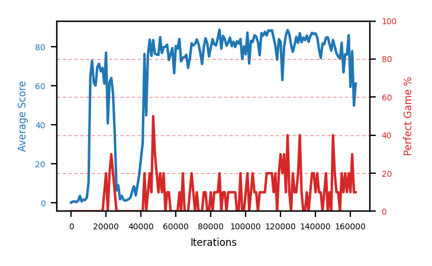

# b10a-disc995seed1

Blue is average score (food eaten) on the left axis, red is perfect-game percentage on the right.

Latest eval: step 163000, avg score 61.2, perfect games 10%.

## Config

| setting | value |
|---|---|
| policy_name | b10a-disc995seed1 |
| learning_rate | 1e-05 |
| batch_size | 128 |
| discount | 0.995 |
| target_update_period | 8 |
| target_update_tau | 1.0 |
| gradient_clipping | none |
| n_step_update | 1 |
| initial_epsilon | 0.4 |
| min_epsilon | 0.0 |
| fc_layer_params | (50, 100, 50) |
| replay_buffer | cpprb prioritized, capacity 100000 |
| priority_exponent (alpha) | 0.6 |
| priority_signal | td_loss |
| importance_sampling_beta | disabled |
| initial_populate_steps | 1000 |
| eval | 10 episodes every 1000 steps |
| grid | 9x9, max possible score 95 |
| DEATH_REWARD | -5.0 |
| FOOD_REWARD | 1.0 |
| FOOD_DISTANCE_REWARD | 0.001 |
| eval_only | False |
| min_checkpoint_score | 40.0 |

## Evals

164 evals so far. Full series in [`b10a-disc995seed1_evals.json`](b10a-disc995seed1_evals.json).

| step | avg score | trailing avg | min score | max score | avg reward | perfect % | epsilon |
|---|---|---|---|---|---|---|---|
| 0 | 0.1 | 0.1 | 0 | 1/95 | -4.901 | 0 | 0.4 |
| 1000 | 0.7 | 0.7 | 0 | 3/95 | -2.531 | 0 | 0.4 |
| 2000 | 0.7 | 0.7 | 0 | 2/95 | 0.142 | 0 | 0.4 |
| ... | | | | | | | |
| 152000 | 76.8 | 80.06 | 56 | 95/95 | 85.633 | 10 | 0.0 |
| 153000 | 75.0 | 78.74 | 8 | 95/95 | 83.82 | 10 | 0.0 |
| 154000 | 74.1 | 77.94 | 62 | 92/95 | 72.958 | 0 | 0.0 |
| 155000 | 82.2 | 77.66 | 63 | 95/95 | 100.902 | 20 | 0.0 |
| 156000 | 67.0 | 75.02 | 2 | 95/95 | 75.824 | 10 | 0.0 |
| 157000 | 76.2 | 74.9 | 54 | 95/95 | 94.609 | 20 | 0.0 |
| 158000 | 76.1 | 75.12 | 17 | 95/95 | 84.477 | 10 | 0.0 |
| 159000 | 86.0 | 77.5 | 69 | 95/95 | 104.708 | 20 | 0.0 |
| 160000 | 59.5 | 72.96 | 1 | 95/95 | 68.415 | 10 | 0.0 |
| 161000 | 77.9 | 75.14 | 1 | 95/95 | 106.23 | 30 | 0.0 |
| 162000 | 49.9 | 69.88 | 5 | 95/95 | 58.509 | 10 | 0.0 |
| 163000 | 61.2 | 66.9 | 1 | 95/95 | 69.292 | 10 | 0.0 |
