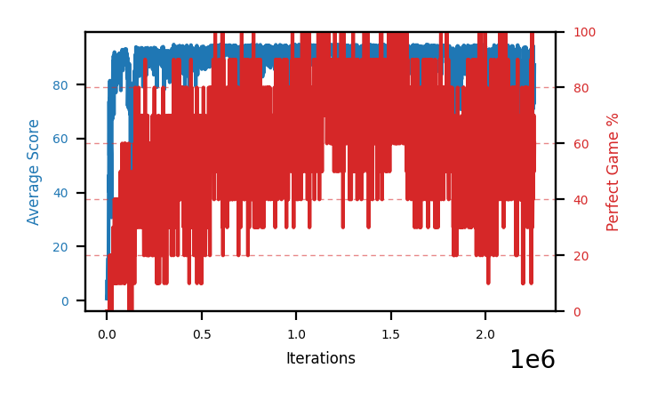

# b10b-disc995seed2

Blue is average score (food eaten) on the left axis, red is perfect-game percentage on the right.

Latest eval: step 2257000, avg score 87.3, perfect games 60%.

## Config

| setting | value |
|---|---|
| policy_name | b10b-disc995seed2 |
| learning_rate | 1e-05 |
| batch_size | 128 |
| discount | 0.995 |
| target_update_period | 8 |
| target_update_tau | 1.0 |
| gradient_clipping | none |
| n_step_update | 1 |
| initial_epsilon | 0.4 |
| min_epsilon | 0.0 |
| fc_layer_params | (50, 100, 50) |
| replay_buffer | cpprb prioritized, capacity 100000 |
| priority_exponent (alpha) | 0.6 |
| priority_signal | td_loss |
| importance_sampling_beta | disabled |
| initial_populate_steps | 1000 |
| eval | 10 episodes every 1000 steps |
| grid | 9x9, max possible score 95 |
| DEATH_REWARD | -5.0 |
| FOOD_REWARD | 1.0 |
| FOOD_DISTANCE_REWARD | 0.001 |
| eval_only | False |
| min_checkpoint_score | 40.0 |

## Evals

2258 evals so far. Full series in [`b10b-disc995seed2_evals.json`](b10b-disc995seed2_evals.json).

| step | avg score | trailing avg | min score | max score | avg reward | perfect % | epsilon |
|---|---|---|---|---|---|---|---|
| 0 | 0.7 | 0.7 | 0 | 3/95 | -4.301 | 0 | 0.4 |
| 1000 | 1.1 | 1.1 | 0 | 4/95 | 0.083 | 0 | 0.4 |
| 2000 | 7.6 | 4.35 | 0 | 24/95 | 6.516 | 0 | 0.2 |
| ... | | | | | | | |
| 2246000 | 82.9 | 83.72 | 3 | 95/95 | 161.01 | 80 | 0.0 |
| 2247000 | 48.1 | 76.68 | 0 | 95/95 | 76.174 | 30 | 0.0 |
| 2248000 | 76.4 | 74.82 | 0 | 95/95 | 113.246 | 40 | 0.0 |
| 2249000 | 83.2 | 77.12 | 8 | 95/95 | 151.16 | 70 | 0.0 |
| 2250000 | 71.0 | 72.32 | 0 | 95/95 | 109.298 | 40 | 0.0 |
| 2251000 | 94.4 | 74.62 | 93 | 95/95 | 162.717 | 70 | 0.0 |
| 2252000 | 83.5 | 81.7 | 4 | 95/95 | 131.172 | 50 | 0.0 |
| 2253000 | 74.6 | 81.34 | 0 | 95/95 | 143.214 | 70 | 0.0 |
| 2254000 | 84.2 | 81.54 | 1 | 95/95 | 152.748 | 70 | 0.0 |
| 2255000 | 72.9 | 81.92 | 1 | 95/95 | 141.139 | 70 | 0.0 |
| 2256000 | 82.1 | 79.46 | 0 | 95/95 | 128.897 | 50 | 0.0 |
| 2257000 | 87.3 | 80.22 | 38 | 95/95 | 144.435 | 60 | 0.0 |
