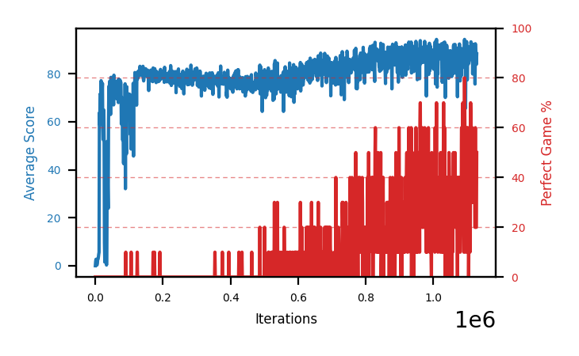

# b10c-disc995seed3

Blue is average score (food eaten) on the left axis, red is perfect-game percentage on the right.

Latest eval: step 1129000, avg score 88.2, perfect games 50%.

## Config

| setting | value |
|---|---|
| policy_name | b10c-disc995seed3 |
| learning_rate | 1e-05 |
| batch_size | 128 |
| discount | 0.995 |
| target_update_period | 8 |
| target_update_tau | 1.0 |
| gradient_clipping | none |
| n_step_update | 1 |
| initial_epsilon | 0.4 |
| min_epsilon | 0.0 |
| fc_layer_params | (50, 100, 50) |
| replay_buffer | cpprb prioritized, capacity 100000 |
| priority_exponent (alpha) | 0.6 |
| priority_signal | td_loss |
| importance_sampling_beta | disabled |
| initial_populate_steps | 1000 |
| eval | 10 episodes every 1000 steps |
| grid | 9x9, max possible score 95 |
| DEATH_REWARD | -5.0 |
| FOOD_REWARD | 1.0 |
| FOOD_DISTANCE_REWARD | 0.001 |
| eval_only | False |
| min_checkpoint_score | 40.0 |

## Evals

1130 evals so far. Full series in [`b10c-disc995seed3_evals.json`](b10c-disc995seed3_evals.json).

| step | avg score | trailing avg | min score | max score | avg reward | perfect % | epsilon |
|---|---|---|---|---|---|---|---|
| 0 | 0.0 | 0.0 | 0 | 0/95 | -5.001 | 0 | 0.4 |
| 1000 | 1.9 | 1.9 | 0 | 5/95 | 0.89 | 0 | 0.4 |
| 2000 | 2.7 | 2.3 | 0 | 8/95 | 1.691 | 0 | 0.4 |
| ... | | | | | | | |
| 1118000 | 88.8 | 87.4 | 63 | 95/95 | 137.365 | 50 | 0.0 |
| 1119000 | 92.3 | 88.46 | 85 | 95/95 | 140.771 | 50 | 0.0 |
| 1120000 | 87.8 | 88.08 | 61 | 95/95 | 126.292 | 40 | 0.0 |
| 1121000 | 90.6 | 87.88 | 79 | 95/95 | 138.679 | 50 | 0.0 |
| 1122000 | 89.2 | 89.74 | 71 | 95/95 | 137.61 | 50 | 0.0 |
| 1123000 | 85.9 | 89.16 | 55 | 95/95 | 124.344 | 40 | 0.0 |
| 1124000 | 75.7 | 85.84 | 43 | 95/95 | 93.488 | 20 | 0.0 |
| 1125000 | 92.5 | 86.78 | 87 | 95/95 | 150.974 | 60 | 0.0 |
| 1126000 | 87.1 | 86.08 | 59 | 95/95 | 104.71 | 20 | 0.0 |
| 1127000 | 89.1 | 86.06 | 81 | 95/95 | 107.239 | 20 | 0.0 |
| 1128000 | 83.9 | 85.66 | 49 | 95/95 | 101.083 | 20 | 0.0 |
| 1129000 | 88.2 | 88.16 | 47 | 95/95 | 136.645 | 50 | 0.0 |
