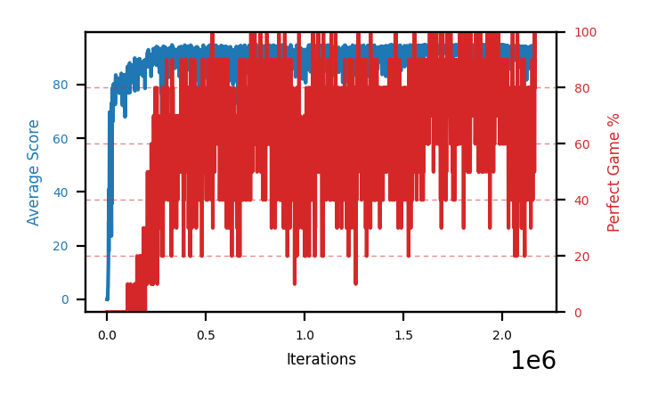

# b10d-disc995seed4

Blue is average score (food eaten) on the left axis, red is perfect-game percentage on the right.

Latest eval: step 2165000, avg score 94.6, perfect games 90%.

## Config

| setting | value |
|---|---|
| policy_name | b10d-disc995seed4 |
| learning_rate | 1e-05 |
| batch_size | 128 |
| discount | 0.995 |
| target_update_period | 8 |
| target_update_tau | 1.0 |
| gradient_clipping | none |
| n_step_update | 1 |
| initial_epsilon | 0.4 |
| min_epsilon | 0.0 |
| fc_layer_params | (50, 100, 50) |
| replay_buffer | cpprb prioritized, capacity 100000 |
| priority_exponent (alpha) | 0.6 |
| priority_signal | td_loss |
| importance_sampling_beta | disabled |
| initial_populate_steps | 1000 |
| eval | 10 episodes every 1000 steps |
| grid | 9x9, max possible score 95 |
| DEATH_REWARD | -5.0 |
| FOOD_REWARD | 1.0 |
| FOOD_DISTANCE_REWARD | 0.001 |
| eval_only | False |
| min_checkpoint_score | 40.0 |

## Evals

2166 evals so far. Full series in [`b10d-disc995seed4_evals.json`](b10d-disc995seed4_evals.json).

| step | avg score | trailing avg | min score | max score | avg reward | perfect % | epsilon |
|---|---|---|---|---|---|---|---|
| 0 | 0.0 | 0.0 | 0 | 0/95 | -5.004 | 0 | 0.4 |
| 1000 | 0.4 | 0.4 | 0 | 2/95 | -0.152 | 0 | 0.4 |
| 2000 | 0.0 | 0.2 | 0 | 0/95 | -0.548 | 0 | 0.4 |
| ... | | | | | | | |
| 2154000 | 92.2 | 91.04 | 81 | 95/95 | 160.621 | 70 | 0.0 |
| 2155000 | 92.9 | 90.84 | 85 | 95/95 | 160.891 | 70 | 0.0 |
| 2156000 | 91.6 | 91.74 | 78 | 95/95 | 139.466 | 50 | 0.0 |
| 2157000 | 91.8 | 91.5 | 71 | 95/95 | 170.184 | 80 | 0.0 |
| 2158000 | 91.8 | 92.06 | 76 | 95/95 | 149.329 | 60 | 0.0 |
| 2159000 | 94.5 | 92.52 | 90 | 95/95 | 182.505 | 90 | 0.0 |
| 2160000 | 92.1 | 92.36 | 76 | 95/95 | 170.463 | 80 | 0.0 |
| 2161000 | 87.4 | 91.52 | 68 | 95/95 | 135.051 | 50 | 0.0 |
| 2162000 | 93.7 | 91.9 | 87 | 95/95 | 161.565 | 70 | 0.0 |
| 2163000 | 95.0 | 92.54 | 95 | 95/95 | 193.348 | 100 | 0.0 |
| 2164000 | 89.8 | 91.6 | 65 | 95/95 | 167.708 | 80 | 0.0 |
| 2165000 | 94.6 | 92.1 | 91 | 95/95 | 182.49 | 90 | 0.0 |
