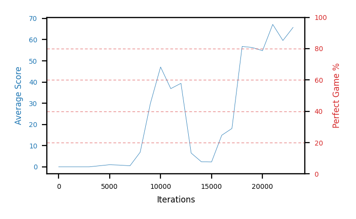

# b11a-obs30seed1

Blue is average score (food eaten) on the left axis, red is perfect-game percentage on the right.

Latest eval: step 23000, avg score 65.8, perfect games 0%.

## Config

| setting | value |
|---|---|
| policy_name | b11a-obs30seed1 |
| seed | 1 |
| zeroed_observations | none |
| learning_rate | 1e-05 |
| batch_size | 128 |
| discount | 0.995 |
| target_update_period | 8 |
| target_update_tau | 1.0 |
| gradient_clipping | none |
| n_step_update | 1 |
| initial_epsilon | 0.4 |
| min_epsilon | 0.0 |
| fc_layer_params | (50, 100, 50) |
| replay_buffer | cpprb prioritized, capacity 100000 |
| priority_exponent (alpha) | 0.6 |
| priority_signal | td_loss |
| importance_sampling_beta | disabled |
| initial_populate_steps | 1000 |
| eval | 10 episodes every 1000 steps |
| grid | 9x9, max possible score 95 |
| DEATH_REWARD | -5.0 |
| FOOD_REWARD | 1.0 |
| FOOD_DISTANCE_REWARD | 0.001 |
| eval_only | False |
| min_checkpoint_score | 40.0 |

## Evals

24 evals so far. Full series in [`b11a-obs30seed1_evals.json`](b11a-obs30seed1_evals.json).

| step | avg score | trailing avg | min score | max score | avg reward | perfect % | epsilon |
|---|---|---|---|---|---|---|---|
| 0 | 0.0 | 0.0 | 0 | 0/95 | -5.002 | 0 | 0.4 |
| 1000 | 0.0 | 0.0 | 0 | 0/95 | -0.549 | 0 | 0.4 |
| 2000 | 0.0 | 0.0 | 0 | 0/95 | -0.549 | 0 | 0.4 |
| ... | | | | | | | |
| 12000 | 39.4 | 32.04 | 4 | 71/95 | 36.165 | 0 | 0.05 |
| 13000 | 6.5 | 31.96 | 0 | 13/95 | 5.875 | 0 | 0.05 |
| 14000 | 2.4 | 26.46 | 0 | 6/95 | 1.831 | 0 | 0.05 |
| 15000 | 2.3 | 17.5 | 0 | 6/95 | 1.733 | 0 | 0.05 |
| 16000 | 14.9 | 13.1 | 0 | 78/95 | 13.279 | 0 | 0.05 |
| 17000 | 18.1 | 8.84 | 3 | 72/95 | 16.45 | 0 | 0.05 |
| 18000 | 56.8 | 18.9 | 4 | 85/95 | 53.347 | 0 | 0.01 |
| 19000 | 56.3 | 29.68 | 3 | 81/95 | 51.534 | 0 | 0.01 |
| 20000 | 54.8 | 40.18 | 4 | 74/95 | 51.471 | 0 | 0.01 |
| 21000 | 67.2 | 50.64 | 50 | 84/95 | 63.363 | 0 | 0.001 |
| 22000 | 59.6 | 58.94 | 26 | 84/95 | 55.483 | 0 | 0.001 |
| 23000 | 65.8 | 60.74 | 56 | 73/95 | 61.137 | 0 | 0.001 |
