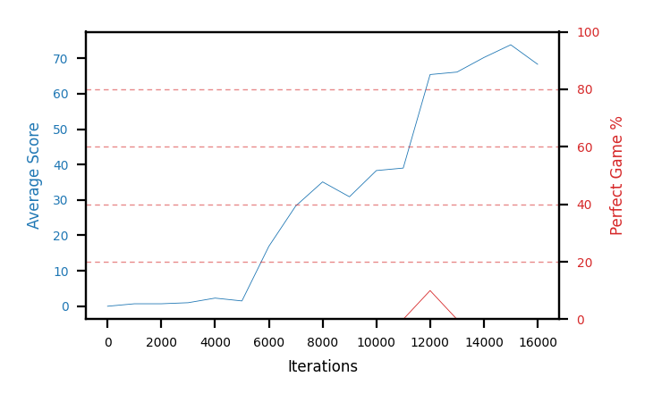

# b11b-obs30seed2

Blue is average score (food eaten) on the left axis, red is perfect-game percentage on the right.

Latest eval: step 3559000, avg score 94.4, perfect games 80%.

## Config

| setting | value |
|---|---|
| policy_name | b11b-obs30seed2 |
| seed | 2 |
| zeroed_observations | none |
| learning_rate | 1e-05 |
| batch_size | 128 |
| discount | 0.995 |
| target_update_period | 8 |
| target_update_tau | 1.0 |
| gradient_clipping | none |
| n_step_update | 1 |
| initial_epsilon | 0.4 |
| min_epsilon | 0.0 |
| fc_layer_params | (50, 100, 50) |
| replay_buffer | cpprb prioritized, capacity 100000 |
| priority_exponent (alpha) | 0.6 |
| priority_signal | td_loss |
| importance_sampling_beta | disabled |
| initial_populate_steps | 1000 |
| eval | 10 episodes every 1000 steps |
| grid | 9x9, max possible score 95 |
| DEATH_REWARD | -5.0 |
| FOOD_REWARD | 1.0 |
| FOOD_DISTANCE_REWARD | 0.001 |
| eval_only | False |
| min_checkpoint_score | 40.0 |

## Evals

3560 evals so far. Full series in [`b11b-obs30seed2_evals.json`](b11b-obs30seed2_evals.json).

| step | avg score | trailing avg | min score | max score | avg reward | perfect % | epsilon |
|---|---|---|---|---|---|---|---|
| 0 | 0.0 | 0.0 | 0 | 0/95 | -5.003 | 0 | 0.4 |
| 1000 | 0.7 | 0.7 | 0 | 3/95 | -0.745 | 0 | 0.4 |
| 2000 | 0.7 | 0.7 | 0 | 2/95 | 0.146 | 0 | 0.4 |
| ... | | | | | | | |
| 3548000 | 93.0 | 91.88 | 81 | 95/95 | 161.492 | 70 | 0.0 |
| 3549000 | 93.7 | 91.76 | 90 | 95/95 | 162.222 | 70 | 0.0 |
| 3550000 | 93.9 | 92.14 | 88 | 95/95 | 161.947 | 70 | 0.0 |
| 3551000 | 94.8 | 92.6 | 93 | 95/95 | 183.199 | 90 | 0.0 |
| 3552000 | 93.8 | 93.84 | 88 | 95/95 | 172.24 | 80 | 0.0 |
| 3553000 | 93.6 | 93.96 | 84 | 95/95 | 172.101 | 80 | 0.0 |
| 3554000 | 91.2 | 93.46 | 62 | 95/95 | 159.706 | 70 | 0.0 |
| 3555000 | 93.5 | 93.38 | 88 | 95/95 | 161.916 | 70 | 0.0 |
| 3556000 | 93.9 | 93.2 | 87 | 95/95 | 172.357 | 80 | 0.0 |
| 3557000 | 94.7 | 93.38 | 92 | 95/95 | 183.068 | 90 | 0.0 |
| 3558000 | 94.4 | 93.54 | 92 | 95/95 | 172.862 | 80 | 0.0 |
| 3559000 | 94.4 | 94.18 | 92 | 95/95 | 172.756 | 80 | 0.0 |
