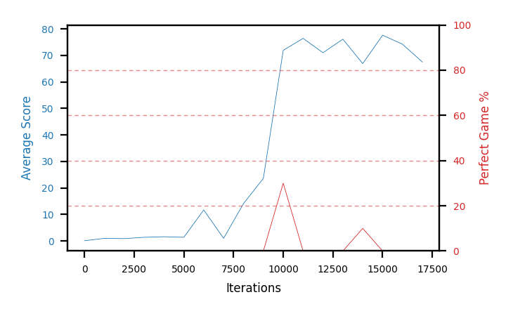

# b11c-obs30seed3

Blue is average score (food eaten) on the left axis, red is perfect-game percentage on the right.

Latest eval: step 17000, avg score 67.5, perfect games 0%.

## Config

| setting | value |
|---|---|
| policy_name | b11c-obs30seed3 |
| seed | 3 |
| zeroed_observations | none |
| learning_rate | 1e-05 |
| batch_size | 128 |
| discount | 0.995 |
| target_update_period | 8 |
| target_update_tau | 1.0 |
| gradient_clipping | none |
| n_step_update | 1 |
| initial_epsilon | 0.4 |
| min_epsilon | 0.0 |
| fc_layer_params | (50, 100, 50) |
| replay_buffer | cpprb prioritized, capacity 100000 |
| priority_exponent (alpha) | 0.6 |
| priority_signal | td_loss |
| importance_sampling_beta | disabled |
| initial_populate_steps | 1000 |
| eval | 10 episodes every 1000 steps |
| grid | 9x9, max possible score 95 |
| DEATH_REWARD | -5.0 |
| FOOD_REWARD | 1.0 |
| FOOD_DISTANCE_REWARD | 0.001 |
| eval_only | False |
| min_checkpoint_score | 40.0 |

## Evals

18 evals so far. Full series in [`b11c-obs30seed3_evals.json`](b11c-obs30seed3_evals.json).

| step | avg score | trailing avg | min score | max score | avg reward | perfect % | epsilon |
|---|---|---|---|---|---|---|---|
| 0 | 0.1 | 0.1 | 0 | 1/95 | -4.902 | 0 | 0.4 |
| 1000 | 1.0 | 1.0 | 0 | 4/95 | 0.445 | 0 | 0.4 |
| 2000 | 0.9 | 0.95 | 0 | 4/95 | 0.347 | 0 | 0.4 |
| ... | | | | | | | |
| 6000 | 11.7 | 3.4 | 7 | 16/95 | 11.019 | 0 | 0.2 |
| 7000 | 1.0 | 3.42 | 0 | 3/95 | 0.442 | 0 | 0.2 |
| 8000 | 14.1 | 5.96 | 9 | 18/95 | 13.408 | 0 | 0.1 |
| 9000 | 23.6 | 10.36 | 20 | 27/95 | 22.732 | 0 | 0.05 |
| 10000 | 71.9 | 24.46 | 30 | 95/95 | 99.555 | 30 | 0.01 |
| 11000 | 76.4 | 37.4 | 69 | 94/95 | 73.665 | 0 | 0.001 |
| 12000 | 71.0 | 51.4 | 51 | 90/95 | 68.677 | 0 | 0.001 |
| 13000 | 76.1 | 63.8 | 46 | 86/95 | 72.983 | 0 | 0.001 |
| 14000 | 66.9 | 72.46 | 1 | 95/95 | 74.276 | 10 | 0.001 |
| 15000 | 77.6 | 73.6 | 66 | 89/95 | 76.178 | 0 | 0.001 |
| 16000 | 74.2 | 73.16 | 38 | 88/95 | 72.856 | 0 | 0.001 |
| 17000 | 67.5 | 72.46 | 4 | 83/95 | 66.2 | 0 | 0.001 |
