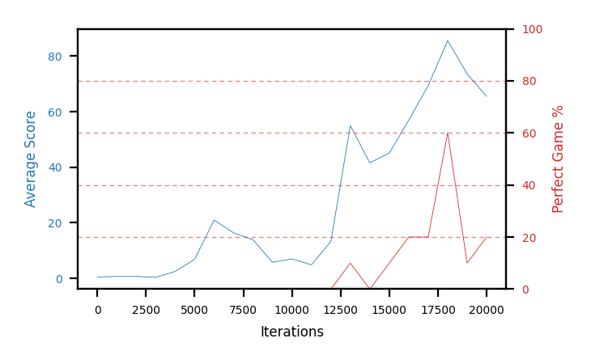

# b11d-obs30seed4

Blue is average score (food eaten) on the left axis, red is perfect-game percentage on the right.

Latest eval: step 20000, avg score 65.5, perfect games 20%.

## Config

| setting | value |
|---|---|
| policy_name | b11d-obs30seed4 |
| seed | 4 |
| zeroed_observations | none |
| learning_rate | 1e-05 |
| batch_size | 128 |
| discount | 0.995 |
| target_update_period | 8 |
| target_update_tau | 1.0 |
| gradient_clipping | none |
| n_step_update | 1 |
| initial_epsilon | 0.4 |
| min_epsilon | 0.0 |
| fc_layer_params | (50, 100, 50) |
| replay_buffer | cpprb prioritized, capacity 100000 |
| priority_exponent (alpha) | 0.6 |
| priority_signal | td_loss |
| importance_sampling_beta | disabled |
| initial_populate_steps | 1000 |
| eval | 10 episodes every 1000 steps |
| grid | 9x9, max possible score 95 |
| DEATH_REWARD | -5.0 |
| FOOD_REWARD | 1.0 |
| FOOD_DISTANCE_REWARD | 0.001 |
| eval_only | False |
| min_checkpoint_score | 40.0 |

## Evals

21 evals so far. Full series in [`b11d-obs30seed4_evals.json`](b11d-obs30seed4_evals.json).

| step | avg score | trailing avg | min score | max score | avg reward | perfect % | epsilon |
|---|---|---|---|---|---|---|---|
| 0 | 0.5 | 0.5 | 0 | 1/95 | -4.503 | 0 | 0.4 |
| 1000 | 0.7 | 0.7 | 0 | 3/95 | 0.148 | 0 | 0.4 |
| 2000 | 0.7 | 0.7 | 0 | 2/95 | 0.146 | 0 | 0.4 |
| ... | | | | | | | |
| 9000 | 5.8 | 12.8 | 1 | 13/95 | 5.222 | 0 | 0.1 |
| 10000 | 7.0 | 12.82 | 0 | 22/95 | 6.419 | 0 | 0.1 |
| 11000 | 4.9 | 9.6 | 0 | 15/95 | 4.323 | 0 | 0.1 |
| 12000 | 13.3 | 8.98 | 1 | 27/95 | 12.593 | 0 | 0.1 |
| 13000 | 55.0 | 17.2 | 3 | 95/95 | 63.063 | 10 | 0.05 |
| 14000 | 41.6 | 24.36 | 3 | 64/95 | 40.283 | 0 | 0.01 |
| 15000 | 45.1 | 31.98 | 15 | 95/95 | 53.825 | 10 | 0.01 |
| 16000 | 56.9 | 42.38 | 29 | 95/95 | 75.337 | 20 | 0.001 |
| 17000 | 69.4 | 53.6 | 43 | 95/95 | 87.394 | 20 | 0.001 |
| 18000 | 85.6 | 59.72 | 59 | 95/95 | 143.953 | 60 | 0.0 |
| 19000 | 73.6 | 66.12 | 23 | 95/95 | 82.208 | 10 | 0.0 |
| 20000 | 65.5 | 70.2 | 6 | 95/95 | 84.244 | 20 | 0.0 |
