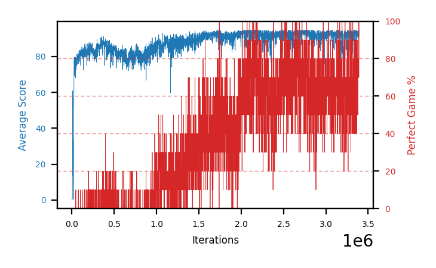

# b13a-shieldseed1

Blue is average score (food eaten) on the left axis, red is perfect-game percentage on the right.

Latest eval: step 3391000, avg score 91.8, perfect games 70%.

## Config

| setting | value |
|---|---|
| policy_name | b13a-shieldseed1 |
| seed | 1 |
| zeroed_observations | none |
| learning_rate | 1e-05 |
| batch_size | 128 |
| discount | 0.995 |
| target_update_period | 8 |
| target_update_tau | 1.0 |
| gradient_clipping | none |
| n_step_update | 1 |
| initial_epsilon | 0.4 |
| min_epsilon | 0.002 |
| epsilon_schedule | bootstrap on avg_reward [2, 5, 10, 15, 20] then geometric to floor by 80% trailing-30 perfect |
| guided_fraction | 0.5 |
| exploration_shield | 50% of refinement-phase episodes draw the epsilon move from non-fatal actions; greedy moves never shielded |
| fc_layer_params | (50, 100, 50) |
| replay_buffer | cpprb prioritized, capacity 100000 |
| priority_exponent (alpha) | 0.6 |
| priority_signal | td_loss |
| importance_sampling_beta | disabled |
| initial_populate_steps | 1000 |
| eval | 10 episodes every 1000 steps |
| grid | 9x9, max possible score 95 |
| DEATH_REWARD | -5.0 |
| FOOD_REWARD | 1.0 |
| FOOD_DISTANCE_REWARD | 0.001 |
| eval_only | False |
| min_checkpoint_score | 40.0 |

## Evals

3392 evals so far. Full series in [`b13a-shieldseed1_evals.json`](b13a-shieldseed1_evals.json).

| step | avg score | trailing avg | min score | max score | avg reward | perfect % | epsilon |
|---|---|---|---|---|---|---|---|
| 0 | 0.0 | 0.0 | 0 | 0/95 | -5.002 | 0 | 0.4 |
| 1000 | 0.0 | 0.0 | 0 | 0/95 | -0.548 | 0 | 0.4 |
| 2000 | 0.0 | 0.0 | 0 | 0/95 | -0.549 | 0 | 0.4 |
| ... | | | | | | | |
| 3380000 | 93.8 | 93.04 | 86 | 95/95 | 172.322 | 80 | 0.0028 |
| 3381000 | 94.1 | 93.14 | 88 | 95/95 | 172.502 | 80 | 0.0028 |
| 3382000 | 92.4 | 93.5 | 80 | 95/95 | 160.46 | 70 | 0.0028 |
| 3383000 | 93.2 | 93.4 | 83 | 95/95 | 160.712 | 70 | 0.0027 |
| 3384000 | 93.8 | 93.46 | 86 | 95/95 | 171.75 | 80 | 0.0027 |
| 3385000 | 94.2 | 93.54 | 91 | 95/95 | 162.268 | 70 | 0.0027 |
| 3386000 | 94.1 | 93.54 | 89 | 95/95 | 171.982 | 80 | 0.0027 |
| 3387000 | 93.8 | 93.82 | 90 | 95/95 | 162.217 | 70 | 0.0027 |
| 3388000 | 94.2 | 94.02 | 90 | 95/95 | 172.18 | 80 | 0.0026 |
| 3389000 | 93.8 | 94.02 | 88 | 95/95 | 172.316 | 80 | 0.0026 |
| 3390000 | 95.0 | 94.18 | 95 | 95/95 | 193.397 | 100 | 0.0025 |
| 3391000 | 91.8 | 93.72 | 76 | 95/95 | 160.219 | 70 | 0.0024 |
