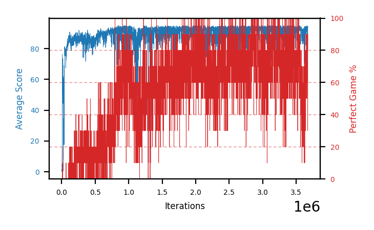

# b13c-shieldseed3

Blue is average score (food eaten) on the left axis, red is perfect-game percentage on the right.

Latest eval: step 3674000, avg score 93.9, perfect games 90%.

## Config

| setting | value |
|---|---|
| policy_name | b13c-shieldseed3 |
| seed | 3 |
| zeroed_observations | none |
| learning_rate | 1e-05 |
| batch_size | 128 |
| discount | 0.995 |
| target_update_period | 8 |
| target_update_tau | 1.0 |
| gradient_clipping | none |
| n_step_update | 1 |
| initial_epsilon | 0.4 |
| min_epsilon | 0.002 |
| epsilon_schedule | bootstrap on avg_reward [2, 5, 10, 15, 20] then geometric to floor by 80% trailing-30 perfect |
| guided_fraction | 0.5 |
| exploration_shield | 50% of refinement-phase episodes draw the epsilon move from non-fatal actions; greedy moves never shielded |
| fc_layer_params | (50, 100, 50) |
| replay_buffer | cpprb prioritized, capacity 100000 |
| priority_exponent (alpha) | 0.6 |
| priority_signal | td_loss |
| importance_sampling_beta | disabled |
| initial_populate_steps | 1000 |
| eval | 10 episodes every 1000 steps |
| grid | 9x9, max possible score 95 |
| DEATH_REWARD | -5.0 |
| FOOD_REWARD | 1.0 |
| FOOD_DISTANCE_REWARD | 0.001 |
| eval_only | False |
| min_checkpoint_score | 40.0 |

## Evals

3675 evals so far. Full series in [`b13c-shieldseed3_evals.json`](b13c-shieldseed3_evals.json).

| step | avg score | trailing avg | min score | max score | avg reward | perfect % | epsilon |
|---|---|---|---|---|---|---|---|
| 0 | 0.1 | 0.1 | 0 | 1/95 | -4.902 | 0 | 0.4 |
| 1000 | 1.5 | 1.5 | 0 | 4/95 | 0.935 | 0 | 0.4 |
| 2000 | 0.9 | 1.2 | 0 | 5/95 | 0.345 | 0 | 0.4 |
| ... | | | | | | | |
| 3663000 | 92.7 | 91.98 | 76 | 95/95 | 170.752 | 80 | 0.0025 |
| 3664000 | 94.2 | 92.38 | 90 | 95/95 | 171.822 | 80 | 0.0025 |
| 3665000 | 93.3 | 92.22 | 85 | 95/95 | 171.258 | 80 | 0.0025 |
| 3666000 | 85.6 | 90.78 | 1 | 95/95 | 174.116 | 90 | 0.0025 |
| 3667000 | 93.1 | 91.78 | 86 | 95/95 | 161.102 | 70 | 0.0024 |
| 3668000 | 91.7 | 91.58 | 62 | 95/95 | 180.106 | 90 | 0.0024 |
| 3669000 | 94.7 | 91.68 | 92 | 95/95 | 183.052 | 90 | 0.0023 |
| 3670000 | 93.1 | 91.64 | 84 | 95/95 | 160.753 | 70 | 0.0024 |
| 3671000 | 89.7 | 92.46 | 71 | 95/95 | 118.165 | 30 | 0.0024 |
| 3672000 | 94.0 | 92.64 | 90 | 95/95 | 171.844 | 80 | 0.0024 |
| 3673000 | 94.3 | 93.16 | 90 | 95/95 | 172.196 | 80 | 0.0024 |
| 3674000 | 93.9 | 93.0 | 84 | 95/95 | 182.375 | 90 | 0.0023 |
