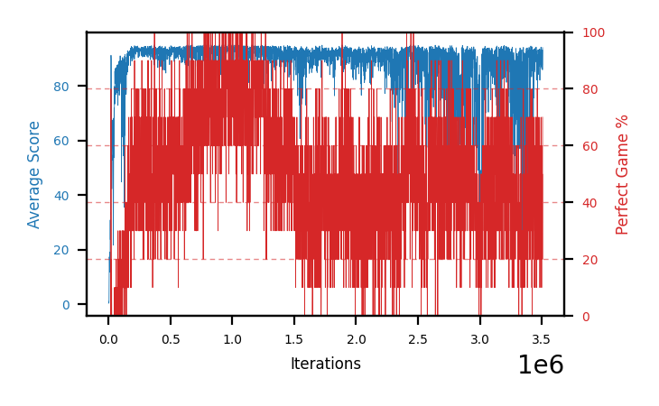

# b13d-shieldseed4

Blue is average score (food eaten) on the left axis, red is perfect-game percentage on the right.

Latest eval: step 3506000, avg score 94.0, perfect games 70%.

## Config

| setting | value |
|---|---|
| policy_name | b13d-shieldseed4 |
| seed | 4 |
| zeroed_observations | none |
| learning_rate | 1e-05 |
| batch_size | 128 |
| discount | 0.995 |
| target_update_period | 8 |
| target_update_tau | 1.0 |
| gradient_clipping | none |
| n_step_update | 1 |
| initial_epsilon | 0.4 |
| min_epsilon | 0.002 |
| epsilon_schedule | bootstrap on avg_reward [2, 5, 10, 15, 20] then geometric to floor by 80% trailing-30 perfect |
| guided_fraction | 0.5 |
| exploration_shield | 50% of refinement-phase episodes draw the epsilon move from non-fatal actions; greedy moves never shielded |
| fc_layer_params | (50, 100, 50) |
| replay_buffer | cpprb prioritized, capacity 100000 |
| priority_exponent (alpha) | 0.6 |
| priority_signal | td_loss |
| importance_sampling_beta | disabled |
| initial_populate_steps | 1000 |
| eval | 10 episodes every 1000 steps |
| grid | 9x9, max possible score 95 |
| DEATH_REWARD | -5.0 |
| FOOD_REWARD | 1.0 |
| FOOD_DISTANCE_REWARD | 0.001 |
| eval_only | False |
| min_checkpoint_score | 40.0 |

## Evals

3507 evals so far. Full series in [`b13d-shieldseed4_evals.json`](b13d-shieldseed4_evals.json).

| step | avg score | trailing avg | min score | max score | avg reward | perfect % | epsilon |
|---|---|---|---|---|---|---|---|
| 0 | 0.5 | 0.5 | 0 | 1/95 | -4.503 | 0 | 0.4 |
| 1000 | 0.7 | 0.7 | 0 | 3/95 | 0.147 | 0 | 0.4 |
| 2000 | 1.1 | 0.9 | 0 | 3/95 | 0.544 | 0 | 0.4 |
| ... | | | | | | | |
| 3495000 | 89.0 | 91.24 | 65 | 95/95 | 127.357 | 40 | 0.0047 |
| 3496000 | 87.3 | 90.36 | 74 | 95/95 | 105.376 | 20 | 0.0048 |
| 3497000 | 87.9 | 89.78 | 67 | 95/95 | 105.486 | 20 | 0.0049 |
| 3498000 | 89.6 | 88.86 | 82 | 95/95 | 97.174 | 10 | 0.005 |
| 3499000 | 86.5 | 88.06 | 55 | 95/95 | 104.588 | 20 | 0.0052 |
| 3500000 | 92.3 | 88.72 | 84 | 95/95 | 140.704 | 50 | 0.0052 |
| 3501000 | 92.2 | 89.7 | 86 | 95/95 | 130.613 | 40 | 0.0051 |
| 3502000 | 93.0 | 90.72 | 86 | 95/95 | 151.453 | 60 | 0.0051 |
| 3503000 | 87.6 | 90.32 | 70 | 95/95 | 105.683 | 20 | 0.0051 |
| 3504000 | 93.2 | 91.66 | 90 | 95/95 | 141.285 | 50 | 0.0051 |
| 3505000 | 85.9 | 90.38 | 61 | 95/95 | 103.615 | 20 | 0.0052 |
| 3506000 | 94.0 | 90.74 | 90 | 95/95 | 162.489 | 70 | 0.005 |
