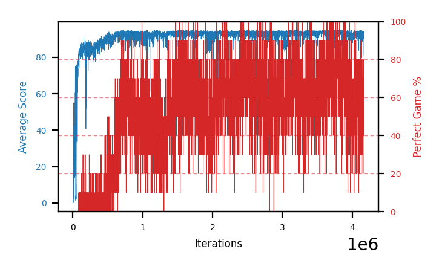

# b14a-disc9975seed1

Blue is average score (food eaten) on the left axis, red is perfect-game percentage on the right.

Latest eval: step 4169000, avg score 93.6, perfect games 60%.

## Config

| setting | value |
|---|---|
| policy_name | b14a-disc9975seed1 |
| seed | 1 |
| zeroed_observations | none |
| learning_rate | 1e-05 |
| batch_size | 128 |
| discount | 0.9975 |
| target_update_period | 8 |
| target_update_tau | 1.0 |
| gradient_clipping | none |
| n_step_update | 1 |
| initial_epsilon | 0.4 |
| min_epsilon | 0.002 |
| epsilon_schedule | bootstrap on avg_reward [2, 5, 10, 15, 20] then geometric to floor by 80% trailing-30 perfect |
| guided_fraction | 0.8 |
| exploration_shield | 80% of refinement-phase episodes draw the epsilon move from non-fatal actions; greedy moves never shielded |
| fc_layer_params | (50, 100, 50) |
| replay_buffer | cpprb prioritized, capacity 100000 |
| priority_exponent (alpha) | 0.6 |
| priority_signal | td_loss |
| importance_sampling_beta | disabled |
| max_steps | 5000000 |
| initial_populate_steps | 1000 |
| eval | 10 episodes every 1000 steps |
| grid | 9x9, max possible score 95 |
| DEATH_REWARD | -5.0 |
| FOOD_REWARD | 1.0 |
| FOOD_DISTANCE_REWARD | 0.001 |
| eval_only | False |
| min_checkpoint_score | 40.0 |

## Evals

4170 evals so far. Full series in [`b14a-disc9975seed1_evals.json`](b14a-disc9975seed1_evals.json).

| step | avg score | trailing avg | min score | max score | avg reward | perfect % | epsilon |
|---|---|---|---|---|---|---|---|
| 0 | 0.0 | 0.0 | 0 | 0/95 | -5.002 | 0 | 0.4 |
| 1000 | 0.0 | 0.0 | 0 | 0/95 | -0.55 | 0 | 0.4 |
| 2000 | 0.0 | 0.0 | 0 | 0/95 | -3.696 | 0 | 0.4 |
| ... | | | | | | | |
| 4158000 | 81.1 | 90.8 | 3 | 95/95 | 96.565 | 20 | 0.0035 |
| 4159000 | 91.4 | 91.02 | 86 | 95/95 | 106.368 | 20 | 0.0036 |
| 4160000 | 92.0 | 90.54 | 84 | 95/95 | 148.557 | 60 | 0.0035 |
| 4161000 | 93.3 | 90.34 | 88 | 95/95 | 139.573 | 50 | 0.0036 |
| 4162000 | 90.6 | 89.68 | 76 | 95/95 | 126.361 | 40 | 0.0036 |
| 4163000 | 93.8 | 92.22 | 91 | 95/95 | 139.996 | 50 | 0.0037 |
| 4164000 | 94.1 | 92.76 | 90 | 95/95 | 161.174 | 70 | 0.0036 |
| 4165000 | 92.2 | 92.8 | 86 | 95/95 | 127.933 | 40 | 0.0037 |
| 4166000 | 92.5 | 92.64 | 82 | 95/95 | 159.53 | 70 | 0.0037 |
| 4167000 | 90.1 | 92.54 | 67 | 95/95 | 125.904 | 40 | 0.0036 |
| 4168000 | 93.7 | 92.52 | 84 | 95/95 | 171.131 | 80 | 0.0036 |
| 4169000 | 93.6 | 92.42 | 89 | 95/95 | 150.304 | 60 | 0.0036 |
