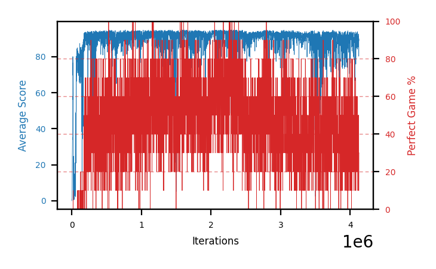

# b14b-disc9975seed2

Blue is average score (food eaten) on the left axis, red is perfect-game percentage on the right.

Latest eval: step 4125000, avg score 89.0, perfect games 30%.

## Config

| setting | value |
|---|---|
| policy_name | b14b-disc9975seed2 |
| seed | 2 |
| zeroed_observations | none |
| learning_rate | 1e-05 |
| batch_size | 128 |
| discount | 0.9975 |
| target_update_period | 8 |
| target_update_tau | 1.0 |
| gradient_clipping | none |
| n_step_update | 1 |
| initial_epsilon | 0.4 |
| min_epsilon | 0.002 |
| epsilon_schedule | bootstrap on avg_reward [2, 5, 10, 15, 20] then geometric to floor by 80% trailing-30 perfect |
| guided_fraction | 0.8 |
| exploration_shield | 80% of refinement-phase episodes draw the epsilon move from non-fatal actions; greedy moves never shielded |
| fc_layer_params | (50, 100, 50) |
| replay_buffer | cpprb prioritized, capacity 100000 |
| priority_exponent (alpha) | 0.6 |
| priority_signal | td_loss |
| importance_sampling_beta | disabled |
| max_steps | 5000000 |
| initial_populate_steps | 1000 |
| eval | 10 episodes every 1000 steps |
| grid | 9x9, max possible score 95 |
| DEATH_REWARD | -5.0 |
| FOOD_REWARD | 1.0 |
| FOOD_DISTANCE_REWARD | 0.001 |
| eval_only | False |
| min_checkpoint_score | 40.0 |

## Evals

4126 evals so far. Full series in [`b14b-disc9975seed2_evals.json`](b14b-disc9975seed2_evals.json).

| step | avg score | trailing avg | min score | max score | avg reward | perfect % | epsilon |
|---|---|---|---|---|---|---|---|
| 0 | 0.0 | 0.0 | 0 | 0/95 | -5.003 | 0 | 0.4 |
| 1000 | 0.8 | 0.8 | 0 | 3/95 | -0.201 | 0 | 0.4 |
| 2000 | 0.7 | 0.75 | 0 | 2/95 | 0.146 | 0 | 0.4 |
| ... | | | | | | | |
| 4114000 | 89.7 | 89.66 | 83 | 95/95 | 104.57 | 20 | 0.0058 |
| 4115000 | 90.5 | 89.88 | 86 | 95/95 | 94.989 | 10 | 0.006 |
| 4116000 | 91.1 | 90.5 | 76 | 95/95 | 126.898 | 40 | 0.0061 |
| 4117000 | 91.4 | 90.72 | 84 | 95/95 | 106.267 | 20 | 0.0062 |
| 4118000 | 90.2 | 90.58 | 80 | 95/95 | 105.048 | 20 | 0.0062 |
| 4119000 | 92.6 | 91.16 | 84 | 95/95 | 138.88 | 50 | 0.0061 |
| 4120000 | 92.1 | 91.48 | 84 | 95/95 | 127.791 | 40 | 0.0061 |
| 4121000 | 89.4 | 91.14 | 62 | 95/95 | 135.52 | 50 | 0.0061 |
| 4122000 | 80.3 | 88.92 | 46 | 95/95 | 84.924 | 10 | 0.0061 |
| 4123000 | 90.1 | 88.9 | 80 | 95/95 | 94.555 | 10 | 0.0062 |
| 4124000 | 89.7 | 88.32 | 78 | 95/95 | 114.918 | 30 | 0.0062 |
| 4125000 | 89.0 | 87.7 | 74 | 95/95 | 114.326 | 30 | 0.0064 |
