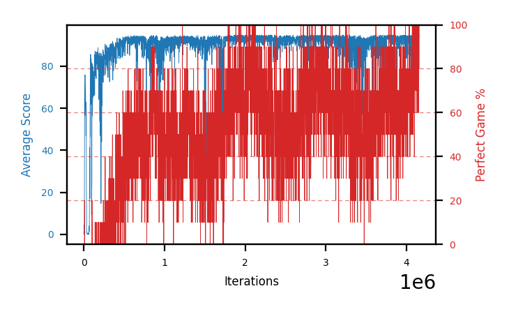

# b14c-disc9975seed3

Blue is average score (food eaten) on the left axis, red is perfect-game percentage on the right.

Latest eval: step 4157000, avg score 94.3, perfect games 80%.

## Config

| setting | value |
|---|---|
| policy_name | b14c-disc9975seed3 |
| seed | 3 |
| zeroed_observations | none |
| learning_rate | 1e-05 |
| batch_size | 128 |
| discount | 0.9975 |
| target_update_period | 8 |
| target_update_tau | 1.0 |
| gradient_clipping | none |
| n_step_update | 1 |
| initial_epsilon | 0.4 |
| min_epsilon | 0.002 |
| epsilon_schedule | bootstrap on avg_reward [2, 5, 10, 15, 20] then geometric to floor by 80% trailing-30 perfect |
| guided_fraction | 0.8 |
| exploration_shield | 80% of refinement-phase episodes draw the epsilon move from non-fatal actions; greedy moves never shielded |
| fc_layer_params | (50, 100, 50) |
| replay_buffer | cpprb prioritized, capacity 100000 |
| priority_exponent (alpha) | 0.6 |
| priority_signal | td_loss |
| importance_sampling_beta | disabled |
| max_steps | 5000000 |
| initial_populate_steps | 1000 |
| eval | 10 episodes every 1000 steps |
| grid | 9x9, max possible score 95 |
| DEATH_REWARD | -5.0 |
| FOOD_REWARD | 1.0 |
| FOOD_DISTANCE_REWARD | 0.001 |
| eval_only | False |
| min_checkpoint_score | 40.0 |

## Evals

4158 evals so far. Full series in [`b14c-disc9975seed3_evals.json`](b14c-disc9975seed3_evals.json).

| step | avg score | trailing avg | min score | max score | avg reward | perfect % | epsilon |
|---|---|---|---|---|---|---|---|
| 0 | 0.1 | 0.1 | 0 | 1/95 | -4.902 | 0 | 0.4 |
| 1000 | 1.6 | 1.6 | 0 | 4/95 | 1.031 | 0 | 0.4 |
| 2000 | 1.0 | 1.3 | 0 | 5/95 | 0.445 | 0 | 0.4 |
| ... | | | | | | | |
| 4146000 | 92.1 | 94.1 | 78 | 95/95 | 159.217 | 70 | 0.002 |
| 4147000 | 94.3 | 94.08 | 91 | 95/95 | 171.886 | 80 | 0.002 |
| 4148000 | 94.7 | 94.02 | 92 | 95/95 | 182.646 | 90 | 0.002 |
| 4149000 | 94.3 | 94.08 | 90 | 95/95 | 171.854 | 80 | 0.002 |
| 4150000 | 94.8 | 94.04 | 93 | 95/95 | 182.799 | 90 | 0.002 |
| 4151000 | 93.4 | 94.3 | 88 | 95/95 | 150.082 | 60 | 0.002 |
| 4152000 | 93.9 | 94.22 | 86 | 95/95 | 171.454 | 80 | 0.002 |
| 4153000 | 94.4 | 94.16 | 93 | 95/95 | 161.491 | 70 | 0.002 |
| 4154000 | 94.6 | 94.22 | 93 | 95/95 | 172.25 | 80 | 0.002 |
| 4155000 | 94.4 | 94.14 | 89 | 95/95 | 182.417 | 90 | 0.002 |
| 4156000 | 95.0 | 94.46 | 95 | 95/95 | 193.479 | 100 | 0.002 |
| 4157000 | 94.3 | 94.54 | 90 | 95/95 | 171.668 | 80 | 0.002 |
