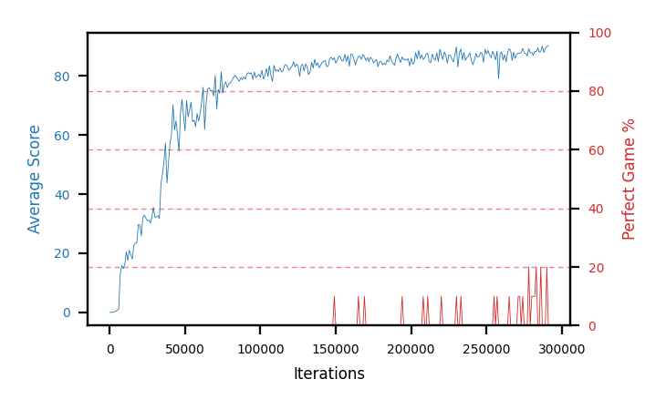

# b15a-nstep3seed1

Blue is average score (food eaten) on the left axis, red is perfect-game percentage on the right.

Latest eval: step 291000, avg score 90.2, perfect games 0%.

## Config

| setting | value |
|---|---|
| policy_name | b15a-nstep3seed1 |
| seed | 1 |
| zeroed_observations | none |
| learning_rate | 1e-05 |
| batch_size | 128 |
| discount | 0.995 |
| target_update_period | 8 |
| target_update_tau | 1.0 |
| gradient_clipping | none |
| n_step_update | 3 |
| initial_epsilon | 0.4 |
| min_epsilon | 0.002 |
| epsilon_schedule | bootstrap on avg_reward [2, 5, 10, 15, 20] then geometric to floor by 80% trailing-30 perfect |
| guided_fraction | 0.8 |
| exploration_shield | 80% of refinement-phase episodes draw the epsilon move from non-fatal actions; greedy moves never shielded |
| fc_layer_params | (50, 100, 50) |
| replay_buffer | cpprb prioritized, capacity 100000 |
| priority_exponent (alpha) | 0.6 |
| priority_signal | td_loss |
| importance_sampling_beta | disabled |
| max_steps | 10000000 |
| initial_populate_steps | 1000 |
| eval | 10 episodes every 1000 steps |
| grid | 9x9, max possible score 95 |
| DEATH_REWARD | -5.0 |
| FOOD_REWARD | 1.0 |
| FOOD_DISTANCE_REWARD | 0.001 |
| eval_only | False |
| min_checkpoint_score | 40.0 |

## Evals

292 evals so far. Full series in [`b15a-nstep3seed1_evals.json`](b15a-nstep3seed1_evals.json).

| step | avg score | trailing avg | min score | max score | avg reward | perfect % | epsilon |
|---|---|---|---|---|---|---|---|
| 0 | 0.0 | 0.0 | 0 | 0/95 | -5.002 | 0 | 0.4 |
| 1000 | 0.0 | 0.0 | 0 | 0/95 | -0.551 | 0 | 0.4 |
| 2000 | 0.0 | 0.0 | 0 | 0/95 | -5.003 | 0 | 0.4 |
| ... | | | | | | | |
| 280000 | 87.9 | 87.84 | 80 | 95/95 | 96.453 | 10 | 0.0117 |
| 281000 | 86.9 | 87.7 | 76 | 95/95 | 95.449 | 10 | 0.0116 |
| 282000 | 88.3 | 88.02 | 70 | 95/95 | 96.793 | 10 | 0.0115 |
| 283000 | 88.2 | 87.82 | 72 | 95/95 | 106.687 | 20 | 0.0113 |
| 284000 | 89.5 | 88.16 | 86 | 93/95 | 87.98 | 0 | 0.0113 |
| 285000 | 88.0 | 88.18 | 80 | 93/95 | 86.531 | 0 | 0.0114 |
| 286000 | 88.3 | 88.46 | 78 | 95/95 | 106.932 | 20 | 0.0112 |
| 287000 | 90.1 | 88.82 | 86 | 93/95 | 88.637 | 0 | 0.0113 |
| 288000 | 87.9 | 88.76 | 82 | 91/95 | 86.503 | 0 | 0.0113 |
| 289000 | 89.2 | 88.7 | 86 | 93/95 | 87.824 | 0 | 0.0113 |
| 290000 | 89.9 | 89.08 | 82 | 95/95 | 108.423 | 20 | 0.0111 |
| 291000 | 90.2 | 89.46 | 84 | 93/95 | 88.82 | 0 | 0.0111 |
