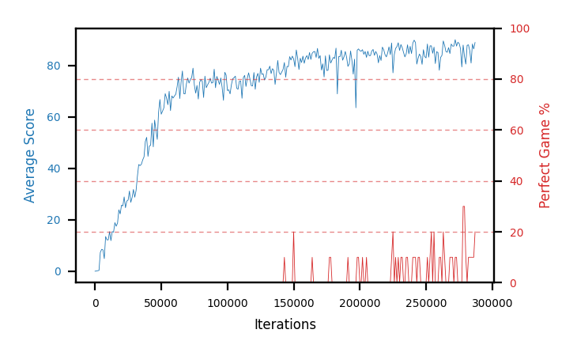

# b15b-nstep3seed2

Blue is average score (food eaten) on the left axis, red is perfect-game percentage on the right.

Latest eval: step 5753000, avg score 93.8, perfect games 80%.

## Config

| setting | value |
|---|---|
| policy_name | b15b-nstep3seed2 |
| seed | 2 |
| zeroed_observations | none |
| learning_rate | 1e-05 |
| batch_size | 128 |
| discount | 0.995 |
| target_update_period | 8 |
| target_update_tau | 1.0 |
| gradient_clipping | none |
| n_step_update | 3 |
| initial_epsilon | 0.4 |
| min_epsilon | 0.002 |
| epsilon_schedule | bootstrap on avg_reward [2, 5, 10, 15, 20] then geometric to floor by 80% trailing-30 perfect |
| guided_fraction | 0.8 |
| exploration_shield | 80% of refinement-phase episodes draw the epsilon move from non-fatal actions; greedy moves never shielded |
| fc_layer_params | (50, 100, 50) |
| replay_buffer | cpprb prioritized, capacity 100000 |
| priority_exponent (alpha) | 0.6 |
| priority_signal | td_loss |
| importance_sampling_beta | disabled |
| max_steps | 10000000 |
| initial_populate_steps | 1000 |
| eval | 10 episodes every 1000 steps |
| grid | 9x9, max possible score 95 |
| DEATH_REWARD | -5.0 |
| FOOD_REWARD | 1.0 |
| FOOD_DISTANCE_REWARD | 0.001 |
| eval_only | False |
| min_checkpoint_score | 40.0 |

## Evals

5754 evals so far. Full series in [`b15b-nstep3seed2_evals.json`](b15b-nstep3seed2_evals.json).

| step | avg score | trailing avg | min score | max score | avg reward | perfect % | epsilon |
|---|---|---|---|---|---|---|---|
| 0 | 0.0 | 0.0 | 0 | 0/95 | -5.003 | 0 | 0.4 |
| 1000 | 0.1 | 0.1 | 0 | 1/95 | -4.903 | 0 | 0.4 |
| 2000 | 0.2 | 0.15 | 0 | 1/95 | -2.14 | 0 | 0.4 |
| ... | | | | | | | |
| 5742000 | 93.8 | 94.2 | 90 | 95/95 | 150.627 | 60 | 0.0028 |
| 5743000 | 94.4 | 94.18 | 92 | 95/95 | 151.218 | 60 | 0.0028 |
| 5744000 | 92.8 | 93.88 | 86 | 95/95 | 149.591 | 60 | 0.0029 |
| 5745000 | 93.1 | 93.72 | 85 | 95/95 | 160.364 | 70 | 0.0029 |
| 5746000 | 94.7 | 93.76 | 94 | 95/95 | 161.918 | 70 | 0.0029 |
| 5747000 | 93.8 | 93.76 | 91 | 95/95 | 140.237 | 50 | 0.0029 |
| 5748000 | 94.5 | 93.78 | 93 | 95/95 | 161.667 | 70 | 0.0029 |
| 5749000 | 88.5 | 92.92 | 39 | 95/95 | 156.207 | 70 | 0.0029 |
| 5750000 | 93.2 | 92.94 | 86 | 95/95 | 139.563 | 50 | 0.003 |
| 5751000 | 93.3 | 92.66 | 90 | 95/95 | 129.288 | 40 | 0.003 |
| 5752000 | 93.9 | 92.68 | 88 | 95/95 | 161.194 | 70 | 0.0031 |
| 5753000 | 93.8 | 92.54 | 84 | 95/95 | 171.454 | 80 | 0.003 |
