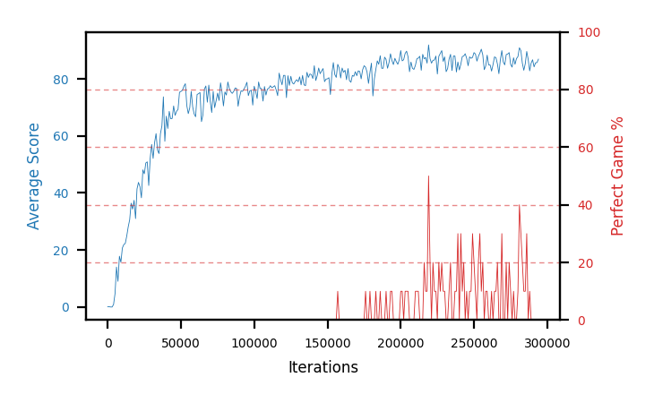

# b15c-nstep3seed3

Blue is average score (food eaten) on the left axis, red is perfect-game percentage on the right.

Latest eval: step 5461000, avg score 93.4, perfect games 70%.

## Config

| setting | value |
|---|---|
| policy_name | b15c-nstep3seed3 |
| seed | 3 |
| zeroed_observations | none |
| learning_rate | 1e-05 |
| batch_size | 128 |
| discount | 0.995 |
| target_update_period | 8 |
| target_update_tau | 1.0 |
| gradient_clipping | none |
| n_step_update | 3 |
| initial_epsilon | 0.4 |
| min_epsilon | 0.002 |
| epsilon_schedule | bootstrap on avg_reward [2, 5, 10, 15, 20] then geometric to floor by 80% trailing-30 perfect |
| guided_fraction | 0.8 |
| exploration_shield | 80% of refinement-phase episodes draw the epsilon move from non-fatal actions; greedy moves never shielded |
| fc_layer_params | (50, 100, 50) |
| replay_buffer | cpprb prioritized, capacity 100000 |
| priority_exponent (alpha) | 0.6 |
| priority_signal | td_loss |
| importance_sampling_beta | disabled |
| max_steps | 10000000 |
| initial_populate_steps | 1000 |
| eval | 10 episodes every 1000 steps |
| grid | 9x9, max possible score 95 |
| DEATH_REWARD | -5.0 |
| FOOD_REWARD | 1.0 |
| FOOD_DISTANCE_REWARD | 0.001 |
| eval_only | False |
| min_checkpoint_score | 40.0 |

## Evals

5462 evals so far. Full series in [`b15c-nstep3seed3_evals.json`](b15c-nstep3seed3_evals.json).

| step | avg score | trailing avg | min score | max score | avg reward | perfect % | epsilon |
|---|---|---|---|---|---|---|---|
| 0 | 0.1 | 0.1 | 0 | 1/95 | -4.902 | 0 | 0.4 |
| 1000 | 0.1 | 0.1 | 0 | 1/95 | -0.9 | 0 | 0.4 |
| 2000 | 0.0 | 0.05 | 0 | 0/95 | -5.002 | 0 | 0.4 |
| ... | | | | | | | |
| 5450000 | 88.9 | 89.46 | 67 | 95/95 | 135.115 | 50 | 0.0039 |
| 5451000 | 91.6 | 90.68 | 76 | 95/95 | 117.051 | 30 | 0.0039 |
| 5452000 | 56.1 | 83.74 | 5 | 95/95 | 94.562 | 40 | 0.0039 |
| 5453000 | 92.9 | 83.6 | 88 | 95/95 | 128.79 | 40 | 0.0039 |
| 5454000 | 92.4 | 84.38 | 82 | 95/95 | 149.122 | 60 | 0.0039 |
| 5455000 | 92.3 | 85.06 | 86 | 95/95 | 128.114 | 40 | 0.004 |
| 5456000 | 94.7 | 85.68 | 92 | 95/95 | 182.707 | 90 | 0.0039 |
| 5457000 | 83.9 | 91.24 | 23 | 95/95 | 141.153 | 60 | 0.0038 |
| 5458000 | 90.0 | 90.66 | 74 | 95/95 | 136.34 | 50 | 0.0038 |
| 5459000 | 94.3 | 91.04 | 88 | 95/95 | 182.223 | 90 | 0.0037 |
| 5460000 | 89.6 | 90.5 | 77 | 95/95 | 125.464 | 40 | 0.0037 |
| 5461000 | 93.4 | 90.24 | 82 | 95/95 | 160.621 | 70 | 0.0037 |
