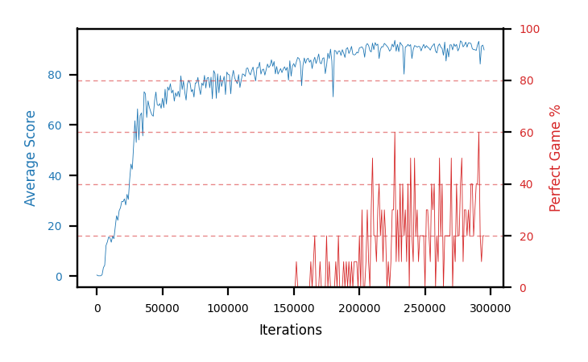

# b15d-nstep3seed4

Blue is average score (food eaten) on the left axis, red is perfect-game percentage on the right.

Latest eval: step 295000, avg score 89.8, perfect games 20%.

## Config

| setting | value |
|---|---|
| policy_name | b15d-nstep3seed4 |
| seed | 4 |
| zeroed_observations | none |
| learning_rate | 1e-05 |
| batch_size | 128 |
| discount | 0.995 |
| target_update_period | 8 |
| target_update_tau | 1.0 |
| gradient_clipping | none |
| n_step_update | 3 |
| initial_epsilon | 0.4 |
| min_epsilon | 0.002 |
| epsilon_schedule | bootstrap on avg_reward [2, 5, 10, 15, 20] then geometric to floor by 80% trailing-30 perfect |
| guided_fraction | 0.8 |
| exploration_shield | 80% of refinement-phase episodes draw the epsilon move from non-fatal actions; greedy moves never shielded |
| fc_layer_params | (50, 100, 50) |
| replay_buffer | cpprb prioritized, capacity 100000 |
| priority_exponent (alpha) | 0.6 |
| priority_signal | td_loss |
| importance_sampling_beta | disabled |
| max_steps | 10000000 |
| initial_populate_steps | 1000 |
| eval | 10 episodes every 1000 steps |
| grid | 9x9, max possible score 95 |
| DEATH_REWARD | -5.0 |
| FOOD_REWARD | 1.0 |
| FOOD_DISTANCE_REWARD | 0.001 |
| eval_only | False |
| min_checkpoint_score | 40.0 |

## Evals

296 evals so far. Full series in [`b15d-nstep3seed4_evals.json`](b15d-nstep3seed4_evals.json).

| step | avg score | trailing avg | min score | max score | avg reward | perfect % | epsilon |
|---|---|---|---|---|---|---|---|
| 0 | 0.5 | 0.5 | 0 | 1/95 | -4.503 | 0 | 0.4 |
| 1000 | 0.2 | 0.2 | 0 | 1/95 | -4.816 | 0 | 0.4 |
| 2000 | 0.2 | 0.2 | 0 | 1/95 | -4.801 | 0 | 0.4 |
| ... | | | | | | | |
| 284000 | 92.6 | 92.14 | 86 | 95/95 | 110.218 | 20 | 0.0071 |
| 285000 | 92.3 | 92.26 | 88 | 95/95 | 130.782 | 40 | 0.0071 |
| 286000 | 90.3 | 91.74 | 78 | 95/95 | 128.866 | 40 | 0.0071 |
| 287000 | 89.9 | 91.54 | 82 | 95/95 | 108.494 | 20 | 0.0072 |
| 288000 | 89.9 | 91.0 | 76 | 95/95 | 118.022 | 30 | 0.007 |
| 289000 | 89.6 | 90.4 | 78 | 95/95 | 128.12 | 40 | 0.0069 |
| 290000 | 91.9 | 90.32 | 86 | 95/95 | 130.345 | 40 | 0.0067 |
| 291000 | 93.2 | 90.9 | 88 | 95/95 | 151.207 | 60 | 0.0067 |
| 292000 | 84.2 | 89.76 | 8 | 95/95 | 101.57 | 20 | 0.0067 |
| 293000 | 91.3 | 90.04 | 80 | 95/95 | 98.07 | 10 | 0.0068 |
| 294000 | 91.7 | 90.46 | 88 | 95/95 | 109.81 | 20 | 0.0067 |
| 295000 | 89.8 | 90.04 | 74 | 95/95 | 107.563 | 20 | 0.0067 |
