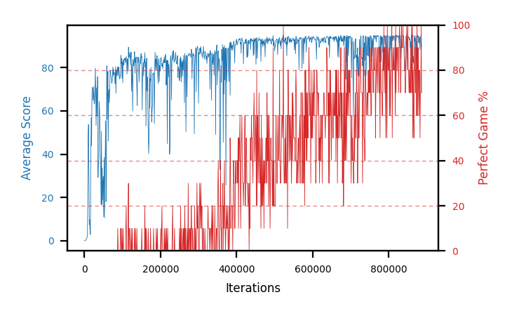

# b16a-noshapeseed1

Blue is average score (food eaten) on the left axis, red is perfect-game percentage on the right.

Latest eval: step 886000, avg score 89.5, perfect games 70%.

## Config

| setting | value |
|---|---|
| policy_name | b16a-noshapeseed1 |
| seed | 1 |
| zeroed_observations | none |
| learning_rate | 1e-05 |
| batch_size | 128 |
| discount | 0.9975 |
| target_update_period | 8 |
| target_update_tau | 1.0 |
| gradient_clipping | none |
| n_step_update | 1 |
| initial_epsilon | 0.4 |
| min_epsilon | 0.002 |
| epsilon_schedule | bootstrap on avg_reward [2, 5, 10, 15, 20] then geometric to floor by 80% trailing-30 perfect |
| guided_fraction | 0.8 |
| exploration_shield | 80% of refinement-phase episodes draw the epsilon move from non-fatal actions; greedy moves never shielded |
| fc_layer_params | (50, 100, 50) |
| replay_buffer | cpprb prioritized, capacity 100000 |
| priority_exponent (alpha) | 0.6 |
| priority_signal | td_loss |
| importance_sampling_beta | disabled |
| max_steps | 10000000 |
| initial_populate_steps | 1000 |
| eval | 10 episodes every 1000 steps |
| grid | 9x9, max possible score 95 |
| DEATH_REWARD | -5.0 |
| FOOD_REWARD | 1.0 |
| FOOD_DISTANCE_REWARD | 0.0 |
| eval_only | False |
| min_checkpoint_score | 40.0 |

## Evals

887 evals so far. Full series in [`b16a-noshapeseed1_evals.json`](b16a-noshapeseed1_evals.json).

| step | avg score | trailing avg | min score | max score | avg reward | perfect % | epsilon |
|---|---|---|---|---|---|---|---|
| 0 | 0.0 | 0.0 | 0 | 0/95 | -5.0 | 0 | 0.4 |
| 1000 | 0.0 | 0.0 | 0 | 0/95 | -0.5 | 0 | 0.4 |
| 2000 | 0.0 | 0.0 | 0 | 0/95 | -0.5 | 0 | 0.4 |
| ... | | | | | | | |
| 875000 | 94.9 | 91.82 | 94 | 95/95 | 183.5 | 90 | 0.002 |
| 876000 | 94.0 | 91.66 | 92 | 95/95 | 151.85 | 60 | 0.002 |
| 877000 | 94.7 | 94.08 | 92 | 95/95 | 183.75 | 90 | 0.0021 |
| 878000 | 91.8 | 94.08 | 76 | 95/95 | 170.0 | 80 | 0.0021 |
| 879000 | 91.4 | 93.36 | 72 | 95/95 | 150.6 | 60 | 0.0021 |
| 880000 | 94.2 | 93.22 | 90 | 95/95 | 173.3 | 80 | 0.0021 |
| 881000 | 93.4 | 93.1 | 82 | 95/95 | 172.5 | 80 | 0.0021 |
| 882000 | 88.4 | 91.84 | 52 | 95/95 | 137.65 | 50 | 0.0022 |
| 883000 | 94.2 | 92.32 | 92 | 95/95 | 162.9 | 70 | 0.0022 |
| 884000 | 94.4 | 92.92 | 93 | 95/95 | 162.65 | 70 | 0.0022 |
| 885000 | 95.0 | 93.08 | 95 | 95/95 | 194.0 | 100 | 0.0022 |
| 886000 | 89.5 | 92.3 | 62 | 95/95 | 158.65 | 70 | 0.0022 |
