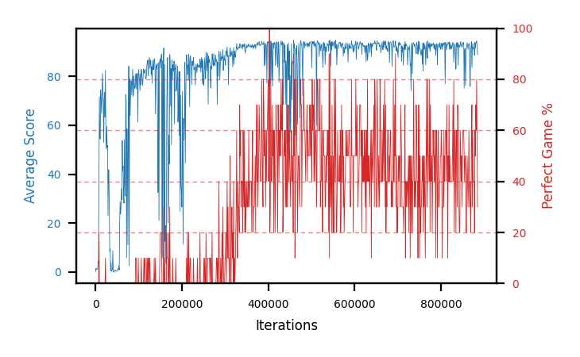

# b16c-noshapeseed3

Blue is average score (food eaten) on the left axis, red is perfect-game percentage on the right.

Latest eval: step 885000, avg score 88.9, perfect games 30%.

## Config

| setting | value |
|---|---|
| policy_name | b16c-noshapeseed3 |
| seed | 3 |
| zeroed_observations | none |
| learning_rate | 1e-05 |
| batch_size | 128 |
| discount | 0.9975 |
| target_update_period | 8 |
| target_update_tau | 1.0 |
| gradient_clipping | none |
| n_step_update | 1 |
| initial_epsilon | 0.4 |
| min_epsilon | 0.002 |
| epsilon_schedule | bootstrap on avg_reward [2, 5, 10, 15, 20] then geometric to floor by 80% trailing-30 perfect |
| guided_fraction | 0.8 |
| exploration_shield | 80% of refinement-phase episodes draw the epsilon move from non-fatal actions; greedy moves never shielded |
| fc_layer_params | (50, 100, 50) |
| replay_buffer | cpprb prioritized, capacity 100000 |
| priority_exponent (alpha) | 0.6 |
| priority_signal | td_loss |
| importance_sampling_beta | disabled |
| max_steps | 10000000 |
| initial_populate_steps | 1000 |
| eval | 10 episodes every 1000 steps |
| grid | 9x9, max possible score 95 |
| DEATH_REWARD | -5.0 |
| FOOD_REWARD | 1.0 |
| FOOD_DISTANCE_REWARD | 0.0 |
| eval_only | False |
| min_checkpoint_score | 40.0 |

## Evals

886 evals so far. Full series in [`b16c-noshapeseed3_evals.json`](b16c-noshapeseed3_evals.json).

| step | avg score | trailing avg | min score | max score | avg reward | perfect % | epsilon |
|---|---|---|---|---|---|---|---|
| 0 | 0.1 | 0.1 | 0 | 1/95 | -4.9 | 0 | 0.4 |
| 1000 | 1.5 | 1.5 | 0 | 4/95 | 1.0 | 0 | 0.4 |
| 2000 | 0.9 | 1.2 | 0 | 5/95 | 0.4 | 0 | 0.4 |
| ... | | | | | | | |
| 874000 | 93.6 | 91.1 | 88 | 95/95 | 152.35 | 60 | 0.0045 |
| 875000 | 91.3 | 90.96 | 77 | 95/95 | 130.15 | 40 | 0.0046 |
| 876000 | 91.9 | 90.5 | 80 | 95/95 | 131.2 | 40 | 0.0046 |
| 877000 | 91.1 | 91.98 | 80 | 95/95 | 129.95 | 40 | 0.0046 |
| 878000 | 88.6 | 91.3 | 57 | 95/95 | 108.0 | 20 | 0.0047 |
| 879000 | 93.9 | 91.36 | 91 | 95/95 | 152.65 | 60 | 0.0046 |
| 880000 | 91.6 | 91.42 | 76 | 95/95 | 139.95 | 50 | 0.0046 |
| 881000 | 93.7 | 91.78 | 90 | 95/95 | 162.85 | 70 | 0.0046 |
| 882000 | 93.8 | 92.32 | 91 | 95/95 | 152.55 | 60 | 0.0046 |
| 883000 | 94.5 | 93.5 | 92 | 95/95 | 173.6 | 80 | 0.0045 |
| 884000 | 92.4 | 93.2 | 82 | 95/95 | 151.15 | 60 | 0.0045 |
| 885000 | 88.9 | 92.66 | 61 | 95/95 | 117.8 | 30 | 0.0045 |
