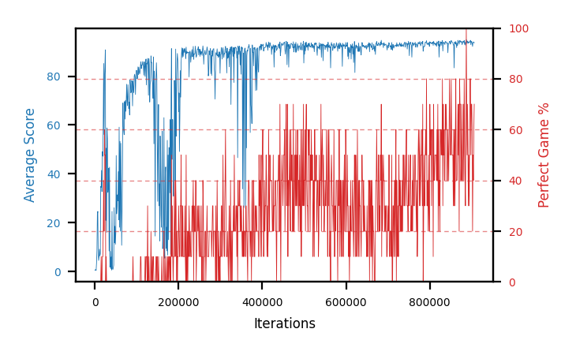

# b16d-noshapeseed4

Blue is average score (food eaten) on the left axis, red is perfect-game percentage on the right.

Latest eval: step 1256000, avg score 94.0, perfect games 80%.

## Config

| setting | value |
|---|---|
| policy_name | b16d-noshapeseed4 |
| seed | 4 |
| zeroed_observations | none |
| learning_rate | 1e-05 |
| batch_size | 128 |
| discount | 0.9975 |
| target_update_period | 8 |
| target_update_tau | 1.0 |
| gradient_clipping | none |
| n_step_update | 1 |
| initial_epsilon | 0.4 |
| min_epsilon | 0.002 |
| epsilon_schedule | bootstrap on avg_reward [2, 5, 10, 15, 20] then geometric to floor by 80% trailing-30 perfect |
| guided_fraction | 0.8 |
| exploration_shield | 80% of refinement-phase episodes draw the epsilon move from non-fatal actions; greedy moves never shielded |
| fc_layer_params | (50, 100, 50) |
| replay_buffer | cpprb prioritized, capacity 100000 |
| priority_exponent (alpha) | 0.6 |
| priority_signal | td_loss |
| importance_sampling_beta | disabled |
| max_steps | 10000000 |
| initial_populate_steps | 1000 |
| eval | 10 episodes every 1000 steps |
| grid | 9x9, max possible score 95 |
| DEATH_REWARD | -5.0 |
| FOOD_REWARD | 1.0 |
| FOOD_DISTANCE_REWARD | 0.0 |
| eval_only | False |
| min_checkpoint_score | 40.0 |

## Evals

1257 evals so far. Full series in [`b16d-noshapeseed4_evals.json`](b16d-noshapeseed4_evals.json).

| step | avg score | trailing avg | min score | max score | avg reward | perfect % | epsilon |
|---|---|---|---|---|---|---|---|
| 0 | 0.5 | 0.5 | 0 | 1/95 | -4.5 | 0 | 0.4 |
| 1000 | 0.7 | 0.7 | 0 | 3/95 | 0.2 | 0 | 0.4 |
| 2000 | 0.7 | 0.7 | 0 | 2/95 | 0.2 | 0 | 0.4 |
| ... | | | | | | | |
| 1245000 | 92.6 | 93.4 | 74 | 95/95 | 160.85 | 70 | 0.0038 |
| 1246000 | 94.1 | 93.3 | 92 | 95/95 | 141.55 | 50 | 0.0038 |
| 1247000 | 92.7 | 92.98 | 84 | 95/95 | 140.6 | 50 | 0.0038 |
| 1248000 | 93.8 | 92.96 | 87 | 95/95 | 162.5 | 70 | 0.0037 |
| 1249000 | 92.4 | 93.12 | 71 | 95/95 | 160.65 | 70 | 0.0037 |
| 1250000 | 94.3 | 93.46 | 92 | 95/95 | 162.55 | 70 | 0.0036 |
| 1251000 | 93.5 | 93.34 | 90 | 95/95 | 121.5 | 30 | 0.0037 |
| 1252000 | 94.0 | 93.6 | 91 | 95/95 | 131.05 | 40 | 0.0037 |
| 1253000 | 94.0 | 93.64 | 91 | 95/95 | 141.45 | 50 | 0.0037 |
| 1254000 | 94.6 | 94.08 | 93 | 95/95 | 173.25 | 80 | 0.0037 |
| 1255000 | 94.0 | 94.02 | 92 | 95/95 | 141.9 | 50 | 0.0037 |
| 1256000 | 94.0 | 94.12 | 86 | 95/95 | 172.65 | 80 | 0.0035 |
