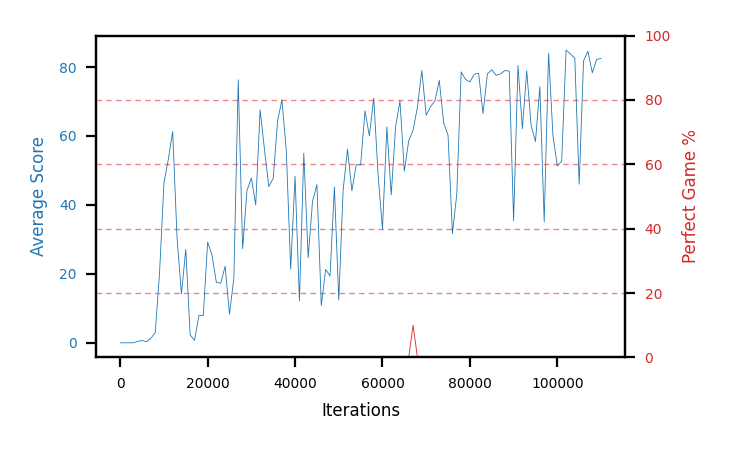

# b17a-forkseed1

Blue is average score (food eaten) on the left axis, red is perfect-game percentage on the right.

Latest eval: step 1406000, avg score 34.9, perfect games 20%.

## Config

| setting | value |
|---|---|
| policy_name | b17a-forkseed1 |
| seed | 1 |
| zeroed_observations | none |
| learning_rate | 1e-05 |
| batch_size | 128 |
| discount | 0.9975 |
| target_update_period | 8 |
| target_update_tau | 1.0 |
| gradient_clipping | none |
| n_step_update | 1 |
| initial_epsilon | 0.4 |
| min_epsilon | 0.002 |
| epsilon_schedule | bootstrap on avg_reward [2, 5, 10, 15, 20] then geometric to floor by 80% trailing-30 perfect |
| guided_fraction | 0.8 |
| forking | up to 4 live branches including the main line, fork p=0.5 at length >= 85, branch capped at 60 steps, one branch advanced per iteration |
| exploration_shield | 80% of refinement-phase episodes draw the epsilon move from non-fatal actions; greedy moves never shielded |
| fc_layer_params | (50, 100, 50) |
| replay_buffer | cpprb prioritized, capacity 100000 |
| priority_exponent (alpha) | 0.6 |
| priority_signal | td_loss |
| importance_sampling_beta | disabled |
| max_steps | 10000000 |
| initial_populate_steps | 1000 |
| eval | 10 episodes every 1000 steps |
| grid | 9x9, max possible score 95 |
| DEATH_REWARD | -5.0 |
| FOOD_REWARD | 1.0 |
| FOOD_DISTANCE_REWARD | 0.0 |
| eval_only | False |
| min_checkpoint_score | 40.0 |

## Evals

1407 evals so far. Full series in [`b17a-forkseed1_evals.json`](b17a-forkseed1_evals.json).

| step | avg score | trailing avg | min score | max score | avg reward | perfect % | epsilon |
|---|---|---|---|---|---|---|---|
| 0 | 0.0 | 0.0 | 0 | 0/95 | -5.0 | 0 | 0.4 |
| 1000 | 0.0 | 0.0 | 0 | 0/95 | -0.5 | 0 | 0.4 |
| 2000 | 0.0 | 0.0 | 0 | 0/95 | -0.5 | 0 | 0.4 |
| ... | | | | | | | |
| 1395000 | 26.8 | 35.32 | 1 | 95/95 | 46.2 | 20 | 0.006 |
| 1396000 | 16.5 | 36.78 | 3 | 95/95 | 25.95 | 10 | 0.0061 |
| 1397000 | 33.1 | 27.94 | 3 | 95/95 | 52.5 | 20 | 0.0061 |
| 1398000 | 41.6 | 29.56 | 1 | 95/95 | 80.9 | 40 | 0.0061 |
| 1399000 | 44.0 | 32.4 | 1 | 95/95 | 83.3 | 40 | 0.0062 |
| 1400000 | 25.4 | 32.12 | 1 | 93/95 | 24.45 | 0 | 0.0066 |
| 1401000 | 28.5 | 34.52 | 4 | 95/95 | 47.9 | 20 | 0.0067 |
| 1402000 | 35.2 | 34.94 | 1 | 95/95 | 54.15 | 20 | 0.0067 |
| 1403000 | 41.4 | 34.9 | 1 | 95/95 | 59.9 | 20 | 0.0069 |
| 1404000 | 25.0 | 31.1 | 1 | 95/95 | 34.0 | 10 | 0.0069 |
| 1405000 | 41.9 | 34.4 | 1 | 95/95 | 70.8 | 30 | 0.0068 |
| 1406000 | 34.9 | 35.68 | 2 | 95/95 | 53.85 | 20 | 0.0068 |
