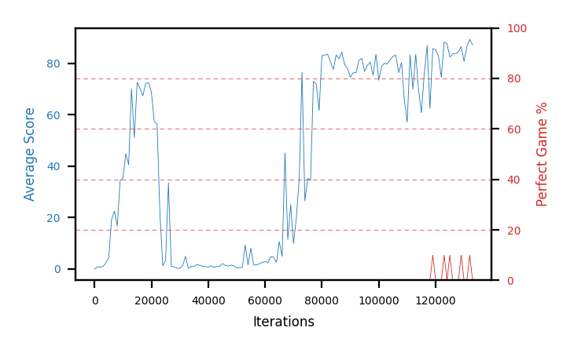

# b17b-forkseed2

Blue is average score (food eaten) on the left axis, red is perfect-game percentage on the right.

Latest eval: step 1571000, avg score 91.2, perfect games 70%.

## Config

| setting | value |
|---|---|
| policy_name | b17b-forkseed2 |
| seed | 2 |
| zeroed_observations | none |
| learning_rate | 1e-05 |
| batch_size | 128 |
| discount | 0.9975 |
| target_update_period | 8 |
| target_update_tau | 1.0 |
| gradient_clipping | none |
| n_step_update | 1 |
| initial_epsilon | 0.4 |
| min_epsilon | 0.002 |
| epsilon_schedule | bootstrap on avg_reward [2, 5, 10, 15, 20] then geometric to floor by 80% trailing-30 perfect |
| guided_fraction | 0.8 |
| forking | up to 4 live branches including the main line, fork p=0.5 at length >= 85, branch capped at 60 steps, one branch advanced per iteration |
| exploration_shield | 80% of refinement-phase episodes draw the epsilon move from non-fatal actions; greedy moves never shielded |
| fc_layer_params | (50, 100, 50) |
| replay_buffer | cpprb prioritized, capacity 100000 |
| priority_exponent (alpha) | 0.6 |
| priority_signal | td_loss |
| importance_sampling_beta | disabled |
| max_steps | 10000000 |
| initial_populate_steps | 1000 |
| eval | 10 episodes every 1000 steps |
| grid | 9x9, max possible score 95 |
| DEATH_REWARD | -5.0 |
| FOOD_REWARD | 1.0 |
| FOOD_DISTANCE_REWARD | 0.0 |
| eval_only | False |
| min_checkpoint_score | 40.0 |

## Evals

1572 evals so far. Full series in [`b17b-forkseed2_evals.json`](b17b-forkseed2_evals.json).

| step | avg score | trailing avg | min score | max score | avg reward | perfect % | epsilon |
|---|---|---|---|---|---|---|---|
| 0 | 0.0 | 0.0 | 0 | 0/95 | -5.0 | 0 | 0.4 |
| 1000 | 0.8 | 0.8 | 0 | 3/95 | -0.15 | 0 | 0.4 |
| 2000 | 0.7 | 0.75 | 0 | 2/95 | 0.2 | 0 | 0.4 |
| ... | | | | | | | |
| 1560000 | 94.8 | 92.3 | 93 | 95/95 | 183.4 | 90 | 0.0025 |
| 1561000 | 88.5 | 91.04 | 64 | 95/95 | 146.8 | 60 | 0.0026 |
| 1562000 | 94.8 | 92.92 | 93 | 95/95 | 183.4 | 90 | 0.0025 |
| 1563000 | 89.9 | 92.44 | 72 | 95/95 | 128.3 | 40 | 0.0026 |
| 1564000 | 95.0 | 92.6 | 95 | 95/95 | 194.0 | 100 | 0.0026 |
| 1565000 | 94.8 | 92.6 | 93 | 95/95 | 183.4 | 90 | 0.0026 |
| 1566000 | 94.4 | 93.78 | 93 | 95/95 | 162.2 | 70 | 0.0026 |
| 1567000 | 85.6 | 91.94 | 1 | 95/95 | 174.65 | 90 | 0.0025 |
| 1568000 | 94.8 | 92.92 | 93 | 95/95 | 183.4 | 90 | 0.0025 |
| 1569000 | 91.7 | 92.26 | 64 | 95/95 | 170.35 | 80 | 0.0024 |
| 1570000 | 92.2 | 91.74 | 80 | 95/95 | 160.9 | 70 | 0.0024 |
| 1571000 | 91.2 | 91.1 | 68 | 95/95 | 159.9 | 70 | 0.0025 |
