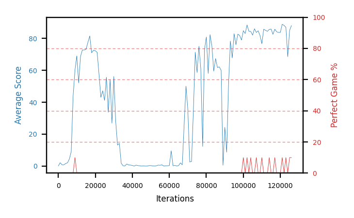

# b17c-forkseed3

Blue is average score (food eaten) on the left axis, red is perfect-game percentage on the right.

Latest eval: step 126000, avg score 88.1, perfect games 10%.

## Config

| setting | value |
|---|---|
| policy_name | b17c-forkseed3 |
| seed | 3 |
| zeroed_observations | none |
| learning_rate | 1e-05 |
| batch_size | 128 |
| discount | 0.9975 |
| target_update_period | 8 |
| target_update_tau | 1.0 |
| gradient_clipping | none |
| n_step_update | 1 |
| initial_epsilon | 0.4 |
| min_epsilon | 0.002 |
| epsilon_schedule | bootstrap on avg_reward [2, 5, 10, 15, 20] then geometric to floor by 80% trailing-30 perfect |
| guided_fraction | 0.8 |
| forking | up to 4 live branches including the main line, fork p=0.5 at length >= 85, branch capped at 60 steps, one branch advanced per iteration |
| exploration_shield | 80% of refinement-phase episodes draw the epsilon move from non-fatal actions; greedy moves never shielded |
| fc_layer_params | (50, 100, 50) |
| replay_buffer | cpprb prioritized, capacity 100000 |
| priority_exponent (alpha) | 0.6 |
| priority_signal | td_loss |
| importance_sampling_beta | disabled |
| max_steps | 10000000 |
| initial_populate_steps | 1000 |
| eval | 10 episodes every 1000 steps |
| grid | 9x9, max possible score 95 |
| DEATH_REWARD | -5.0 |
| FOOD_REWARD | 1.0 |
| FOOD_DISTANCE_REWARD | 0.0 |
| eval_only | False |
| min_checkpoint_score | 40.0 |

## Evals

127 evals so far. Full series in [`b17c-forkseed3_evals.json`](b17c-forkseed3_evals.json).

| step | avg score | trailing avg | min score | max score | avg reward | perfect % | epsilon |
|---|---|---|---|---|---|---|---|
| 0 | 0.1 | 0.1 | 0 | 1/95 | -4.9 | 0 | 0.4 |
| 1000 | 2.1 | 2.1 | 0 | 4/95 | 1.6 | 0 | 0.4 |
| 2000 | 0.8 | 1.45 | 0 | 5/95 | 0.3 | 0 | 0.4 |
| ... | | | | | | | |
| 115000 | 85.9 | 85.4 | 78 | 92/95 | 85.4 | 0 | 0.0119 |
| 116000 | 82.6 | 84.76 | 68 | 90/95 | 82.1 | 0 | 0.0119 |
| 117000 | 85.8 | 84.9 | 74 | 95/95 | 95.25 | 10 | 0.0118 |
| 118000 | 84.2 | 84.84 | 74 | 92/95 | 83.7 | 0 | 0.0118 |
| 119000 | 83.8 | 84.46 | 68 | 92/95 | 83.3 | 0 | 0.0118 |
| 120000 | 83.8 | 84.04 | 68 | 93/95 | 83.3 | 0 | 0.0118 |
| 121000 | 88.9 | 85.3 | 84 | 95/95 | 98.35 | 10 | 0.0118 |
| 122000 | 88.2 | 85.78 | 82 | 93/95 | 87.7 | 0 | 0.0118 |
| 123000 | 87.0 | 86.34 | 76 | 95/95 | 96.45 | 10 | 0.0117 |
| 124000 | 68.6 | 83.3 | 1 | 92/95 | 68.1 | 0 | 0.0117 |
| 125000 | 85.1 | 83.56 | 74 | 95/95 | 94.55 | 10 | 0.0116 |
| 126000 | 88.1 | 83.4 | 80 | 95/95 | 97.55 | 10 | 0.0115 |
