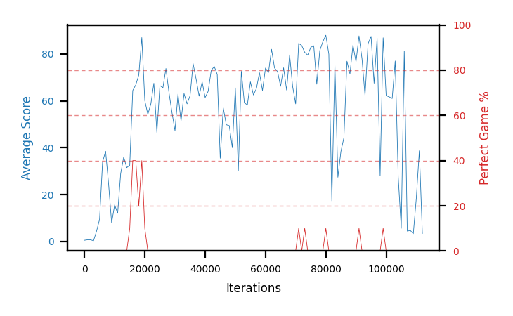

# b17d-forkseed4

Blue is average score (food eaten) on the left axis, red is perfect-game percentage on the right.

Latest eval: step 112000, avg score 3.4, perfect games 0%.

## Config

| setting | value |
|---|---|
| policy_name | b17d-forkseed4 |
| seed | 4 |
| zeroed_observations | none |
| learning_rate | 1e-05 |
| batch_size | 128 |
| discount | 0.9975 |
| target_update_period | 8 |
| target_update_tau | 1.0 |
| gradient_clipping | none |
| n_step_update | 1 |
| initial_epsilon | 0.4 |
| min_epsilon | 0.002 |
| epsilon_schedule | bootstrap on avg_reward [2, 5, 10, 15, 20] then geometric to floor by 80% trailing-30 perfect |
| guided_fraction | 0.8 |
| forking | up to 4 live branches including the main line, fork p=0.5 at length >= 85, branch capped at 60 steps, one branch advanced per iteration |
| exploration_shield | 80% of refinement-phase episodes draw the epsilon move from non-fatal actions; greedy moves never shielded |
| fc_layer_params | (50, 100, 50) |
| replay_buffer | cpprb prioritized, capacity 100000 |
| priority_exponent (alpha) | 0.6 |
| priority_signal | td_loss |
| importance_sampling_beta | disabled |
| max_steps | 10000000 |
| initial_populate_steps | 1000 |
| eval | 10 episodes every 1000 steps |
| grid | 9x9, max possible score 95 |
| DEATH_REWARD | -5.0 |
| FOOD_REWARD | 1.0 |
| FOOD_DISTANCE_REWARD | 0.0 |
| eval_only | False |
| min_checkpoint_score | 40.0 |

## Evals

113 evals so far. Full series in [`b17d-forkseed4_evals.json`](b17d-forkseed4_evals.json).

| step | avg score | trailing avg | min score | max score | avg reward | perfect % | epsilon |
|---|---|---|---|---|---|---|---|
| 0 | 0.5 | 0.5 | 0 | 1/95 | -4.5 | 0 | 0.4 |
| 1000 | 0.7 | 0.7 | 0 | 3/95 | 0.2 | 0 | 0.4 |
| 2000 | 0.7 | 0.7 | 0 | 2/95 | 0.2 | 0 | 0.4 |
| ... | | | | | | | |
| 101000 | 61.7 | 65.12 | 3 | 88/95 | 60.75 | 0 | 0.0121 |
| 102000 | 61.0 | 59.96 | 0 | 90/95 | 60.5 | 0 | 0.0121 |
| 103000 | 77.0 | 69.76 | 5 | 89/95 | 76.05 | 0 | 0.0122 |
| 104000 | 27.5 | 57.88 | 0 | 86/95 | 27.0 | 0 | 0.0122 |
| 105000 | 5.6 | 46.56 | 1 | 14/95 | 5.1 | 0 | 0.0122 |
| 106000 | 81.2 | 50.46 | 9 | 92/95 | 80.7 | 0 | 0.0122 |
| 107000 | 4.4 | 39.14 | 1 | 8/95 | 3.9 | 0 | 0.0122 |
| 108000 | 4.7 | 24.68 | 0 | 15/95 | 4.2 | 0 | 0.0122 |
| 109000 | 3.3 | 19.84 | 0 | 14/95 | 2.8 | 0 | 0.025 |
| 110000 | 18.5 | 22.42 | 1 | 90/95 | 18.0 | 0 | 0.0123 |
| 111000 | 38.7 | 13.92 | 6 | 92/95 | 38.2 | 0 | 0.05 |
| 112000 | 3.4 | 13.72 | 0 | 10/95 | 2.9 | 0 | 0.05 |
