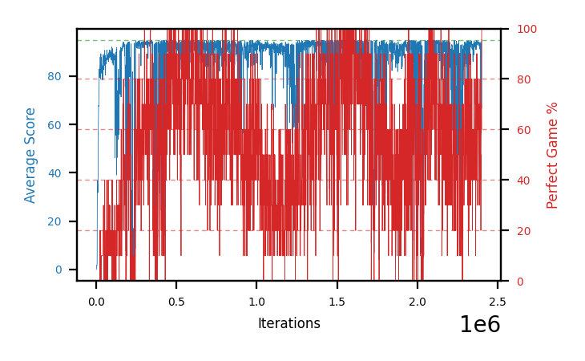

# b18b-tgt1000seed2

Blue is average score (food eaten) on the left axis, red is perfect-game percentage on the right.

Latest eval: step 2401000, avg score 95.0, perfect games 100%.

## Config

| setting | value |
|---|---|
| policy_name | b18b-tgt1000seed2 |
| seed | 2 |
| zeroed_observations | none |
| learning_rate | 1e-05 |
| batch_size | 128 |
| discount | 0.9975 |
| target_update_period | 1000 |
| target_update_tau | 1.0 |
| gradient_clipping | none |
| n_step_update | 1 |
| initial_epsilon | 0.4 |
| min_epsilon | 0.002 |
| epsilon_schedule | bootstrap on avg_reward [2, 5, 10, 15, 20] then geometric to floor by 80% trailing-30 perfect |
| guided_fraction | 0.8 |
| forking | up to 4 live branches including the main line, fork p=0.5 at length >= 85, branch capped at 60 steps, one branch advanced per iteration |
| exploration_shield | 80% of refinement-phase episodes draw the epsilon move from non-fatal actions; greedy moves never shielded |
| fc_layer_params | (50, 100, 50) |
| replay_buffer | cpprb prioritized, capacity 100000 |
| priority_exponent (alpha) | 0.6 |
| priority_signal | td_loss |
| importance_sampling_beta | disabled |
| max_steps | 10000000 |
| initial_populate_steps | 1000 |
| eval | 10 episodes every 1000 steps |
| grid | 9x9, max possible score 95 |
| DEATH_REWARD | -5.0 |
| FOOD_REWARD | 1.0 |
| FOOD_DISTANCE_REWARD | 0.0 |
| eval_only | False |
| min_checkpoint_score | 40.0 |

## Evals

2402 evals so far. Full series in [`b18b-tgt1000seed2_evals.json`](b18b-tgt1000seed2_evals.json).

| step | avg score | trailing avg | min score | max score | avg reward | perfect % | epsilon |
|---|---|---|---|---|---|---|---|
| 0 | 0.0 | 0.0 | 0 | 0/95 | -5.0 | 0 | 0.4 |
| 1000 | 0.9 | 0.9 | 0 | 3/95 | 0.4 | 0 | 0.4 |
| 2000 | 1.3 | 1.1 | 0 | 4/95 | 0.8 | 0 | 0.4 |
| ... | | | | | | | |
| 2390000 | 91.2 | 92.76 | 82 | 95/95 | 140.0 | 50 | 0.0034 |
| 2391000 | 93.2 | 92.9 | 80 | 95/95 | 172.3 | 80 | 0.0034 |
| 2392000 | 93.9 | 92.9 | 90 | 95/95 | 141.8 | 50 | 0.0035 |
| 2393000 | 93.9 | 93.14 | 88 | 95/95 | 162.6 | 70 | 0.0035 |
| 2394000 | 93.3 | 93.1 | 90 | 95/95 | 130.35 | 40 | 0.0034 |
| 2395000 | 75.3 | 89.92 | 1 | 95/95 | 123.65 | 50 | 0.0034 |
| 2396000 | 56.0 | 82.48 | 0 | 95/95 | 74.5 | 20 | 0.0035 |
| 2397000 | 93.6 | 82.42 | 91 | 95/95 | 140.6 | 50 | 0.0035 |
| 2398000 | 93.9 | 82.42 | 91 | 95/95 | 151.75 | 60 | 0.0034 |
| 2399000 | 85.0 | 80.76 | 2 | 95/95 | 153.7 | 70 | 0.0035 |
| 2400000 | 66.7 | 79.04 | 2 | 95/95 | 125.9 | 60 | 0.0035 |
| 2401000 | 95.0 | 86.84 | 95 | 95/95 | 194.0 | 100 | 0.0034 |
