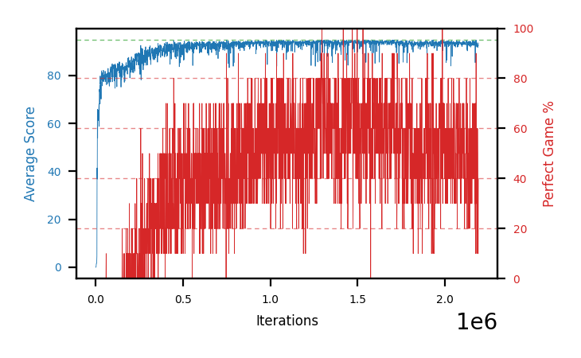

# b19a-stdperseed1

Blue is average score (food eaten) on the left axis, red is perfect-game percentage on the right.

Latest eval: step 2192000, avg score 93.6, perfect games 40%.

## Config

| setting | value |
|---|---|
| policy_name | b19a-stdperseed1 |
| seed | 1 |
| zeroed_observations | none |
| learning_rate | 1e-05 |
| batch_size | 128 |
| discount | 0.9975 |
| target_update_period | 1000 |
| target_update_tau | 1.0 |
| gradient_clipping | none |
| n_step_update | 1 |
| initial_epsilon | 0.4 |
| min_epsilon | 0.002 |
| epsilon_schedule | bootstrap on avg_reward [2, 5, 10, 15, 20] then geometric to floor by 80% trailing-30 perfect |
| guided_fraction | 0.8 |
| forking | up to 4 live branches including the main line, fork p=0.5 at length >= 85, branch capped at 60 steps, one branch advanced per iteration |
| exploration_shield | 80% of refinement-phase episodes draw the epsilon move from non-fatal actions; greedy moves never shielded |
| fc_layer_params | (50, 100, 50) |
| replay_buffer | cpprb prioritized, capacity 100000 |
| priority_exponent (alpha) | 0.6 |
| priority_signal | td_error |
| importance_sampling_beta | 0.4 -> 1.0 over 1000000 steps |
| max_steps | 10000000 |
| initial_populate_steps | 1000 |
| eval | 10 episodes every 1000 steps |
| grid | 9x9, max possible score 95 |
| DEATH_REWARD | -5.0 |
| FOOD_REWARD | 1.0 |
| FOOD_DISTANCE_REWARD | 0.0 |
| eval_only | False |
| min_checkpoint_score | 40.0 |

## Evals

2193 evals so far. Full series in [`b19a-stdperseed1_evals.json`](b19a-stdperseed1_evals.json).

| step | avg score | trailing avg | min score | max score | avg reward | perfect % | epsilon |
|---|---|---|---|---|---|---|---|
| 0 | 0.0 | 0.0 | 0 | 0/95 | -5.0 | 0 | 0.4 |
| 1000 | 0.0 | 0.0 | 0 | 0/95 | -0.5 | 0 | 0.4 |
| 2000 | 0.1 | 0.05 | 0 | 1/95 | -0.4 | 0 | 0.4 |
| ... | | | | | | | |
| 2181000 | 93.3 | 93.5 | 90 | 95/95 | 142.1 | 50 | 0.0042 |
| 2182000 | 94.0 | 93.48 | 93 | 95/95 | 141.0 | 50 | 0.0042 |
| 2183000 | 91.9 | 93.32 | 88 | 95/95 | 98.65 | 10 | 0.0043 |
| 2184000 | 92.9 | 92.94 | 89 | 95/95 | 129.95 | 40 | 0.0043 |
| 2185000 | 93.3 | 93.08 | 84 | 95/95 | 151.15 | 60 | 0.0042 |
| 2186000 | 93.4 | 93.1 | 91 | 95/95 | 130.9 | 40 | 0.0042 |
| 2187000 | 92.2 | 92.74 | 80 | 95/95 | 151.4 | 60 | 0.0041 |
| 2188000 | 92.4 | 92.84 | 76 | 95/95 | 140.3 | 50 | 0.0042 |
| 2189000 | 91.8 | 92.62 | 84 | 95/95 | 108.95 | 20 | 0.0043 |
| 2190000 | 92.8 | 92.52 | 89 | 95/95 | 100.45 | 10 | 0.0045 |
| 2191000 | 92.3 | 92.3 | 90 | 95/95 | 100.4 | 10 | 0.0046 |
| 2192000 | 93.6 | 92.58 | 91 | 95/95 | 130.65 | 40 | 0.0046 |
