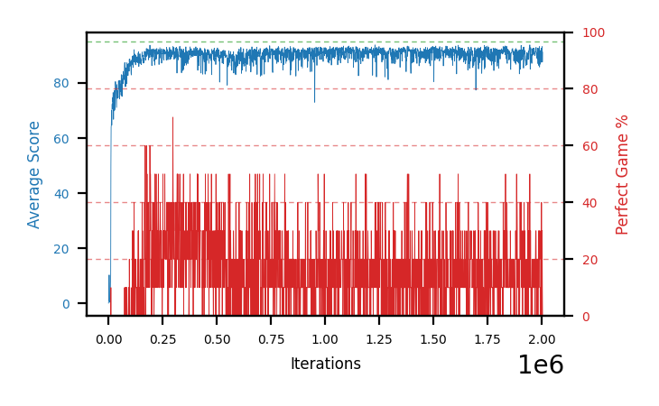

# b19c-stdperseed3

Blue is average score (food eaten) on the left axis, red is perfect-game percentage on the right.

Latest eval: step 2004000, avg score 91.2, perfect games 0%.

## Config

| setting | value |
|---|---|
| policy_name | b19c-stdperseed3 |
| seed | 3 |
| zeroed_observations | none |
| learning_rate | 1e-05 |
| batch_size | 128 |
| discount | 0.9975 |
| target_update_period | 1000 |
| target_update_tau | 1.0 |
| gradient_clipping | none |
| n_step_update | 1 |
| initial_epsilon | 0.4 |
| min_epsilon | 0.002 |
| epsilon_schedule | bootstrap on avg_reward [2, 5, 10, 15, 20] then geometric to floor by 80% trailing-30 perfect |
| guided_fraction | 0.8 |
| forking | up to 4 live branches including the main line, fork p=0.5 at length >= 85, branch capped at 60 steps, one branch advanced per iteration |
| exploration_shield | 80% of refinement-phase episodes draw the epsilon move from non-fatal actions; greedy moves never shielded |
| fc_layer_params | (50, 100, 50) |
| replay_buffer | cpprb prioritized, capacity 100000 |
| priority_exponent (alpha) | 0.6 |
| priority_signal | td_error |
| importance_sampling_beta | 0.4 -> 1.0 over 1000000 steps |
| max_steps | 10000000 |
| initial_populate_steps | 1000 |
| eval | 10 episodes every 1000 steps |
| grid | 9x9, max possible score 95 |
| DEATH_REWARD | -5.0 |
| FOOD_REWARD | 1.0 |
| FOOD_DISTANCE_REWARD | 0.0 |
| eval_only | False |
| min_checkpoint_score | 40.0 |

## Evals

2005 evals so far. Full series in [`b19c-stdperseed3_evals.json`](b19c-stdperseed3_evals.json).

| step | avg score | trailing avg | min score | max score | avg reward | perfect % | epsilon |
|---|---|---|---|---|---|---|---|
| 0 | 0.1 | 0.1 | 0 | 1/95 | -4.9 | 0 | 0.4 |
| 1000 | 1.0 | 1.0 | 0 | 4/95 | 0.5 | 0 | 0.4 |
| 2000 | 1.4 | 1.2 | 0 | 3/95 | 0.9 | 0 | 0.4 |
| ... | | | | | | | |
| 1993000 | 87.4 | 88.72 | 66 | 93/95 | 86.0 | 0 | 0.0085 |
| 1994000 | 91.8 | 88.44 | 89 | 93/95 | 90.4 | 0 | 0.0087 |
| 1995000 | 91.8 | 89.64 | 85 | 95/95 | 99.9 | 10 | 0.0087 |
| 1996000 | 88.1 | 89.18 | 56 | 93/95 | 87.15 | 0 | 0.0088 |
| 1997000 | 87.5 | 89.32 | 60 | 95/95 | 96.5 | 10 | 0.0088 |
| 1998000 | 92.6 | 90.36 | 89 | 95/95 | 100.7 | 10 | 0.0088 |
| 1999000 | 90.1 | 90.02 | 64 | 95/95 | 128.05 | 40 | 0.0087 |
| 2000000 | 90.5 | 89.76 | 76 | 93/95 | 87.75 | 0 | 0.0087 |
| 2001000 | 92.5 | 90.64 | 90 | 95/95 | 111.0 | 20 | 0.0087 |
| 2002000 | 93.2 | 91.78 | 89 | 95/95 | 122.1 | 30 | 0.0087 |
| 2003000 | 87.6 | 90.78 | 64 | 95/95 | 97.05 | 10 | 0.0088 |
| 2004000 | 91.2 | 91.0 | 89 | 93/95 | 90.25 | 0 | 0.009 |
