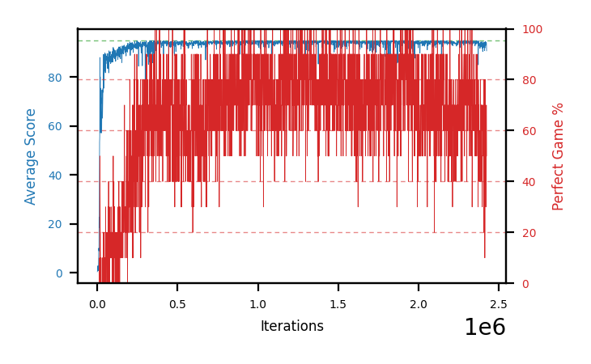

# b19d-stdperseed4

Blue is average score (food eaten) on the left axis, red is perfect-game percentage on the right.

Latest eval: step 2423000, avg score 90.7, perfect games 50%.

## Config

| setting | value |
|---|---|
| policy_name | b19d-stdperseed4 |
| seed | 4 |
| zeroed_observations | none |
| learning_rate | 1e-05 |
| batch_size | 128 |
| discount | 0.9975 |
| target_update_period | 1000 |
| target_update_tau | 1.0 |
| gradient_clipping | none |
| n_step_update | 1 |
| initial_epsilon | 0.4 |
| min_epsilon | 0.002 |
| epsilon_schedule | bootstrap on avg_reward [2, 5, 10, 15, 20] then geometric to floor by 80% trailing-30 perfect |
| guided_fraction | 0.8 |
| forking | up to 4 live branches including the main line, fork p=0.5 at length >= 85, branch capped at 60 steps, one branch advanced per iteration |
| exploration_shield | 80% of refinement-phase episodes draw the epsilon move from non-fatal actions; greedy moves never shielded |
| fc_layer_params | (50, 100, 50) |
| replay_buffer | cpprb prioritized, capacity 100000 |
| priority_exponent (alpha) | 0.6 |
| priority_signal | td_error |
| importance_sampling_beta | 0.4 -> 1.0 over 1000000 steps |
| max_steps | 10000000 |
| initial_populate_steps | 1000 |
| eval | 10 episodes every 1000 steps |
| grid | 9x9, max possible score 95 |
| DEATH_REWARD | -5.0 |
| FOOD_REWARD | 1.0 |
| FOOD_DISTANCE_REWARD | 0.0 |
| eval_only | False |
| min_checkpoint_score | 40.0 |

## Evals

2424 evals so far. Full series in [`b19d-stdperseed4_evals.json`](b19d-stdperseed4_evals.json).

| step | avg score | trailing avg | min score | max score | avg reward | perfect % | epsilon |
|---|---|---|---|---|---|---|---|
| 0 | 0.5 | 0.5 | 0 | 1/95 | -4.5 | 0 | 0.4 |
| 1000 | 0.8 | 0.8 | 0 | 3/95 | 0.3 | 0 | 0.4 |
| 2000 | 1.4 | 1.1 | 0 | 5/95 | 0.45 | 0 | 0.4 |
| ... | | | | | | | |
| 2412000 | 92.2 | 92.94 | 86 | 95/95 | 98.95 | 10 | 0.0035 |
| 2413000 | 91.9 | 92.56 | 80 | 95/95 | 140.25 | 50 | 0.0034 |
| 2414000 | 94.0 | 92.62 | 90 | 95/95 | 173.1 | 80 | 0.0034 |
| 2415000 | 94.5 | 93.36 | 92 | 95/95 | 173.15 | 80 | 0.0034 |
| 2416000 | 93.9 | 93.3 | 90 | 95/95 | 151.75 | 60 | 0.0034 |
| 2417000 | 92.9 | 93.44 | 88 | 95/95 | 130.85 | 40 | 0.0035 |
| 2418000 | 94.3 | 93.92 | 93 | 95/95 | 151.7 | 60 | 0.0034 |
| 2419000 | 93.3 | 93.78 | 91 | 95/95 | 119.95 | 30 | 0.0034 |
| 2420000 | 94.2 | 93.72 | 93 | 95/95 | 152.05 | 60 | 0.0035 |
| 2421000 | 94.1 | 93.76 | 90 | 95/95 | 161.9 | 70 | 0.0034 |
| 2422000 | 94.0 | 93.98 | 90 | 95/95 | 162.7 | 70 | 0.0034 |
| 2423000 | 90.7 | 93.26 | 74 | 95/95 | 138.6 | 50 | 0.0035 |
