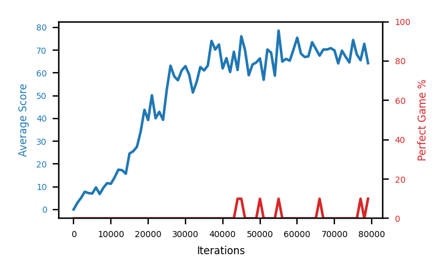

# b1a-base

Blue is average score (food eaten) on the left axis, red is perfect-game percentage on the right.

Latest eval: step 79000, avg score 64.3, perfect games 10%.

## Config

| setting | value |
|---|---|
| policy_name | b1a-base |
| learning_rate | 1e-05 |
| batch_size | 128 |
| discount | 0.99 |
| target_update_period | 8 |
| target_update_tau | 1.0 |
| gradient_clipping | none |
| n_step_update | 1 |
| initial_epsilon | 0.4 |
| fc_layer_params | (50, 100, 50) |
| replay_buffer | cpprb prioritized, capacity 100000 |
| priority_exponent (alpha) | 0.6 |
| importance_sampling_beta | 0.4 -> 1.0 over 1000000 steps |
| initial_populate_steps | 1000 |
| initialize_with_schmid | False |
| eval | 10 episodes every 1000 steps |
| grid | 9x9, max possible score 95 |
| DEATH_REWARD | -5.0 |
| FOOD_REWARD | 1.0 |
| FOOD_DISTANCE_REWARD | 0.001 |
| eval_only | False |

## Evals

80 evals so far. Full series in [`b1a-base_evals.json`](b1a-base_evals.json).

| step | avg score | trailing avg | min score | max score | avg reward | perfect % | epsilon |
|---|---|---|---|---|---|---|---|
| 0 | 0.0 | 0.0 | 0 | 0/95 | -5.005 | 0 | 0.4 |
| 1000 | 2.9 | 2.9 | 0 | 8/95 | -2.155 | 0 | 0.4 |
| 2000 | 5.1 | 4.0 | 0 | 12/95 | 0.08 | 0 | 0.4 |
| ... | | | | | | | |
| 68000 | 70.3 | 70.46 | 50 | 88/95 | 65.468 | 0 | 0.001 |
| 69000 | 70.9 | 69.94 | 18 | 91/95 | 67.344 | 0 | 0.001 |
| 70000 | 69.9 | 69.8 | 44 | 83/95 | 65.454 | 0 | 0.001 |
| 71000 | 64.2 | 69.12 | 37 | 93/95 | 59.866 | 0 | 0.001 |
| 72000 | 69.8 | 69.02 | 37 | 91/95 | 65.9 | 0 | 0.001 |
| 73000 | 67.1 | 68.38 | 22 | 90/95 | 63.182 | 0 | 0.001 |
| 74000 | 64.6 | 67.12 | 35 | 87/95 | 61.502 | 0 | 0.001 |
| 75000 | 74.5 | 68.04 | 53 | 93/95 | 70.394 | 0 | 0.001 |
| 76000 | 68.1 | 68.82 | 7 | 91/95 | 64.166 | 0 | 0.001 |
| 77000 | 65.6 | 67.98 | 36 | 95/95 | 71.279 | 10 | 0.001 |
| 78000 | 72.8 | 69.12 | 28 | 87/95 | 69.666 | 0 | 0.001 |
| 79000 | 64.3 | 69.06 | 30 | 95/95 | 69.564 | 10 | 0.001 |
