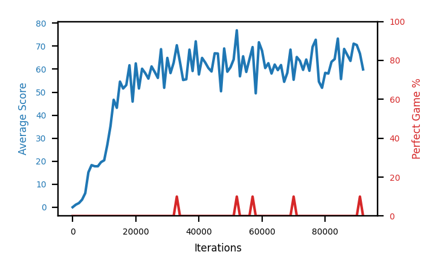

# b1b-tgt200

Blue is average score (food eaten) on the left axis, red is perfect-game percentage on the right.

Latest eval: step 92000, avg score 59.9, perfect games 0%.

## Config

| setting | value |
|---|---|
| policy_name | b1b-tgt200 |
| learning_rate | 1e-05 |
| batch_size | 128 |
| discount | 0.99 |
| target_update_period | 200 |
| target_update_tau | 1.0 |
| gradient_clipping | none |
| n_step_update | 1 |
| initial_epsilon | 0.4 |
| fc_layer_params | (50, 100, 50) |
| replay_buffer | cpprb prioritized, capacity 100000 |
| priority_exponent (alpha) | 0.6 |
| importance_sampling_beta | 0.4 -> 1.0 over 1000000 steps |
| initial_populate_steps | 1000 |
| initialize_with_schmid | False |
| eval | 10 episodes every 1000 steps |
| grid | 9x9, max possible score 95 |
| DEATH_REWARD | -5.0 |
| FOOD_REWARD | 1.0 |
| FOOD_DISTANCE_REWARD | 0.001 |
| eval_only | False |

## Evals

93 evals so far. Full series in [`b1b-tgt200_evals.json`](b1b-tgt200_evals.json).

| step | avg score | trailing avg | min score | max score | avg reward | perfect % | epsilon |
|---|---|---|---|---|---|---|---|
| 0 | 0.0 | 0.0 | 0 | 0/95 | -5.001 | 0 | 0.4 |
| 1000 | 1.1 | 1.1 | 0 | 3/95 | -3.915 | 0 | 0.4 |
| 2000 | 1.8 | 1.45 | 0 | 4/95 | -1.004 | 0 | 0.4 |
| ... | | | | | | | |
| 81000 | 58.1 | 59.16 | 34 | 86/95 | 53.068 | 0 | 0.001 |
| 82000 | 63.2 | 57.24 | 51 | 71/95 | 58.54 | 0 | 0.001 |
| 83000 | 64.4 | 59.2 | 27 | 89/95 | 59.794 | 0 | 0.001 |
| 84000 | 73.3 | 63.48 | 38 | 87/95 | 68.529 | 0 | 0.001 |
| 85000 | 55.7 | 62.94 | 35 | 69/95 | 50.781 | 0 | 0.001 |
| 86000 | 68.8 | 65.08 | 50 | 93/95 | 64.129 | 0 | 0.001 |
| 87000 | 66.2 | 65.68 | 55 | 78/95 | 61.125 | 0 | 0.001 |
| 88000 | 63.6 | 65.52 | 36 | 76/95 | 59.017 | 0 | 0.001 |
| 89000 | 71.1 | 65.08 | 56 | 81/95 | 66.327 | 0 | 0.001 |
| 90000 | 70.5 | 68.04 | 41 | 90/95 | 65.444 | 0 | 0.001 |
| 91000 | 66.8 | 67.64 | 38 | 95/95 | 72.465 | 10 | 0.001 |
| 92000 | 59.9 | 66.38 | 22 | 86/95 | 55.322 | 0 | 0.001 |
