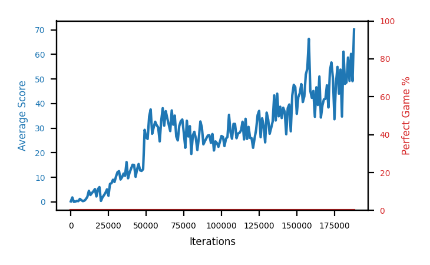

# b1c-nstep3

Blue is average score (food eaten) on the left axis, red is perfect-game percentage on the right.

Latest eval: step 188000, avg score 70.1, perfect games 0%.

## Config

| setting | value |
|---|---|
| policy_name | b1c-nstep3 |
| learning_rate | 1e-05 |
| batch_size | 128 |
| discount | 0.99 |
| target_update_period | 8 |
| target_update_tau | 1.0 |
| gradient_clipping | none |
| n_step_update | 3 |
| initial_epsilon | 0.4 |
| fc_layer_params | (50, 100, 50) |
| replay_buffer | cpprb prioritized, capacity 100000 |
| priority_exponent (alpha) | 0.6 |
| importance_sampling_beta | 0.4 -> 1.0 over 1000000 steps |
| initial_populate_steps | 1000 |
| initialize_with_schmid | False |
| eval | 10 episodes every 1000 steps |
| grid | 9x9, max possible score 95 |
| DEATH_REWARD | -5.0 |
| FOOD_REWARD | 1.0 |
| FOOD_DISTANCE_REWARD | 0.001 |
| eval_only | False |

## Evals

189 evals so far. Full series in [`b1c-nstep3_evals.json`](b1c-nstep3_evals.json).

| step | avg score | trailing avg | min score | max score | avg reward | perfect % | epsilon |
|---|---|---|---|---|---|---|---|
| 0 | 0.2 | 0.2 | 0 | 1/95 | -4.808 | 0 | 0.4 |
| 1000 | 1.8 | 1.8 | 0 | 5/95 | -1.0 | 0 | 0.4 |
| 2000 | 0.0 | 0.9 | 0 | 0/95 | -5.005 | 0 | 0.4 |
| ... | | | | | | | |
| 177000 | 54.9 | 48.72 | 30 | 80/95 | 49.564 | 0 | 0.001 |
| 178000 | 44.0 | 46.18 | 20 | 66/95 | 38.743 | 0 | 0.001 |
| 179000 | 53.8 | 46.9 | 17 | 82/95 | 48.413 | 0 | 0.001 |
| 180000 | 34.7 | 47.12 | 13 | 57/95 | 29.496 | 0 | 0.001 |
| 181000 | 61.1 | 49.7 | 20 | 93/95 | 55.567 | 0 | 0.001 |
| 182000 | 48.0 | 48.32 | 22 | 84/95 | 42.645 | 0 | 0.001 |
| 183000 | 48.6 | 49.24 | 14 | 74/95 | 43.755 | 0 | 0.001 |
| 184000 | 58.7 | 50.22 | 30 | 80/95 | 53.676 | 0 | 0.001 |
| 185000 | 49.2 | 53.12 | 22 | 78/95 | 43.872 | 0 | 0.001 |
| 186000 | 60.2 | 52.94 | 22 | 87/95 | 54.772 | 0 | 0.001 |
| 187000 | 49.1 | 53.16 | 16 | 77/95 | 43.757 | 0 | 0.001 |
| 188000 | 70.1 | 57.46 | 44 | 85/95 | 64.601 | 0 | 0.001 |
