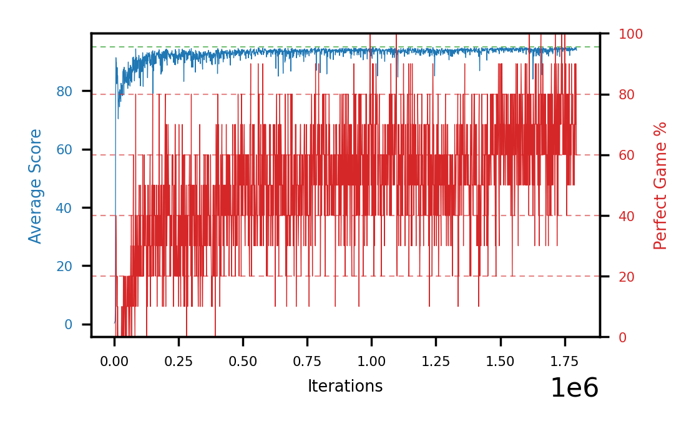

# b20h-fc200seed4

Blue is average score (food eaten) on the left axis, red is perfect-game percentage on the right.

Latest eval: step 1797000, avg score 94.0, perfect games 60%.

## Config

| setting | value |
|---|---|
| policy_name | b20h-fc200seed4 |
| seed | 4 |
| zeroed_observations | none |
| learning_rate | 1e-05 |
| batch_size | 128 |
| discount | 0.9975 |
| target_update_period | 1000 |
| target_update_tau | 1.0 |
| gradient_clipping | none |
| n_step_update | 1 |
| initial_epsilon | 0.4 |
| min_epsilon | 0.002 |
| epsilon_schedule | bootstrap on avg_reward [2, 5, 10, 15, 20] then geometric to floor by 80% trailing-30 perfect |
| guided_fraction | 0.8 |
| forking | up to 4 live branches including the main line, fork p=0.5 at length >= 85, branch capped at 60 steps, one branch advanced per iteration |
| exploration_shield | 80% of refinement-phase episodes draw the epsilon move from non-fatal actions; greedy moves never shielded |
| fc_layer_params | (200, 100, 50) |
| replay_buffer | cpprb prioritized, capacity 100000 |
| priority_exponent (alpha) | 0.6 |
| priority_signal | td_error |
| importance_sampling_beta | 0.4 -> 1.0 over 300000 steps |
| max_steps | 10000000 |
| initial_populate_steps | 1000 |
| eval | 10 episodes every 1000 steps |
| grid | 9x9, max possible score 95 |
| DEATH_REWARD | -5.0 |
| FOOD_REWARD | 1.0 |
| FOOD_DISTANCE_REWARD | 0.0 |
| eval_only | False |
| min_checkpoint_score | 40.0 |

## Evals

1798 evals so far. Full series in [`b20h-fc200seed4_evals.json`](b20h-fc200seed4_evals.json).

| step | avg score | trailing avg | min score | max score | avg reward | perfect % | epsilon |
|---|---|---|---|---|---|---|---|
| 0 | 0.3 | 0.3 | 0 | 1/95 | -4.7 | 0 | 0.4 |
| 1000 | 0.4 | 0.4 | 0 | 1/95 | -0.1 | 0 | 0.4 |
| 2000 | 0.8 | 0.6 | 0 | 2/95 | 0.3 | 0 | 0.4 |
| ... | | | | | | | |
| 1786000 | 94.3 | 94.14 | 92 | 95/95 | 163.0 | 70 | 0.0027 |
| 1787000 | 94.2 | 94.08 | 91 | 95/95 | 162.0 | 70 | 0.0027 |
| 1788000 | 94.0 | 94.12 | 93 | 95/95 | 141.45 | 50 | 0.0027 |
| 1789000 | 94.3 | 94.18 | 91 | 95/95 | 162.1 | 70 | 0.0027 |
| 1790000 | 94.8 | 94.32 | 93 | 95/95 | 183.4 | 90 | 0.0027 |
| 1791000 | 94.1 | 94.28 | 92 | 95/95 | 151.95 | 60 | 0.0027 |
| 1792000 | 94.4 | 94.32 | 91 | 95/95 | 173.05 | 80 | 0.0027 |
| 1793000 | 94.4 | 94.4 | 93 | 95/95 | 162.65 | 70 | 0.0027 |
| 1794000 | 94.6 | 94.46 | 91 | 95/95 | 183.65 | 90 | 0.0027 |
| 1795000 | 94.8 | 94.46 | 94 | 95/95 | 173.0 | 80 | 0.0026 |
| 1796000 | 93.9 | 94.42 | 91 | 95/95 | 152.2 | 60 | 0.0026 |
| 1797000 | 94.0 | 94.34 | 91 | 95/95 | 151.85 | 60 | 0.0026 |
