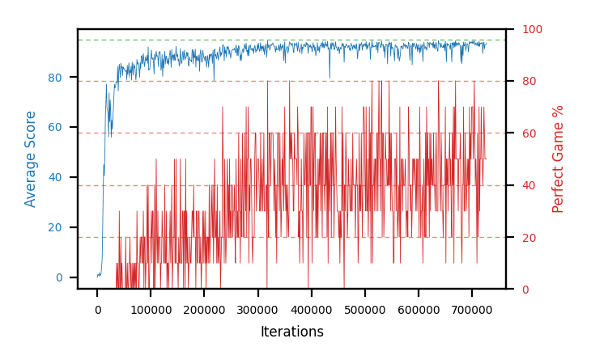

# b20k-fc200x50seed3

Blue is average score (food eaten) on the left axis, red is perfect-game percentage on the right.

Latest eval: step 727000, avg score 93.5, perfect games 50%.

## Config

| setting | value |
|---|---|
| policy_name | b20k-fc200x50seed3 |
| seed | 3 |
| zeroed_observations | none |
| learning_rate | 1e-05 |
| batch_size | 128 |
| discount | 0.9975 |
| target_update_period | 1000 |
| target_update_tau | 1.0 |
| gradient_clipping | none |
| n_step_update | 1 |
| initial_epsilon | 0.4 |
| min_epsilon | 0.002 |
| epsilon_schedule | bootstrap on avg_reward [2, 5, 10, 15, 20] then geometric to floor by 80% trailing-30 perfect |
| guided_fraction | 0.8 |
| forking | up to 4 live branches including the main line, fork p=0.5 at length >= 85, branch capped at 60 steps, one branch advanced per iteration |
| exploration_shield | 80% of refinement-phase episodes draw the epsilon move from non-fatal actions; greedy moves never shielded |
| fc_layer_params | (200, 50) |
| replay_buffer | cpprb prioritized, capacity 100000 |
| priority_exponent (alpha) | 0.6 |
| priority_signal | td_error |
| importance_sampling_beta | 0.4 -> 1.0 over 300000 steps |
| max_steps | 3000000 |
| initial_populate_steps | 1000 |
| eval | 10 episodes every 1000 steps |
| grid | 9x9, max possible score 95 |
| DEATH_REWARD | -5.0 |
| FOOD_REWARD | 1.0 |
| FOOD_DISTANCE_REWARD | 0.0 |
| eval_only | False |
| min_checkpoint_score | 40.0 |

## Evals

728 evals so far. Full series in [`b20k-fc200x50seed3_evals.json`](b20k-fc200x50seed3_evals.json).

| step | avg score | trailing avg | min score | max score | avg reward | perfect % | epsilon |
|---|---|---|---|---|---|---|---|
| 0 | 0.0 | 0.0 | 0 | 0/95 | -5.0 | 0 | 0.4 |
| 1000 | 1.2 | 1.2 | 0 | 4/95 | 0.7 | 0 | 0.4 |
| 2000 | 1.0 | 1.1 | 0 | 5/95 | 0.5 | 0 | 0.4 |
| ... | | | | | | | |
| 716000 | 93.3 | 93.08 | 90 | 95/95 | 142.55 | 50 | 0.0041 |
| 717000 | 93.6 | 93.36 | 88 | 95/95 | 162.75 | 70 | 0.0041 |
| 718000 | 93.2 | 93.16 | 90 | 95/95 | 142.45 | 50 | 0.004 |
| 719000 | 93.7 | 93.46 | 92 | 95/95 | 142.95 | 50 | 0.004 |
| 720000 | 89.4 | 92.64 | 56 | 95/95 | 128.7 | 40 | 0.004 |
| 721000 | 93.1 | 92.6 | 84 | 95/95 | 142.35 | 50 | 0.004 |
| 722000 | 93.9 | 92.66 | 90 | 95/95 | 163.05 | 70 | 0.0039 |
| 723000 | 91.2 | 92.26 | 66 | 95/95 | 150.4 | 60 | 0.0039 |
| 724000 | 92.8 | 92.08 | 88 | 95/95 | 142.05 | 50 | 0.0038 |
| 725000 | 92.9 | 92.78 | 87 | 95/95 | 142.15 | 50 | 0.0038 |
| 726000 | 93.0 | 92.76 | 86 | 95/95 | 142.25 | 50 | 0.0038 |
| 727000 | 93.5 | 92.68 | 91 | 95/95 | 142.75 | 50 | 0.0038 |
