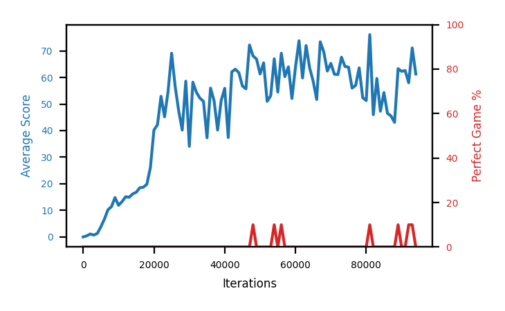

# b2a-base2

Blue is average score (food eaten) on the left axis, red is perfect-game percentage on the right.

Latest eval: step 94000, avg score 61.3, perfect games 0%.

## Config

| setting | value |
|---|---|
| policy_name | b2a-base2 |
| learning_rate | 1e-05 |
| batch_size | 128 |
| discount | 0.99 |
| target_update_period | 8 |
| target_update_tau | 1.0 |
| gradient_clipping | none |
| n_step_update | 1 |
| initial_epsilon | 0.4 |
| fc_layer_params | (50, 100, 50) |
| replay_buffer | cpprb prioritized, capacity 100000 |
| priority_exponent (alpha) | 0.6 |
| importance_sampling_beta | 0.4 -> 1.0 over 1000000 steps |
| initial_populate_steps | 1000 |
| initialize_with_schmid | False |
| eval | 10 episodes every 1000 steps |
| grid | 9x9, max possible score 95 |
| DEATH_REWARD | -5.0 |
| FOOD_REWARD | 1.0 |
| FOOD_DISTANCE_REWARD | 0.001 |
| eval_only | False |

## Evals

95 evals so far. Full series in [`b2a-base2_evals.json`](b2a-base2_evals.json).

| step | avg score | trailing avg | min score | max score | avg reward | perfect % | epsilon |
|---|---|---|---|---|---|---|---|
| 0 | 0.0 | 0.0 | 0 | 0/95 | -5.002 | 0 | 0.4 |
| 1000 | 0.4 | 0.4 | 0 | 1/95 | -0.153 | 0 | 0.4 |
| 2000 | 1.1 | 0.75 | 0 | 4/95 | 0.543 | 0 | 0.4 |
| ... | | | | | | | |
| 83000 | 59.6 | 57.08 | 9 | 86/95 | 54.858 | 0 | 0.001 |
| 84000 | 47.3 | 56.06 | 10 | 89/95 | 44.027 | 0 | 0.001 |
| 85000 | 54.3 | 56.66 | 11 | 83/95 | 50.171 | 0 | 0.001 |
| 86000 | 46.5 | 50.74 | 8 | 80/95 | 42.824 | 0 | 0.001 |
| 87000 | 45.5 | 50.64 | 8 | 84/95 | 42.269 | 0 | 0.001 |
| 88000 | 43.1 | 47.34 | 10 | 87/95 | 39.468 | 0 | 0.001 |
| 89000 | 63.3 | 50.54 | 43 | 95/95 | 68.62 | 10 | 0.001 |
| 90000 | 62.3 | 52.14 | 10 | 86/95 | 58.053 | 0 | 0.001 |
| 91000 | 62.6 | 55.36 | 8 | 90/95 | 57.865 | 0 | 0.001 |
| 92000 | 58.0 | 57.86 | 23 | 95/95 | 63.807 | 10 | 0.001 |
| 93000 | 71.1 | 63.46 | 37 | 95/95 | 77.244 | 10 | 0.001 |
| 94000 | 61.3 | 63.06 | 15 | 87/95 | 57.512 | 0 | 0.001 |
