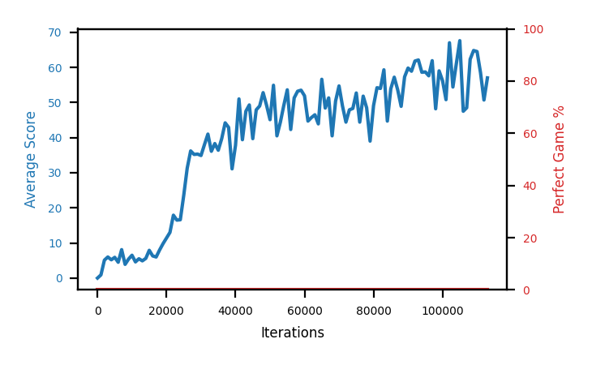

# b2b-nstep2

Blue is average score (food eaten) on the left axis, red is perfect-game percentage on the right.

Latest eval: step 113000, avg score 57.0, perfect games 0%.

## Config

| setting | value |
|---|---|
| policy_name | b2b-nstep2 |
| learning_rate | 1e-05 |
| batch_size | 128 |
| discount | 0.99 |
| target_update_period | 8 |
| target_update_tau | 1.0 |
| gradient_clipping | none |
| n_step_update | 2 |
| initial_epsilon | 0.4 |
| fc_layer_params | (50, 100, 50) |
| replay_buffer | cpprb prioritized, capacity 100000 |
| priority_exponent (alpha) | 0.6 |
| importance_sampling_beta | 0.4 -> 1.0 over 1000000 steps |
| initial_populate_steps | 1000 |
| initialize_with_schmid | False |
| eval | 10 episodes every 1000 steps |
| grid | 9x9, max possible score 95 |
| DEATH_REWARD | -5.0 |
| FOOD_REWARD | 1.0 |
| FOOD_DISTANCE_REWARD | 0.001 |
| eval_only | False |

## Evals

114 evals so far. Full series in [`b2b-nstep2_evals.json`](b2b-nstep2_evals.json).

| step | avg score | trailing avg | min score | max score | avg reward | perfect % | epsilon |
|---|---|---|---|---|---|---|---|
| 0 | 0.0 | 0.0 | 0 | 0/95 | -5.004 | 0 | 0.4 |
| 1000 | 0.9 | 0.9 | 0 | 2/95 | -1.467 | 0 | 0.4 |
| 2000 | 5.1 | 3.0 | 1 | 8/95 | 0.079 | 0 | 0.4 |
| ... | | | | | | | |
| 102000 | 67.0 | 56.24 | 50 | 83/95 | 61.468 | 0 | 0.001 |
| 103000 | 54.4 | 57.48 | 34 | 81/95 | 49.46 | 0 | 0.001 |
| 104000 | 61.1 | 57.9 | 34 | 85/95 | 56.474 | 0 | 0.001 |
| 105000 | 67.6 | 60.18 | 41 | 89/95 | 63.36 | 0 | 0.001 |
| 106000 | 47.5 | 59.52 | 16 | 80/95 | 42.576 | 0 | 0.001 |
| 107000 | 48.5 | 55.82 | 22 | 82/95 | 43.164 | 0 | 0.001 |
| 108000 | 62.3 | 57.4 | 36 | 78/95 | 57.605 | 0 | 0.001 |
| 109000 | 64.8 | 58.14 | 25 | 84/95 | 59.698 | 0 | 0.001 |
| 110000 | 64.5 | 57.52 | 24 | 91/95 | 59.338 | 0 | 0.001 |
| 111000 | 58.5 | 59.72 | 15 | 82/95 | 53.93 | 0 | 0.001 |
| 112000 | 50.7 | 60.16 | 30 | 73/95 | 45.723 | 0 | 0.001 |
| 113000 | 57.0 | 59.1 | 18 | 83/95 | 51.558 | 0 | 0.001 |
