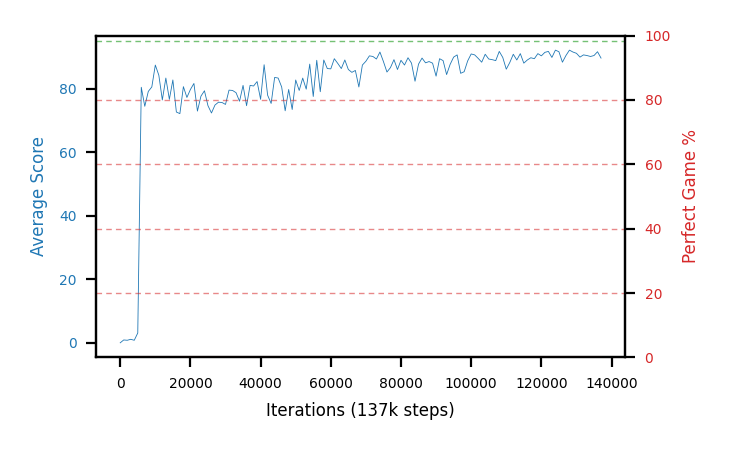

# b30b-chase10fc200x100x100seed2

Blue is average score (food eaten) on the left axis, red is perfect-game percentage on the right.

Latest eval: step 137000, avg score 89.7, perfect games 0%.

## Config

| setting | value |
|---|---|
| policy_name | b30b-chase10fc200x100x100seed2 |
| seed | 2 |
| zeroed_observations | none |
| learning_rate | 1e-05 |
| batch_size | 128 |
| discount | 0.9975 |
| target_update_period | 1000 |
| target_update_tau | 1.0 |
| gradient_clipping | none |
| n_step_update | 1 |
| initial_epsilon | 0.4 |
| min_epsilon | 0.002 |
| epsilon_schedule | bootstrap on avg_reward [2, 5, 10, 15, 20] then geometric to floor by 80% trailing-30 perfect |
| guided_fraction | 0.8 |
| forking | up to 4 live branches including the main line, fork p=0.5 at length >= 85, branch capped at 60 steps, one branch advanced per iteration |
| exploration_shield | 80% of refinement-phase episodes draw the epsilon move from non-fatal actions; greedy moves never shielded |
| fc_layer_params | (200, 100, 100) |
| replay_buffer | cpprb prioritized, capacity 100000 |
| priority_exponent (alpha) | 0.6 |
| priority_signal | td_error |
| importance_sampling_beta | disabled |
| max_steps | 2000000 |
| initial_populate_steps | 1000 |
| eval | 10 episodes every 1000 steps |
| grid | 9x9, max possible score 95 |
| DEATH_REWARD | -5.0 |
| FOOD_REWARD | 1.0 |
| FOOD_DISTANCE_REWARD | 0.0 |
| CHASE_SAFE_SHAPING | c=0.1, potential-based on head/food/tail in one region, gated to snake length >= 85 |
| eval_only | False |
| min_checkpoint_score | 40.0 |

## Evals

138 evals so far. Full series in [`b30b-chase10fc200x100x100seed2_evals.json`](b30b-chase10fc200x100x100seed2_evals.json).

| step | avg score | trailing avg | min score | max score | avg reward | perfect % | epsilon |
|---|---|---|---|---|---|---|---|
| 0 | 0.0 | 0.0 | 0 | 0/95 | -5.0 | 0 | 0.4 |
| 1000 | 0.9 | 0.9 | 0 | 3/95 | 0.4 | 0 | 0.4 |
| 2000 | 0.8 | 0.85 | 0 | 3/95 | 0.3 | 0 | 0.4 |
| ... | | | | | | | |
| 126000 | 88.4 | 90.8 | 78 | 95/95 | 97.838 | 0 | 0.0125 |
| 127000 | 90.5 | 90.54 | 86 | 94/95 | 89.086 | 0 | 0.0125 |
| 128000 | 92.2 | 91.0 | 88 | 95/95 | 131.483 | 0 | 0.0125 |
| 129000 | 91.6 | 90.88 | 89 | 95/95 | 100.584 | 0 | 0.0125 |
| 130000 | 91.2 | 90.78 | 84 | 95/95 | 120.534 | 0 | 0.0125 |
| 131000 | 90.0 | 91.1 | 80 | 94/95 | 89.037 | 0 | 0.0125 |
| 132000 | 90.7 | 91.14 | 84 | 94/95 | 89.288 | 0 | 0.0125 |
| 133000 | 90.5 | 90.8 | 78 | 95/95 | 119.386 | 0 | 0.0125 |
| 134000 | 90.2 | 90.52 | 72 | 95/95 | 119.086 | 0 | 0.0125 |
| 135000 | 90.5 | 90.38 | 86 | 95/95 | 109.436 | 0 | 0.0125 |
| 136000 | 91.7 | 90.72 | 88 | 94/95 | 90.283 | 0 | 0.0125 |
| 137000 | 89.7 | 90.52 | 80 | 95/95 | 99.137 | 0 | 0.0125 |
