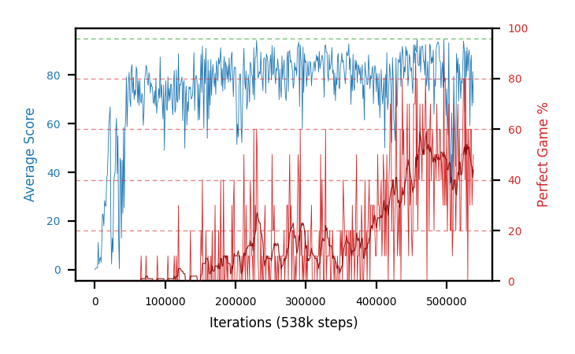

# b31b-c51lr5e5seed2

Blue is average score (food eaten) on the left axis, red is perfect-game percentage on the right.

Latest eval: step 538000, avg score 68.6, perfect games 50%.

## Config

| setting | value |
|---|---|
| policy_name | b31b-c51lr5e5seed2 |
| seed | 2 |
| zeroed_observations | none |
| learning_rate | 5e-05 |
| batch_size | 128 |
| discount | 0.9975 |
| target_update_period | 1000 |
| target_update_tau | 1.0 |
| gradient_clipping | none |
| n_step_update | 1 |
| initial_epsilon | 0.4 |
| min_epsilon | 0.002 |
| epsilon_schedule | bootstrap on avg_reward [2, 5, 10, 15, 20] then geometric to floor by 80% trailing-30 perfect |
| guided_fraction | 0.8 |
| forking | up to 4 live branches including the main line, fork p=0.5 at length >= 85, branch capped at 60 steps, one branch advanced per iteration |
| exploration_shield | 80% of refinement-phase episodes draw the epsilon move from non-fatal actions; greedy moves never shielded |
| fc_layer_params | (200, 100, 100) |
| algo | c51 (distributional), 51 atoms over [-5.0, 120.0] at 2.500 spacing, cross-entropy loss, double (online argmax) target selection, standard init |
| replay_buffer | cpprb prioritized, capacity 100000 |
| priority_exponent (alpha) | 0.6 |
| priority_signal | kl (SNEK_PRIORITY_SIGNAL=td_error; a distributional agent has no TD error) |
| importance_sampling_beta | disabled |
| max_steps | 2000000 |
| initial_populate_steps | 1000 |
| eval | 10 episodes every 1000 steps |
| grid | 9x9, max possible score 95 |
| DEATH_REWARD | -5.0 |
| FOOD_REWARD | 1.0 |
| FOOD_DISTANCE_REWARD | 0.0 |
| CHASE_SAFE_SHAPING | off |
| eval_only | False |
| min_checkpoint_score | 40.0 |
| c51_support_note | support [-5.0, 120.0] is below the derived maximum return 194.0, so a return above 120.0 would be clipped. Measured max is 105.0 (14% headroom); spacing 2.500. This is a judgement, not an error. |

## Evals

539 evals so far. Full series in [`b31b-c51lr5e5seed2_evals.json`](b31b-c51lr5e5seed2_evals.json).

| step | avg score | trailing avg | min score | max score | avg reward | perfect % | epsilon |
|---|---|---|---|---|---|---|---|
| 0 | 0.0 | 0.0 | 0 | 0/95 | -5.0 | 0 | 0.4 |
| 1000 | 0.4 | 0.4 | 0 | 2/95 | -0.1 | 0 | 0.4 |
| 2000 | 0.8 | 0.6 | 0 | 1/95 | 0.3 | 0 | 0.4 |
| ... | | | | | | | |
| 527000 | 89.8 | 84.7 | 45 | 95/95 | 168.45 | 80 | 0.0044 |
| 528000 | 79.2 | 83.62 | 27 | 95/95 | 98.15 | 20 | 0.0045 |
| 529000 | 91.3 | 83.1 | 77 | 95/95 | 149.6 | 60 | 0.0044 |
| 530000 | 81.7 | 81.34 | 65 | 90/95 | 79.85 | 0 | 0.0046 |
| 531000 | 88.2 | 86.04 | 49 | 95/95 | 146.5 | 60 | 0.0045 |
| 532000 | 90.3 | 86.14 | 72 | 95/95 | 139.55 | 50 | 0.0044 |
| 533000 | 59.2 | 82.14 | 3 | 95/95 | 88.1 | 30 | 0.0046 |
| 534000 | 85.0 | 80.88 | 27 | 95/95 | 143.75 | 60 | 0.0045 |
| 535000 | 88.1 | 82.16 | 49 | 95/95 | 146.4 | 60 | 0.0044 |
| 536000 | 67.3 | 77.98 | 20 | 95/95 | 96.65 | 30 | 0.0044 |
| 537000 | 81.4 | 76.2 | 0 | 95/95 | 119.8 | 40 | 0.0044 |
| 538000 | 68.6 | 78.08 | 15 | 95/95 | 116.95 | 50 | 0.0043 |
