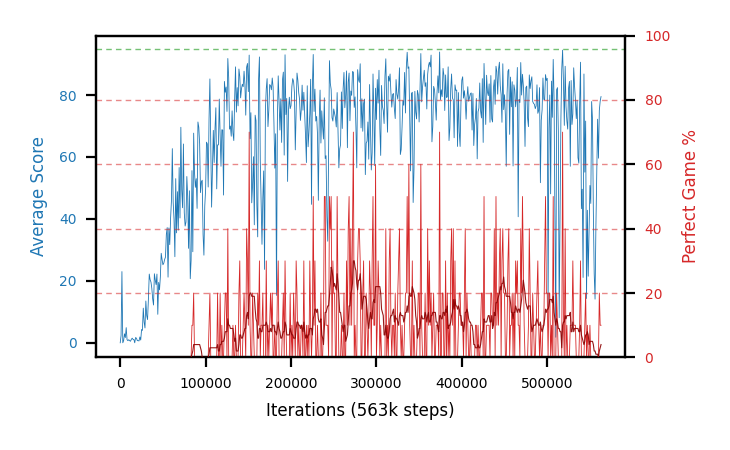

# b31c-c51lr5e5seed3

Blue is average score (food eaten) on the left axis, red is perfect-game percentage on the right.

Latest eval: step 563000, avg score 79.5, perfect games 10%.

## Config

| setting | value |
|---|---|
| policy_name | b31c-c51lr5e5seed3 |
| seed | 3 |
| zeroed_observations | none |
| learning_rate | 5e-05 |
| batch_size | 128 |
| discount | 0.9975 |
| target_update_period | 1000 |
| target_update_tau | 1.0 |
| gradient_clipping | none |
| n_step_update | 1 |
| initial_epsilon | 0.4 |
| min_epsilon | 0.002 |
| epsilon_schedule | bootstrap on avg_reward [2, 5, 10, 15, 20] then geometric to floor by 80% trailing-30 perfect |
| guided_fraction | 0.8 |
| forking | up to 4 live branches including the main line, fork p=0.5 at length >= 85, branch capped at 60 steps, one branch advanced per iteration |
| exploration_shield | 80% of refinement-phase episodes draw the epsilon move from non-fatal actions; greedy moves never shielded |
| fc_layer_params | (200, 100, 100) |
| algo | c51 (distributional), 51 atoms over [-5.0, 120.0] at 2.500 spacing, cross-entropy loss, double (online argmax) target selection, standard init |
| replay_buffer | cpprb prioritized, capacity 100000 |
| priority_exponent (alpha) | 0.6 |
| priority_signal | kl (SNEK_PRIORITY_SIGNAL=td_error; a distributional agent has no TD error) |
| importance_sampling_beta | disabled |
| max_steps | 2000000 |
| initial_populate_steps | 1000 |
| eval | 10 episodes every 1000 steps |
| grid | 9x9, max possible score 95 |
| DEATH_REWARD | -5.0 |
| FOOD_REWARD | 1.0 |
| FOOD_DISTANCE_REWARD | 0.0 |
| CHASE_SAFE_SHAPING | off |
| eval_only | False |
| min_checkpoint_score | 40.0 |
| c51_support_note | support [-5.0, 120.0] is below the derived maximum return 194.0, so a return above 120.0 would be clipped. Measured max is 105.0 (14% headroom); spacing 2.500. This is a judgement, not an error. |

## Evals

564 evals so far. Full series in [`b31c-c51lr5e5seed3_evals.json`](b31c-c51lr5e5seed3_evals.json).

| step | avg score | trailing avg | min score | max score | avg reward | perfect % | epsilon |
|---|---|---|---|---|---|---|---|
| 0 | 0.0 | 0.0 | 0 | 0/95 | -5.0 | 0 | 0.4 |
| 1000 | 2.4 | 2.4 | 0 | 4/95 | 1.9 | 0 | 0.4 |
| 2000 | 23.0 | 12.7 | 0 | 81/95 | 21.6 | 0 | 0.1 |
| ... | | | | | | | |
| 552000 | 77.9 | 46.18 | 26 | 93/95 | 76.05 | 0 | 0.0108 |
| 553000 | 72.2 | 56.32 | 12 | 93/95 | 69.9 | 0 | 0.0109 |
| 554000 | 42.6 | 57.7 | 1 | 90/95 | 39.85 | 0 | 0.0109 |
| 555000 | 22.3 | 52.0 | 4 | 89/95 | 21.35 | 0 | 0.0109 |
| 556000 | 14.1 | 45.82 | 1 | 55/95 | 12.25 | 0 | 0.0109 |
| 557000 | 37.5 | 37.74 | 0 | 90/95 | 36.1 | 0 | 0.011 |
| 558000 | 54.9 | 34.28 | 2 | 89/95 | 50.35 | 0 | 0.0111 |
| 559000 | 72.2 | 40.2 | 3 | 93/95 | 70.35 | 0 | 0.0111 |
| 560000 | 59.6 | 47.66 | 5 | 87/95 | 55.05 | 0 | 0.0114 |
| 561000 | 75.0 | 59.84 | 5 | 95/95 | 92.15 | 20 | 0.0113 |
| 562000 | 78.0 | 67.94 | 52 | 95/95 | 85.2 | 10 | 0.0113 |
| 563000 | 79.5 | 72.86 | 42 | 95/95 | 86.7 | 10 | 0.0113 |
