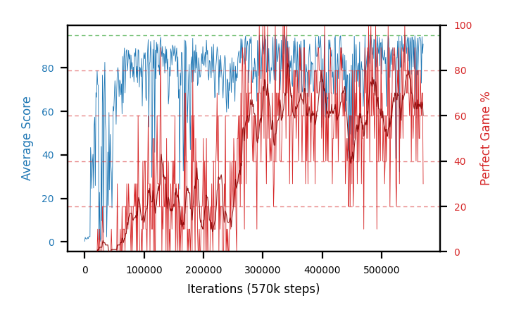

# b31d-c51lr5e5seed4

Blue is average score (food eaten) on the left axis, red is perfect-game percentage on the right.

Latest eval: step 570000, avg score 91.0, perfect games 30%.

## Config

| setting | value |
|---|---|
| policy_name | b31d-c51lr5e5seed4 |
| seed | 4 |
| zeroed_observations | none |
| learning_rate | 5e-05 |
| batch_size | 128 |
| discount | 0.9975 |
| target_update_period | 1000 |
| target_update_tau | 1.0 |
| gradient_clipping | none |
| n_step_update | 1 |
| initial_epsilon | 0.4 |
| min_epsilon | 0.002 |
| epsilon_schedule | bootstrap on avg_reward [2, 5, 10, 15, 20] then geometric to floor by 80% trailing-30 perfect |
| guided_fraction | 0.8 |
| forking | up to 4 live branches including the main line, fork p=0.5 at length >= 85, branch capped at 60 steps, one branch advanced per iteration |
| exploration_shield | 80% of refinement-phase episodes draw the epsilon move from non-fatal actions; greedy moves never shielded |
| fc_layer_params | (200, 100, 100) |
| algo | c51 (distributional), 51 atoms over [-5.0, 120.0] at 2.500 spacing, cross-entropy loss, double (online argmax) target selection, standard init |
| replay_buffer | cpprb prioritized, capacity 100000 |
| priority_exponent (alpha) | 0.6 |
| priority_signal | kl (SNEK_PRIORITY_SIGNAL=td_error; a distributional agent has no TD error) |
| importance_sampling_beta | disabled |
| max_steps | 2000000 |
| initial_populate_steps | 1000 |
| eval | 10 episodes every 1000 steps |
| grid | 9x9, max possible score 95 |
| DEATH_REWARD | -5.0 |
| FOOD_REWARD | 1.0 |
| FOOD_DISTANCE_REWARD | 0.0 |
| CHASE_SAFE_SHAPING | off |
| eval_only | False |
| min_checkpoint_score | 40.0 |
| c51_support_note | support [-5.0, 120.0] is below the derived maximum return 194.0, so a return above 120.0 would be clipped. Measured max is 105.0 (14% headroom); spacing 2.500. This is a judgement, not an error. |

## Evals

571 evals so far. Full series in [`b31d-c51lr5e5seed4_evals.json`](b31d-c51lr5e5seed4_evals.json).

| step | avg score | trailing avg | min score | max score | avg reward | perfect % | epsilon |
|---|---|---|---|---|---|---|---|
| 0 | 0.3 | 0.3 | 0 | 1/95 | -4.7 | 0 | 0.4 |
| 1000 | 2.1 | 2.1 | 0 | 6/95 | 1.6 | 0 | 0.4 |
| 2000 | 1.5 | 1.8 | 1 | 3/95 | 1.0 | 0 | 0.4 |
| ... | | | | | | | |
| 559000 | 87.0 | 81.92 | 17 | 95/95 | 166.1 | 80 | 0.0026 |
| 560000 | 93.7 | 84.72 | 87 | 95/95 | 172.35 | 80 | 0.0025 |
| 561000 | 76.8 | 81.12 | 5 | 95/95 | 115.65 | 40 | 0.0025 |
| 562000 | 86.9 | 80.26 | 16 | 95/95 | 165.55 | 80 | 0.0025 |
| 563000 | 93.8 | 87.64 | 91 | 95/95 | 142.15 | 50 | 0.0025 |
| 564000 | 94.0 | 89.04 | 93 | 95/95 | 142.8 | 50 | 0.0026 |
| 565000 | 93.9 | 89.08 | 86 | 95/95 | 173.0 | 80 | 0.0026 |
| 566000 | 92.4 | 92.2 | 73 | 95/95 | 160.65 | 70 | 0.0025 |
| 567000 | 73.0 | 89.42 | 13 | 95/95 | 132.2 | 60 | 0.0026 |
| 568000 | 94.4 | 89.54 | 93 | 95/95 | 163.55 | 70 | 0.0026 |
| 569000 | 86.7 | 88.08 | 29 | 95/95 | 155.4 | 70 | 0.0027 |
| 570000 | 91.0 | 87.5 | 84 | 95/95 | 119.0 | 30 | 0.0028 |
